Feedback, Growth, and Form
==========================

> We watch an ant make his laborious way across a wind- and wave-molded beach. He moves ahead, angles to the right to ease his climb up a steep dunelet, detours around a pebble, stops for a moment to exchange information with a compatriot. Thus he makes his weaving, halting way back home. . . . His horizons are very close, so that he deals with each obstacle as he comes to it; he probes for ways around or over it, without much thought for future obstacles. It is easy to trap him into deep detours.
>
> Herbert Simon, *The Sciences of the Artificial*

Chapter 1 presented the rudiments of a computational view of geometry and introduced some themes-local versus global, intrinsic versus extrinsic, state, and fixed instruction programs — that will be important in chapters to come. The most important theme of all, however, is that turtle geometry is a mathematics designed for exploring. Now it’s time to explore. This chapter presents some ideas for using turtle graphics to investigate mathematics in an experimental and phenomenon-oriented way. Randomness, feedback systems, growth, differential games, and designs based on recursion are all fruitful areas. With the initiation provided here, we hope you will take the time to investigate some of these topics in depth.

The Turtle as Animal
--------------------

We introduced the turtle as a mathematical "animal"; let’s pursue that point of view by thinking of the turtle’s motion as a behavior pattern and the turtle programs as models of simple animal behavior. Turtle geometry is particularly well suited to such modeling because of the r local and intrinsic ways we specify the turtle’s movements. Expressing motions in terms of forwards and rights is a much more direct way of dealing with an animal’s behavior than, say, describing movements in response to stimuli as changes in *x* and *y* coordinates.

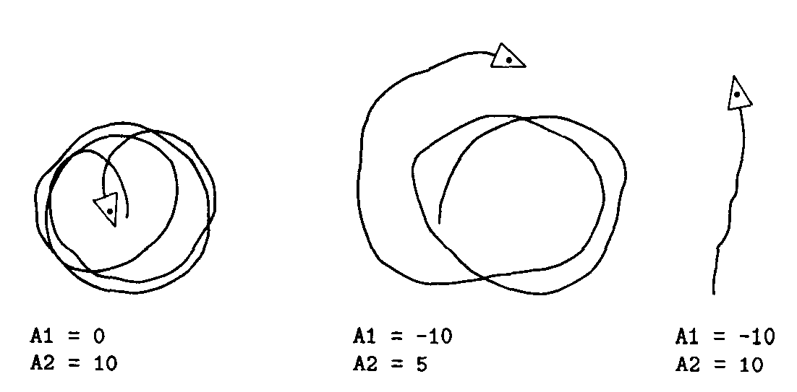

### Random Motion

Perhaps the simplest kind of motion to model with the turtle is random motion (repeatedly going forward and turning random amounts). To implement this in a procedure, let’s assume that our computer language has a random-number generator rand (low, high) that outputs a random number between low and high. Using this we can write a procedure that takes four inputs specifying the ranges from which to select the inputs to forward and left:

    TO RANDOM.MOVE (D1, D2, A1, A2)
       REPEAT FOREVER
          LEFT RAND (A1, A2)
          FORWARD RAND (D1, D2)

Even with this simple program, there is much to investigate. How do the bounds on the forwards or the turns affect the path? For instance, unless you make A1 negative the turtle will always turn left and the Y path will look roughly like a circle. In fact, except when A1 is chosen to be the negative of A2, the turtle’s turning will be biased in one direction or the other and this will be reflected in the shape of the path. Figure 2.1 shows some examples. How about the case where the turning is unbiased? Would you expect the turtle to go off "to infinity"? Or will it instead travel in a very large circle? More generally, can you say anything about the radius of the "average path" as a function of the bounds on the turns? One way to investigate these random motions is to write a record-keeping procedure that repeatedly runs, say, 100 rounds of the random.move loop and automatically records such statistics as the turtle’s heading and distance from the origin after those 100 rounds. Can you say anything about the average values of these quantities? (See exercises 2 and 3.)

Random-motion procedures such as this will often run the turtle off the edge of the display screen. Forcing the turtle to stay on the screen suggests modifying the random motion to model the behavior of an animal crawling in a box. To enable the turtle to do this, we’ll supply two new procedures: check.forward, which is just like forward except that it won’t allow the turtle to move if the result would take it outside of some fixed square box around the origin, and stuck, which tells whether or not the last move tried to place the turtle outside of the box. The checked.forward program works by moving the turtle "invisibly" to the new position, then using a subprocedure out.of.bounds? to check whether the new position is within bounds, and finally redoing the move visibly only if it is within bounds. This procedure makes use of some new operations in our turtle graphics system. hideturtle causes the turtle indicator not to be displayed; showturtle restores the indicator; xcor and ycor output, respectively, the $x$ and $y$ coordinates of the turtle; turtle.state outputs (as a list) the position and heading of the turtle; and setturtle takes as input a list such as is produced by turtle.state and restores the turtle to that state:

    TO CHECK.FORWARD DISTANCE
       OLD.POSITION <- TURTLE.STATE
       PENUP
       HIDETURTLE
       FORWARD DISTANCE
       FORWARD.FAILED <- OUT.OF.BOUNDS?
       SETTURTLE OLD.POSITION
       PENDOWN
       SHOWTURTLE
       IF NOT FORWARD.FAILED THEN FORWARD DISTANCE

    TO STUCK
       RETURN FORWARD.FAILED

    TO OUT.OF.BOUNDS?
       IF EITHER
             ABS (XCOR) > BOXSIZE
             ABS (YCOR) > BOXSIZE
          THEN RETURN "TRUE"
          ELSE RETURN "FALSE"

(abs is the absolute value function.)

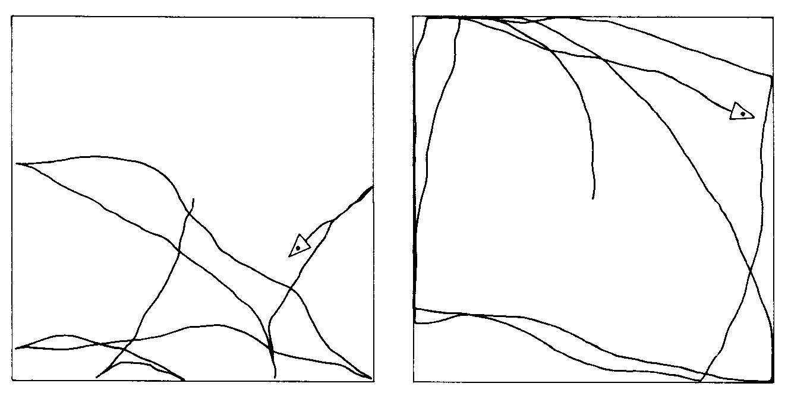

We can use these procedures to model appropriate behaviors that will keep the turtle in the box. Here, for example, is a version of random.move that has the turtle turn $180^{\circ}$ whenever it runs into an edge:

    TO RANDOM.MOVE (D1, D2, A1, A2)
       REPEAT FOREVER
       LEFT RAND (A1. A2)
       CHECK.FORWARD RAND (D1, D2)
       IF STUCK THEN RIGHT 180

shows a sample path. A second possibility for edge behavior is to have the turtle turn a little at a time, until it can go forward again. To do this, change the last line in the above procedure to if stuck then wriggle where wriggle is defined as

    TO WRIGGLE
       REPEAT
          RIGHT 1
          CHECK.FORWARD 1
       UNTIL NOT STUCK

Figure 2.2b shows how this variation, incorporated into a random-motion procedure, causes the turtle to spend most of its time wandering along the edges of the box. You may have observed the similar behavior of a real insect trapped in a box. Of course, with a real insect, this behavior is often interpreted as the insect trying to get out of the box by following the walls. The turtle program calls into question the validity of such anthropomorphizing. If edge-following behavior can be produced by a simple combination of random motion plus wall avoidance, are we really justified in saying that the insect is "trying" to follow the edge? Could we legitimately make this claim about the turtle?

### Directed Motion: Modeling Smell

We can make our simulation more elaborate by allowing the turtle’s behavior to be affected by some stimulus. For example, we could imagine that there is some food located in the box with the turtle and design mechanisms that allow the turtle to find the food "by sense of smell." There are many different ways we could provide turtles with information corresponding to an ability to smell. For example, the "amount of smell" could be a value that depends on how far the turtle is from the food (the larger the distance, the weaker the smell); or the turtle might not sense any particular level of smell, but at each move be able to detect whether the smell is getting stronger or weaker.

We’ll begin with the second possibility. This "stronger-weaker" kind of smell can be modeled by

    TO SMELL
       IF DISTANCE.TO.FOOD > DISTANCE.LAST.TIME
          THEN RESULT <- "WEAKER"
          ELSE RESULT <- "STRONGER"
       DISTANCE.LAST.TIME <- DISTANCE . TO . FOOD
       RETURN RESULT

How can the turtle use this information to locate the food? One possibility is this: If the turtle finds that the smell is getting stronger, it keeps going in the same direction; otherwise it turns:

    TO FIND.BY.SMELL1
       REPEAT FOREVER
          FORWARD 1
          IF SMELL = "WEAKER" THEN RIGHT 1

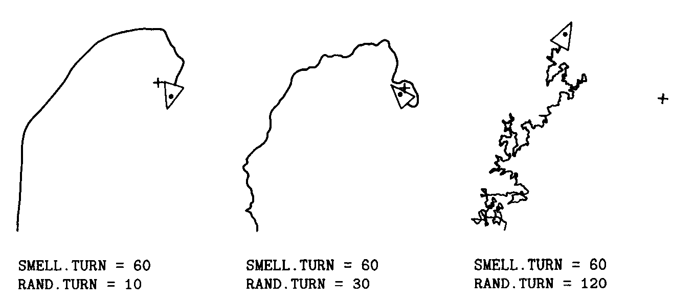

such intensity information to approach or avoid stimuli. Wood lice, for example, are observed to aggregate in moist places and avoid dry places. It is believed that they move in random directions, but that the moisture level governs their speed-they move more slowly when it is damp and hence spend most of their time in moist regions. This mechanism for aggregation is called orthokinesis. A different mechanism, klinokinesis, is claimed to govern the behavior of paramecia in aggregating in dark areas. In klinokinesis, the animal’s speed is constant, but the rate of turning varies with the intensity of the stimulus. (For more information on these and other orientation mechanisms, see G. Fraenkel and D. Gunn, Orientation in Animals [New York: Dover, 1961].) Try writing procedures embodying these mechanisms, and then try inventing new mechanisms. Good questions to guide your exploration are: How "efficient" is your method (how long does it take the turtle to reach the stimulus point)? How does the turtle’s path change as you vary the initial position and heading, or as you vary the parameters to the program? How does the mechanism degenerate as you incorporate some randomness into the turtle’s motion (for example, as in the find.by.smell3 procedure above)? Will even a slight amount of randomness destroy the turtle’s ability to reach the goal, or is your mechanism relatively stable with respect to random distortions?

In a more abstract vein, investigate the mathematical properties of simple polylike programs, but think of some aspect of the turtle’s motion as governed by the distance from some chosen point. Try, for example,

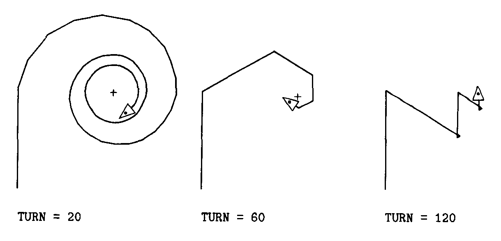

Experimenting further, we can add a parameter to adjust the size of the turtle’s turns. This leads to an interesting study of how the geometry of the path varies with the turn angle. (See figure 2.3.)

    TO FIND.BY.SMELL.2 (TURN)
       REPEAT FOREVER
          FORWARD 1
          IF SMELL = "WEAKER" THEN RIGHT TURN

A more realistic simulation would also include some of‘ the random motion of section 2.1.1:

    TO FIND.BY.SMELL3 (D1, D2, SMELL.TURN, RAND.TURN)
       REPEAT FOREVER
          FORWARD RAND (D1, D2)
          LEFT RAND ( - RAND.TURN, RAND.TURN )
          IF SMELL = "WEAKER" THEN RIGHT SMELL.TURN

In this procedure the turtle’s motion is governed by two opposing tendencies: a "random motion" scaled by rand.turn and a "directed motion" scaled by smell.turn. This can be highlighted by adjusting the relative sizes of the two parameters. As an experiment, see how large rand.turn must be with respect to smell.turn before the random motion dominates completely and the turtle makes no discernible progress towards the food. (See figure 2.4.)

A different possibility for sensing "smell" is to have the turtle respond to an intensity directly, rather than to a change in intensity. Biologists have suggested various simple mechanisms by which animals can use

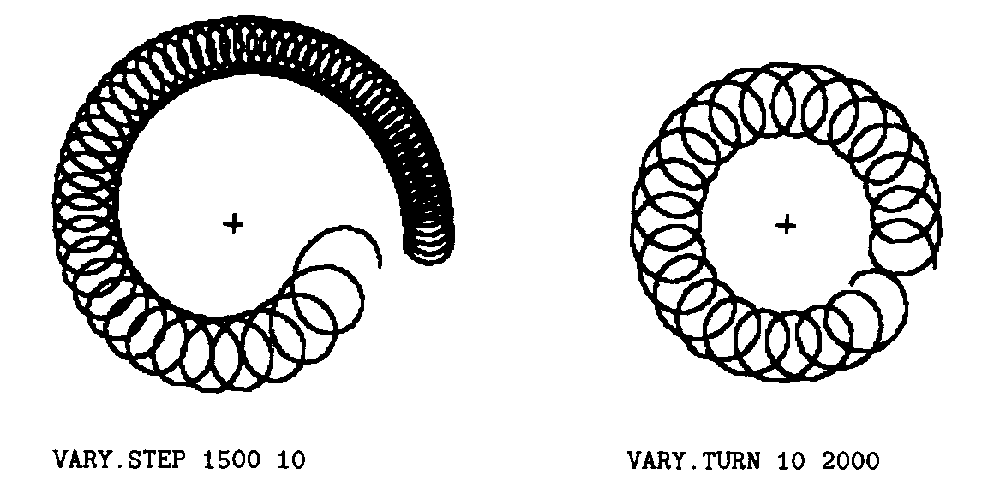

having the turtle turn a constant angle while going forward a distance that depends on the distance from the point:

    TO VARY.STEP (SIDE, ANGLE)
       REPEAT FOREVER
          FORWARD (FACTOR * SIDE)
          LEFT ANGLE

Or take a constant forward step and vary the turn:

    TO VARY.TURN (SIDE, ANGLE)
       REPEAT FOREVER
          FORWARD SIDE
          LEFT (FACTOR * ANGLE)

factor here can be something like

    TO FACTOR
       RETURN (1 / DISTANCE.TO.CHOSEN.POINT)

Figure 2.5 shows some sample paths. As you can see, the procedures seem to do different sorts of things. vary.step tends to draw spirals, whereas vary.turn tends to draw bounded figures. Investigate these programs and come up with some conjectures about their behavior. Can you prove your oonqectures?

### Modeling Sight

As with smell, the first step in providing turtle with simulated sight is to A decide what information the "eye" should receive from the environment.

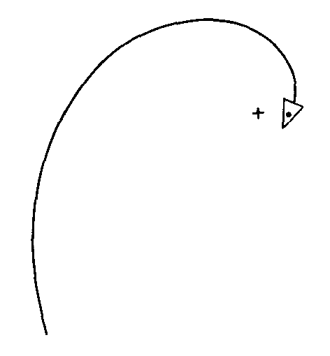

We could hardly begin to model the complexity of human vision. A much simpler model ignores color, shape, and texture and registers merely the intensity of light reaching the eye. This kind of "sight" is not so different from the "smell" discussed above. Each sense receives some kind of intensity information from the environment. The major difference is that sight is directional; it depends on how the turtle is facing with respect to the stimulus. Algorithms for locating an object by sight are therefore different from "smelling something out."

#### Facing a Stimulus

The first model for sight assumes that any creature able to see a light is able to turn to face that light. (See exercise 10.) Investigate what new things the turtle can do when given the ability to face a named point. For example, getting to the point is easy: Simply face the point and go forward. (But how does the turtle know when to stop?) Another use for the face command is to have the turtle move while keeping some point at a fixed bearing. The following procedure makes the turtle walk with a fixed bearing of angle with respect to a fixed point:

    TO KEEP.A.BEARING POINT ANGLE
       REPEAT FOREVER
          FACE POINT
          LEFT ANGLE
          FORWARD 1

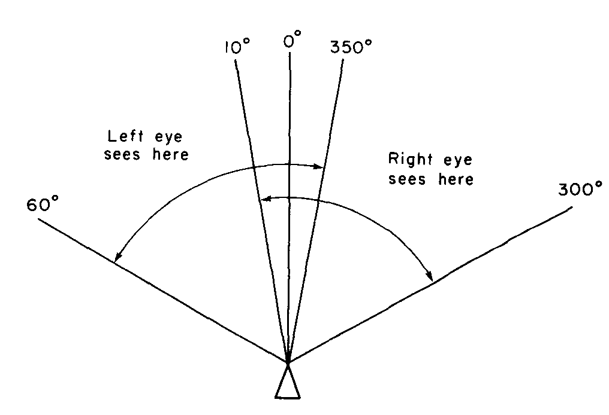

If you try this procedure (figure 2.6) you will find that it causes the turtle to spiral about the point. Does this remind you of anything? How about a moth getting trapped by a light? Can you think of a reason why a moth would be trying to keep a light at a fixed bearing? Some people believe that moths and other night-flying insects have learned to fly along straight paths by keeping the moon at a constant bearing as they fly. Keeping a very distant light like the moon at a fixed bearing would indeed make the insects fly straight. When they confuse the moon with a nearby light, the fixed-bearing mechanism causes them to spiral.

#### A Two-Eye Model

The next model focuses on how a creature might use vision in order to face a point. Assume that the turtle has two eyes, each with its own tield of vision, as shown in figure 2.7. We give the turtle the ability to tell whether a point is within each eye’s field of vision:

    TO RIGHT.EYE.SEES POINT
       IF BEARING (POINT) > 300 THEN RETURN "TRUE"
       IF BEARING (POINT) < 10 THEN RETURN "TRUE"
       RETURN "FALSE"

    TO LEFT.EYE.SEES POINT
       IF BEARING (POINT) > 350 THEN RETURN "TRUE"
       IF BEARING (POINT) < 60 THEN RETURN "TRUE"
       RETURN "FALSE"

(These procedures use a subprocedure called bearing that outputs the angle that the turtle would need to turn left in order to face a given point. Exercise 10 outlines how bearing can be implemented.)

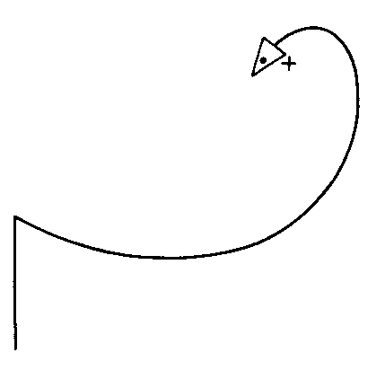

The turtle will know that it is facing roughly in the direction of a named point when the point lies in the field of vision on at least one side. So, as the turtle moves, it should keep checking that it can still see the point. Otherwise it turns until it can see the point:

    TO HEAD.FOR POINT
       REPEAT FOREVER
          IF EITHER
             LEFT.EYE.SEES (POINT)
             RIGHT.EYE.SEES (POINT)
          THEN FORWARD 10
          ELSE LEFT 10

It may seem amazing that a turtle following this procedure manages to reach the specified point despite the fact that its way of heading for the point is so inaccurate. (See figure 2.8.) This illustrates the effectiveness of a feedback mechanism — constant adjustment can often compensate for lack of accuracy. You might try combining this mechanism with some of the random-motion procedures of subsection 2.1.1.

#### A Two-Eye Model With Intensity

A more elaborate model for vision registers not only the presence of a light source in the visual field, but also the intensity that each eye receives from the source. This intensity depends on the strength of the source, the distance of the source from the eye, and the angle at which the light strikes the eye. The intensity is greatest when the light hits the eye straight on and tapers off to zero as the light source moves toward the edge of the visual field.

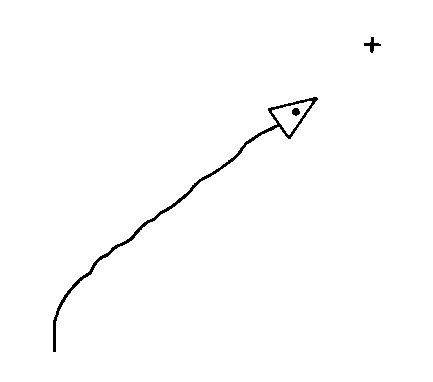

Suppose we have procedures intensity.left and intensity.right that output the intensity each eye receives from a light source. (We’ll worry about how to design these intensity procedures later.) There is a simple yet effective way to incorporate such intensity information in a feedback mechanism to make the turtle approach the light source:

    TO FIND.BY.SIGHT SOURCE
       REPEAT FOREVER
          FORWARD 1
          IF INTENSITY.LEFT (SOURCE) > INTENSITY.RIGHT (SOURCE)
          THEN LEFT 10
          ELSE RIGHT 10

The turtle walks forward while trying to keep the amount of light received at both eyes in balance. If the turtle sees more light to its right, it turns slightly to the right. If it sees more light to its left, it turns slightly to the left. (See figure 2.9.)

Some animals may actually use this mechanism for approaching light sources. Biologists have obtained experimental evidence for this conclusion by taking an animal and masking one of its eyes. What happens when the animal tries to approach the light? You can simulate this experiment by modifying intensity.left to always return 0 and have the turtle follow the find.by.sight procedure. Now the turtle will always turn right, and will therefore travel in a circle. Biologists call this behavior "circus movement." It has been observed in experiments with numerous species of insects. A variation of this experiment is to modify intensity.left to output half its normal value. (This corresponds to an animal with weak vision in one eye.) What kind of path does find.by.sight produce now? Does the animal still reach the light? How does the path degenerate to a circus movement as the eye becomes weaker and weaker?

Finally, consider what happens when there are two or more light sources. The intensity for each eye can be found by adding together the intensities from the individual sources:

    TO FIND.BY.SIGHT2 (SOURCE1, SOURCE2)
       REPEAT FOREVER
          FORWARD 1
          TOTAL.LEFT <- INTENSITY.LEFT (SOURCE1)
                           + INTENSITY.LEFT (SOURCE2) 
          TOTAL.RIGHT <- INTENSITY.RIGHT (SOURCE1)
                           + INTENSITY.RIGHT (SOURCE2)
          IF TOTAL.LEFT > TOTAL.RIGHT
          THEN LEFT 10
          ELSE RIGHT 10

How does the turtle behave? Does it go to the stronger light? Between the lights? Keep records of what happens for sources with different strengths and for different initial positions of turtle and sources. This "two-light experiment" is often performed with real insects. The intensity procedures used in these projects can be designed according to a model given in the book by Fraenkel and Gunn mentioned above. They compute the intensity of light falling on the eye as $(S/D^2)\cos A$ where $S$ is the strength of the source, $D$ is the distance from the source, and $A$ is the angle at which light from the source strikes the eye. (See figure 2.10.) The turtle procedure based on this would be

    TO INTENSITY.LEFT SOURCE
       IF NOT LEFT.EYE.SEES (SOURCE) THEN RETURN O
       FACTOR + STRENGTH / (DIST(SOURCE) | 2)
       ANGLE + BEARING (SOURCE) - 45
       RETURN (FACTOR * COS(ANGLE) 

strength here is a parameter you supply to indicate the intensity of the source. Note the computation of angle, which reflects the fact that the left eye is offset $45^{\circ}$ from the turtle’s heading. intensity.right is implemented in a similar fashion.

#### Exercises for Section 

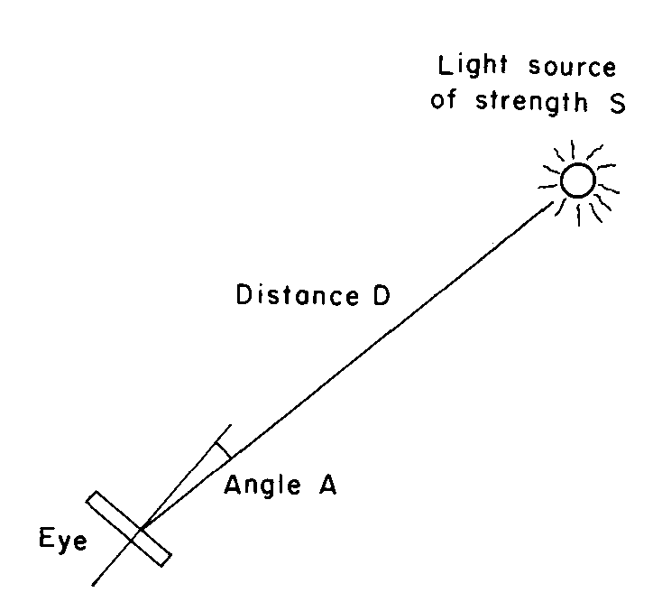

1.  $[P]$ In the random.move procedure of 2.1.1, how does the turtle’s path change if the turning is generated by left rand(0, 50) followed by right rand(0, 50) rather than left rand(-50,50)? How is the distribution of numbers produced by rand(-50, 50) different from that of rand(0, 50) - rand(0, 50)? [A]

2.  $[PD]$ Starting with the turtle facing straight up, run the random.move procedure until the turtle exceeds distance n from the start, that is, crosses a circle of radius $n$ centered at the starting point. At what point did the turtle intersect the circle? Repeat this process over and over and study the distribution of intersection points on the circle. What is its "average value"? How does the distribution change as $n$ varies? Answer the same sort of questions about the number of steps taken before crossing the circle.

3.  $[PDD]$ If the turtle follows randommove with the turn angle evenly distributed between -10 and 10, will you expect it to go off to infinity, or to travel in a large circle? Make some studies of this phenomenon. For example, graph the turtle’s distance from the origin after n steps. ls there an average graph for many tries of this experiment? Alternatively, if the angle is not evenly distributed, the program will cause the turtle to tend to walk in circles. But do the circles wander off to infinity? How fast?

4.  $[P]$ Investigate randomized poly procedures such as

        TO RANDOM.POLY (SIDE, ANGLE)
           REPEAT FOREVER
              FORWARD SIDE
              LEFT (ANGLE * RAND (LOW, HIGH))

5.  $[P]$ In the find.by.smell2 procedure of 2.1.2, how does the time required to reach the food vary with the angle the turtle turns? In the randomized find.by.smell3 procedure, what is the average time as a function of the smell.turn and rand.turn? (Do some experiments and take statistics.)

6.  $[P]$ Implement procedures for orthokinesis and klinokinesis. Which is more efficient? Which is more stable under adding a bit of randomness? Does the stability depend on the kind of randomness?

7.  $[P]$ Play around with the vary.step procedure of 2.1.2. Does the turtle always spiral inwards or outwards? Does this depend on the initial position or heading with respect to the fixed point? Try also taking different values for factor, such as making it directly proportional to the distance from the point or inversely proportional to the distance squared.

8.  $[P]$ What can you say about the vary.turn procedure? Does the turtle always stay within a bounded distance from the fixed point? Try this also with the variations on factor, as in exercise 7.

9.  $[P]$ Try procedures like vary.step and vary.turn, only this time where factor depends on the change in distance (as with the smell procedure of 2.1.1). For instance, suppose factor is equal to distance $-$ distance.last.time. Consider the procedure

        REPEAT FOREVER
           FORWARD SIDE
           LEFT FACTOR

    Prove that this can never draw a simple closed figure. [HA]

10. $[P]$ Implement the face and bearing procedures used in the sight programs of 2.1.3. bearing should return the amount the turtle needs to turn left in order to face the point. Then face can be immediately implemented as left (bearing (point)). bearing, in turn, can be implemented in terms of the turtle’s heading and another function, towards, which outputs the heading of the line directed from the turtle to the point. This can be computed using an arctangent function. [A]

11. $[P]$ Make a careful investigation of the two- (or more) light experiment. How does the turtle’s path vary with the relative intensities of the light?

12. $[P]$ Suppose the turtle lives in a square room with a light at each corner. Instead of using a rectangular coordinate system, the turtle can "get its bearings" by measuring the observed angles between the lights. Suppose the turtle starts at some point $p$ and records the observed angles. Now move the turtle to a different point. Design a simple feedback algorithm that enables the turtle to return to $p$ by moving and watching how the angles change.

Turtles Interacting
-------------------

One natural extension of the previous section’s "turtle biology" is to consider multiple turtles and the interactions produced by simple algorithms. As we shall see, even simple algorithms may lead to complex phenomena, and a study of these phenomena can be an invitation to the theory of "differential games."

### Predator and Prey

Consider how the find.by.smell mechanism of subsection 2.1.2 would behave if the food were also moving, as in the case of a predator trying to catch dinner. There are many possible variations to try. Suppose, for example, that the hunted creature, unaware of the predator’s intentions, moves round and round in a circle and that the predator follows the prey according to the find.by.smell2 procedure of 2.1.2. One way to implement this interaction is to write separate procedures for predator and prey that describe how each creature generates a single forward step:

    TO PREY.STEP (SPEED, TURN)
       FORWARD SPEED
       RIGHT TURN

    TO PREDATOR.STEP (SPEED, TURN)
       FORWARD SPEED
       IF SMELL = "WEAKER" THEN RIGHT TURN

Now supply a monitor procedure called execute.together that executes these two procedures alternately, over and over;

    TO EXECUTE.TOGETHER (PREDATOR.PROCESS, PREY.PROCESS)
       REPEAT FOREVER
       ; set the turtle at the predator state and
       ; execute the predator's procedure
          EXECUTE.STEP (PREDATOR.PROCESS, PREDATOR.STATE)
          ; save the predator state for next time
          PREDATOR.STATE <- TURTLE.STATE
          ; execute the prey's procedure
          EXECUTE.STEP (PREY.PROCESS, PREY.STATE)
          ;save the prey state
          PREY.STATE <- TURTLE.STATE

The inputs to this procedure are to be the steps above, with their inputs. For instance,

execute.together("prey.step(1,1)" . "predator.step(2,90)") makes the prey and predator execute simultaneously.

The execute.step procedure is responsible for executing the process in the right place. It makes the turtle follow a given process starting from a given state.

    TO EXECUTE.STEP (PROCESS, STATE)
       ; with the pen up move the turtle to the starting state
       PENUP
       SETTURTLE STATE
       ; put the pen down and execute the process
       PENDOWN
       EXECUTE PROCESS

At any point during the process, the variables predator.state and prey.state specify the position and heading of the creatures. Set these to their initial values before starting the execute.together procedure. (Note: Some computer languages have built-in facilities for parallel processing, which eliminate the need for such a execute.together procedure. But since these languages are not yet widespread, we show how to implement this in a more conventional language. Also, see appendix A for details about the execute command.)

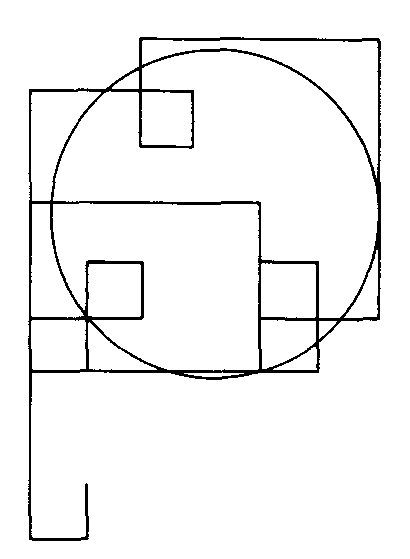

Figure 2.11 shows the result of the two procedures with the predator’s turn equal to $90^{\circ}$ and with predator moving twice as fast as prey. As you can see, the find.by.smell mechanism, which works so well with a fixed food source, does very poorly when the food is moving. The geometry of the path, however, is interesting. Notice that, after an initial segment, the predator’s path is closed. Can you see why? Investigate this phenomenon for different turn angles in the predator.step procedure and also for varying relative speeds of predator and prey. Now conduct a similar investigation with some of the other animal-orientation mechanisms of section 2.1. Do they all do so poorly when the food is moving? Or consider the use of these simple algorithms as avoidance mechanisms. For example, set up a situation in which A a predator uses one of the sight algorithms of 2.1.3 to chase another creature that is using an avoid.by.smell procedure. (Note: To convert find.by.smell to avoid.by.smell, simply modify the procedure so that the creature will turn whenever the smell is getting stronger.) Any such combination of the behaviors illustrated in section 2.1 can serve as the basis for a project.

### Following and Chasing

In a slightly different framework, we can consider "chase and evade" strategies for two turtles. The simplest strategy is for the chasing turtle to run directly towards the evader, and for the evader to run directly away from the chaser. More interesting is the situation when both creatures are constrained to stay within a square box. There are lots of possibilities for projects here. Begin by programing simple strategies using the execute.together framework of 2.2.1. Now make the chaser a bit smarter so that he can generally catch the evader — for example, by driving him into a corner. Now make the evader smarter, so that he can avoid the trap. Now make the chaser smarter still, and so on. When you get some really clever programs, modify the setup so that you control one of the creatures by hand and the computer controls the other. Are your clever procedures more skilled at the chase-evade game than you are? As a test of skill and strategy, try varying the relative speeds of chaser and evader. If they both move at the same speed, can the evader always avoid being caught?

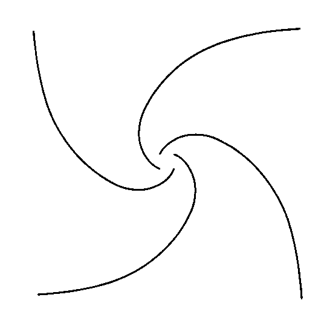

It’s also interesting to examine the paths generated by interacting creatures. One example is the widely known mathematical problem of the four "bugs" who start at the vertices of a square and move at the same speed, each one following the bug to its right. Set this up using the execute.together procedure (suitably modified to handle four creatures) and the follow mechanism:

    TO FOLLOW.THAT.BUG
       FACE THAT.BUG
       FORWARD 1

Now make bug 1 follow bug 2, bug 2 follow bug 3, bug 3 follow bug 4, and bug 4 follow bug 1:

    EXECUTE.TOGETHER "FOLLOW BUG2" "FOLLOW BUG3" 
                "FOLLOW BUG4" "FOLLOW BUG1"

Figure 2.12 shows the paths generated by the four bugs. As you can see, they all meet at a single point. One notable property of the "four bugs" situation is that the length of the path traveled by each bug is equal to the side of the original square. See if you can prove that. Modify follow to keep track of how far each bug moves, and compare the computed value with the theoretical value. Here is another interesting chase phenomenon with two creatures, the chaser and the evader. The chaser heads directly towards the evader:

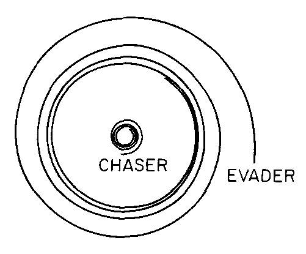

But the evader, instead of running directly away, heads at a constant $90^{\circ}$ bearing from the chaser:

    TO CHASE
       FACE EVADER
       FORWARD CHASE.SPEED

    TO EVADE
       FACE CHASER
       RIGHT 90
       FORWARD EVADE.SPEED

When the two creatures move at the same speed, the chaser always catches up, as you might expect. But when the evader’s speed is increased, both chaser and evader begin to spiral in towards each other. The spirals eventually degenerate into closed circles (see figure 2.13), which are stable configurations for the chaser-evader situation. Even though the algorithm seems "directed," the creatures end up retracing their paths over and over.

A multiple-turtle setup can also be used to investigate some of the phenomena in the area of "differential games," which has to do with finding optimal strategies in situations similar to "chase and evade." An example is provided by a "target defending" game consisting of two players and a target. The attacker’s object is to get as close to the target as possible; the defender’s object is to intercept the first player as far from the target as possible. Assume that both players have the same speed and that the defender starts out closer to the target. It turns out that this situation has a simple optimal strategy, which is the same for both players: Each time you move, head for the point that is closest to the target and that lies on the perpendicular bisector of the line joining your position to your opponent’s (see exercise 11). Of course, if both players are computerized and move with optimal strategy (figure 2.14a) the resulting paths aren’t very interesting-a better idea might be to arrange things so that you control one player and the computer controls

Books on differential games suggest many more situations that can be made into games between a person and a computer. In general these are very difficult to analyze for optimal strategies; the target-defending game explained above is unusually straightforward. There is a Way to simplify the situation: Restrict all creatures to move on a square grid; that is, only allow turns that are multiples of 900 and distances that are multiples of some fixed length, or, alternatively, specify that at each step a creature can move only to an adjacent square in the grid.

#### Exercises for Section 

1.  $[PD]$ Can you verify, as asserted in subsection 2.2.1, that a predator using find.by.smell to chase a creature moving in a circle will eventually travel in a closed path? How does this depend on the angle turned? On the relative speeds of predator and prey? On the initial positions?

2.  $[P]$ Set up a predator using find.by.sight (subsection 2.1.3) to chase a prey using avoid.by.smell. Does he catch him if the two creatures have equal speeds? Does this depend on the angles that the creatures turn? What happens as the speeds vary?

3.  $[P]$ Implement a general execute.together facility that can handle, say, two, three, or four creatures simultaneously. Notice that the procedure given in the text draws only the creatures’ paths and not the creatures themselves. Maybe you’d like to improve upon this.

4.  $[P]$ Implement a general "chase-evade" system that allows you to specify procedures to guide both chaser and evader, or to control either creature by hand.

5.  $[PD]$ Set up the "four bugs" simulation. Have the system calculate the distance traveled by each bug. Does your result agree with the claim in the text that this distance is equal to the side of the original square? Can you prove this claim?

6.  $[PDD]$ Suppose that, instead of four bugs, we have three bugs starting in the vertices of an equilateral triangle. How far does each bug travel now? Generalize this to consider $n$ bugs starting at the vertices of a regular n-gon. Given a formula for the distance traveled by each bug in terms of the side of the $n$-gon, and check your formula by doing some computer simulations. [A]

7.  $[P]$ Make up and investigate some variations on the "four bugs" problem. For example: Suppose the bugs start on a figure that is not so symmetric. (How about a rectangle?) Suppose one bug goes faster than the other. Suppose instead of each bug following the one to its left, they follow each other in some other order.

8.  $[P] $What kinds of initial conditions, speeds, and following mechanisms will ensure that all bugs eventually meet at one point?

9.  $[PD]$ Investigate the modified chase-evade simulation that yields the stable circles of 2.2.2, assuming that the evader movers faster than the chaser. Why does the process stabilize? When it does stabilize, what is the approximate distance of chaser from evader? How does this distance depend on the speeds of chaser and evader? Give a formula for the distance.

10. $[P]$ Find other chase-evade pairs that produce stable configurations.

11. In the "target-defending" game, give a formula for the coordinates of the point to head for when following the optimal strategy, and use this to implement the strategy on the computer.

12. $[D]$ Analyze the target-defending game in the case where the two players have different speeds. What is the optimal strategy for each player?

13. $[P]$ Carry out a detailed study of chase-evade for creatures moving on a grid. Invent strategies and counterstrategies. Can the evader always avoid getting caught if the two creatures move at equal speeds? If they move at different speeds?

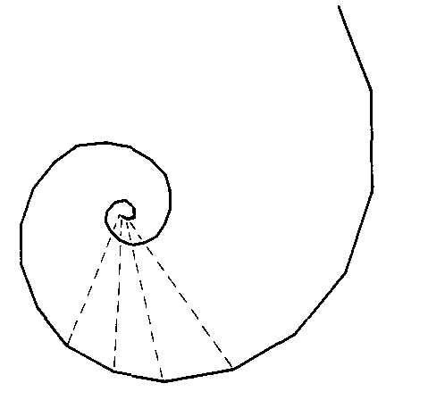

Growth
------

Besides simulating animal behavior, another good source of turtle biology projects is modeling patterns of growth. In this section we’ll examine two models: the equiangular spiral, which emerges in the shapes of shells and horns; and models for branching in the growth of trees.

### Equiangular Spirals

We’ve already seen in section 1.1 how to transform the poly program

    TO POLY SIDE ANGLE
       FORWARD SIDE
       LEFT ANGLE
       POLY SIDE ANGLE

into a program for drawing spirals:

    TO POLYSPI (SIDE, ANGLE, INCREMENT)
       FORWARD SIDE
       LEFT ANGLE
       POLYSPI (SIDE + INCREMENT, ANGL, INCREMENT)

Here is another way to make a spiral: Rather than increasing the side by adding a fixed increment, multiply the side by a constant scale factor:

    TO EQSPI (SIDE, ANGLE, SCALE)
       FORWARD SIDE
       LEFT ANGLE
       EQSPI (SIDE * SCALE, ANGLE, SCALE)

This spiral (shown in figure 2.15) is called aniequiangular spiral (also sometimes called a logarithmic spiral). Connecting the vertices of the spiral to a central point shows that the spiral can be generated by successions of similar triangles, each one built upon the previous. This principle of constructing a pattern through the accumulation of similar shapes lies behind the spiral’s appearance in many biological forms, especially in shells and horns. The nautilus shell, shown in figure 2.16, gives a clear illustration. The entire shell is constructed as a sequence of "chambers," each chamber built on the previous chamber and similar to it. (The chambers are similar because the creature doesn’t change shape as it moves from chamber to chamber; it just grows.) The result is that corresponding points of successive chambers lie on equiangular spirals. We’ll exhibit a turtle program that mimics this kind of equiangular growth, using quadrilateral chambers. Each quadrilateral, as indicated in figure 2.17a, will be specified to the program by three sides and two angles. If the turtle starts in the lower left corner, the base and sides of the quadrilateral can be drawn by

    TO CHAMBER (BASE, S1, S2, A1, A2)
    ; save the position of the lower left vertex
       LOWER.LEFT + TURTLE.STATE
       ; draw the base and right side and save the
       ; position of the upper right vertex (see below)
       FORWARD BASE
       LEFT A2
       FORWARD S2
       UPPER.RIGHT + TURTLE.STATE
       ; return to the lower left vertex and draw the left side
       PENUP
       SETTURTLE LOWER.LEFT
       PENDOWN
       LEFT A1
       FORWARD S1

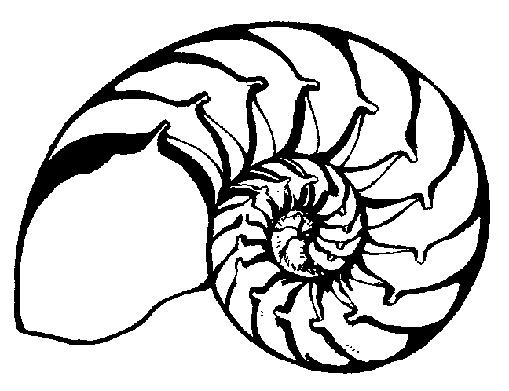

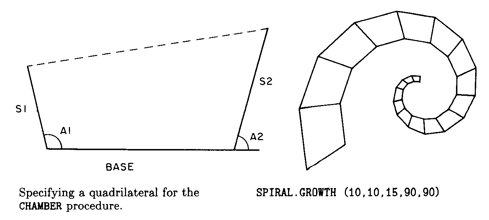

At the end of this procedure the turtle is sitting at the upper left corner 1 of the chamber, which is the same as the lower left vertex of the next chamber. To prepare for drawing the next chamber we must point the turtle along the base of the next chamber, that is, point the turtle towards the upper right vertex of the chamber just drawn. We can do this using the face procedure of section 2.1, whose implementation is outlined in exercise 10 of that section. Having done this, we are ready to draw the next chamber. The angles of the next chamber are the same as before. The base of the next chamber is the top edge of the previous chamber, and the size of the next chamber is determined by the ratio of the old base to the new base. All together, the program for spiral growth is

    TO SPIRALGROWTH (BASE, S1, S2, A1, A2)
    ; draw one chamber and face along the edge of the new chamber
       CHAMBER (BASE, S1, S2, A1, A2)
       FACE UPPER.RIGHT
       ; the length of the next chamber's base is the distance
       ; from the current location to the upper right corner of
       ; the chamber just drawn
       NEXT.BASE <- DISTANCE (UPPER.RIGHT)
       ; compute the ratio of the sides of the new chamber to the
       ; sides of the previous chamber
       R <- NEXT.BASE/BASE
       ; now repeat the process, using as inputs
       ; the sides and angles of the new chamber
       SPIRAL.GROWTH (NEXT.BASE, S1 * R, S2 * R, A1, A2)

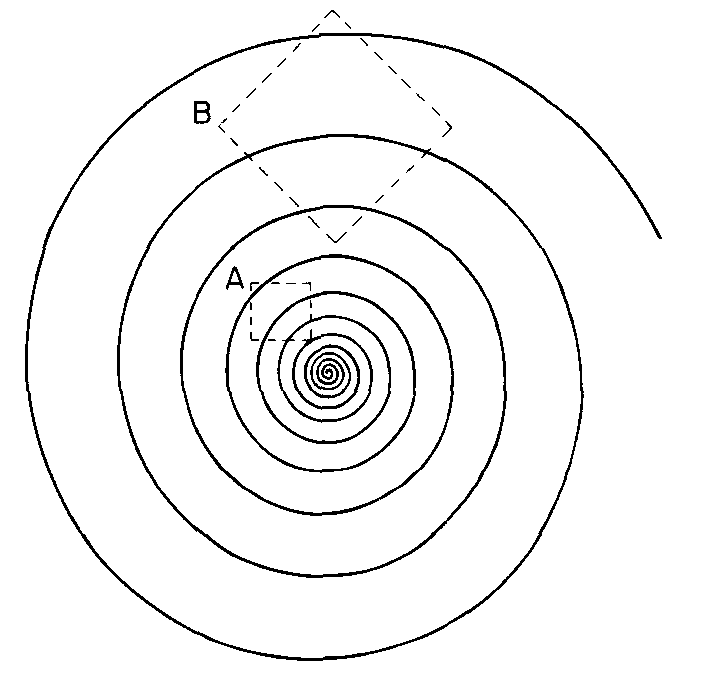

The recursive structure of the program implies that each chamber generates a new chamber. There is no stop rule and the program goes on forever. Whether the chambers increase or decrease in size depends on the initial sides and angles. A sample "shell" drawn by this program is illustrated in figure 2.17.

#### Growing Turtle Geometry

Equiangular spirals underlie uniform growth such as the spiral.growth shown above in the same way that a circle underlies any turtle program that does the same thing over and over. The reason for both of these facts becomes clearer when one describes the equiangular spiral and the circle as curves that are "everywhere the same." In the case of a circle, that means any chunk of the circle can match any other chunk of the circle if you are allowed to move and turn the iirst chunk. In the case of the spiral, one must allow changing scale (making a bigger or smaller model of a piece), in addition to moving and turning, to show that one piece matches another. See figure 2.18.

One can augment turtle geometry to make scale changes by introducing a new "scaled forward" command and a grow command to change scale:

    TO S.FORWARD DISTANCE
       FORWARD (SCALE * DISTANCE)
     
    TO GROW FACTOR
       SCALE <- (SCALE * FACTOR)

scale should now be considered a part of the turtle state — it’s a kind of "size" of the turtle that determines the size of the next step just as heading determines the direction of the next step. (scale should start equal to 1.) The analog to poly is precisely eqspi:

    TO EQSPI (SIZE, ANGLE, FACTOR)
       REPEAT FOREVER
          S.FORWARD SIZE
          RIGHT ANGLE
          GROW FACTOR

You should be able to show that any looping program which involves only s.forward, right, and grow will have an eqspi skeleton, just as poly is the skeleton for looping programs without grow (see exercise 10). Incidentally, a circle is an "equiangular spiral with no growth" in the same way a line is "a circle with no turning." Finally, notice that the chambered growth shown in figure 2.17 ensures that the growth is uniform by having the bottom edge of one chamber be related to the bottom edge of the preceding precisely as the ratio of top to bottom edge of the previous chamber. Because the chambers are constructed to be similar, that ratio never changes.

### Branching Processes: A Lesson in Recursion

A different kind of growth pattern we can mimic with turtle graphics is the branching process that characterizes the growth of trees. We’ll start by drawing a very regular binary tree, that is, a tree in which each branch sprouts two more branches. We’ll make the length of each sprouted branch half that of the parent. Conceptually, each branch consists of a straight line, with two more branches at its end. Notice the fundamentally recursive nature of this description — a branch consists of something (the stem) plus sub-branches (things with the same structure as the branch). In a program, that structure will appear in the standard recursive way, as a procedure calling itself as a subprocedure.

If we assume that the branching angle is $45^{\circ}$, then a first try at a program might be

    TO BRANCH LENGTH
    ; draw the main branch
       FORWARD LENGTH
       ; turn to point along the left
       ; secondary branch and draw it
       LEFT 45
       BRANCH LENGTH / 2
       ; now draw the right secondary branch
       RIGHT 90
       BRANCH LENGTH / 2

But if we try this procedure, we’ll find that it has a bug: The turtle starts drawing a branch, then its left secondary branch, then that branch’s left secondary branch, and so on and so on. No right branches ever get drawn. At some point, we must make the process stop generating new left branches and come back to do the right branches. We’ll accomplish this by giving the branch process a second input called level, which counts down as the program moves from each branch to its secondary. We can think of level as labeling the type (complexity) of the branch: A level 1 branch is a tip (a branch with no secondaries); a level 2 branch will sprout two level 1 secondaries; a level 3 branch will sprout level 2 secondaries, and so on. The program should stop generating secondary branches whenever the level reaches 0:

    TO BRANCH (LENGTH, LEVEL)
       IF LEVEL = 0 THEN RETURN
       FORWARD LENGTH
       LEFT 45
       BRANCH (LENGTH/2, LEVEL - 1)
       RIGHT 90
       BRANCH (LENGTH/2. LEVEL · 1)

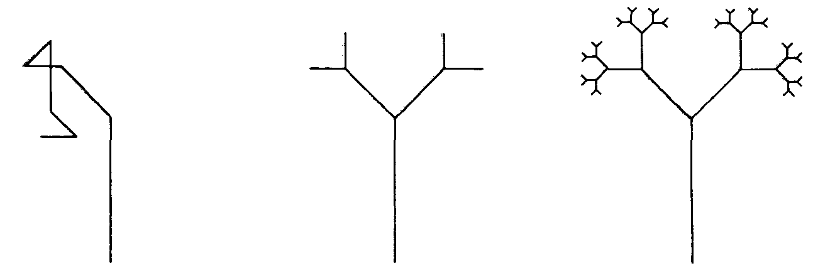

Unfortunately, as shown in figure 2.19a, there is still a bug in the program. This bug, which is tricky to find, comes up often in such recursive descriptions: We must ensure that after drawing the left secondary branch the turtle returns to the base of that branch, or else the right 90 instruction will not align the turtle correctly for drawing the right secondary branch. Ir1 other words, we must ensure that the process that draws the left secondary branch restores the state of the turtle to what the state was before the process began. The technical term for a process that leaves the turtle in the same state in which it found it is state transparent.

branch will work only if its sub-branches are state-transparent. But since the sub-branches as programs are just copies of branch itself, branch must be made state-transparent. (In a recursive society all you must do to make sure your offspring have some property is have it yourself.) Here is the debugged program:

    TO BRANCH (LENGTH, LEVEL)
       IF LEVEL = 0 THEN RETURN
       FORWARD LENGTH
       LEFT 45
       BRANCH (LENGTH/ 2, LEVEL - 1)
       RIGHT 90
       BRANCH (LENGTH/2, LEVEL - 1)
       ; turn and back up to make the
       ; procedure state-transparent
       LEFT 45
       BACK LENGTH

Using this simple binary tree as a model, we can go on to construct figures that look more like real trees. For example, we might add inputs to the program to allow some other variation of the size of the secondary branches besides "divide by 2." Another possibility is to make the length of stem depend not on the level, but on whether the stem belongs to a left or a right sub-branch.

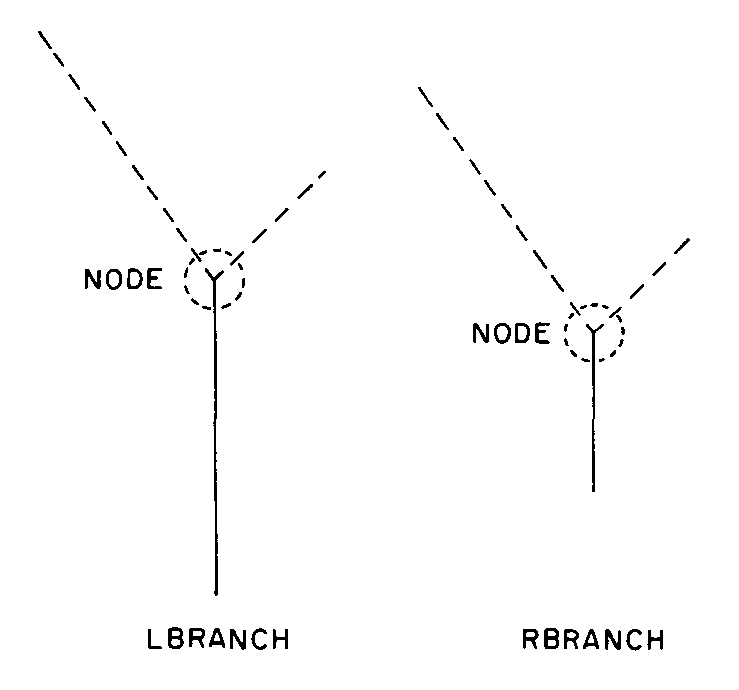

The cleanest way to implement this idea is to have separate left and right procedures that produce stems of different lengths. As the dashed lines in figure 2.20 indicate, each of these must prepare for the next-level branch. Though the preparation is not hard, it is more than half the procedure, and both left and right branch procedures must do it. So it makes sense to make it a subprocedure called node. We can also make node responsible for the stop rule, which is common to the two procedures.

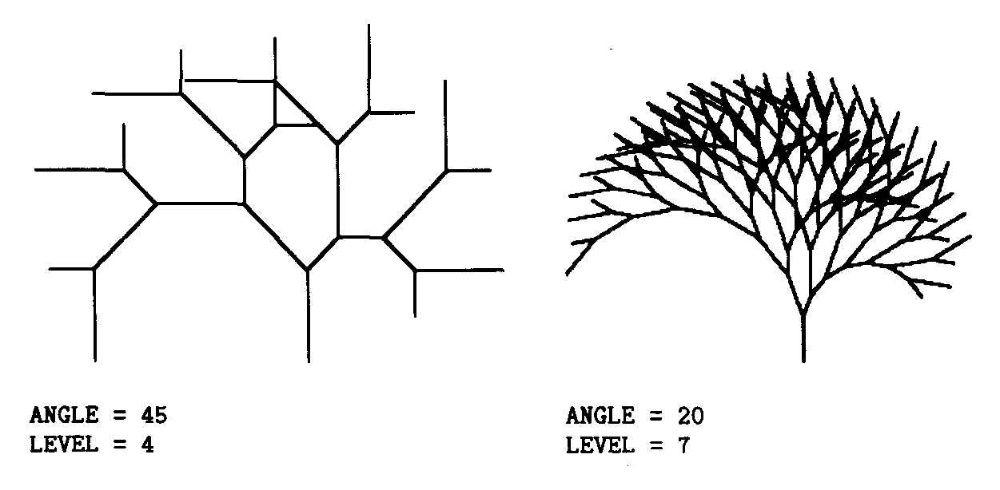

    TO LBRANCH (LENGTH, ANGLE, LEVEL)
    ; draw a long stem
       FORWARD (2 * LENGTH)
       ; do next level
       NODE (LENGTH, ANGLE, LEVEL)
       ; make LBRANCH state-transparent
       BACK (2 * LENGTH)
       TO RBRANCH (LENGTH, ANGLE, LEVEL)
       ; draw a short stem
       FORWARD LENGTH
       ; do next level
       NODE (LENGTH, ANGLE, LEVEL)
       ; make RBRANCH state-transparent
       BACK LENGTH

    TO NODE (LENGTH, ANGLE, LEVEL)
       IF LEVEL = 0 THEN RETURN
       ; point along left branch and draw it
       LEFT ANGLE
       LBRANCH (LENGTH, ANGLE, LEVEL - 1)
       ; draw right branch
       RIGHT (2 * ANGLE)
       RBRANCH (LENGTH, ANGLE, LEVEL - 1)
       ; make NODE state-transparent
       LEFT ANGLE

You can start the process with either lbranch or rbranch. Figure 2.21 shows some of these trees. Notice that at first sight the growth pattern looks random, even though it is actually very regular. More information on the spiral shapes of shells, horns, claws, and teeth can be found in On Growth and Form by D’Arcy Thompson (abridged edition; Cambridge University Press, 1961). The branch procedure is adapted from a model discussed in Patterns in Nature, by Peter S. Stevens (Boston: Atlantic Monthly Press, 1974). Both of these books are well worth having a look at if you are interested in mathematical models in biology.

#### Exercises for Section 

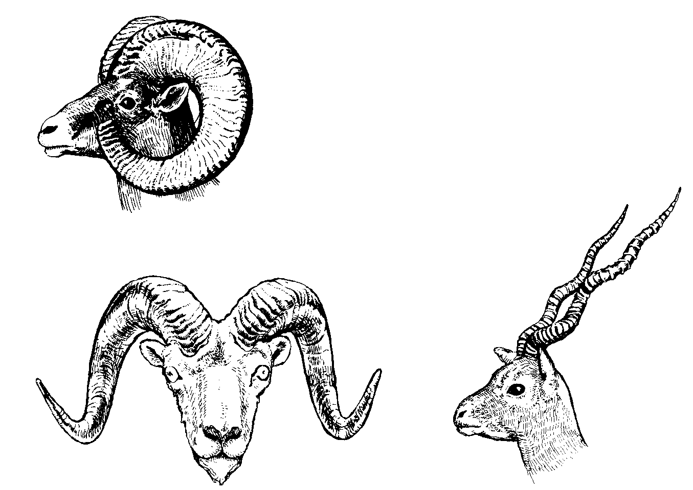

1.  $[P]$ Figure 2.22 shows some animal horns. Can you find inputs to the spiral.growth program that produce horns shaped like these?

2.  $[P]$ Invent variants of the spiral.growth procedure in which the chambers are not quadrilaterals.

3.  $[P]$ Efficiency experts may object that our spiral.growth procedure is inefficient in that the ratio of one chamber to the next should be computed only once, rather than each time a new chamber is drawn. But our version is easy to modify so that this ratio (and hence the shape of the chambers) can be varied from one chamber to the next. We might let the left and right sides grow more slowly (with a different ratio) than the tops and bottoms, and so get a figure which becomes stubbier as it grows. Experiment with possibilities like these. What kinds of shapes arise if the change in growth is periodic (seasonal)? If the rate of growth is random?

4.  What is the total length of all the lines drawn by the branch procedure for a given length and level?

5.  $[P]$ Modify node so that the choice of whether the left or the right sub-branch is to be the long one is made randomly at each level.

6.  Make a branching model in which each left sub-branch is twice as long as each right sub-branch and sprouts two left-right branches. What is the total length of all the branches drawn for a given length and level? [HA]

7.  $[P]$ Create some variations that introduce randomness into the model given in the previous exercise. For instance, the left branch may sprout either one or two branches at each level.

8.  $[D]$ Does eqspi (2, 2, 2), eqspi (1,1,1), eqspi (.5, .5, .5), approach a limiting spiral the way poly (n, n) does, as $n$ goes to O? Explain why or why not. How about eqspi $(n, n, n + 1)$? How about eqspi $(n, n, k^{n})$, *k* constant? [A]

9.  What parameters describe equiangular spirals the way radius or curvature describes a circle? Relate these to the inputs of eqspi.

10. $[D]$ Prove the assertion that any looping program which uses only s.forward, right, and grow has an eqspi skeleton, paralleling the results of section 1.3. What are the angle and the growth factor for the steps of the skeleton?

Recursive Designs
-----------------

The branching models of section 2.3 could be described as recursive designs, because these figures contain subparts which are in some sense equivalent to the entire figure (for example, a branch is made up of branches). We’ve already run into two important considerations for writing turtle procedures to generate such designs: We need to include some kind of stop rule so that the process eventually stops generating more and more subiigures, and we need to keep track of the state of the turtle in designing the interface between part and subpart. ln particular, it helps to make each part state-transparent.

### Nested Triangles

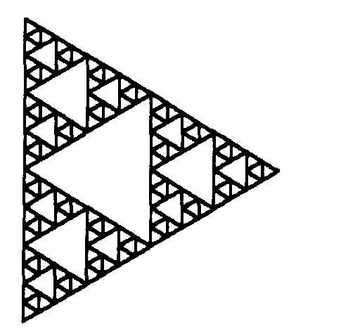

The nested triangle design shown in figure 2.23 illustrates these principles. The central observation is that the figure consists of a triangle plus a smaller copy of itself at each corner, just as the trees of the last section were forks plus smaller copies of themselves on each prong. Thus, we imagine the turtle drawing our figure as follows: At each of the vertices of the largest triangle, pause and construct a smaller figure of half the size, in the corner. The smaller triangles should follow the I same rules, drawing a still smaller triangle at each of their corners, and so on, and so on. Finally, we’ll stop generating subtriangles when the sides get very small. All together, the procedure is

    TO NESTED.TRIANGLE SIZE
       IF SIZE < 10 THEN RETURN
       REPEAT 3
          NESTED.TRIANGLE SIZE / 2
          FORWARD SIZE
          RIGHT 120

Notice that each nested.triangle(size) will be state-transparent as long as each nested.triangle(size/2) drawn in its corners satisfies that property. In turn, that state transparency depends on the state transparency of smaller and smaller nested.triangles until, when size is less than 10, the program stops, ensuring state transparency all the way back up the line. A simple variation on this program draws smaller figures outward from the corners:

    TO CORNER.TRI SIZE
       IF SIZE < 10 THEN RETURN
       REPEAT 3
          FORWARD SIZE
          CORNER.TRI SIZE/2
          RIGHT 120

Yet another way to interface a triangle to a recursive call to itself is to stop halfway through a side and put the recursive call there:

    TO OUTWARD.TRI SIZE
       IF SIZE < 10 THEN RETURN
       REPEAT 3
          FORWARD SIZE / 2
          INSERT SIZE
          FORWARD SIZE / 2
          RIGHT 120

    TO INSERT SIZE
       LEFT 120
       OUTWARD.TRI SIZE/2
       ; ensure state transparency of INSERT
       RIGHT 120

    TO NESTEDTRIANGLE (SIZE, LEVEL)
       IF LEVEL = 0 THEN RETURN
       REPEAT 3
          NESTEDTRIANGLE (SIZE/2, LEVEL - 1)
          FORWARD SIZE
          RIGHT 120

These triangle procedures can be generalized to arbitrary poly figures. The only tricky part is to make sure we know how many sides to draw, say, as a function of the poly’s angle. As we saw in chapter 1, this can be done by accumulating total turning and stopping when the total turning is a multiple of $360^{\circ}$:

    TO CORNERPOLY (SIZE, ANGLE, TOTALTURN)
       IF SIZE < 10 THEN RETURN
       REPEAT
          CORNERPOLYSTEP (SIZE, ANGLE)
          TOTALTURN <- TOTALTURN + ANGLE
          UNTIL REMAINDER (TOTALTURN, 360) = 0

    TO CORNERPOLYSTEP (SIZE, ANGLE)
       FORWARD SIZE
       CORNERPOLY (SIZE/2, - ANGLE, O)
       ; using - ANGLE "symmetrizes" the figure
       RIGHT ANGLE

The cornerpoly procedure is invoked with the third input, totalturn, equal to zero. Figure 2.24 shows some samples drawn by this program. Although we’ve been using the side length as a stop rule for these designs, you might prefer to stop at a particular level of recursion. For example,

### Snowflakes and Other Curves

In some instances the effect of state transparency can be achieved although there is not true state transparency. In such cases, each procedure knows the state change of its subprocedures and hence knows what to do to compensate (if necessary). If the state change of the subprocedure is simple there are few disadvantages to this method, and if the state change is exactly what the main procedure needs to prepare for a next step this method can be advantageous. This strategy is illustrated by a program to draw the snowflake curve shown in figure 2.25. Think of this curve as a triangle in which each side is made up of four subsides, each subside is made up of four sub-subsides, $p$ etc. Rather than making the procedure state-transparent, we’ll design each side to move the turtle forward a certain distance without changing the heading:

    TO SNOWFLAKE (SIZE, LEVEL)
       REPEAT 3
       SIDE (SIZE, LEVEL)
       RIGHT 120
       TO SIDE (SIZE, LEVEL)
       IF LEVEL = 0 THEN
          FORWARD SIZE
          RETURN
       SIDE (SIZE/3, LEVEL - 1)
       LEFT 60
       SIDE (SIZE/3, LEVEL - 1)
       RIGHT 120
       SIDE (SIZE/3, LEVEL - 1)
       LEFT G0
       SIDE (SIZE/3, LEVEL - 1)

Until now the level = 0 process has been trivial, and has been statetransparent by virtue of doing nothing at all. Here the level = 0 action is crucial so that the level = 1 process gets the state change expected, forward(size). In fact, in the snowilake procedure no forward commands will be issued except when level = 0.

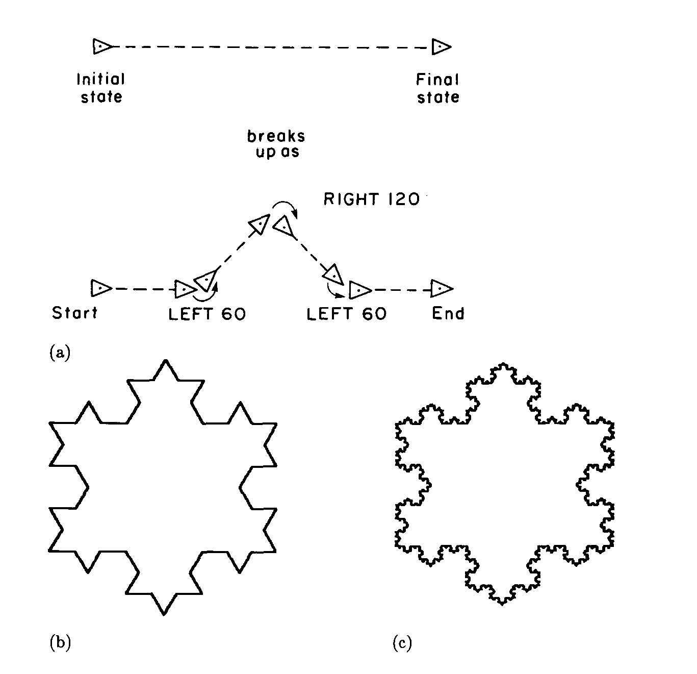

Another related curve is the "C curve" shown in figure 2.26a. A level 0 C curve is just a line; a level $n$ C curve consists of two level $n - 1$ C curves at right angles to each other, followed by a $90^{\circ}$ turn to restore the heading:

    TO C (SIZE, LEVEL)
       IF LEVEL = 0 THEN
          FORWARD SIZE
          RETURN
       C (SIZE, LEVEL - 1)
       RIGHT 90
       C (SIZE, LEVEL - 1)
       LEFT 90

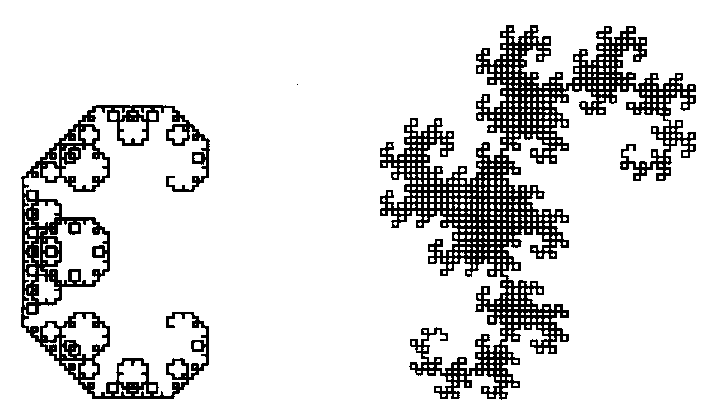

The "dragon curve" shown in figure 2.26b is similar to the C curve; however, there is only one $90^{\circ}$ turn, and its direction changes from level to level. We can think of it as generated by a pair of procedures ldragon and rdragon specified as follows: A level $n$ ldragon is made up of a level $n - 1$ ldragon and a level $n - 1$ rdragon with a left turn in between; a level $n$ rdragon is made up of a level $n - 1$ ldragon and a level $n - 1$ rdragon with a right turn in between; a level 0 dragon is a line:

    TO LDRAGON (SIZE, LEVEL)
       IF LEVEL = 0 THEN
          FORWARD SIZE
          RETURN
       LDRAGON (SIZE, LEVEL - 1)
       LEFT 90
       RDRAG0N (SIZE, LEVEL - 1)
       TO RDRAGON (SIZE, LEVEL)
       IF LEVEL = 0 THEN
          FORWARD SIZE
          RETURN
       LDRAGON (SIZE, LEVEL - 1)
       RIGHT 90
       RDRAGON (SIZE, LEVEL - 1) 

### Space-Filling Design

Suppose we write a program that draws something inside a square. For the moment, we won’t care what the program does, but we will insist that the initial and final states of the turtle are related to the square as shown in figure 2.27a. Consider a new square that consists of nine smaller squares. We can use our simple program in each smaller square to produce a more complicated program winding through the new square (figure 2.27b). All we need is appropriate interfacing between subsquares. This more complicated program relates to the new square in exactly the same way that the simple program related to the first square, so we can continue this process. In the end we will have a square, consisting of nine smaller squares, each of which consists of still smaller squares, and I so on. The process is recursive, and can be implemented in the usual way (by writing the higher-level procedure in terms of the lower-level one). The interfaces between the various subfigures are shown in figure 2.27b. For a level 0 process, we can use the simplest possible way of entering and leaving a square, as assumed — forward(size). This gives the following procedure:

    TO FILL (SIZE, LEVEL)
       IF LEVEL = 0 THEN
          FORWARD SIZE
          RETURN
          ; side of small square is 1/3 side of large square
       FILL (SIZE / 3, LEVEL - 1)
       ; interface to next subfigure is LEFT 90
       LEFT 90
       FILL (SIZE / 3, LEVEL - 1)
       ; next three subfigures have RIGHT 90 as interface
       REPEAT 3
          RIGHT 90
          FILL (SIZE / 3, LEVEL - 1)
          ; next three have LEFT 90 as interface
       REPEAT 3
          LEFT 90
          FILL (SIZE / 3, LEVEL - 1)
          ; final subfigure has RIGHT 90 interface
       RIGHT 90
       FILL (SIZE / 3, LEVEL - 1)

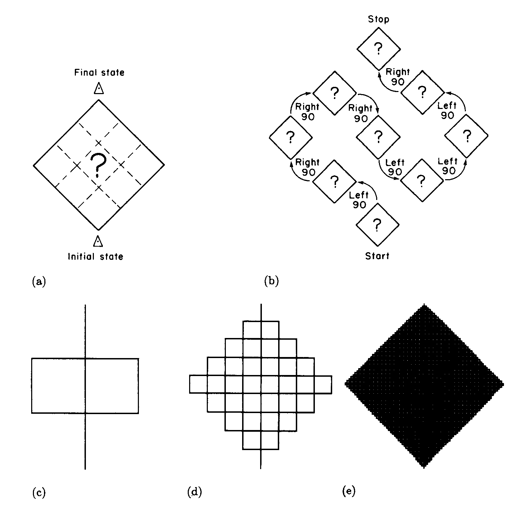

This fill procedure is an example of a space-filling design. lf we make level greater and greater, then the fill curve winds through the square in finer and finer subdivisions. For level very large, we could imagine fill as passing through every point of the square. fill, as written, draws a curve that intersects itself; however, it is possible to separate the nine subsquares with small interfaces to avoid intersection. (See exercise 5.) If done properly, this will not affect the space-filling property of the design.

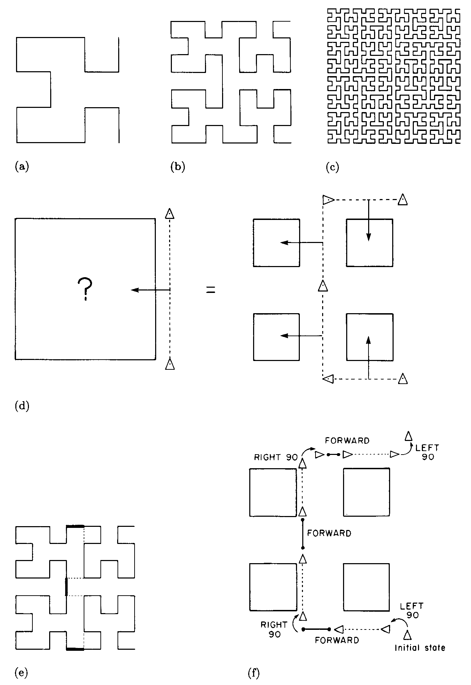

Perhaps the most famous space-filling design is the curve (shown in figure 2.28) invented by the German mathematician David Hilbert. As indicated in figure 2.28e, we can think of the level $n$ Hilbert curve as made up of four level $n - 1$ Hilbert curves, joined by interfaces which are straight line segments. Another way to picture this is to imagine the square as divided into four subsquares. The Hilbert curve traverses the square by visiting each of the subsquares and placing the interfaces in between. (See figure 2.28d.)

In designing a program to draw the Hilbert curve we must be careful to keep track of how each level of the curve affects the state of the turtle. Assume that the turtle begins facing along the edge of the square that it traverses, and ends in the same direction. Then pasting together four level $n - 1$ curves to form the level n curve requires interface turns as shown in figure 2.28f. A second tricky point is that there are really two different level $n - 1$ Hilbert curves-one that traverses its square to the left and one that traverses to the right-and that the level $n$ curve is made up of two of each parity. Finally, notice that the interfaces alone provide the state change assumed at each level, so we can let the level 0 curve be simply a point; then the interfaces in level 1 will provide the state change assumed by higher levels. The complete program consists of two procedures, lhilbert and rhilbert:

    TO LHILBERT (SIZE, LEVEL)
       IF LEVEL = 0 THEN RETURN
       ; rotate and draw first subcurve
       ; with opposite parity to big curve
       LEFT 90
       RHILBERT (SIZE, LEVEL - 1)
       ; interface to and draw second subcurve
       ; with same parity as big curve
       FORWARD SIZE
       RIGHT 90
       LHILBERT (SIZE, LEVEL - 1)
       ; third subcurve
       FORWARD SIZE
       LHILBERT (SIZE, LEVEL - 1)
       ; fourth subcurve
       RIGHT 90 \textsc{forward} SIZE
       RHILBERT (SIZE, LEVEL - 1)
       ; a final turn is needed to make the turtle
       ; end up facing outward from the large square
       LEFT 90

The rhilbert procedure is the same, but with all the turns reversed:

    TO RHILBERT (SIZE, LEVEL)
       IF LEVEL = 0 THEN RETURN
       RIGHT 90
       LHILBERT (SIZE, LEVEL - 1)
       FORWARD SIZE
       LEFT 90
       RHILBERT (SIZE, LEVEL - 1)
       FORWARD SIZE
       RHILBERT (SIZE, LEVEL - 1)
       LEFT 90
       FORWARD SIZE
       LHILBERT (SIZE, LEVEL - 1)
       RIGHT 90

We ean combine lhilbert and rhilbert into a single procedure by providing a third input, equal to $+1$ or $-1$, whose sign is reversed to convert left turns to right turns:

    TO HILBERT (SIZE, LEVEL, PARITY)
       IF LEVEL = 0 THEN RETURN
       LEFT (PARITY * 90)
       HILBERT (SIZE, LEVEL - 1, - PARITY)
       FORWARD SIZE
       RIGHT (PARITY * 90)
       HILBERT (SIZE, LEVEL - 1 , PARITY)
       FORWARD SIZE
       HILBERT (SIZE, LEVEL - 1, PARITY)
       RIGHT (PARITY * 90)
       FORWARD SIZE
       HILBERT (SIZE, LEVEL - 1, - PARITY)
       LEFT (PARITY * 90)

#### Exercises for Section 

1.  $[P]$ Try the following variant of the nested-triangle procedure, which adds only one smaller triangle at each level connecting the midpoints of the larger triangle:

        TO NEST (SIZE, LEVEL)
           IF LEVEL = 0 THEN STOP
           FORWARD SIZE / 2
           SUBNEST (SIZE, LEVEL)
           FORWARD SIZE / 2
           RIGHT 120
           FORWARD SIZE
           RIGHT 120
           FORWARD SIZE
           RIGHT 120

        TO SUBNEST (SIZE, LEVEL)
           RIGHT 60
           NEST (SIZE / 2, LEVEL - 1)
           LEFT GO

    Generalize this procedure to produce designs based on nested polys. [HA]

2.  What is the length of the level n snowflake curve? How much area does it enclose? [HA]

3.  $[P]$ Write a procedure that generalizes the (triangular) snowflake curve to produce arbitrary "polysnowflakes."

4.  $[D]$ What is the length of the level $n$ Hilbert curve?

5.  $[P]$ The fill curve is not as elegant as it might be because it intersects itself. Add interfaces, in the same way that hilbert has them, to separate the squares a bit. (See figure 2.29.) Note that the net effect of the interfaces by themselves (including turning to set up for diagonals) is the state change assumed for each level of fill. This is the same as with the interfaces to hilbert, and makes it possible to allow the level 0 curve to be simply return. Try this possibility for fill as well.

6.  $[P]$ The Hilbert curve is constructed on the following model: (1) Walk along the side of a square, and imagine filling the square. (2) Divide the square into four subsquares. Construct a similar space-filling curve A based on dividing a triangle into four subtriangles.

    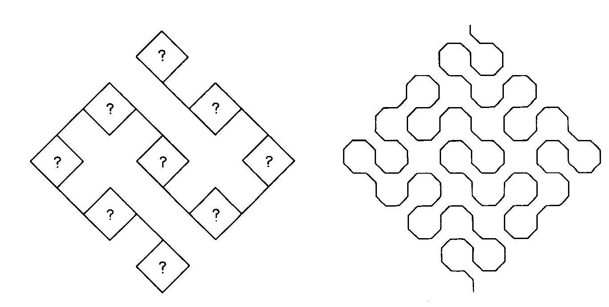

7.  $[P]$ Construct a space-filling curve on the Hilbert model, but based on dividing a square into nine subsquares.

8.  $[PD]$ Write a procedure to draw the space-filling curve shown in figure 2.30. (This curve was invented by the Polish mathematician Wraclaw Sierpinski.)

9.  $[P]$ Invent some new space-filling designs.

10. $[P]$ Can you build a recursive design like fill or hilbert, but based on entering the middle of the side of the square rather than the corner?

11. $[P]$ How much does the fill curve depend on the particular level 0 step used? Does fill change its character if you use some more complicated level 0 step than forward(size)?

12. $[P]$ Notice that in none of our recursive designs does the turtle have any representation of the curve except the program itself. On the other hand, by encoding turtle commands as letters, one can construct an explicit representation in the following way: Let F stand for forward SIZE, L for left 60, and R for right 120; then construct a string representing the side of a snowflake curve with the rules $$S_0 = F$$ $$S_n = S_{n-1}LS_{n-1}RS_{n-1}LS_{n-1}$$

    In fact a program to draw the side could be enacted as follows: Initialize $S \leftarrow F$ ; apply the recursive step $S \leftarrow SLSRSLS$ (juxtaposition denotes concatenation) $n$ times; have the turtle interpret the resulting string. Try this with several known recursive designs, such as hilbert and snowflake. Now explore the possibilities of this "word generation" method by varying level 0, the recursive step, and the interpretation of letters. You may wish to add more variable symbols to the process, for example, $T \leftarrow SRSLSRS$.

    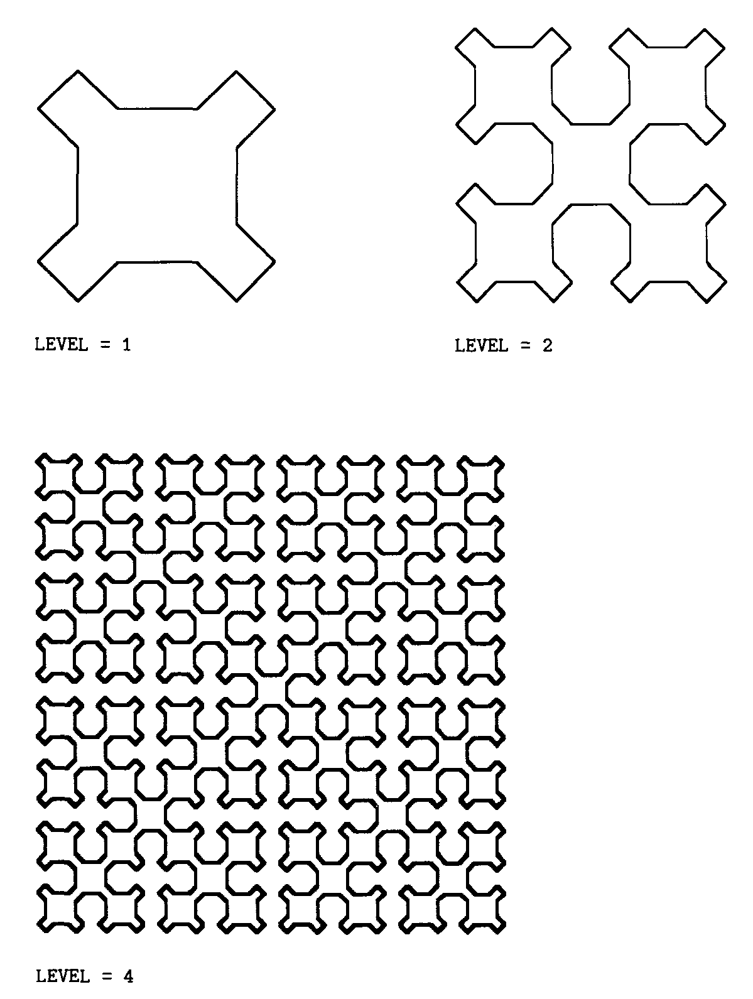

13. $[PD]$ All our recursive designs have maintained the constraint that turtle must not lift the pen. Thus, the recursive step in fill consisted of taking a certain walk through a square and then using that walk nine times in sequence to make a more complex walk through a square. But I we could just as easily imagine taking any design whatsoever in a square (not necessarily a walk through it) and gluing nine copies to make a larger square (without making sure the designs hook up simply). (See I figure 2.31a.) Of course the overall design will appear more impressive if some lines do "accidentally" hook up. This is like tiling a floor with more and more complex tiles. Varying the design on the level 0 tile together with the orientations for the tiles in the recursive step makes a fascinating artistic and mathematical exploration. To aid the exploration you may wish to implement the recursive gluing-together steps as programs that can take arbitrary design-drawing programs, including glued-together designs, as inputs. That way a level 3 recursive tile will look like glue1(glue2(glue3(shape1))). Figure 2.31b-e shows designs that can be made in this way. See if you can find the level 0 design in each.
