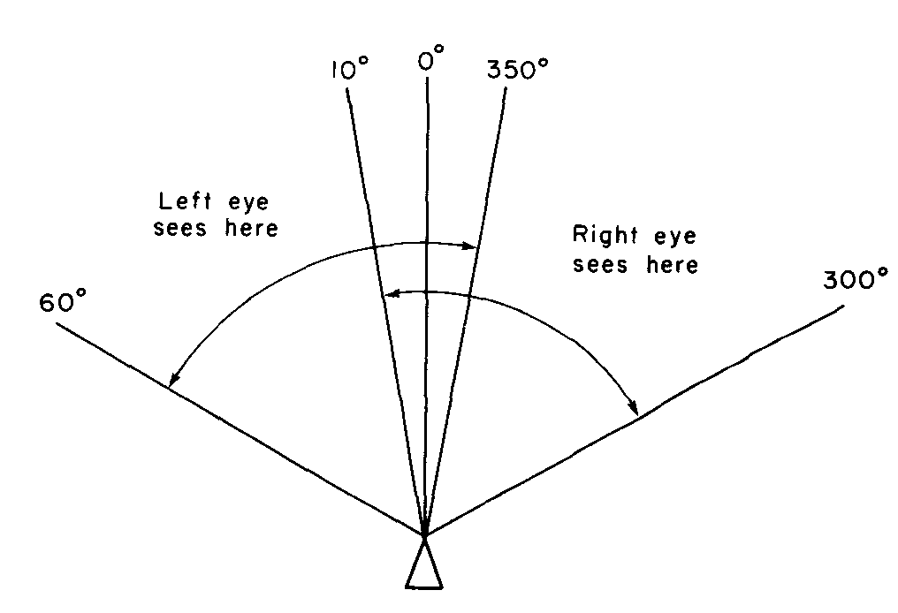
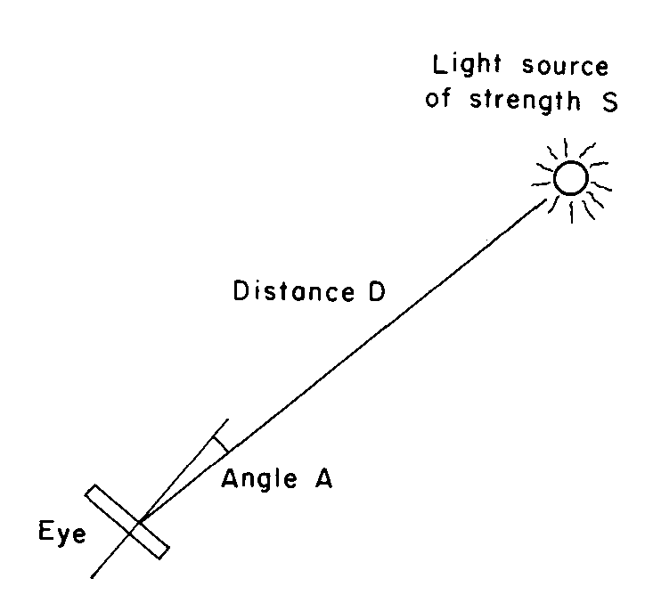
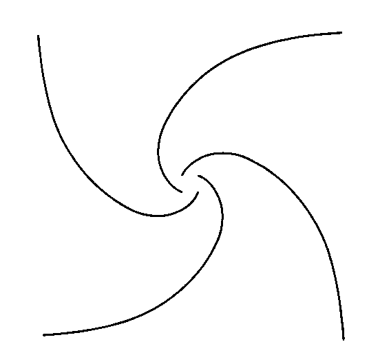
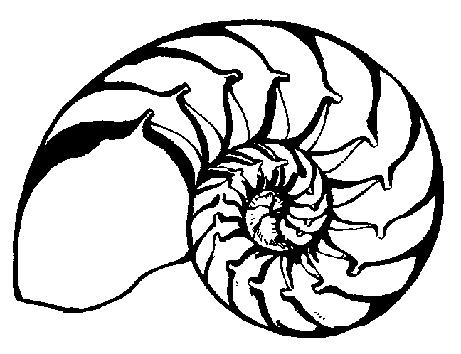
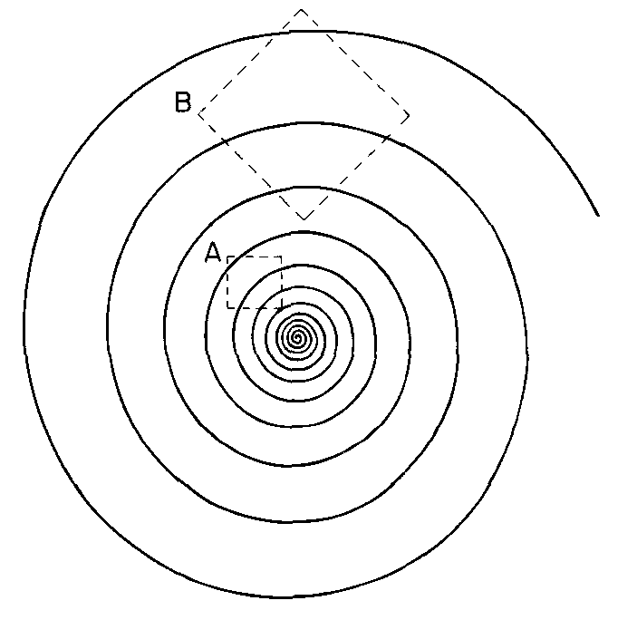
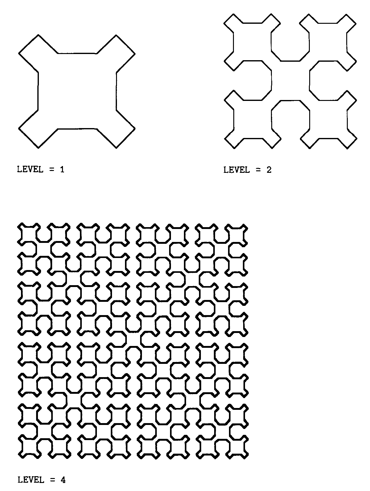

<head>
    <meta http-equiv="Content-Type" content="text/html; charset=utf-8">
    
</head>

Introduction to Turtle Geometry
===============================

> We start with the simplest vocabulary of images, with “left” and “right” and “one, two, three,” and before we know how it happened the words and numbers have conspired to make a match with nature: we catch in them the pattern of mind and matter as one.
>
> Jacob Bronowski, *The Reach of Imagination*

This chapter is an introduction on three levels. First, we introduce you to a new kind of geometry called turtle geometry. The most important thing to remember about turtle geometry is that it is a mathematics designed for exploration, not just for presenting theorems and proofs. When we do state and prove theorems, we are trying to help you to generate new ideas and to think about and understand the phenomena you discover.

The technical language of this geometry is our second priority. This may look as if we’re describing a computer language, but our real aim is to establish a notation for the range of complicated things a turtle can do in terms of the simplest things it knows. lf you wish to actually program a computer-controlled turtle using one of the standard programing languages, you will need to know more details than are presented here; see appendixes A and B.

Finally, this chapter will introduce some of the important themes to be elaborated in later chapters. These themes permeate not only geometry but all of mathematics, and we aim to give you rich and varied experiences with them.

Turtle Graphics
---------------

Imagine that you have control of a little creature called a turtle that exists in a mathematical plane or, better yet, on a computer display screen. The turtle can respond to a few simple *commands*: `FORWARD` moves the turtle, in the direction it is facing, some number of units. `RIGHT` rotates it in place, clockwise, some number of degrees. `BACK` and `LEFT` cause the opposite movements. The number that goes with a command to specify how much to move is called the command’s *input*.

In describing the effects of these operations, we say that `FORWARD` and `BACK` change the turtle’s *position* (the point on the plane where the turtle is located); `RIGHT` and `LEFT` change the turtle’s *heading* (the direction in which the turtle is facing).

The turtle can leave a trace of the places it has been: The position-changing commands can cause lines to appear on the screen. This is controlled by the commands `PENUP` and `PENDOWN`. When the pen is down, the turtle draws lines. Figure 1.1 illustrates how you can draw on the display screen by steering the turtle with `FORWARD`, `BACK`, `RIGHT`, and `LEFT`.

### Procedures

Turtle geometry would be rather dull if it did not allow us to teach the turtle new commands. But luckily all we have to do to teach the turtle a new trick is to give it a list of commands it already knows. For example, here’s how to draw a square with sides 100 units long:

    TO SQUARE
       FORWARD 100
       RIGHT 90
       FORWARD 100
       RIGHT 90
       FORWARD 100
       RIGHT 90
       FORWARD 100

This is an example of a *procedure*. (Such definitions are also commonly referred to as programs or functions.) The first line of the procedure (the *title line*) specifies the procedure’s name. We’ve chosen to name this procedure `SQUARE`, but we could have named it anything at all. The rest of the procedure (the body) specifies a list of instructions the turtle is to carry out in response to the `SQUARE` command. There are a few useful tricks for writing procedures. One of them is called *iteration*, meaning repetition—doing something over and over. Here’s a more concise way of telling the turtle to draw a square, using iteration:

    TO SQUARE
       REPEAT 4
          FORWARD 100
          RIGHT 90

This procedure will repeat the indented commands `FORWARD` 100 and `RIGHT` 90 four times.

Another trick is to create a `SQUARE` procedure that takes an input for the size of the square. To do this, specify a name for the input in the title line of the procedure, and use the name in the procedure body:

    TO SQUARE SIZE
       REPEAT 4
          FORWARD SIZE
          RIGHT 90

Now, when you use the command, you must specify the value to be used for the input, so you say `SQUARE 100`, just like `FORWARD 100`.

The chunk `FORWARD SIZE`, `RIGHT 90` might be useful in other contexts, which is a good reason to make it a procedure in its own right:

    TO SQUAREPIECE SIZE
       FORWARD SIZE
       RIGHT 90

Now we can rewrite `SQUARE` using `SQUAREPIECE` as

    TO SQUARE SIZE
       REPEAT 4
       SQUAREPIECE SIZE

Notice that the input to `SQUARE`, also called `SIZE`, is passed in turn as an input to `SQUAREPIECE`. `SQUAREPIECE` can be used as a *subprocedure* in other places as well—for example, in drawing a rectangle:

    TO RECTANGLE SIDE1 SIDE2
       REPEAT 2
          SQUAREPIECE SIDE1
          SQUAREPIECE SIDE2

To use the `RECTANGLE` procedure you must specify its two inputs, for example, `RECTANGLE 100 50`.

When programs become more complex this kind of input notation can be a bit hard to read, especially when there are procedures such as `RECTANGLE` that take more than one input. Sometimes it helps to use parentheses and commas to separate inputs to procedures. For example, the `RECTANGLE` procedure can be written as

    TO RECTANGLE (SIDE1, SIDE2)
       REPEAT 2
           SQUAREPIECE (SIDE1)
           SQUAREPIECE (SIDE2)

If you like, you can regard this notation as a computer language that has been designed to make it easy to interact with turtles. Appendix A gives some of the details of this language. It should not be diflicult to rewrite these procedures in any language that has access to the basic turtle commands `FORWARD`, `BACK`, `RIGHT`, `LEFT`, `PENUP`, and `PENDOWN`.

Appendix B gives some tips on how to implement these commands in some of the more common computer languages, and includes sample translations of turtle procedures.

### Drawing with the Turtle

Let’s draw a figure that doesn’t use $90°$ angles—an equilateral triangle. Since the triangle has $60°$ angles, a natural first guess at a triangle procedure is

    TO TRY.ANGLE SIZE
       REPEAT 3
          FORWARD SIZE
          RIGHT 60

But `TRY.ANGLE` doesn’t work, as shown in figure 1.2. In fact, running this “triangle” procedure draws half of a regular hexagon. The bug in the procedure is that, whereas we normally measure geometric figures by their interior angles, turtle turning corresponds to the exterior angle at the vertex. So if we want to draw a triangle we should have the turtle turn 120°. You might practice “playing turtle” on a few geometric figures until it becomes natural for you to think of measuring a vertex by how much the turtle must turn in drawing the vertex, rather than by the usual interior angle. Turtle angle has many advantages over interior angle, as you will see.

Now that we have a triangle and a square, we can use them as building blocks in more complex drawings—a house, for example. But Figure 1.3 shows that simply running `SQUARE` followed by `TRIANGLE` doesn’t quite work. The reason is that after `SQUARE`, the turtle is at neither the correct position nor the correct heading to begin drawing the roof. To fix this bug, we must add steps to the procedure that will move and rotate the turtle before the `TRIANGLE` procedure is run. In terms of designing programs to draw things, these extra steps serve as an interface between the part of the program that draws the walls of the house (the `SQUARE` procedure) and the part that draws the roof (the `TRIANGLE` procedure).

In general, thinking of procedures as a number of main steps separated by interfaces is a useful strategy for planning complex drawings. Using procedures and subprocedures is also a good way to create abstract designs. Figure 1.4 shows how to create elaborate patterns by rotating a simple “doodle”.

After all these straight line drawings, it is natural to ask whether the turtle can also draw curves—circles, for example. One easy way to do this is to make the turtle go `FORWARD` a little bit and then turn `RIGHT` a little bit, and repeat this over and over:

    TO CIRCLE
       REPEAT FOREVER
          FORWARD 1
          RIGHT 1

This draws a circular arc, as shown in figure 1.5. Since this program goes on “forever” (until you press the stop button on your computer), it is not very useful as a subprocedure in creating more complex iigures. More useful would be a version of the `CIRCLE` procedure that would draw the figure once and then stop. When we study the mathematics of turtle geometry, we’ll see that the turtle circle closes precisely when the turtle has turned through $360°$. So if we generate the circle in chunks of `FORWARD` 1, `RIGHT` 1, the circle will close after precisely 360 chunks:

    TO CIRCLE
       REPEAT 360
          FORWARD 1
          RIGHT 1

If we repeat the basic chunk fewer than 360 times, we get circular arcs. For instance, 180 repetitions give a semicircle, and 60 repetitions give a $60°$ arc. The following procedures draw left and right arcs of `DEG` degrees on a circle of size `R`:

    T0 ARCR R DEG
       REPEAT DEG
       FORWARD R
       RIGHT 1

    TO ARCL R DEG
       REPEAT DEG
          FORWARD R
          LEFT 1

(See figure 1.6 and exercise 3 for more on making drawings with arcs.)

The circle program above actually draws regular 360-gons, of course, rather than “real” circles, but for the purpose of making drawings on the display screen this difference is irrelevant. (See exercises 1 and 2.)

### Turtle Geometry versus Coordinate Geometry

We can think of turtle commands as a way to draw geometric figures on a computer display. But we can also regard them as a way to describe figures. Let’s compare turtle descriptions with a more familiar system for representing geometric figures—the Cartesian coordinate system, in which points are specified by two numbers, the $x$ and $y$ coordinates relative to a pair of axes drawn in the plane. To put Cartesian coordinates into our computer framework, imagine a “Cartesian turtle” whose moves are directed by a command called `SETXY`. `SETXY` takes two numbers as inputs. These numbers are interpreted as at and y coordinates, and the turtle moves to the corresponding point. We could draw a rectangle with `SETXY` using

    TO CARTESIAN.RECTANGLE (WIDTH, HEIGHT)
       SETXY (WIDTH, 0)
       SETXY (WIDTH, HEIGHT)
       SETXY (O, HEIGHT)
       SETXY (O, O)

You are probably familiar with the uses of coordinates in geometry: studying geometric figures via equations, plotting graphs of numerical relationships, and so on. Indeed, Descartes’ marriage of algebra and geometry is one of the fundamental insights in the development of mathematics. Nevertheless, these kinds of coordinate systems—Cartesian, polar, or what have you—are not the only ways to relate numbers to geometry. The turtle `FORWARD` and `RIGHT` commands give an alternative way of measuring figures in the plane, a way that complements the coordinate viewpoint. The geometry of coordinates is called coordinate geometry we shall refer to the geometry of `FORWARD` and `RIGHT` as turtle geometry. And even though we will be making use of coordinates later on, let us begin by studying turtle geometry as a system in its own right. Whereas studying coordinate geometry leads to graphs and algebraic equations, turtle geometry will introduce some less familiar, but no less important, mathematical ideas.

#### Intrinsic versus Extrinsic

One major difference between turtle geometry and coordinate geometry rests on the notion of the *intrinsic* properties of geometric figures. An intrinsic property is one which depends only on the figure in question, not on the figure’s relation to a frame of reference. The fact that a rectangle has four equal angles is intrinsic to the rectangle. But the fact that a particular rectangle has two vertical sides is *extrinsic*, for an external reference frame is required to determine which direction is “vertical.” Turtles prefer intrinsic descriptions of figures. For example, the turtle program to draw a rectangle can draw the rectangle in any orientation (depending on the turtle’s initial heading), but the program `CARTESIAN.RECTANGLE` shown above would have to be modified if we did not want the sides of the rectangle drawn parallel to the coordinate axes, or one vertex at (0,0).

Another intrinsic property is illustrated by the turtle program for drawing a circle: Go `FORWARD` a little bit, turn `RIGHT` a little bit, and repeat this over and over. Contrast this with the Cartesian coordinate representation for a circle, $x^2 + y^2 = r^2$. The turtle representation makes it evident that the curve is everywhere the same, since the process that draws it does the same thing over and over. This property of the circle, however, is not at all evident from the Cartesian representation. Compare the modified program

    TO CIRCLE
       REPEAT FOREVER
          FORWARD 2
          RIGHT 1

with the modified equation $x^2 + 2y^2 = r^2$. (See figure 1.7.) The drawing produced by the modified program is still everywhere the same, that is, a circle. In fact, it doesn’t matter what inputs we use to `FORWARD` or `RIGHT` (as long as they are small). We still get a circle. The modified equation, however, no longer describes a circle, but rather an ellipse whose sides look different from its top and bottom. A turtle drawing an ellipse would have to turn more per distance traveled to get around its “pointy” sides than to get around its flatter top and bottom. This notion of “how pointy something is,” expressed as the ratio of angle turned to distance traveled, is the intrinsic quantity that mathematicians call *curvature*. (See exercises 2 and 4.)

#### Local versus Global

The turtle representation of a circle is not only more intrinsic than the Cartesian coordinate description. It is also more local; that is, it deals with geometry a little piece at a time. The turtle can forget about the rest of the plane when drawing a circle and deal only with the small part of the plane that surrounds its current position. By contrast, $x^2 + y^2 = r^2$ relies on a large-scale, global coordinate system to deline its properties. And defining a circle to be the set of points equidistant from some fixed point is just as global as using $x^2 + y^2 = r^2$. The turtle representation does not need to make reference to that “faraway” special point, the center. In later chapters we will see how the fact that the turtle does its geometry by feeling a little locality of the world at a time allows turtle geometry to extend easily out of the plane to curved surfaces.

#### Procedures versus Equations

A final important difference between turtle geometry and coordinate geometry is that turtle geometry characteristically describes geometric objects in terms of procedures rather than in terms of equations. In formulating turtle-geometric descriptions we have access to an entire range of procedural mechanisms (such as iteration) that are hard to capture in the traditional algebraic formalism. Moreover, the procedural descriptions used in turtle geometry are readily modified in many ways. This makes turtle geometry a fruitful arena for mathematical exploration. Let’s enter that arena now.

### Some Simple Turtle Programs

If we were setting out to explore coordinate geometry we might begin by examining the graphs of some simple algebraic equations. Our investigation of turtle geometry begins instead by examining the geometric figures associated with simple procedures. Here’s one of the simplest: Go `FORWARD` some fixed amount, turn `RIGHT` some fixed amount, and repeat this sequence over and over. This procedure is called `POLY`.

    TO POLY SIDE ANGLE
       REPEAT FOREVER
          FORWARD SIDE
          RIGHT ANGLE

It draws shapes like those in figure 1.8.

`POLY` is a generalization of some procedures we’ve already seen. Setting the angle inputs equal to 90, 120, and 60, we get, respectively, squares, equilateral triangles, and regular hexagons. Setting the angle input equal to 1 gives a circle. Spend some time exploring `POLY`, examining how the figures vary as you change the inputs. Observe that rather than drawing each figure only once, `POLY` makes the turtle retrace the same path over and over. (Later on we’ll worry about how to make a version of `POLY` that draws a figure once and then stops.)

Another way to explore with `POLY` is to modify not only the inputs, but also the program; for example (see figure 1.9),

    TO NEWPOLY SIDE ANGLE
       REPEAT FOREVER
          FORWARD SIDE
          RIGHT ANGLE
          FORWARD SIDE
          RIGHT (2 * ANGLE)

(The symbol “\*” denotes multiplication.) You should have no difficulty inventing many variations along these lines, particularly if you use such procedures as `SQUARE` and `TRIANGLE` as subprocedures to replace or supplement `FORWARD` and `RIGHT`.

#### Recursion

One particularly important way to make new procedures and vary old ones is to employ a program control structure called *recursion*; that is, to have a procedure use itself as a subprocedure, as in

    TO POLY SIDE ANGLE
       FORWARD SIDE
       RIGHT ANGLE
       POLY SIDE ANGLE

The final line keeps the process going over and over by including “do `POLY` again” as part of the definition of `POLY`.

One advantage of this slightly different way of representing `POLY` is that it suggests some further modifications to the basic program. For instance, when it comes time to do `POLY` again, call it with different inputs:

    TO POLYSPI SIDE ANGLE
       FORWARD SIDE
       RIGHT ANGLE
       POLYSPI (SIDE + 1, ANGLE)

Figure 1.10 shows some sample `POLYSPI` figures. Look carefully at how the program generates these figures: Each time the turtle goes `FORWARD` it goes one unit farther than the previous time.

A more general form of `POLYSPI` uses a third input (`INC`, for increment) to allow us to vary how quickly the sides grow:

    TO POLYSPI (SIDE, ANGLE, INC)
       FORWARD SIDE
       RIGHT ANGLE
       POLYSPI (SIDE + INC, ANGLE, INC)

In addition to trying `POLYSPI` with various inputs, make up some of your own variations. For example, subtract a bit from the side each time, which will produce an inward spiral. Or double the side each time, or divide it by two. Figure 1.11 illustrates a pattern made drawing only the vertices of `POLYSPI`, shown at four scales of magnification (see exercise 13).

Another way to produce an inward spiral (curve of increasing curvature) is to increment the angle each time:

    TO INSPI (SIDE, ANGLE, INC)
       FORWARD SIDE
       RIGHT ANGLE
       INSPI (SIDE, ANGLE + INC, INC)

Run `INSPI` and watch how it works. The turtle begins spiraling inward as expected. But eventually the path begins to unwind as the angle is incremented past $180°$. Letting `INSPI` continue, we find that it eventually produces a symmetrical closed figure which the turtle retraces over and over as shown in figure 1.12. You should find this surprising. Why should this succession of `FORWARD`s and `RIGHT`s bring the turtle back precisely to its starting point, so that it will then retrace its own path? We will see in the next section that this closing phenomenon reflects the elegant mathematics underlying turtle geometry.

#### Exercises for Section 

1.  We said in the text that when the inputs to the `POLY` procedure are small, the resulting figure will be indistinguishable from a circle. Do some experiments to see how large you can make the inputs and still have the figure look like a circle. For example, is an angle of $20°$ small enough to draw acceptable circles?

2.  The sequence of figures `POLY(2,2)`, `POLY(1,1)`, `POLY(.5, .5)` all with the same curvature (turning divided by distance traveled), approaches “in the limit” a true mathematical circle. What is the radius of the circle?

3.  $[P]$ Write a procedure that draws circular arcs. Inputs should specify the number of degrees in the arc as well as the size of the circle. Can you use the result of exercise 2 so that the size input is the radius of the circle? [A]

4.  Although the radius of a circle is not “locally observable” to a turtle who is drawing the circle, that length is intimately related to a local quantity called the “radius of curvature,” defined to be equal to $1 \div$ curvature, or equivalently, to distance divided by angle. What is the relation between radius and radius of curvature for a `POLY` with small inputs as above? Do this when angle is measured in radians as well as in degrees. [A]

5.  $[P]$ Construct some drawings using squares, rectangles, triangles, circles, and circular arc programs.

6.  $[P]$ lnvent your own variations on the model of `POLYSPI` and `INSPI`.

7.  How many different 9-sided figures can `POLY` draw (not counting differences in size or orientation)? What angle inputs to `POLY` produce these figures? How about 10-sided figures? [A]

8.  $[PD]$ A rectangle is a square with two different side lengths. More generally, what happens to a `POLY` that uses two different side lengths as in the following program?

        TO DOUBLEPOLY (SIDE1, SIDE2, ANGLE)
           REPEAT FOREVER
           POLYSTEP SIDE1 ANGLE
           POLYSTEP SIDE2 ANGLE

    In particular, how does the symmetry of `DOUBLEPOLY` relate to that of `POLY` with the same `ANGLE` input?

9.  $[D]$ Which encloses the larger area—`POLY(5, 5)` or `POLY(6,6)`?

10. $[P]$ Find inputs to `INSPI` that give a nonclosed figure. Can you give a convincing argument that the figure is really nonclosed rather than, say, a closed figure too big to fit on the display screen? [A]

11. $[P]$ If the display system you are using allows “wraparound,” you can get some interesting effects by trying `POLY`s with very large sides. Explore these figures.

12. There are three kinds of “interchanges” we can perform on turtle programs: interchanging `RIGHT` and `LEFT`, interchanging `FORWARD` and `BACK`, and (for programs that terminate) reversing the sequence of instructions. Describe in geometric terms the effect of each of these operations, both by itself and in combination with the others. Start with the class of programs that close (return the turtle to its initial position and heading). [HA]

13. $[P]$ The pattern made by the vertices of `POLYSPI` can be an interesting object of study. The dots seem to group into various “arms,” either straight or curving left or right. To draw these patterns, you can use the procedures

        TO SPIDOT ANGLE
           SUBSPIDOT 0 ANGLE

        TO SUBSPIDOT SIDE ANGLE
           FORWARD SIDE
           DOT
           RIGHT ANGLE
           SUBSPIDOT (SIDE + 1, ANGLE)

        TO DOT
           PENDOWN
           FORWARD
           BACK 1
           PENUP

    For example, predict what you will see between `SPIDOT 90`, which has four arms, and `SPIDOT 120`, which has three. Can you explain the sequence of figures you actually do see? Figure 1.11 shows how the figure drawn by the same `SPIDOT` program seems to have different numbers of spiral arms when viewed at different scales of magnification, which can be accomplished by changing the increment to `SIDE` in `SUBSPIDOT`. Study this phenomenon.

14. $[P]$ Suppose we have a function called `RANDOM` that outputs a random digit (0 through 9). Play around with the procedure

        TO RANDPOLY SIDE ANGLE
           REPEAT FOREVER
              IF RANDOM = 0 THEN PENDOWN
                 ELSE PENUP
              FORWARD SIDE
              RIGHT ANGLE

    Use this program as the basis for some psychology experiments. For instance, what is the average number of sides that must be drawn before people can recognize which `POLY` it is?

15. $[D]$ Find some local and intrinsic way to describe an ellipse. Write a program that makes the turtle draw ellipses, where the inputs specify the size and eccentricity of the ellipse. [A]

POLYs and Other Closed Paths
----------------------------

This section develops some general theorems about turtle programs by studying one of the simplest of them, `POLY`, which, when it closes, exhibits clearly some properties shared by all closed paths, no matter how complicated. Even when `POLY` doesn’t close, it can serve as a model that clarifies symmetry and other important properties of a very general class of programs. Careful and patient study of such a simple program will be richly rewarded.

### The Closed-Path Theorem and the Simple-Closed-Path Theorem

You have probably already noticed that `POLY` with an angle input of $360 / n$ draws a regular n-sided polygon. But it is not always true that (number of sides) $\times$ (angle) $= 360$. If you try running `POLY` with an angle of 144 you will see that it draws a five-pointed star, and $5 \times 144 = 720$, not 360. Noticing that 720 is exactly twice 360 might lead us to guess the following formula: $$\text{(number of sides)} \times \text{(angle)} = 360 \times \text{(an integer)}$$ It’s not hard to see why this formula is true. The number of sides times the angle is precisely the *total turning* done by the turtle in walking once around the figure—the net change in heading. If the path is to close legitimately, and not just cross itself, then the turtle must end its trip with the same heading it started out with. Thus, the total turning must be some multiple of $360°$.

Total turning is the central concept here. It certainly need not be restricted to `POLY`. One can imagine any turtle program keeping a running count of its turning, adding in `RIGHT`s and subtracting `LEFT`s. Because only `RIGHT`s and `LEFT`s change heading, this total turning is always exactly the total change in heading. In particular, if the path is a closed path (one which restores the turtle’s initial position and heading), we can be confident that the net turning ($=$ change of heading) is a multiple of $360°$. This gives us our first turtle-geometric theorem:

**Closed-Path Theorem** The total turning along any closed path is an integer multiple of $360°$.

Total turning is an intrinsic property of a path. It does not depend on where the path starts, or how it is oriented with respect to “vertical.” The total turning of a closed path is frequently summarized simply by the particular integer that multiplies 360. That integer is called the *rotation number* of the path. As an exercise, follow the turtle around the sample paths in figure 1.13 and compute the rotation numbers.

Does your experience with `POLY` suggest an improvement to the closed-path theorem? A little experimentation should convince you that there are two essentially different classes of `POLY` paths: simple polygons (such as squares, triangles, and hexagons); and star polygons (such as five-pointed stars), which are characterized by the fact that the paths cross themselves. The simple polygons always appear to have total turning equal to $+360°$ or $-360°$, depending upon the direction in which the turtle traverses the path. The star polygons, however, always have total turning different from $\pm 360°$.

One wonders if this experimental correlation has general significance. It is not hard to prove its validity for `POLY`s (see exercise 11 below). But the more important conjecture involves generalizing from `POLY`s to any *simple closed path* (a closed path that does not cross itself):

**Simple-Closed-Path Theorem** The total turning in a simple closed path is $360°$ (to the right or to the left). That is to say, the rotation number of any simple closed path is $\pm 1$.

Take a look at some examples of simple closed paths to convince yourself of the plausibility of this theorem, which is difficult to prove rigorously. We will return to it later, in chapter 4. For now you should note that this theorem says that there is a relation between two very different aspects of a closed path—the turning and the crossing points. That makes it considerably less obvious than the closed-path theorem, but also much more powerful. We give one example of the power here and several more in the exercises.

The simple-closed-path theorem says that the sum of the exterior angles of any simple polygon is $360°$. For triangles, we can rewrite this in terms of the three interior angles $A$, $B$, and $C$ to get $$(180 - A) + (180 - B) + (180 - C) = 360$$ and thus $$(A + B + C) = \text{the sum of interior angles} = 3 \times 180 - 360 = 180.$$

So, as a corollary of the simple-closed-path theorem, we have derived the familiar result that the interior angles of a triangle must sum to $180°$.

(Exercises 6-9 detail some other applications of the simple-closed-path theorem.)

### The POLY Closing Theorem

The `POLY` procedures we’ve written so far, iterative and recursive, have one fault: They neverstop. That makes it generally impossible to use them as subprocedures in more complicated programs. Moreover, the “inefficiency” of a drawing program that doesn’t know when it is done may simply offend one’s sensibilities. The problem of making a `POLY` program that stops is a mathematical one with two fundamentally different approaches.

The global approach is as follows: Sit back and look ahead. Given an `ANGLE` input, compute how many times the turtle must run the basic `POLY` step, `FORWARD SIDE`, `RIGHT ANGLE`, before the path closes and starts again. Then you need only repeat the `POLY` step that many times. The local approach revolves around questions like the following: How can the turtle know, as it is walking along, when it is done? What clue can the turtle be watching for? We will take the second approach here, as it turns out to be simpler. The Hrst approach, however, is mathematically rich and is pursued in section 1.4.

Consider: How could a turtle, while walking along drawing a `POLY`, know when the figure has been completed? (A computer turtle cannot see the lines it is drawing.) Thinking locally, the turtle knows only two things, position and heading. Neither of these is truly local, for to measure them usually involves a coordinate system. But the one locally computable quantity we know about—total turning—can do the trick. The closed-path theorem says that if the path closes, then total turning must be a multiple of $360°$. How about the converse: If the total turning reaches a multiple of $360°$, will the path be closed? This is not true for turtle paths in general, but it is true for `POLY`:

**POLY Closing Theorem** A path drawn by the `POLY` procedure will close precisely when the total turning reaches a multiple of $360°$.

There is one bug in this theorem, one exceptional case: If the angle of the `POLY` is equal to 0 then the turtle just walks off along a straight line. The path never closes, even though at every point the total turning is 0, a perfectly good multiple of 360. But this exceptional case, `FORWARD SIDE`, `RIGHT 0`, is transparent enough so that we can just leave it out of consideration in most instances. Any multiple of $360°$ will, of course, have the same effect as a turn of 0.

We’ll outline two different proofs of the `POLY` closing theorem.

**Sketch of Proof 1** Have you noticed the important fact that the vertices of `POLY` lie on a circle? (Everything about `POLY` seems to be circular!) We leave the proof of this geometric fact to you in exercise 2. Using this fact, one can redescribe `POLY` as the sequential laying down of fixed-length chords on a fixed circle as shown in figure 1.14. The point is that there is only one chord of the required length that can be produced by the turtle starting at any given heading. (Actually there are two, but one of them has the wrong sense—the turtle would turn off the circle after traversing the chord.) Thus, whenever the turtle returns to its initial heading (total turning = any multiple of $360°$) it will be about to retrace the first chord and so should stop. Notice how this proof breaks down for the exceptional case `FORWARD SIDE`, `RIGHT 0`. The turtle must do some turning or else the vertices will lie on a straight line rather than on a circle.

An alternative proof is inspired less by geometry and more by ideas from the theory of computation. It proceeds as follows.

**Sketch of Proof 2** Assume that we have a turtle following a `POLY` procedure, and that at some time the turtle returns to its initial heading (heading change = a multiple of $360°$) but not to its initial position. We will show that this assumption leads to a contradiction. (The trick of the proof is to show that the turtle must walk off to infinity in some

direction. Then, by regrouping the sequence of commands, we’ll show that the turtle runs off to iniinity in a different direction.)

By assumption, the turtle returns to its initial heading after some number (say, $n$) repetitions of the `POLY` step. (Notice that $n$ cannot be 1 if we neglect the exceptional case `ANGLE` = 0.) Draw a dotted line connecting the turtle’s initial position $p_0$ to its position $p_n$ after $n$ repetitions. This line makes some angle $\theta$ with the turtle’s initial heading (figure 1.15a).

Now let the turtle continue for $n$ more repetitions of the `POLY` step. Since the turtle starts out from $p_n$ with the same heading it had when it started at $p_0$, the effect of n more `POLY` steps will be to do the same thing again, moving the turtle farther out along the same line, and again bring it back to the initial heading (figure 1.15b). Continuing with $n$ more repetitions, and $n$ more, and so on, we see that the turtle must run off infinitely far in the direction of the dotted line. Moreover, at no point can the turtle’s path stray very far from the line, since the turtle must get back to it at the end of every $n$ `POLY` steps. Now let’s return the turtle to the initial state and run the `POLY` step for one iteration. We will now see the turtle at a new position $p_1$ with a different heading. lf we continue with $n$ repetitions from here, the turtle will end up on a new dotted line that lies at angle $\theta$ to this new heading. (Figure 1.15c).

But the problem is obvious now. Running another sequence of $n$, then another and another, forces the turtle off infinitely far along this new line. But the turtle cannot remain close to both dotted lines as it marches off to infinity. This contradiction means that our assumption that the turtle does not come back to the initial position must have been wrong. This completes the proof.

This second proof demonstrates an important computational strategy: Divide a process into meaningful chunks (for example, the parts of the `POLY` between equal headings), then pay close attention to the net action of the chunks. Structuring a complex program as a group of subprocedures illustrates the same strategy.

Here finally is our `POLY` with stop rule:

    TO POLYSTOP SIDE ANGLE
       TURN <- O
       REPEAT
          FORWARD SIDE
          RIGHT ANGLE
          TURN <- (TURN + ANGLE)
       UNTIL REMAINDER (TURN, 360) = 0

Note the use of the new symbol $\leftarrow$, which means “assign to the variable on the left the value given on the right.” The procedure `REMAINDER` is a function that computes the value of its first input modulo its second input. The program also makes use of the iteration construct “`REPEAT . . . UNTIL` (some condition)”, which keeps repeating the indented portion until the condition is true (and always does the indented part at least once).

This program allows us to use `POLY`s as building blocks in more complex figures; for example (see figure 1.16),

    TO POLYROLL SIDE ANGLE1 ANGLE2 I
       REPEAT FOREVER
          POLYSTOP SIDE ANGLE1
          RIGHT ANGLE2

#### Exercises for Section 

1.  The simple-closed-path theorem has a serious bug as it stands. It purports to give the precise multiple of 360 that describes the total turning for a set of paths. Unfortunately, one can insert a step, `RIGHT 360`, that does not change the path at all, yet changes the multiple of 360 given by total turning. These gratuitous 360s must be pruned from the program before the theorem can hold. However, the pruning can be somewhat complicated if the gratuitous 360s are hidden—as, for example, `LEFT 160` followed by `RIGHT 360` being written as `RIGHT 200`. Give general rules for pruning. (Think of writing a procedure that takes the text of a turtle procedure as input and returns the pruned version.) Try your method on the following program:

        TO PRUNE.ME
           FORWARD 5
           RIGHT 360
           FORWARD 5
           LEFT 240
           FORWARD 10
           LEFT 120
           FORWARD 0
           LEFT 120
           FORWARD 10
           RIGHT 120

    Can you give some motivation for pruning other than that it makes the simple-closed-path theorem true? [A]

    

2.  Fill in the details in the first proof of the `POLY` closing theorem (see “sketch of proof 1”), including a proof that the vertices of `POLY` lie on a circle.

3.  Prove that if the angle input to `POLY` is an irrational number, the turtle never returns to its initial position, and yet always remains within a finite distance from it. [A]

4.  $[P]$ lnvent some variations on the `POLYROLL` program, perhaps modeled after `POLYSPI` and `INSPI`.

5.  Rewrite the `POLYSTOP` program recursively, so that it doesn’t use the `REPEAT` command. [A]

6.  What is the sum of the interior angles of an $n$-gon? What is the interior angle of a regular $n$-gon? Show how these formulas can be easily derived by using the simple-closed-path theorem.

7.  Suppose we have a simple arc (an arc that does not cross itself) and that we join the endpoints of the arc by a straight line. Suppose further that the line and the arc do not intersect except at the endpoints (figure 1.17). Use the simple-closed-path theorem to give a formula relating the total turning over the arc to the (interior) angles that the arc makes with the line.

8.  Apply the result of the previous exercise to find the angle between a chord of a circle and the arc that it subtends (figure 1.18a). [A]

9.  Use the previous exercise to compute the arc of a circle subtended by an inscribed angle (figure 1.18b). [HA]

10. Proof 1 of the `POLY` closing theorem was based on the fact that the vertices of a `POLY` all lie on a circle. Use the simple-closed-path theorem to show that the amount of arc on the circumscribed `POLY` circle from one vertex to the next is just the angle input to the `POLY` procedure. [H]

11. We said that we would delay giving a proof of the simple-closed-path theorem until chapter 4. Give a proof of the theorem in the special case where the simple closed path is a `POLY` figure. [H]

12. If you take a bicycle and lock the front wheel at angle $\theta$ from straight ahead (where $\theta$ is rather small), the bicycle will turn in a circle. What is the radius of the circle, given that the length between wheel centers of the bicycle is D?

Looping Programs
----------------

We said that the turtle approach allows us to take concepts that are useful in thinking about computation and apply them to the study of geometry. One such concept is that of state. Of course the idea of state is not unique to computer science. It is important in physics, chemistry, and any other field involving configurations that are subject to change. But we do not generally look upon geometry in this way; geometric figures are usually regarded as static objects. Turtle geometry provides a more dynamic perspective—the geometry is tied to movements. The state of the turtle is given by specifying its position and its heading. From the state point of view, the basic turtle commands –`FORWARD`, `BACK`, `LEFT`, and `RIGHT`—are *state-change operators*: They cause the turtle to change state. In this section we will look at a sequence of turtle commands purely in terms of its net effect in changing the initial state to the final state, ignoring what comes between. Thus, a sequence of turtle commands can be summarized as a single state-change operator. At this level of abstraction all programs that generate a closed path are the same—they are all *state-change-equivalent*. They correspond to the simplest of all state-change operators, the one that does nothing and leaves the initial state *invariant*.

### The Looping Lemma

There is something striking about the paths drawn by the modifications to `POLY` discussed at the end of section 1.1. It is as if their descent from `POLY` cannot be suppressed! You should have noticed the same phenomenon in many of your own programs. Figure 1.19 shows a `POLY` skeleton in dotted lines underlying the elaborate surface structures of `NEWPOLY` and `INSPI`. Can we understand this phenomenon?

The key observation is this: Between successive vertices of the `POLY` skeleton, the program does the same thing. We might say that the program is just a decorated version of the underlying `POLY`. That the paths of `NEWPOLY` and `INSPI` consist of a collection of identical pieces is evident from the pictures they draw. In the case of `NEWPOLY` the repetitive or looping behavior is clear in the program structure. `INSPI`’s program structure will require a second look. For now we proceed on the basis of the visual evidence of the paths and consider the class of programs that do the same thing over and over, regardless of the complexity of the basic loop (the thing that is repeated).

We can peel away the decoration by focusing on the net result of the basic loop. What is the difference between the initial state and the final state of the turtle? By the nature of the turtle only two things can happen: a net change of position and a net change of heading. Figure 1.20a shows the general case. Notice that we cannot assume that the change of position is in the same direction as the turtle’s original heading; hence, we must include an angle $i$ between the initial heading and the change-of-position line.

When the basic loop is repeated, the same change of state must occur, but now relative to the new heading and hence rotated by the heading change which the turtle underwent in the first loop. We will call this change of heading $T$ (for total turn). The next loop must follow the same pattern, and so on. Figure 1.20b shows the repeated process laying down the skeleton `POLY`. The angle $i$ is irrelevant to the intrinsic properties of the underlying `POLY`-it just determines the relative orientation of the `POLY` with respect to the initial heading of the turtle. The important quantity is the heading change from beginning to end of the basic loop, the total turning $T$ in the basic loop. This is the angle of turning from one segment of the `POLY` to the next, and it determines the iigure’s properties. We can state this result more formally:

**Looping Lemma** Any program that is just a repetition of some basic loop of turtle instructions has precisely the structure of `POLY` with an angle input equal to $T$, the total turning in the loop.

You should be able to say what “has the structure of `POLY`” means in detail. lt includes such things as repeatedly touching base with a circle if total turning is not equal to a multiple of $360°$, and touching base with a line if it is. It also includes the fact that the symmetry type of the figure is the same as that of the underlying `POLY`. For instance, if the total turning of the basic loop is $90°$, the repeated loop will have the fourfold symmetry of a square, necessarily closing in four iterations of the loop.

### Examples of Looping Programs

Let’s analyze some simple looping programs. In `NEWPOLY` the total turning is $3 \times$ `ANGLE`. If `ANGLE` is 144, then $T = 3 \times 144 = 432$, which is equivalent to $72 = 360 \div 5$. Hence, the five-pointed star `NEWPOLY` actually has the structure of a pentagon (not a `POLY` with `ANGLE 144`)—something that might not have been apparent from just looking at the path. (The fact that the path is simple is a clue. Also, observe that the program visits the vertices of the underlying pentagon in sequence, as does `POLY` with an `ANGLE` of 72, rather than skipping between vertices, as does `POLY` with `ANGLE` 144.)

Let’s take a look at `INSPI`—in particular `INSPI` with `ANGLE` equal to 2 and `INCREMENT` equal to 20, which draws the decorated five-pointed star shown in figure 1.12. The program simply alternates `FORWARD SIDE` with turning `RIGHT` an ever-increasing angle which is tabulated in the following:

    RIGHT 2
    RIGHT 2 + 20
    RIGHT 2 + 2*20
    RIGHT 2 + 3*20
    .
    .
    .
    RIGHT 2 + 17*20
    RIGHT 2 + 18*20 = 2 + 360

The last command has the same effect as the first, and the one to follow, `RIGHT` $2 + 19 \times 20 =$ `RIGHT` $2 + 20 + 360$, is the same as the second. The program is clearly staging a repeat performance of the first 18 steps. Computing the total turning, we find

We will refer to the figures drawn by `SPIRO` as simple spirolaterals. A more general kind of spirolateral (shown in figure 1.22) maintains a basic loop in which each vertex has the same amount of turning, but allows the turtle to turn left rather than right at some of the vertices. To specify these figures we need to indicate the direction of the turtle’s turning at each vertex. The corresponding `GSPIRO` procedure takes four inputs: a side length (the length of the shortest side in the figure), an angle through which the turtle turns left or right at each vertex, a number `MAX` telling how many steps are in the basic loop, and a list of numbers specifying the vertices at which the turtle should turn left. If the vertex number is a member of the list, then the turtle turns left at the vertex; otherwise the turtle turns right. (The `MEMBER` command is used to tell whether or not something is a member of a list.) Thus, the `GSPIRO` procedure is

    TO GSPIRO (SIDE, ANGLE, MAX, LIST)
       REPEAT FOREVER
          SUBGSPIRO (SIDE, ANGLE, MAX, LIST)

    TO SUBGSPIRO (SIDE, ANGLE, MAX, LIST)
       COUNT <- 1
       REPEAT
          FORWARD SIDE * COUNT
          IF MEMBER (COUNT, LIST)
             THEN LEFT ANGLE
             ELSE RIGHT ANGLE
          COUNT <- COUNT + 1
       UNTIL COUNT > MAX

The basic loop `SUBGSPIRO` makes `MAX` $-$ $L$ right turns and $L$ left turns where $L$ is the number of elements in `LIST`, making a total turning of (`MAX` $-$ $L$) $\times$ `ANGLE` $-$ $L$ $\times$ `ANGLE` $=$ (`MAX` $- 2L$) $\times$ `ANGLE`. One intriguing property of spirolaterals is that they may be closed even when the heading change is a multiple of $360°$. Total turning a multiple of $360°$ would lead you to expect a `POLY` substrate that would march off on a straight line to infinity. But, by a remarkable coincidence, the sidelength of the underlying `POLY` (which we did not bother to compute for any of these other programs) might turn out to be 0 as well! This corresponds to having a looping program in which the basic loop closes all by itself. This phenomenon deserves a name: *unexpectedly closed*. Figure 1.23 gives some examples of unexpectedly closed spirolaterals.

### More on the Looping Lemma

We end the body of this section with two remarks about the looping lemma—one about its implications beyond predicting the symmetry of looping programs, the other about increasing the strength of the lemma. First, the looping lemma constrains the behavior of any looping program. Under many circumstances, it may be possible to exclude simple looping as a way of generating a class of paths. For example, any infinite spiral neither touches base on a lixed circle nor marches off to infinity around a line as `POLY` does, so it cannot be drawn by any looping program.

Second, it can be very valuable to know how to identify which programs are looping programs without a detailed look at each particular case. We can give a purely program-structural criterion that serves to identify such programs: A program must loop (or terminate) if it consists of any combination of

-   fixed and finite sequences of turtle commands `FORWARD`, `BACK`, `LEFT`, and `RIGHT` with specified numeric inputs (these are called fixed instruction sequences),

-   repeats, and

-   calls to programs that satisfy these properties.

Notice that this criterion is recursive in form.

### Technical Summary

The following is a technical recap of results stated or implied in this section. The detailed proofs of these facts are left as exercises.

#### The Canonical Form of a Turtle State-Change Operator

Any fixed instruction sequence of turtle commands is state-change-equivalent to a `POLY` step sandwiched between a `RIGHT` I and `LEFT` I for some angle I:

    RIGHT I
    FORWARD D
    RIGHT T
    LEFT I

The angle $T$ is precisely the total turning of the fixed instruction sequence.

#### Looping Lemma and Classification of Looping Programs

Any program that repeats a fixed instruction sequence (or the equivalent, as in `INSPI`) has the behavior of a `POLY` with angle $T$ and side $D$ in the following senses (the angle $T$ may be simply determined as the total turning in the basic loop):

**Boundedness** If $T \not= 0$ then the figure drawn by the program will lie within a fixed distance from some circle, and hence will be bounded. In the exceptional case, $T = 0$, the figure will lie within a fixed distance from some line (figure 1.24).

**Closing** If $T$ is a rational multiple of $360°$, the program will always draw a closed path, with the usual exception, $T = 0$, which causes the program to walk off to infinity. The exception to the exception is when $D$ is also zero, the equivalent of `POLY 0 0`, in which case the program is “unexpectedly” closed. If $T$ is irrational the program will never close.

**Symmetry** The program must have the same rotational symmetry as `POLY D T`. In particular, if $T = 360s/r$ where $s/r$ is a fraction in lowest terms, then the program will have $r$-fold symmetry. (We have not yet discussed symmetry in detail. This topic will form the basis of section 1.4.)

### Nontechnical Summary

Doing the same thing over and over is either circular, straight-linish, or very dull.

#### Exercises for Section 1.3

1.  $[P]$ Draw at least three distinct (ignoring size) `INSPI` figures with sixfold symmetry.

2.  Give a proof of the looping lemma and the classification of looping programs given in the technical summary. This may be done using the form of a general state-change operator (given above) or by modifying Proof 2 of the `POLY` closing theorem of subsection 1.2.2. Give bounds for the “fixed distances” specified in the boundedness part in terms of the instructions in the basic loop.

3.  $[P]$ Figure 1.23 shows some unexpectedly closed spirolaterals. Find some more.

4.  What is the heading change for `INSPI` with an `ANGLE` of $A$ and an `INCREMENT` of 10? [A]

5.  $[D]$ What is the heading change for `INSPI` with an `ANGLE` of $A$ and an `INCREMENT` of 360/$n$, where $n$ is an integer? [HA]

6.  $[DP]$ Compute the total turning, $T$, of the basic loop in the following looping program in terms of the angle inputs `BOTTOM` and `TOP`. Use your formula to draw at least three different (ignoring size) figures with threefold symmetry; fourfold, fivefold.

        TO POLYARC (SIDE, BOTTOM, TOP)
           REPEAT FOREVER
              INSPI.STOP (SIDE, BOTTOM, TOP, 1)
              INSPI.STOP (SIDE. TOP, BOTTOM, -1)

        TO INSPI.STOP (SIDE, START.ANG, END.ANG, INC)
           REPEAT
              FORWARD SIDE
              LEFT START.ANG
              START.ANG <- START.ANG + INC
           UNTIL START.ANG = END.ANG

7.  $[P]$ Make “even more general” spirolaterals by allowing the turtle to move `BACK` at certain of the vertices. Analyze this program. Find some unexpectedly closed figures.

8.  $[DD]$ Show that a simple spirolateral can never be unexpectedly closed.

9.  $[DD]$ Can `INSPI` produce unexpectedly closed figures?

10. $[P]$ Invent some disguised looping programs like `INSPI`. Give a formula for the total turning of the basic loop in terms of the inputs to the procedure. Find inputs that draw figures with simple symmetry. Find inputs that draw unbounded figures. Determine whether any of these figures are unexpectedly closed.

11. When we summarize turtle paths as state-change operators, the closed paths are precisely those operators that leave the turtle’s state unchanged. This suggests the generalization of studying operators that, when run twice (or three times, and so on), leave the state unchanged. Describe the paths corresponding to these operators. [A]

12. $[P]$ Can you characterize “looping programs” in terms of the commands used in writing them? In particular, consider the following program structures, where X and Y are variables and n is some fixed number:

    -   do loops

    -   goto statements

    -   assignment statements of the form $X \leftarrow n$

    -   assignments of the form $X \leftarrow Y + n$

    -   conditional statements of the form `IF` $X = n$ . . .

For each kind of structure, say whether a program that repeats a block of instructions consisting of basic turtle commands together with that particular structure must necessarily be equivalent to a program which repeats a fixed instruction sequence. Are there bad combinations, in the sense that two structures which separately lead to looping may not loop when combined in a single program?

### Symmetry of Looping Programs

Section 1.3 showed how the symmetry of any looping program is determined by the symmetry of an underlying `POLY` skeleton. But what determines the symmetry of the `POLY`? To begin with, it is clear that the `SIDE` input in `POLY SIDE ANGLE` does not aiiect the shape of the figure at all but only determines the size. The real question is: How does the `ANGLE` input affect the symmetry of `POLY`? To be more precise, we can break this question into two questions:

For a given `ANGLE` input, how many vertices will the resulting `POLY` have? Conversely, if we want to produce a `POLY` with a specified number of vertices, what number(s) can we use for the `ANGLE` input?

The purpose of this section is to answer these questions, and in doing so to provide a taste of the mathematics of number theory.

### The Symmetry of `POLY`

We want to relate the number of vertices, $n$, to the input `ANGLE`, which we’ll call $A$ for short. The `POLY` closing theorem of 1.2.2 gives us a very good start. It says `POLY` is done when the turtle has turned a multiple of $360°$, that is, when $n$ turns of $A$ each is some multiple of 360:

$nA = 360R$

We’ve given the multiple the name $R$ for a good reason: It is the rotation number of the figure, as defined in subsection 1.2.1.

But the above equation, which defines a common multiple of $A$ and 360, doesn’t tell the whole story. $R$ and $n$ aren’t just any integers satisfying the equation; they are the smallest (positive) that do so, corresponding to the first time heading change reaches a multiple of 360. That is why the number $nA=360R$ is called the *least common multiple* of $A$ and 360, denoted LCM(A, 360). The answer to our first question is: For an `ANGLE` input of $A$, the number of vertices of the resulting `POLY` is $n$ = LCM(A, 360) / $A$ and the rotation number is $R$ = LCM(A, 360) / 360.

What we’ve done so far is little more than giving the answer a name. How does one go about computing the least common multiple? One way, which assumes that $A$ is an integer, is to express $A$ and 360 as products of primes. Then each of the expressions *nA* and 360$R$ will give a partial view of the factorization of LCM(A, 360). For example, if $A$ = 144 then we have $A$ = $2^4 \times  3^2$, 360 = $2^3 \times 3^2 \times 5$. Using this decomposition, we can deduce that $$\operatorname{LCM}(144,360) = n \times 2^4 \times 3^2 = R \times 22 \times 32 \times 5 = 2^4 \times 3^2 \times 5 = 720$$ for it is easy to see that the LCM must contain at least four factors of 2 (from $A$), one factor of 5 (from 360), and two factors of 3 (from either $A$ or 360), and from this we derive that $n$ = 5 and $R$ = 2. So `POLY 100 144` has fivefold symmetry (it consists of $n$ = 5 identical pieces identically hooked together) and rotation number 2.

Another way to compute the least common multiple is to solve the equation *nA* = 360$R$ exactly as the procedure `POLY` solves it: by running until it closes! Make a list of $n$ $\times$ $A$ for $n$ = 1,2,3,... and see when $n$ $\times$ $A$ is a multiple of 360. Applying this method to our example $A$ = 144 gives

  $n$    *nA*    multiple of 360?
  ----- ------ ------------------
  1      144                   no
  2      288                   no
  3      432                   no
  4      576                   no
  5      720                  yes

We can formulate this method as a procedure for computing the least common multiple:

    TO LCM A B
       N <- O
       REPEAT
          N <- N + 1
          MULTIPLE <- N * A
       UNTIL REMAINDER (MULTIPLE, B) = 0
       RETURN MULTIPLE

Such “brute force” methods of computation can be very useful. We will see in the next subsection the utility of a simple modification of this process, called Euclid’s algorithm. The `LCM` procedure uses `RETURN`—a command we haven’t seen before. Since the procedure is supposed to be computing some value, we need to have some method for “getting the value out of the procedure.” This is what `RETURN` does. In practice the returned value will be used as an input to another operation, for example, `PRINT LCM(144,360)`.

Let’s turn to our second question about the symmetry of `POLY` figures. Suppose we want to produce figures of a given symmetry; what `ANGLE` can we use? To answer this question, let’s start again with the basic symmetry equation *nA* = 360$R$. Since we want to find values for $A$ that will produce a given value for $n$, we should be able to use any $A$ that satisfies $A$ = 360$R$/$n$. The question is: What value(s) can we choose for $R$? For instance, we can take $R$ = 1, $A$ = 360/$n$, which always works—it makes a regular *n-sided polygon*. But $R$ = 2, $A$ = 2 $\times 360 / n$ may not work. Here’s an example: Suppose we want tenfold symmetry, $n$ = 10. If we take $R$ = 2, then $A$ will be 72. This makes a pentagon, not a figure with tenfold symmetry. We’ve been fooled. $A = 360R/n$ doesn’t always give $n$-fold symmetry. Let’s look more carefully at the above guess, $R$ = 2, $n$ = 10.

Not only does the resulting pentagon not have tenfold symmetry, but it has rotation number 1, not 2. We clearly are not justified in naming our guesses 10 by $n$ and 2 by $R$, so let’s give them new names, *n’* and *R’*. How do these relate to the real $n$ and $R$?

Let’s compute the real n and R that correspond to $A$ = 360*R’*/*n’*. We want the smallest positive integers $n$ and $R$ that satisfy *nA* = 360$R$. But this equation is satisfied by all pairs of integers $R$ and $n$ with the property that $R$/$n$ = *R’*/*n’*. Since we want $R$ and $n$ to be the smallest pair with this property, we should take them to be the numerator and denominator of the fraction *R’*/*n’* reduced to lowest terms. In our example we had *R’*/*n’* = 2/10 = 1/5, so $n$ = 5 and $R$ : 1. To put this another way, $A$ = 360*R’*/*n’* will give *n’*-fold symmetry only when *R’*/*n’* cannot be reduced, that is to say, when *R’* and *n’* have no factors in common. Thus, the answer to the second question above is the following:

To generate a `POLY` with $n$-fold symmetry, take the `ANGLE` input to be $A = 360R/n$, where $R$ is any positive integer that has no factors in common with n.

### Common Divisors

We’ve answered our questions about the symmetry of `POLY` in terms of such concepts as common multiples and common factors. Let’s take a detour from turtle geometry and turn this process around to see what knowing about `POLY` can tell us about these number-theoretic concepts.

To begin with, the previous subsection led us to consider pairs of integers $n$ and $R$ that have no common factors. Such pairs are called relatively prime. We saw that $A = 360R/n$ draws an $n$-sided `POLY` precisely when $R$ is relatively prime to $n$. We’ll reinterpret this fact in terms of a new way of looking at the `POLY` process.

Think of the $n$ vertices of `POLY` lying on a circle and numbered from 0 through $n - 1$. To construct the various $n$-sided `POLY`s we can connect the vertices in sequence using the following sorts of rules: (1) Connect each vertex to the very next one; (2) connect the vertices, skipping one in between; (3) connect the vertices, skipping 2 in between; and so on. Figure 1.25 illustrates the various patterns for $n = 8$. There are $n - 1$ possibilities, which correspond to $R$ = 1,2, . . .,$n - 1$ in the formula $A$ = 360$R$/$n$. For any choice of $R$, if we start at the vertex numbered 0, then that is connected to the vertex numbered $R$, which is connected to the vertex numbered 2$R$, and so on. Since we’re counting these vertices modulo n, we see that the sequence of vertices hit are precisely the

multiples 0, $R$, 2$R$, . . . , ($n - 1$)$R$ taken modulo $n$.

Now we saw in the previous subsection that, if $R$ and $n$ are relatively prime, then the resulting `POLY` figure will have $n$ vertices. In terms of the circle picture this means that all vertices on the circle 0, 1, 2, . . . ,$n - 1$ are reached. Consequently, if $R$ and n are relatively prime, then the multiples of $R$ taken modulo $n$ must include all the numbers between 0 and $n - 1$. In other words, if *s* is any integer between 0 and $n - 1$, then there is some multiple of $R$, say *pR*, with *pR* = *s* (mod $n$). Moreover, if $R$ and $n$ are not relatively prime, then at least one of the $n$ vertices will not be touched by the `POLY` process, and so there will be some number *s* which is not equal to *pR* (mod $n$) for any $p$. Restating the equality modulo $n$ in terms of precise equality, we have the following:

Two integers $R$ and $n$ are relatively prime if and only if, for any integer *s*, we can find integers $p$ and $q$ such that $pR - qn = s$.

This condition can be written in an equivalent form (exercise 10) that reflects the fact that, if the vertex labeled 1 is hit, then all vertices must be:

Two integers $R$ and $n$ are relatively prime if and only if there exist integers $p$ and $q$ such that $pR + qs = 1$.

In summary: We have shown how to translate a condition about the relative primality of two integers into a rather different condition which has to do with representing integers as sums.

What exactly happens when $R$ and $n$ are not relatively prime? Figure 1.25 includes some examples: Taking $n$ = 8 and $R$ = 2 hits all the even vertices (the multiples of 2); $n$ = 8 and $R$ = 4 hits only 0 and 4 (multiples of 4); $n$ = 8 and $R$ = 6 hits all the multiples of 2. In general, the vertices which are hit—numbered 0, $R$, 2$R$, . . . , $(n - 1)R$, taken modulo $n$—give precisely the multiples of some integer $d$. This integer $d$ is called the greatest common divisor of $n$ and $R$, and it can be defined by stating that $d$ = GCD($n$, $R$) is the largest integer that divides both $n$ and $R$. The fact that the vertices which are hit are precisely the multiples of $d$ follows from the fact that GCD($n$, $R$) can alternatively be defined as the smallest positive integer that can be represented as *pR* + *qn*, where $p$ and $q$ also integers. We leave it to you (exercise 11) to verify these claims. You can see that the GCD of $n$ and $R$ is an important quantity. When it is 1, $n$ and $R$ are relatively prime and the `POLY` has $n$-fold symmetry. When the GCD is not 1, it gives $d$, the integer whose multiples are the vertices actually hit.

Neither definition of GCD—as the largest common divisor, or as the smallest positive *pR* + *qn*—seems very helpful in actually computing the GCD of two given integers. One method for doing so is Euclid’s algorithm. The idea of the algorithm is very simple: The common factors of $n$ and $R$ are the same as the common factors of $n - R$ and $R$. (Prove this.) And so the problem of finding the GCD of $n$ and $R$ can be reduced to finding the GCD of $n$ - $R$ and $R$:

**Euclid’s Algorithm** Start with two numbers. (1) If the two numbers are equal, then stop; the GCD is their common value. (2) Subtract the smaller number from the larger and throw away the larger. (3) Repeat the entire process using, as the two numbers, the smaller number and the difference computed in step 2.

The process produces ever smaller numbers and stops with two equal numbers. Take as an example 360 and 144. The sequence of pairs generated is

(360,144) $\rightarrow$ (216,144) $\rightarrow$ (72,144) $\rightarrow$ (72, 72) $\rightarrow$ done: GCD = 72

Finding the GCD of 360 and 144 can be interpreted as follows: Any `POLY` with an integer angle will touch some subset of the vertices of a regular 360-gon. If the angle is 144, the vertices touched will be the multiples of 72.

We can translate Euclid’s algorithm into a recursive computer procedure:

    TO EUCLID (N, R)
       IF N = R THEN RETURN N
       IF N > R THEN RETURN EUCLID (N - R, R)
       IF N < R THEN RETURN EUCLID (N, R - N)

There’s an obvious way to speed up the algorithm: Subtract multiple copies of the smaller number from the larger in a single step. Even better, we can divide the smaller number into the larger, taking the smaller number and the remainder to start the next step. This has an additional advantage—we will know automatically that the remainder is smaller than the original smaller number, so it will not be necessary to test to see which of the two inputs is smaller:

    TO FAST.EUCLID (N, R)
       IF N = R THEN RETURN N
       ELSE RETURN FAST.EUCLID (R, REMAINDER (N, R))

Note that Euclid’s algorithm is very nearly the reverse of the “brute force” method for finding the least common multiple given in subsection 1.4.1. In fact the algorithm gives us a new way of computing the LCM of two numbers because of the formula $$\operatorname{LCM}(p, q) \times \operatorname{GCD}(p, q) = p \times q$$ which is true for any integers $p$ and $q$. (See exercise 16.)

As a final remark we point out that, whereas the `REMAINDER` function used in `FAST.EUCLID` is defined only for integers, the operations in the original `EUCLID` procedure make sense for any numbers. So we can define the GCD for any two numbers (not just integers) to be the value returned by the `EUCLID` procedure. (Exercises 15-17 invite you to investigate the properties of this generalized GCD.) We see here how the procedural formulation of a concept can suggest new insights and directions for exploring. Further explorations suggested by the `EUCLID` procedure are illustrated in exercises 18-25.

#### Exercises for Section 

1.  Determine the symmetry of `POLY` with $A$ = 350, 35, 37, 12$\frac{1}{2}$, 26$\frac{2}{3}$. For each value of $A$, find $p$ and $q$ such that $A = 360p/q$ where $p/q$ is a fraction reduced to lowest terms. [A]

2.  Using only integer angles, what are all the possible values of $n$ for which `POLY` can draw an $n$-sided figure?

3.  $[D]$ Show that the `POLY` symmetry determined by `ANGLE` = 360 - $A$ is the same as the symmetry of `ANGLE` : $A$. What about the symmetry of `ANGLE` : 180 - $A$? [HA]

4.  Consider the process of finding the least common multiple of $A$ and *B*. Show that the “brute force” method will find the same minimal number $n$ such that *nA* = *RB* as it will for *n(Ax)* = *R(Bz)* where *x* is any number, and hence that LCM(*Ax*, *Bx*) = *x* $\times$ LCM($A$, *B*). Use this idea to show how to compute least common multiples of (noninteger) rational numbers. If $A$ = $p$/$q$ and *B* = *r*/*s*, both fractions in lowest terms, show how to pick sv so that one can use the prime factorization method to compute LCM(A, B). [A]

5.  We saw that $A$ = 360$R$/$n$ will produce an $n$-pointed figure for any integer $R$ relatively prime to $n$. But how many of these $R$s actually produce `POLY`s that look different? How many different `POLY`s are there with $n$ = 10, 36, 37? How many in general? [A]

6.  In solving the previous problem you may want to make use of the Euler $\phi$ function, which is defined for positive integers $n$ to be the number of integers less than $n$ and relatively prime to it. Euler gave a formula for $\phi$($n$), which works as follows: Suppose that *$p_1$*,*$p_2$*, $...$ are the distinct prime factors of $n$, that is $n$ = $p_1^ap_2^b$ .... (For example, 3960 = $2^3 \times
    3^2 \times 5 \times 11$.) Then $$\phi(n) = n(1 - \frac{1}{p_1})(1 - \frac{1}{p_2})$$ Use this formula to compute $\phi$(1,000, 000). [A]

7.  $[D]$ Use the fact that, for $R$ relatively prime to $n$, the multiples of $R$ include all the integers 1, 2, . . . , $n$ - 1 (mod $n$) to prove Fermat’s Little Theorem: If $p$ is a prime and $R$ is any positive integer less than $p$, then $R^{p-1} = 1$ (mod p).

8.  $[P]$ Fermat’s Little Theorem lies behind a recently discovered way to test by computer whether large numbers are prime. The idea is to start with a number $p$, pick a random number *a* less than $p$, and compute $a^{p-1}$ (mod $p$). lf the answer is not 1, then $p$ is not prime. Conversely, it is known that, in general, if $p$ is not prime, then most of the numbers a less than $p$ will not satisfy $a^{p-1} = 1$ (mod p). So if we test, say, 10 different choices for *a* and they all satisfy Fermat’s equation, then we can be virtually certain that $p$ is prime. Implement this method in a computer program and use it to find, say, the ten largest primes less than one billion. (There are choices for $p$, called “Carmichael numbers,” that will fool this test. They are nonprime, and yet satisfy the condition $a^{p-1} = 1$ (mod p) for every *a*. But they are few and far between.)

9.  $[P]$ Write a procedure that, given a number $n$, returns a list of all the primes dividing $n$. Use this together with Euler’s formula of exercise 6 to produce a procedure that calculates the Euler $\phi$ function.

10. Given integers $R$ and $n$, show that there exist integers $p$ and $q$ such that $pR + qn = 1$ if and only if, for any integer *s*, there exist integers $p_s$ and $q_s$ such that $p_sR - q_sn = s$. [A]

11. $[D]$ Prove that if we define the greatest common divisor $d$ = GCD($n$, $R$) as the largest integer that divides both $n$ and $R$, then $d$ is the smallest positive integer that can be expressed as (integer)$R$ + (integer)$n$. Show also that the multiples of $R$ taken modulo $n$ are precisely the multiples of $d$. [H]

12. $[D]$ Show that the `EUCLID` procedure works when its inputs are positive integers. That is, show that it will always terminate and that what it returns is in fact the GCD of its inputs.

13. $[P]$ In subsection 1.2.2 we discussed the problem of writing a `POLY` procedure that draws the figure once and then stops. We implemented `POLYSTOP` using the “local” strategy of having the turtle count total turning. Write a version of `POLYSTUP` which uses the “global” strategy of taking the `ANGLE` input and computing in advance how many times to run the basic loop. Can you design the program so that it works not only for integer angles but for (noninteger) rational angles as well?

14. Show directly that if Euclid’s algorithm returns $d$ given $R$ and $n$ as inputs, then there exist integers $p$ and $q$ such that $pR + qn = d$.

15. $[D]$ Show that the `EUCLID` procedure terminates whenever its inputs are positive rational numbers, and thus allows us to extend the definition of greatest common divisor to all positive rational numbers. What is the “GCD” of $\frac{1}{2}$ and $\frac{2}{3}$? of *a*/*b* and *c*/$d$ where *a*, *b*, *c* and $d$ are integers? What can you say about the behavior of the algorithm when the inputs are not both rational? [A]

16. $[D]$ Prove for integers $p$ and $q$ that GCD($p$, $q$) $\times$ LCM($p$, $q$) = $p \times q$. Does this formula hold as well for rational numbers (with GCD defined as the result of the `EUCLID` procedure and LCM defined as indicated in exercise 4)?

17. $[D]$ What can you say about the (integer)$R$ + (integer)$n$ definition of GCD as it relates to the GCD for rational numbers (defined as the result of the `EUCLID` procedure)?

18. $[D]$ Modify the `EUCLID` procedure to define a procedure `DIO` which not only computes $d$ = GCD($n$, $R$) but also returns integers $p$ and $q$ such that $pR + qn = d$. The `DIO` procedure should take two inputs and return a list of three numbers $p$, $q$, $d$.

19. $[D]$ Show how to speed up the `DIO` procedure by using the reduction method of the `FAST.EUCLID` procedure. Write the corresponding `FAST.DIO` program.

20. The name `DIO` comes from “Diophantine equations.” These are equations which are to be solved for integer values of the unknowns. Use your `DIO` or `FAST.DIO` procedures to find integers *x* and *y* which satisfy the equation $17x + 117y = 1$; the equation $1234567x + 7654321y = 1$. [A]

21. Let $T$ denote the transformation $(mr) \rightarrow (r, n - r)$ which is used by the `EUCLID` program. Show that the transformation $S$ defined by $(x, y) \rightarrow (x + y, x)$ is inverse to $T$ in the sense that, for any pair (*a*, *b*), $T(S(a,b)) = S(T(a,b)) = (a, b)$. If we start with the pair (1,0) and repeatedly apply $S$ we obtain $$(1,0) \rightarrow (1, 1) \rightarrow (2,1) \rightarrow (3,2) \rightarrow (5,3) \rightarrow (3,5) \rightarrow (13,3) \rightarrow \cdot \cdot \cdot$$ The sequence of numbers formed by this operation is called the Fibonacci numbers; that is, $$F(0)=0,F(1)=1,F(2)=1,F(3)=2,F(4)=3,F(5)=5,F(6)=8$$ and so on. Use the fact that $S$ and $T$ are inverse to show that for any integer $n$, *F*(n) and *F(n - 1)* are relatively prime. [A]

22. $[P]$ Show that $F(n) = F(n - 1) + F(n - 2)$ and hence that the Fibonacci numbers can be generated by the procedure

        TO FIB N
           IF N = 0 RETURN 1
           IF N = 1 RETURN 1
           RETURN FIB (N-1) + FIB (N-2)

    Why does this procedure run so slowly? Can you find a faster method of computing the Fibonacci numbers? [A]

23. $[DD]$ Expanding on the result of exercise 21, investigate the greatest common divisor of *F(n)* and $F(n + k)$. State and prove a theorem about GCD($F(a), F(b)$) [HA]

24. $[D]$ Use the `DIO` or `FAST.DIO` procedures (exercises 18,19) to solve Diophantine equations of the form $xF(n) + yF(n - 1) = 1$ for integers $x$ and $y$. What is the solution in general?

25. $[P]$ For any pair of numbers $p,q$ we can define a new sequence of numbers $F(p, q; n)$ by applying the transformation $S$ of exercise 21 beginning with $(p, q)$ rather than $(1,0)$. Write a program to generate these sequences and investigate their properties. Can you express $F(p, q; n)$ in terms of the usual Fibonacci numbers? [A]

Feedback, Growth, and Form
==========================

> We watch an ant make his laborious way across a wind- and wave-molded beach. He moves ahead, angles to the right to ease his climb up a steep dunelet, detours around a pebble, stops for a moment to exchange information with a compatriot. Thus he makes his weaving, halting way back home. . . . His horizons are very close, so that he deals with each obstacle as he comes to it; he probes for ways around or over it, without much thought for future obstacles. It is easy to trap him into deep detours.
>
> Herbert Simon, *The Sciences of the Artificial*

Chapter 1 presented the rudiments of a computational view of geometry and introduced some themes-local versus global, intrinsic versus extrinsic, state, and fixed instruction programs—that will be important in chapters to come. The most important theme of all, however, is that turtle geometry is a mathematics designed for exploring. Now it’s time to explore. This chapter presents some ideas for using turtle graphics to investigate mathematics in an experimental and phenomenon-oriented way. Randomness, feedback systems, growth, differential games, and designs based on recursion are all fruitful areas. With the initiation provided here, we hope you will take the time to investigate some of these topics in depth.

The Turtle as Animal
--------------------

We introduced the turtle as a mathematical “animal”; let’s pursue that point of view by thinking of the turtle’s motion as a behavior pattern and the turtle programs as models of simple animal behavior. Turtle geometry is particularly well suited to such modeling because of the r local and intrinsic ways we specify the turtle’s movements. Expressing motions in terms of `FORWARD`s and `RIGHT`s is a much more direct way of dealing with an animal’s behavior than, say, describing movements in response to stimuli as changes in *x* and *y* coordinates.

### Random Motion

Perhaps the simplest kind of motion to model with the turtle is random motion (repeatedly going forward and turning random amounts). To implement this in a procedure, let’s assume that our computer language has a random-number generator `RAND (LOW, HIGH)` that outputs a random number between `LOW` and `HIGH`. Using this we can write a procedure that takes four inputs specifying the ranges from which to select the inputs to `FORWARD` and `LEFT`:

    TO RANDOM.MOVE (D1, D2, A1, A2)
       REPEAT FOREVER
          LEFT RAND (A1, A2)
          FORWARD RAND (D1, D2)

Even with this simple program, there is much to investigate. How do the bounds on the `FORWARD`s or the turns affect the path? For instance, unless you make A1 negative the turtle will always turn left and the Y path will look roughly like a circle. In fact, except when A1 is chosen to be the negative of A2, the turtle’s turning will be biased in one direction or the other and this will be reflected in the shape of the path. Figure 2.1 shows some examples. How about the case where the turning is unbiased? Would you expect the turtle to go off “to infinity”? Or will it instead travel in a very large circle? More generally, can you say anything about the radius of the “average path” as a function of the bounds on the turns? One way to investigate these random motions is to write a record-keeping procedure that repeatedly runs, say, 100 rounds of the `RANDOM.MOVE` loop and automatically records such statistics as the turtle’s heading and distance from the origin after those 100 rounds. Can you say anything about the average values of these quantities? (See exercises 2 and 3.)

Random-motion procedures such as this will often run the turtle off the edge of the display screen. Forcing the turtle to stay on the screen suggests modifying the random motion to model the behavior of an animal crawling in a box. To enable the turtle to do this, we’ll supply two new procedures: `CHECK.FORWARD`, which is just like `FORWARD` except that it won’t allow the turtle to move if the result would take it outside of some fixed square box around the origin, and `STUCK`, which tells whether or not the last move tried to place the turtle outside of the box. The `CHECKED.FORWARD` program works by moving the turtle “invisibly” to the new position, then using a subprocedure `OUT.OF.BOUNDS`? to check whether the new position is within bounds, and finally redoing the move visibly only if it is within bounds. This procedure makes use of some new operations in our turtle graphics system. `HIDETURTLE` causes the turtle indicator not to be displayed; `SHOWTURTLE` restores the indicator; `XCOR` and `YCOR` output, respectively, the $x$ and $y$ coordinates of the turtle; `TURTLE.STATE` outputs (as a list) the position and heading of the turtle; and `SETTURTLE` takes as input a list such as is produced by `TURTLE.STATE` and restores the turtle to that state:

    TO CHECK.FORWARD DISTANCE
       OLD.POSITION <- TURTLE.STATE
       PENUP
       HIDETURTLE
       FORWARD DISTANCE
       FORWARD.FAILED <- OUT.OF.BOUNDS?
       SETTURTLE OLD.POSITION
       PENDOWN
       SHOWTURTLE
       IF NOT FORWARD.FAILED THEN FORWARD DISTANCE

    TO STUCK
       RETURN FORWARD.FAILED

    TO OUT.OF.BOUNDS?
       IF EITHER
             ABS (XCOR) > BOXSIZE
             ABS (YCOR) > BOXSIZE
          THEN RETURN "TRUE"
          ELSE RETURN "FALSE"

(`ABS` is the absolute value function.)

We can use these procedures to model appropriate behaviors that will keep the turtle in the box. Here, for example, is a version of `RANDOM.MOVE` that has the turtle turn $180°$ whenever it runs into an edge:

    TO RANDOM.MOVE (D1, D2, A1, A2)
       REPEAT FOREVER
       LEFT RAND (A1. A2)
       CHECK.FORWARD RAND (D1, D2)
       IF STUCK THEN RIGHT 180

shows a sample path. A second possibility for edge behavior is to have the turtle turn a little at a time, until it can go forward again. To do this, change the last line in the above procedure to `IF`` STUCK`` THEN`` WRIGGLE` where `WRIGGLE` is defined as

    TO WRIGGLE
       REPEAT
          RIGHT 1
          CHECK.FORWARD 1
       UNTIL NOT STUCK

Figure 2.2b shows how this variation, incorporated into a random-motion procedure, causes the turtle to spend most of its time wandering along the edges of the box. You may have observed the similar behavior of a real insect trapped in a box. Of course, with a real insect, this behavior is often interpreted as the insect trying to get out of the box by following the walls. The turtle program calls into question the validity of such anthropomorphizing. If edge-following behavior can be produced by a simple combination of random motion plus wall avoidance, are we really justified in saying that the insect is “trying” to follow the edge? Could we legitimately make this claim about the turtle?

### Directed Motion: Modeling Smell

We can make our simulation more elaborate by allowing the turtle’s behavior to be affected by some stimulus. For example, we could imagine that there is some food located in the box with the turtle and design mechanisms that allow the turtle to find the food “by sense of smell.” There are many different ways we could provide turtles with information corresponding to an ability to smell. For example, the “amount of smell” could be a value that depends on how far the turtle is from the food (the larger the distance, the weaker the smell); or the turtle might not sense any particular level of smell, but at each move be able to detect whether the smell is getting stronger or weaker.

We’ll begin with the second possibility. This “stronger-weaker” kind of smell can be modeled by

    TO SMELL
       IF DISTANCE.TO.FOOD > DISTANCE.LAST.TIME
          THEN RESULT <- "WEAKER"
          ELSE RESULT <- "STRONGER"
       DISTANCE.LAST.TIME <- DISTANCE . TO . FOOD
       RETURN RESULT

How can the turtle use this information to locate the food? One possibility is this: If the turtle finds that the smell is getting stronger, it keeps going in the same direction; otherwise it turns:

    TO FIND.BY.SMELL1
       REPEAT FOREVER
          FORWARD 1
          IF SMELL = "WEAKER" THEN RIGHT 1

such intensity information to approach or avoid stimuli. Wood lice, for example, are observed to aggregate in moist places and avoid dry places. It is believed that they move in random directions, but that the moisture level governs their speed-they move more slowly when it is damp and hence spend most of their time in moist regions. This mechanism for aggregation is called orthokinesis. A different mechanism, klinokinesis, is claimed to govern the behavior of paramecia in aggregating in dark areas. In klinokinesis, the animal’s speed is constant, but the rate of turning varies with the intensity of the stimulus. (For more information on these and other orientation mechanisms, see G. Fraenkel and D. Gunn, Orientation in Animals [New York: Dover, 1961].) Try writing procedures embodying these mechanisms, and then try inventing new mechanisms. Good questions to guide your exploration are: How “efficient” is your method (how long does it take the turtle to reach the stimulus point)? How does the turtle’s path change as you vary the initial position and heading, or as you vary the parameters to the program? How does the mechanism degenerate as you incorporate some randomness into the turtle’s motion (for example, as in the `FIND``.BY``.SMELL3` procedure above)? Will even a slight amount of randomness destroy the turtle’s ability to reach the goal, or is your mechanism relatively stable with respect to random distortions?

In a more abstract vein, investigate the mathematical properties of simple `POLY`like programs, but think of some aspect of the turtle’s motion as governed by the distance from some chosen point. Try, for example,

Experimenting further, we can add a parameter to adjust the size of the turtle’s turns. This leads to an interesting study of how the geometry of the path varies with the turn angle. (See figure 2.3.)

    TO FIND.BY.SMELL.2 (TURN)
       REPEAT FOREVER
          FORWARD 1
          IF SMELL = "WEAKER" THEN RIGHT TURN

A more realistic simulation would also include some of` the random motion of section 2.1.1:

    TO FIND.BY.SMELL3 (D1, D2, SMELL.TURN, RAND.TURN)
       REPEAT FOREVER
          FORWARD RAND (D1, D2)
          LEFT RAND ( - RAND.TURN, RAND.TURN )
          IF SMELL = "WEAKER" THEN RIGHT SMELL.TURN

In this procedure the turtle’s motion is governed by two opposing tendencies: a “random motion” scaled by `RAND.TURN` and a “directed motion” scaled by `SMELL.TURN`. This can be highlighted by adjusting the relative sizes of the two parameters. As an experiment, see how large `RAND.TURN` must be with respect to `SMELL.TURN` before the random motion dominates completely and the turtle makes no discernible progress towards the food. (See figure 2.4.)

A different possibility for sensing “smell” is to have the turtle respond to an intensity directly, rather than to a change in intensity. Biologists have suggested various simple mechanisms by which animals can use

having the turtle turn a constant angle while going forward a distance that depends on the distance from the point:

    TO VARY.STEP (SIDE, ANGLE)
       REPEAT FOREVER
          FORWARD (FACTOR * SIDE)
          LEFT ANGLE

Or take a constant `FORWARD` step and vary the turn:

    TO VARY.TURN (SIDE, ANGLE)
       REPEAT FOREVER
          FORWARD SIDE
          LEFT (FACTOR * ANGLE)

`FACTOR` here can be something like

    TO FACTOR
       RETURN (1 / DISTANCE.TO.CHOSEN.POINT)

Figure 2.5 shows some sample paths. As you can see, the procedures seem to do different sorts of things. `VARY.STEP` tends to draw spirals, whereas `VARY.TURN` tends to draw bounded figures. Investigate these programs and come up with some conjectures about their behavior. Can you prove your oonqectures?

### Modeling Sight

As with smell, the first step in providing turtle with simulated sight is to A decide what information the “eye” should receive from the environment.

We could hardly begin to model the complexity of human vision. A much simpler model ignores color, shape, and texture and registers merely the intensity of light reaching the eye. This kind of “sight” is not so different from the “smell” discussed above. Each sense receives some kind of intensity information from the environment. The major difference is that sight is directional; it depends on how the turtle is facing with respect to the stimulus. Algorithms for locating an object by sight are therefore different from “smelling something out.”

#### Facing a Stimulus

The first model for sight assumes that any creature able to see a light is able to turn to face that light. (See exercise 10.) Investigate what new things the turtle can do when given the ability to `FACE` a named point. For example, getting to the point is easy: Simply face the point and go forward. (But how does the turtle know when to stop?) Another use for the `FACE` command is to have the turtle move while keeping some point at a fixed bearing. The following procedure makes the turtle walk with a fixed bearing of `ANGLE` with respect to a fixed `POINT`:

    TO KEEP.A.BEARING POINT ANGLE
       REPEAT FOREVER
          FACE POINT
          LEFT ANGLE
          FORWARD 1

If you try this procedure (figure 2.6) you will find that it causes the turtle to spiral about the point. Does this remind you of anything? How about a moth getting trapped by a light? Can you think of a reason why a moth would be trying to keep a light at a fixed bearing? Some people believe that moths and other night-flying insects have learned to fly along straight paths by keeping the moon at a constant bearing as they fly. Keeping a very distant light like the moon at a fixed bearing would indeed make the insects fly straight. When they confuse the moon with a nearby light, the fixed-bearing mechanism causes them to spiral.

#### A Two-Eye Model

The next model focuses on how a creature might use vision in order to face a point. Assume that the turtle has two eyes, each with its own tield of vision, as shown in figure 2.7. We give the turtle the ability to tell whether a point is within each eye’s field of vision:

    TO RIGHT.EYE.SEES POINT
       IF BEARING (POINT) > 300 THEN RETURN "TRUE"
       IF BEARING (POINT) < 10 THEN RETURN "TRUE"
       RETURN "FALSE"

    TO LEFT.EYE.SEES POINT
       IF BEARING (POINT) > 350 THEN RETURN "TRUE"
       IF BEARING (POINT) < 60 THEN RETURN "TRUE"
       RETURN "FALSE"

(These procedures use a subprocedure called `BEARING` that outputs the angle that the turtle would need to turn left in order to face a given point. Exercise 10 outlines how `BEARING` can be implemented.)

The turtle will know that it is facing roughly in the direction of a named point when the point lies in the field of vision on at least one side. So, as the turtle moves, it should keep checking that it can still see the point. Otherwise it turns until it can see the point:

    TO HEAD.FOR POINT
       REPEAT FOREVER
          IF EITHER
             LEFT.EYE.SEES (POINT)
             RIGHT.EYE.SEES (POINT)
          THEN FORWARD 10
          ELSE LEFT 10

It may seem amazing that a turtle following this procedure manages to reach the specified point despite the fact that its way of heading for the point is so inaccurate. (See figure 2.8.) This illustrates the effectiveness of a feedback mechanism—constant adjustment can often compensate for lack of accuracy. You might try combining this mechanism with some of the random-motion procedures of subsection 2.1.1.

#### A Two-Eye Model With Intensity

A more elaborate model for vision registers not only the presence of a light source in the visual field, but also the intensity that each eye receives from the source. This intensity depends on the strength of the source, the distance of the source from the eye, and the angle at which the light strikes the eye. The intensity is greatest when the light hits the eye straight on and tapers off to zero as the light source moves toward the edge of the visual field.

Suppose we have procedures `INTENSITY.LEFT` and `INTENSITY.RIGHT` that output the intensity each eye receives from a light source. (We’ll worry about how to design these `INTENSITY` procedures later.) There is a simple yet effective way to incorporate such intensity information in a feedback mechanism to make the turtle approach the light source:

    TO FIND.BY.SIGHT SOURCE
       REPEAT FOREVER
          FORWARD 1
          IF INTENSITY.LEFT (SOURCE) > INTENSITY.RIGHT (SOURCE)
          THEN LEFT 10
          ELSE RIGHT 10

The turtle walks forward while trying to keep the amount of light received at both eyes in balance. If the turtle sees more light to its right, it turns slightly to the right. If it sees more light to its left, it turns slightly to the left. (See figure 2.9.)

Some animals may actually use this mechanism for approaching light sources. Biologists have obtained experimental evidence for this conclusion by taking an animal and masking one of its eyes. What happens when the animal tries to approach the light? You can simulate this experiment by modifying `INTENSITY.LEFT` to always return 0 and have the turtle follow the `FIND.BY.SIGHT` procedure. Now the turtle will always turn right, and will therefore travel in a circle. Biologists call this behavior “circus movement.” It has been observed in experiments with numerous species of insects. A variation of this experiment is to modify `INTENSITY.LEFT` to output half its normal value. (This corresponds to an animal with weak vision in one eye.) What kind of path does `FIND.BY.SIGHT` produce now? Does the animal still reach the light? How does the path degenerate to a circus movement as the eye becomes weaker and weaker?

Finally, consider what happens when there are two or more light sources. The intensity for each eye can be found by adding together the intensities from the individual sources:

    TO FIND.BY.SIGHT2 (SOURCE1, SOURCE2)
       REPEAT FOREVER
          FORWARD 1
          TOTAL.LEFT <- INTENSITY.LEFT (SOURCE1)
                           + INTENSITY.LEFT (SOURCE2) 
          TOTAL.RIGHT <- INTENSITY.RIGHT (SOURCE1)
                           + INTENSITY.RIGHT (SOURCE2)
          IF TOTAL.LEFT > TOTAL.RIGHT
          THEN LEFT 10
          ELSE RIGHT 10

How does the turtle behave? Does it go to the stronger light? Between the lights? Keep records of what happens for sources with different strengths and for different initial positions of turtle and sources. This “two-light experiment” is often performed with real insects. The intensity procedures used in these projects can be designed according to a model given in the book by Fraenkel and Gunn mentioned above. They compute the intensity of light falling on the eye as $(S/D^2)\cos A$ where $S$ is the strength of the source, $D$ is the distance from the source, and $A$ is the angle at which light from the source strikes the eye. (See figure 2.10.) The turtle procedure based on this would be

    TO INTENSITY.LEFT SOURCE
       IF NOT LEFT.EYE.SEES (SOURCE) THEN RETURN O
       FACTOR + STRENGTH / (DIST(SOURCE) | 2)
       ANGLE + BEARING (SOURCE) - 45
       RETURN (FACTOR * COS(ANGLE) 

`STRENGTH` here is a parameter you supply to indicate the intensity of the source. Note the computation of `ANGLE`, which reflects the fact that the left eye is offset $45°$ from the turtle’s heading. `INTENSITY.RIGHT` is implemented in a similar fashion.

#### Exercises for Section 

1.  $[P]$ In the `RANDOM.MOVE` procedure of 2.1.1, how does the turtle’s path change if the turning is generated by `LEFT RAND(0, 50)` followed by `RIGHT RAND(0, 50)` rather than `LEFT RAND(-50,50)`? How is the distribution of numbers produced by `RAND(-50, 50)` different from that of `RAND(0, 50)` - `RAND(0, 50)`? [A]

2.  $[PD]$ Starting with the turtle facing straight up, run the `RANDOM.MOVE` procedure until the turtle exceeds distance n from the start, that is, crosses a circle of radius $n$ centered at the starting point. At what point did the turtle intersect the circle? Repeat this process over and over and study the distribution of intersection points on the circle. What is its “average value”? How does the distribution change as $n$ varies? Answer the same sort of questions about the number of steps taken before crossing the circle.

3.  $[PDD]$ If the turtle follows `RANDOMMOVE` with the turn angle evenly distributed between -10 and 10, will you expect it to go off to infinity, or to travel in a large circle? Make some studies of this phenomenon. For example, graph the turtle’s distance from the origin after n steps. ls there an average graph for many tries of this experiment? Alternatively, if the angle is not evenly distributed, the program will cause the turtle to tend to walk in circles. But do the circles wander off to infinity? How fast?

4.  $[P]$ Investigate randomized `POLY` procedures such as

        TO RANDOM.POLY (SIDE, ANGLE)
           REPEAT FOREVER
              FORWARD SIDE
              LEFT (ANGLE * RAND (LOW, HIGH))

5.  $[P]$ In the `FIND.BY.SMELL2` procedure of 2.1.2, how does the time required to reach the food vary with the angle the turtle turns? In the randomized `FIND.BY.SMELL3` procedure, what is the average time as a function of the `SMELL.TURN` and `RAND.TURN`? (Do some experiments and take statistics.)

6.  $[P]$ Implement procedures for orthokinesis and klinokinesis. Which is more efficient? Which is more stable under adding a bit of randomness? Does the stability depend on the kind of randomness?

7.  $[P]$ Play around with the `VARY.STEP` procedure of 2.1.2. Does the turtle always spiral inwards or outwards? Does this depend on the initial position or heading with respect to the fixed point? Try also taking different values for `FACTOR`, such as making it directly proportional to the distance from the point or inversely proportional to the distance squared.

8.  $[P]$ What can you say about the `VARY.TURN` procedure? Does the turtle always stay within a bounded distance from the fixed point? Try this also with the variations on `FACTOR`, as in exercise 7.

9.  $[P]$ Try procedures like `VARY.STEP` and `VARY.TURN`, only this time where `FACTOR` depends on the change in distance (as with the `SMELL` procedure of 2.1.1). For instance, suppose `FACTOR` is equal to `DISTANCE` $-$ `DISTANCE.LAST.TIME`. Consider the procedure

        REPEAT FOREVER
           FORWARD SIDE
           LEFT FACTOR

    Prove that this can never draw a simple closed figure. [HA]

10. $[P]$ Implement the `FACE` and `BEARING` procedures used in the sight programs of 2.1.3. `BEARING` should return the amount the turtle needs to turn left in order to face the point. Then `FACE` can be immediately implemented as `LEFT (BEARING (POINT))`. `BEARING`, in turn, can be implemented in terms of the turtle’s heading and another function, `TOWARDS`, which outputs the heading of the line directed from the turtle to the point. This can be computed using an arctangent function. [A]

11. $[P]$ Make a careful investigation of the two- (or more) light experiment. How does the turtle’s path vary with the relative intensities of the light?

12. $[P]$ Suppose the turtle lives in a square room with a light at each corner. Instead of using a rectangular coordinate system, the turtle can “get its bearings” by measuring the observed angles between the lights. Suppose the turtle starts at some point $p$ and records the observed angles. Now move the turtle to a different point. Design a simple feedback algorithm that enables the turtle to return to $p$ by moving and watching how the angles change.

Turtles Interacting
-------------------

One natural extension of the previous section’s “turtle biology” is to consider multiple turtles and the interactions produced by simple algorithms. As we shall see, even simple algorithms may lead to complex phenomena, and a study of these phenomena can be an invitation to the theory of “differential games.”

### Predator and Prey

Consider how the `FIND.BY.SMELL` mechanism of subsection 2.1.2 would behave if the food were also moving, as in the case of a predator trying to catch dinner. There are many possible variations to try. Suppose, for example, that the hunted creature, unaware of the predator’s intentions, moves round and round in a circle and that the predator follows the prey according to the `FIND.BY.SMELL2` procedure of 2.1.2. One way to implement this interaction is to write separate procedures for predator and prey that describe how each creature generates a single forward step:

    TO PREY.STEP (SPEED, TURN)
       FORWARD SPEED
       RIGHT TURN

    TO PREDATOR.STEP (SPEED, TURN)
       FORWARD SPEED
       IF SMELL = "WEAKER" THEN RIGHT TURN

Now supply a monitor procedure called `EXECUTE.TOGETHER` that executes these two procedures alternately, over and over;

    TO EXECUTE.TOGETHER (PREDATOR.PROCESS, PREY.PROCESS)
       REPEAT FOREVER
       ; set the turtle at the predator state and
       ; execute the predator's procedure
          EXECUTE.STEP (PREDATOR.PROCESS, PREDATOR.STATE)
          ; save the predator state for next time
          PREDATOR.STATE <- TURTLE.STATE
          ; execute the prey's procedure
          EXECUTE.STEP (PREY.PROCESS, PREY.STATE)
          ;save the prey state
          PREY.STATE <- TURTLE.STATE

The inputs to this procedure are to be the `STEP`s above, with their inputs. For instance,

`EXECUTE.TOGETHER(“PREY.STEP(1,1)” . “PREDATOR.STEP(2,90)”)` makes the prey and predator execute simultaneously.

The `EXECUTE.STEP` procedure is responsible for executing the process in the right place. It makes the turtle follow a given process starting from a given state.

    TO EXECUTE.STEP (PROCESS, STATE)
       ; with the pen up move the turtle to the starting state
       PENUP
       SETTURTLE STATE
       ; put the pen down and execute the process
       PENDOWN
       EXECUTE PROCESS

At any point during the process, the variables `PREDATOR.STATE` and `PREY.STATE` specify the position and heading of the creatures. Set these to their initial values before starting the `EXECUTE.TOGETHER` procedure. (Note: Some computer languages have built-in facilities for parallel processing, which eliminate the need for such a `EXECUTE.TOGETHER` procedure. But since these languages are not yet widespread, we show how to implement this in a more conventional language. Also, see appendix A for details about the `EXECUTE` command.)

Figure 2.11 shows the result of the two procedures with the predator’s `TURN` equal to $90°$ and with predator moving twice as fast as prey. As you can see, the `FIND.BY.SMELL` mechanism, which works so well with a fixed food source, does very poorly when the food is moving. The geometry of the path, however, is interesting. Notice that, after an initial segment, the predator’s path is closed. Can you see why? Investigate this phenomenon for different `TURN` angles in the `PREDATOR``.STEP` procedure and also for varying relative speeds of predator and prey. Now conduct a similar investigation with some of the other animal-orientation mechanisms of section 2.1. Do they all do so poorly when the food is moving? Or consider the use of these simple algorithms as avoidance mechanisms. For example, set up a situation in which A a predator uses one of the sight algorithms of 2.1.3 to chase another creature that is using an `AVOID``.BY``.SMELL` procedure. (Note: To convert `FIND``.BY``.SMELL` to `AVOID``.BY``.SMELL`, simply modify the procedure so that the creature will turn whenever the smell is getting stronger.) Any such combination of the behaviors illustrated in section 2.1 can serve as the basis for a project.

### Following and Chasing

In a slightly different framework, we can consider “chase and evade” strategies for two turtles. The simplest strategy is for the chasing turtle to run directly towards the evader, and for the evader to run directly away from the chaser. More interesting is the situation when both creatures are constrained to stay within a square box. There are lots of possibilities for projects here. Begin by programing simple strategies using the `EXECUTE``.TOGETHER` framework of 2.2.1. Now make the chaser a bit smarter so that he can generally catch the evader—for example, by driving him into a corner. Now make the evader smarter, so that he can avoid the trap. Now make the chaser smarter still, and so on. When you get some really clever programs, modify the setup so that you control one of the creatures by hand and the computer controls the other. Are your clever procedures more skilled at the chase-evade game than you are? As a test of skill and strategy, try varying the relative speeds of chaser and evader. If they both move at the same speed, can the evader always avoid being caught?

It’s also interesting to examine the paths generated by interacting creatures. One example is the widely known mathematical problem of the four “bugs” who start at the vertices of a square and move at the same speed, each one following the bug to its right. Set this up using the `EXECUTE.TOGETHER` procedure (suitably modified to handle four creatures) and the `FOLLOW` mechanism:

    TO FOLLOW.THAT.BUG
       FACE THAT.BUG
       FORWARD 1

Now make bug 1 follow bug 2, bug 2 follow bug 3, bug 3 follow bug 4, and bug 4 follow bug 1:

    EXECUTE.TOGETHER "FOLLOW BUG2" "FOLLOW BUG3" 
                "FOLLOW BUG4" "FOLLOW BUG1"

Figure 2.12 shows the paths generated by the four bugs. As you can see, they all meet at a single point. One notable property of the “four bugs” situation is that the length of the path traveled by each bug is equal to the side of the original square. See if you can prove that. Modify `FOLLOW` to keep track of how far each bug moves, and compare the computed value with the theoretical value. Here is another interesting chase phenomenon with two creatures, the chaser and the evader. The chaser heads directly towards the evader:

But the evader, instead of running directly away, heads at a constant $90°$ bearing from the chaser:

    TO CHASE
       FACE EVADER
       FORWARD CHASE.SPEED

    TO EVADE
       FACE CHASER
       RIGHT 90
       FORWARD EVADE.SPEED

When the two creatures move at the same speed, the chaser always catches up, as you might expect. But when the evader’s speed is increased, both chaser and evader begin to spiral in towards each other. The spirals eventually degenerate into closed circles (see figure 2.13), which are stable configurations for the chaser-evader situation. Even though the algorithm seems “directed,” the creatures end up retracing their paths over and over.

A multiple-turtle setup can also be used to investigate some of the phenomena in the area of “differential games,” which has to do with finding optimal strategies in situations similar to “chase and evade.” An example is provided by a “target defending” game consisting of two players and a target. The attacker’s object is to get as close to the target as possible; the defender’s object is to intercept the first player as far from the target as possible. Assume that both players have the same speed and that the defender starts out closer to the target. It turns out that this situation has a simple optimal strategy, which is the same for both players: Each time you move, head for the point that is closest to the target and that lies on the perpendicular bisector of the line joining your position to your opponent’s (see exercise 11). Of course, if both players are computerized and move with optimal strategy (figure 2.14a) the resulting paths aren’t very interesting-a better idea might be to arrange things so that you control one player and the computer controls

Books on differential games suggest many more situations that can be made into games between a person and a computer. In general these are very difficult to analyze for optimal strategies; the target-defending game explained above is unusually straightforward. There is a Way to simplify the situation: Restrict all creatures to move on a square grid; that is, only allow turns that are multiples of 900 and distances that are multiples of some fixed length, or, alternatively, specify that at each step a creature can move only to an adjacent square in the grid.

#### Exercises for Section 

1.  $[PD]$ Can you verify, as asserted in subsection 2.2.1, that a predator using `FIND``.BY``.SMELL` to chase a creature moving in a circle will eventually travel in a closed path? How does this depend on the angle turned? On the relative speeds of predator and prey? On the initial positions?

2.  $[P]$ Set up a predator using `FIND``.BY``.SIGHT` (subsection 2.1.3) to chase a prey using `AVOID``.BY``.SMELL`. Does he catch him if the two creatures have equal speeds? Does this depend on the angles that the creatures turn? What happens as the speeds vary?

3.  $[P]$ Implement a general `EXECUTE``.TOGETHER` facility that can handle, say, two, three, or four creatures simultaneously. Notice that the procedure given in the text draws only the creatures’ paths and not the creatures themselves. Maybe you’d like to improve upon this.

4.  $[P]$ Implement a general “chase-evade” system that allows you to specify procedures to guide both chaser and evader, or to control either creature by hand.

5.  $[PD]$ Set up the “four bugs” simulation. Have the system calculate the distance traveled by each bug. Does your result agree with the claim in the text that this distance is equal to the side of the original square? Can you prove this claim?

6.  $[PDD]$ Suppose that, instead of four bugs, we have three bugs starting in the vertices of an equilateral triangle. How far does each bug travel now? Generalize this to consider $n$ bugs starting at the vertices of a regular n-gon. Given a formula for the distance traveled by each bug in terms of the side of the $n$-gon, and check your formula by doing some computer simulations. [A]

7.  $[P]$ Make up and investigate some variations on the “four bugs” problem. For example: Suppose the bugs start on a figure that is not so symmetric. (How about a rectangle?) Suppose one bug goes faster than the other. Suppose instead of each bug following the one to its left, they follow each other in some other order.

8.  $[P] $What kinds of initial conditions, speeds, and following mechanisms will ensure that all bugs eventually meet at one point?

9.  $[PD]$ Investigate the modified chase-evade simulation that yields the stable circles of 2.2.2, assuming that the evader movers faster than the chaser. Why does the process stabilize? When it does stabilize, what is the approximate distance of chaser from evader? How does this distance depend on the speeds of chaser and evader? Give a formula for the distance.

10. $[P]$ Find other chase-evade pairs that produce stable configurations.

11. In the “target-defending” game, give a formula for the coordinates of the point to head for when following the optimal strategy, and use this to implement the strategy on the computer.

12. $[D]$ Analyze the target-defending game in the case where the two players have different speeds. What is the optimal strategy for each player?

13. $[P]$ Carry out a detailed study of chase-evade for creatures moving on a grid. Invent strategies and counterstrategies. Can the evader always avoid getting caught if the two creatures move at equal speeds? If they move at different speeds?

Growth
------

Besides simulating animal behavior, another good source of turtle biology projects is modeling patterns of growth. In this section we’ll examine two models: the equiangular spiral, which emerges in the shapes of shells and horns; and models for branching in the growth of trees.

### Equiangular Spirals

We’ve already seen in section 1.1 how to transform the `POLY` program

    TO POLY SIDE ANGLE
       FORWARD SIDE
       LEFT ANGLE
       POLY SIDE ANGLE

into a program for drawing spirals:

    TO POLYSPI (SIDE, ANGLE, INCREMENT)
       FORWARD SIDE
       LEFT ANGLE
       POLYSPI (SIDE + INCREMENT, ANGL, INCREMENT)

Here is another way to make a spiral: Rather than increasing the side by adding a fixed increment, multiply the side by a constant scale factor:

    TO EQSPI (SIDE, ANGLE, SCALE)
       FORWARD SIDE
       LEFT ANGLE
       EQSPI (SIDE * SCALE, ANGLE, SCALE)

This spiral (shown in figure 2.15) is called aniequiangular spiral (also sometimes called a logarithmic spiral). Connecting the vertices of the spiral to a central point shows that the spiral can be generated by successions of similar triangles, each one built upon the previous. This principle of constructing a pattern through the accumulation of similar shapes lies behind the spiral’s appearance in many biological forms, especially in shells and horns. The nautilus shell, shown in figure 2.16, gives a clear illustration. The entire shell is constructed as a sequence of “chambers,” each chamber built on the previous chamber and similar to it. (The chambers are similar because the creature doesn’t change shape as it moves from chamber to chamber; it just grows.) The result is that corresponding points of successive chambers lie on equiangular spirals. We’ll exhibit a turtle program that mimics this kind of equiangular growth, using quadrilateral chambers. Each quadrilateral, as indicated in figure 2.17a, will be specified to the program by three sides and two angles. If the turtle starts in the lower left corner, the base and sides of the quadrilateral can be drawn by

    TO CHAMBER (BASE, S1, S2, A1, A2)
    ; save the position of the lower left vertex
       LOWER.LEFT + TURTLE.STATE
       ; draw the base and right side and save the
       ; position of the upper right vertex (see below)
       FORWARD BASE
       LEFT A2
       FORWARD S2
       UPPER.RIGHT + TURTLE.STATE
       ; return to the lower left vertex and draw the left side
       PENUP
       SETTURTLE LOWER.LEFT
       PENDOWN
       LEFT A1
       FORWARD S1

At the end of this procedure the turtle is sitting at the upper left corner 1 of the chamber, which is the same as the lower left vertex of the next chamber. To prepare for drawing the next chamber we must point the turtle along the base of the next chamber, that is, point the turtle towards the upper right vertex of the chamber just drawn. We can do this using the `FACE` procedure of section 2.1, whose implementation is outlined in exercise 10 of that section. Having done this, we are ready to draw the next chamber. The angles of the next chamber are the same as before. The base of the next chamber is the top edge of the previous chamber, and the size of the next chamber is determined by the ratio of the old base to the new base. All together, the program for spiral growth is

    TO SPIRALGROWTH (BASE, S1, S2, A1, A2)
    ; draw one chamber and face along the edge of the new chamber
       CHAMBER (BASE, S1, S2, A1, A2)
       FACE UPPER.RIGHT
       ; the length of the next chamber's base is the distance
       ; from the current location to the upper right corner of
       ; the chamber just drawn
       NEXT.BASE <- DISTANCE (UPPER.RIGHT)
       ; compute the ratio of the sides of the new chamber to the
       ; sides of the previous chamber
       R <- NEXT.BASE/BASE
       ; now repeat the process, using as inputs
       ; the sides and angles of the new chamber
       SPIRAL.GROWTH (NEXT.BASE, S1 * R, S2 * R, A1, A2)

The recursive structure of the program implies that each chamber generates a new chamber. There is no stop rule and the program goes on forever. Whether the chambers increase or decrease in size depends on the initial sides and angles. A sample “shell” drawn by this program is illustrated in figure 2.17.

#### Growing Turtle Geometry

Equiangular spirals underlie uniform growth such as the `SPIRAL.GROWTH` shown above in the same way that a circle underlies any turtle program that does the same thing over and over. The reason for both of these facts becomes clearer when one describes the equiangular spiral and the circle as curves that are “everywhere the same.” In the case of a circle, that means any chunk of the circle can match any other chunk of the circle if you are allowed to move and turn the iirst chunk. In the case of the spiral, one must allow changing scale (making a bigger or smaller model of a piece), in addition to moving and turning, to show that one piece matches another. See figure 2.18.

One can augment turtle geometry to make scale changes by introducing a new “scaled forward” command and a `GROW` command to change scale:

    TO S.FORWARD DISTANCE
       FORWARD (SCALE * DISTANCE)
     
    TO GROW FACTOR
       SCALE <- (SCALE * FACTOR)

`SCALE` should now be considered a part of the turtle state—it’s a kind of “size” of the turtle that determines the size of the next step just as heading determines the direction of the next step. (`SCALE` should start equal to 1.) The analog to `POLY` is precisely `EQSPI`:

    TO EQSPI (SIZE, ANGLE, FACTOR)
       REPEAT FOREVER
          S.FORWARD SIZE
          RIGHT ANGLE
          GROW FACTOR

You should be able to show that any looping program which involves only `S.FORWARD`, `RIGHT`, and `GROW` will have an `EQSPI` skeleton, just as `POLY` is the skeleton for looping programs without `GROW` (see exercise 10). Incidentally, a circle is an “equiangular spiral with no growth” in the same way a line is “a circle with no turning.” Finally, notice that the chambered growth shown in figure 2.17 ensures that the growth is uniform by having the bottom edge of one chamber be related to the bottom edge of the preceding precisely as the ratio of top to bottom edge of the previous chamber. Because the chambers are constructed to be similar, that ratio never changes.

### Branching Processes: A Lesson in Recursion

A different kind of growth pattern we can mimic with turtle graphics is the branching process that characterizes the growth of trees. We’ll start by drawing a very regular binary tree, that is, a tree in which each branch sprouts two more branches. We’ll make the length of each sprouted branch half that of the parent. Conceptually, each branch consists of a straight line, with two more branches at its end. Notice the fundamentally recursive nature of this description—a branch consists of something (the stem) plus sub-branches (things with the same structure as the branch). In a program, that structure will appear in the standard recursive way, as a procedure calling itself as a subprocedure.

If we assume that the branching angle is $45°$, then a first try at a program might be

    TO BRANCH LENGTH
    ; draw the main branch
       FORWARD LENGTH
       ; turn to point along the left
       ; secondary branch and draw it
       LEFT 45
       BRANCH LENGTH / 2
       ; now draw the right secondary branch
       RIGHT 90
       BRANCH LENGTH / 2

But if we try this procedure, we’ll find that it has a bug: The turtle starts drawing a branch, then its left secondary branch, then that branch’s left secondary branch, and so on and so on. No right branches ever get drawn. At some point, we must make the process stop generating new left branches and come back to do the right branches. We’ll accomplish this by giving the `BRANCH` process a second input called `LEVEL`, which counts down as the program moves from each branch to its secondary. We can think of `LEVEL` as labeling the type (complexity) of the branch: A level 1 branch is a tip (a branch with no secondaries); a level 2 branch will sprout two level 1 secondaries; a level 3 branch will sprout level 2 secondaries, and so on. The program should stop generating secondary branches whenever the level reaches 0:

    TO BRANCH (LENGTH, LEVEL)
       IF LEVEL = 0 THEN RETURN
       FORWARD LENGTH
       LEFT 45
       BRANCH (LENGTH/2, LEVEL - 1)
       RIGHT 90
       BRANCH (LENGTH/2. LEVEL · 1)

Unfortunately, as shown in figure 2.19a, there is still a bug in the program. This bug, which is tricky to find, comes up often in such recursive descriptions: We must ensure that after drawing the left secondary branch the turtle returns to the base of that branch, or else the `RIGHT` 90 instruction will not align the turtle correctly for drawing the right secondary branch. Ir1 other words, we must ensure that the process that draws the left secondary branch restores the state of the turtle to what the state was before the process began. The technical term for a process that leaves the turtle in the same state in which it found it is state transparent.

`BRANCH` will work only if its sub-branches are state-transparent. But since the sub-branches as programs are just copies of `BRANCH` itself, `BRANCH` must be made state-transparent. (In a recursive society all you must do to make sure your offspring have some property is have it yourself.) Here is the debugged program:

    TO BRANCH (LENGTH, LEVEL)
       IF LEVEL = 0 THEN RETURN
       FORWARD LENGTH
       LEFT 45
       BRANCH (LENGTH/ 2, LEVEL - 1)
       RIGHT 90
       BRANCH (LENGTH/2, LEVEL - 1)
       ; turn and back up to make the
       ; procedure state-transparent
       LEFT 45
       BACK LENGTH

Using this simple binary tree as a model, we can go on to construct figures that look more like real trees. For example, we might add inputs to the program to allow some other variation of the size of the secondary branches besides “divide by 2.” Another possibility is to make the length of stem depend not on the level, but on whether the stem belongs to a left or a right sub-branch.

The cleanest way to implement this idea is to have separate left and right procedures that produce stems of different lengths. As the dashed lines in figure 2.20 indicate, each of these must prepare for the next-level branch. Though the preparation is not hard, it is more than half the procedure, and both left and right branch procedures must do it. So it makes sense to make it a subprocedure called `NODE`. We can also make `NODE` responsible for the stop rule, which is common to the two procedures.

    TO LBRANCH (LENGTH, ANGLE, LEVEL)
    ; draw a long stem
       FORWARD (2 * LENGTH)
       ; do next level
       NODE (LENGTH, ANGLE, LEVEL)
       ; make LBRANCH state-transparent
       BACK (2 * LENGTH)
       TO RBRANCH (LENGTH, ANGLE, LEVEL)
       ; draw a short stem
       FORWARD LENGTH
       ; do next level
       NODE (LENGTH, ANGLE, LEVEL)
       ; make RBRANCH state-transparent
       BACK LENGTH

    TO NODE (LENGTH, ANGLE, LEVEL)
       IF LEVEL = 0 THEN RETURN
       ; point along left branch and draw it
       LEFT ANGLE
       LBRANCH (LENGTH, ANGLE, LEVEL - 1)
       ; draw right branch
       RIGHT (2 * ANGLE)
       RBRANCH (LENGTH, ANGLE, LEVEL - 1)
       ; make NODE state-transparent
       LEFT ANGLE

You can start the process with either `LBRANCH` or `RBRANCH`. Figure 2.21 shows some of these trees. Notice that at first sight the growth pattern looks random, even though it is actually very regular. More information on the spiral shapes of shells, horns, claws, and teeth can be found in On Growth and Form by D’Arcy Thompson (abridged edition; Cambridge University Press, 1961). The branch procedure is adapted from a model discussed in Patterns in Nature, by Peter S. Stevens (Boston: Atlantic Monthly Press, 1974). Both of these books are well worth having a look at if you are interested in mathematical models in biology.

#### Exercises for Section 

1.  $[P]$ Figure 2.22 shows some animal horns. Can you find inputs to the `SPIRAL.GROWTH` program that produce horns shaped like these?

2.  $[P]$ Invent variants of the `SPIRAL.GROWTH` procedure in which the chambers are not quadrilaterals.

3.  $[P]$ Efficiency experts may object that our `SPIRAL``.GROWTH` procedure is inefficient in that the ratio of one chamber to the next should be computed only once, rather than each time a new chamber is drawn. But our version is easy to modify so that this ratio (and hence the shape of the chambers) can be varied from one chamber to the next. We might let the left and right sides grow more slowly (with a different ratio) than the tops and bottoms, and so get a figure which becomes stubbier as it grows. Experiment with possibilities like these. What kinds of shapes arise if the change in growth is periodic (seasonal)? If the rate of growth is random?

4.  What is the total length of all the lines drawn by the `BRANCH` procedure for a given length and level?

5.  $[P]$ Modify `NODE` so that the choice of whether the left or the right sub-branch is to be the long one is made randomly at each level.

6.  Make a branching model in which each left sub-branch is twice as long as each right sub-branch and sprouts two left-right branches. What is the total length of all the branches drawn for a given length and level? [HA]

7.  $[P]$ Create some variations that introduce randomness into the model given in the previous exercise. For instance, the left branch may sprout either one or two branches at each level.

8.  $[D]$ Does `EQSPI (2, 2, 2), EQSPI (1,1,1), EQSPI (.5, .5, .5)`, approach a limiting spiral the way `POLY (N, N)` does, as $n$ goes to O? Explain why or why not. How about `EQSPI` $(n, n, n + 1)$? How about `EQSPI` $(n, n, k^{n})$, *k* constant? [A]

9.  What parameters describe equiangular spirals the way radius or curvature describes a circle? Relate these to the inputs of `EQSPI`.

10. $[D]$ Prove the assertion that any looping program which uses only `S``.FORWARD`, `RIGHT`, and `GROW` has an `EQSPI` skeleton, paralleling the results of section 1.3. What are the angle and the growth factor for the steps of the skeleton?

Recursive Designs
-----------------

The branching models of section 2.3 could be described as recursive designs, because these figures contain subparts which are in some sense equivalent to the entire figure (for example, a branch is made up of branches). We’ve already run into two important considerations for writing turtle procedures to generate such designs: We need to include some kind of stop rule so that the process eventually stops generating more and more subiigures, and we need to keep track of the state of the turtle in designing the interface between part and subpart. ln particular, it helps to make each part state-transparent.

### Nested Triangles

The nested triangle design shown in figure 2.23 illustrates these principles. The central observation is that the figure consists of a triangle plus a smaller copy of itself at each corner, just as the trees of the last section were forks plus smaller copies of themselves on each prong. Thus, we imagine the turtle drawing our figure as follows: At each of the vertices of the largest triangle, pause and construct a smaller figure of half the size, in the corner. The smaller triangles should follow the I same rules, drawing a still smaller triangle at each of their corners, and so on, and so on. Finally, we’ll stop generating subtriangles when the sides get very small. All together, the procedure is

    TO NESTED.TRIANGLE SIZE
       IF SIZE < 10 THEN RETURN
       REPEAT 3
          NESTED.TRIANGLE SIZE / 2
          FORWARD SIZE
          RIGHT 120

Notice that each `NESTED``.TRIANGLE(SIZE)` will be state-transparent as long as each `NESTED``.TRIANGLE``(SIZE/2)` drawn in its corners satisfies that property. In turn, that state transparency depends on the state transparency of smaller and smaller `NESTED``.TRIANGLE`s until, when `SIZE` is less than 10, the program stops, ensuring state transparency all the way back up the line. A simple variation on this program draws smaller figures outward from the corners:

    TO CORNER.TRI SIZE
       IF SIZE < 10 THEN RETURN
       REPEAT 3
          FORWARD SIZE
          CORNER.TRI SIZE/2
          RIGHT 120

Yet another way to interface a triangle to a recursive call to itself is to stop halfway through a side and put the recursive call there:

    TO OUTWARD.TRI SIZE
       IF SIZE < 10 THEN RETURN
       REPEAT 3
          FORWARD SIZE / 2
          INSERT SIZE
          FORWARD SIZE / 2
          RIGHT 120

    TO INSERT SIZE
       LEFT 120
       OUTWARD.TRI SIZE/2
       ; ensure state transparency of INSERT
       RIGHT 120

    TO NESTEDTRIANGLE (SIZE, LEVEL)
       IF LEVEL = 0 THEN RETURN
       REPEAT 3
          NESTEDTRIANGLE (SIZE/2, LEVEL - 1)
          FORWARD SIZE
          RIGHT 120

These triangle procedures can be generalized to arbitrary `POLY` figures. The only tricky part is to make sure we know how many sides to draw, say, as a function of the `POLY`’s angle. As we saw in chapter 1, this can be done by accumulating total turning and stopping when the total turning is a multiple of $360°$:

    TO CORNERPOLY (SIZE, ANGLE, TOTALTURN)
       IF SIZE < 10 THEN RETURN
       REPEAT
          CORNERPOLYSTEP (SIZE, ANGLE)
          TOTALTURN <- TOTALTURN + ANGLE
          UNTIL REMAINDER (TOTALTURN, 360) = 0

    TO CORNERPOLYSTEP (SIZE, ANGLE)
       FORWARD SIZE
       CORNERPOLY (SIZE/2, - ANGLE, O)
       ; using - ANGLE “symmetrizes” the figure
       RIGHT ANGLE

The `CORNERPOLY` procedure is invoked with the third input, `TOTALTURN`, equal to zero. Figure 2.24 shows some samples drawn by this program. Although we’ve been using the side length as a stop rule for these designs, you might prefer to stop at a particular level of recursion. For example,

### Snowflakes and Other Curves

In some instances the effect of state transparency can be achieved although there is not true state transparency. In such cases, each procedure knows the state change of its subprocedures and hence knows what to do to compensate (if necessary). If the state change of the subprocedure is simple there are few disadvantages to this method, and if the state change is exactly what the main procedure needs to prepare for a next step this method can be advantageous. This strategy is illustrated by a program to draw the snowflake curve shown in figure 2.25. Think of this curve as a triangle in which each side is made up of four subsides, each subside is made up of four sub-subsides, $p$ etc. Rather than making the procedure state-transparent, we’ll design each side to move the turtle forward a certain distance without changing the heading:

    TO SNOWFLAKE (SIZE, LEVEL)
       REPEAT 3
       SIDE (SIZE, LEVEL)
       RIGHT 120
       TO SIDE (SIZE, LEVEL)
       IF LEVEL = 0 THEN
          FORWARD SIZE
          RETURN
       SIDE (SIZE/3, LEVEL - 1)
       LEFT 60
       SIDE (SIZE/3, LEVEL - 1)
       RIGHT 120
       SIDE (SIZE/3, LEVEL - 1)
       LEFT G0
       SIDE (SIZE/3, LEVEL - 1)

Until now the `LEVEL` = 0 process has been trivial, and has been statetransparent by virtue of doing nothing at all. Here the `LEVEL` = 0 action is crucial so that the `LEVEL` = 1 process gets the state change expected, `FORWARD(SIZE)`. In fact, in the snowilake procedure no `FORWARD` commands will be issued except when `LEVEL` = 0.

Another related curve is the “C curve” shown in figure 2.26a. A level 0 C curve is just a line; a level $n$ C curve consists of two level $n - 1$ C curves at right angles to each other, followed by a $90°$ turn to restore the heading:

    TO C (SIZE, LEVEL)
       IF LEVEL = 0 THEN
          FORWARD SIZE
          RETURN
       C (SIZE, LEVEL - 1)
       RIGHT 90
       C (SIZE, LEVEL - 1)
       LEFT 90

The “dragon curve” shown in figure 2.26b is similar to the C curve; however, there is only one $90°$ turn, and its direction changes from level to level. We can think of it as generated by a pair of procedures `LDRAGON` and `RDRAGON` specified as follows: A level $n$ `LDRAGON` is made up of a level $n - 1$ `LDRAGON` and a level $n - 1$ `RDRAGON` with a left turn in between; a level $n$ `RDRAGON` is made up of a level $n - 1$ `LDRAGON` and a level $n - 1$ `RDRAGON` with a right turn in between; a level 0 dragon is a line:

    TO LDRAGON (SIZE, LEVEL)
       IF LEVEL = 0 THEN
          FORWARD SIZE
          RETURN
       LDRAGON (SIZE, LEVEL - 1)
       LEFT 90
       RDRAG0N (SIZE, LEVEL - 1)
       TO RDRAGON (SIZE, LEVEL)
       IF LEVEL = 0 THEN
          FORWARD SIZE
          RETURN
       LDRAGON (SIZE, LEVEL - 1)
       RIGHT 90
       RDRAGON (SIZE, LEVEL - 1) 

### Space-Filling Design

Suppose we write a program that draws something inside a square. For the moment, we won’t care what the program does, but we will insist that the initial and final states of the turtle are related to the square as shown in figure 2.27a. Consider a new square that consists of nine smaller squares. We can use our simple program in each smaller square to produce a more complicated program winding through the new square (figure 2.27b). All we need is appropriate interfacing between subsquares. This more complicated program relates to the new square in exactly the same way that the simple program related to the first square, so we can continue this process. In the end we will have a square, consisting of nine smaller squares, each of which consists of still smaller squares, and I so on. The process is recursive, and can be implemented in the usual way (by writing the higher-level procedure in terms of the lower-level one). The interfaces between the various subfigures are shown in figure 2.27b. For a level 0 process, we can use the simplest possible way of entering and leaving a square, as assumed—`FORWARD(SIZE)`. This gives the following procedure:

    TO FILL (SIZE, LEVEL)
       IF LEVEL = 0 THEN
          FORWARD SIZE
          RETURN
          ; side of small square is 1/3 side of large square
       FILL (SIZE / 3, LEVEL - 1)
       ; interface to next subfigure is LEFT 90
       LEFT 90
       FILL (SIZE / 3, LEVEL - 1)
       ; next three subfigures have RIGHT 90 as interface
       REPEAT 3
          RIGHT 90
          FILL (SIZE / 3, LEVEL - 1)
          ; next three have LEFT 90 as interface
       REPEAT 3
          LEFT 90
          FILL (SIZE / 3, LEVEL - 1)
          ; final subfigure has RIGHT 90 interface
       RIGHT 90
       FILL (SIZE / 3, LEVEL - 1)

This `FILL` procedure is an example of a space-filling design. lf we make `LEVEL` greater and greater, then the `FILL` curve winds through the square in finer and finer subdivisions. For `LEVEL` very large, we could imagine `FILL` as passing through every point of the square. `FILL`, as written, draws a curve that intersects itself; however, it is possible to separate the nine subsquares with small interfaces to avoid intersection. (See exercise 5.) If done properly, this will not affect the space-filling property of the design.

Perhaps the most famous space-filling design is the curve (shown in figure 2.28) invented by the German mathematician David Hilbert. As indicated in figure 2.28e, we can think of the level $n$ Hilbert curve as made up of four level $n - 1$ Hilbert curves, joined by interfaces which are straight line segments. Another way to picture this is to imagine the square as divided into four subsquares. The Hilbert curve traverses the square by visiting each of the subsquares and placing the interfaces in between. (See figure 2.28d.)

In designing a program to draw the Hilbert curve we must be careful to keep track of how each level of the curve affects the state of the turtle. Assume that the turtle begins facing along the edge of the square that it traverses, and ends in the same direction. Then pasting together four level $n - 1$ curves to form the level n curve requires interface turns as shown in figure 2.28f. A second tricky point is that there are really two different level $n - 1$ Hilbert curves-one that traverses its square to the left and one that traverses to the right-and that the level $n$ curve is made up of two of each parity. Finally, notice that the interfaces alone provide the state change assumed at each level, so we can let the level 0 curve be simply a point; then the interfaces in level 1 will provide the state change assumed by higher levels. The complete program consists of two procedures, `LHILBERT` and `RHILBERT`:

    TO LHILBERT (SIZE, LEVEL)
       IF LEVEL = 0 THEN RETURN
       ; rotate and draw first subcurve
       ; with opposite parity to big curve
       LEFT 90
       RHILBERT (SIZE, LEVEL - 1)
       ; interface to and draw second subcurve
       ; with same parity as big curve
       FORWARD SIZE
       RIGHT 90
       LHILBERT (SIZE, LEVEL - 1)
       ; third subcurve
       FORWARD SIZE
       LHILBERT (SIZE, LEVEL - 1)
       ; fourth subcurve
       RIGHT 90 \textsc{`FORWARD`} SIZE
       RHILBERT (SIZE, LEVEL - 1)
       ; a final turn is needed to make the turtle
       ; end up facing outward from the large square
       LEFT 90

The `RHILBERT` procedure is the same, but with all the turns reversed:

    TO RHILBERT (SIZE, LEVEL)
       IF LEVEL = 0 THEN RETURN
       RIGHT 90
       LHILBERT (SIZE, LEVEL - 1)
       FORWARD SIZE
       LEFT 90
       RHILBERT (SIZE, LEVEL - 1)
       FORWARD SIZE
       RHILBERT (SIZE, LEVEL - 1)
       LEFT 90
       FORWARD SIZE
       LHILBERT (SIZE, LEVEL - 1)
       RIGHT 90

We ean combine `LHILBERT` and `RHILBERT` into a single procedure by providing a third input, equal to $+1$ or $-1$, whose sign is reversed to convert left turns to right turns:

    TO HILBERT (SIZE, LEVEL, PARITY)
       IF LEVEL = 0 THEN RETURN
       LEFT (PARITY * 90)
       HILBERT (SIZE, LEVEL - 1, - PARITY)
       FORWARD SIZE
       RIGHT (PARITY * 90)
       HILBERT (SIZE, LEVEL - 1 , PARITY)
       FORWARD SIZE
       HILBERT (SIZE, LEVEL - 1, PARITY)
       RIGHT (PARITY * 90)
       FORWARD SIZE
       HILBERT (SIZE, LEVEL - 1, - PARITY)
       LEFT (PARITY * 90)

#### Exercises for Section 

1.  $[P]$ Try the following variant of the nested-triangle procedure, which adds only one smaller triangle at each level connecting the midpoints of the larger triangle:

        TO NEST (SIZE, LEVEL)
           IF LEVEL = 0 THEN STOP
           FORWARD SIZE / 2
           SUBNEST (SIZE, LEVEL)
           FORWARD SIZE / 2
           RIGHT 120
           FORWARD SIZE
           RIGHT 120
           FORWARD SIZE
           RIGHT 120

        TO SUBNEST (SIZE, LEVEL)
           RIGHT 60
           NEST (SIZE / 2, LEVEL - 1)
           LEFT GO

    Generalize this procedure to produce designs based on nested `POLY`s. [HA]

2.  What is the length of the level n snowflake curve? How much area does it enclose? [HA]

3.  $[P]$ Write a procedure that generalizes the (triangular) snowflake curve to produce arbitrary “polysnowflakes.”

4.  $[D]$ What is the length of the level $n$ Hilbert curve?

5.  $[P]$ The `FILL` curve is not as elegant as it might be because it intersects itself. Add interfaces, in the same way that `HILBERT` has them, to separate the squares a bit. (See figure 2.29.) Note that the net effect of the interfaces by themselves (including turning to set up for diagonals) is the state change assumed for each level of `FILL`. This is the same as with the interfaces to `HILBERT`, and makes it possible to allow the level 0 curve to be simply `RETURN`. Try this possibility for `FILL` as well.

6.  $[P]$ The Hilbert curve is constructed on the following model: (1) Walk along the side of a square, and imagine filling the square. (2) Divide the square into four subsquares. Construct a similar space-filling curve A based on dividing a triangle into four subtriangles.

    

7.  $[P]$ Construct a space-filling curve on the Hilbert model, but based on dividing a square into nine subsquares.

8.  $[PD]$ Write a procedure to draw the space-filling curve shown in figure 2.30. (This curve was invented by the Polish mathematician Wraclaw Sierpinski.)

9.  $[P]$ Invent some new space-filling designs.

10. $[P]$ Can you build a recursive design like `FILL` or `HILBERT`, but based on entering the middle of the side of the square rather than the corner?

11. $[P]$ How much does the `FILL` curve depend on the particular level 0 step used? Does `FILL` change its character if you use some more complicated level 0 step than `FORWARD(SIZE)`?

12. $[P]$ Notice that in none of our recursive designs does the turtle have any representation of the curve except the program itself. On the other hand, by encoding turtle commands as letters, one can construct an explicit representation in the following way: Let F stand for `FORWARD` SIZE, L for `LEFT` 60, and R for `RIGHT` 120; then construct a string representing the side of a snowflake curve with the rules $$S_0 = F$$ $$S_n = S_{n-1}LS_{n-1}RS_{n-1}LS_{n-1}$$

    In fact a program to draw the side could be enacted as follows: Initialize $S \leftarrow F$ ; apply the recursive step $S \leftarrow SLSRSLS$ (juxtaposition denotes concatenation) $n$ times; have the turtle interpret the resulting string. Try this with several known recursive designs, such as `HILBERT` and `SNOWFLAKE`. Now explore the possibilities of this “word generation” method by varying level 0, the recursive step, and the interpretation of letters. You may wish to add more variable symbols to the process, for example, $T \leftarrow SRSLSRS$.

    

13. $[PD]$ All our recursive designs have maintained the constraint that turtle must not lift the pen. Thus, the recursive step in `FILL` consisted of taking a certain walk through a square and then using that walk nine times in sequence to make a more complex walk through a square. But I we could just as easily imagine taking any design whatsoever in a square (not necessarily a walk through it) and gluing nine copies to make a larger square (without making sure the designs hook up simply). (See I figure 2.31a.) Of course the overall design will appear more impressive if some lines do “accidentally” hook up. This is like tiling a floor with more and more complex tiles. Varying the design on the level 0 tile together with the orientations for the tiles in the recursive step makes a fascinating artistic and mathematical exploration. To aid the exploration you may wish to implement the recursive gluing-together steps as programs that can take arbitrary design-drawing programs, including glued-together designs, as inputs. That way a level 3 recursive tile will look like `GLUE1(GLUE2(GLUE3(SHAPE1)))`. Figure 2.31b-e shows designs that can be made in this way. See if you can find the level 0 design in each.

Vector Methods in Turtle Geometry
=================================

> I am sorry that I had to torture you with these elements of analytic geometry. The purpose of this invention of Descartes’ is nothing but to give names to the points $X$ in a plane by which we can distinguish and recognize them. This has to be done in a systematic way because there are infinitely many of them; and it is the more necessary as points, unlike persons, are all completely alike, and hence we can distinquish them only by attaching labels to them.
>
> Hermann Weyl, *Symmetry*

In chapter 1 we emphasized how turtle geometry provides an alternative to Cartesian coordinates for exploring geometry with a computer display screen. This chapter introduces a third way to represent geometric phenomena: vector representation. Vectors methods are, in many ways, intermediate between pure turtle methods and coordinate methods. We will be making use of vectors as a mode of representing geometric phenomena that is sufficiently intrinsic and local to capture simply some essential features of turtle geometry but also shares the algebraic nature that makes analytic geometry so generally useful. More than that, the algebra of vectors is easily reduced to simple arithmetic operations through the introduction of vector coordinates. Since they link well with geometry on one side and with numerical calculation on the other, vectors are an ideal representation to use in computer programs dealing with geometry. Using this fact, we will show how to implement turtle geometry from scratch on almost any computer graphics system, how to extend turtle geometry into three dimensions, and (in later chapters) how to design exotic turtles that walk on cubes, on spheres, and even in Einstein’s curved spacetime.

Despite this great power and the detailed work necessary to harness it, we encourage you not to lose sight of the most important reason for a combined look at turtles and vectors: Turtle geometry and vector geometry are two different representations for geometric phenomena, and whenever we have two different representations of the same thing we can learn a great deal by comparing representations and translating descriptions from one representation into the other. Shifting descriptions back and forth between representations can often lead to insights that are not inherent in either of the representations alone.

We will start this chapter by looking at some of the familiar turtle phenomena—`POLY`s, closed paths, and so on—in terms of vectors. After dealing with vectors as conceptual entities, we will reduce vectors to coordinates and thus gain the ability to manipulate vectors on the computer.

Vector Analysis of Turtle Programs
----------------------------------

The turtle commands `FORWARD`, `BACK`, `LEFT`, and `RIGHT` describe changes relative to the turtle’s current state. For example, the pair of commands `RIGHT` 90, `FORWARD` 100 results in a motion of 100 steps from the turtle’s current position and at $90°$ from the current heading. This relativity is exactly what allows turtle programs to be simple intrinsic descriptions of shapes such as circles and `POLY`s. However, if you have a global frame of reference in mind, and absolute orientation is important to you, the two shapes in figure 3.1a are very different; one is a square and one is A a diamond. The orientation of the sides with respect to a global “up” allows one to discriminate between square and diamond, even though intrinsically the two figures are identical. In this case, position is still relative. One cannot transform “squareness” to “diamondness” simply by changing the position of the figure without rotating it.

Motions that are absolute in direction but relative in position—called displacements—are readily described by *vectors*. We can think of a vector as an arrow of definite length and direction but arbitrary position, pointing from beginning to end of the displacement. (Throughout the book we denote vectors by boldface symbols such as **v** and **w**.) ln order to make a turtle produce squares and diamonds, imagine handing it a collection of vectors. A program to draw a figure tells the turtle when to make the displacement described by each vector. The following procedures correspond to figure 3.1b and c.

    TO SQUARE
       DISPLACE.BY S1
       DISPLACE.BY S2
       DISPLACE.BY S3
       DISPLACE.BY S4

    TO DIAMOND
       DISPLACE.BY D1
       DISPLACE.BY D2
       DISPLACE.BY D3
       DISPLACE.BY D4

### Vector Operations: Scalar Multiplication and Addition

There are a number of relations between vectors that can be useful to a vector-following turtle. If the turtle knows how to walk along a particular vector $-$**v**, then it should be able to walk along a vector of the same length pointing in exactly the opposite direction. Naturally enough, we denote this displacement by $-$**v**. Similarly, a displacement in the direction of **v**, but 5 times as far, can be denoted by $5 \times \textbf{v}$ (or simply $5\textbf{v}$). In general, $a\textbf{v}$ (where $a$ is a number) is a vector in the direction of **v**, but *a* times as long. (If *a* is negative, $a\textbf{v}$ is opposite in direction.) This operation is called scalar multiplication of numbers and vectors. It is essentially just changing the scale used to measure displacement. Scalar division can be defined by the formula $\textbf{v}/a = (1 / a) \times \mathbf{v}$.

Besides scalar multiplication (and the special case $-1 \times \textbf{v} = -\textbf{v}$) there is one other fundamental method of producing new vectors from old ones. Observe that performing two displacements in sequence defines a net displacement, a net change in position. A displacement **v** followed by a displacement **w** yields a net displacement called the vector sum, denoted **v**+**w**. Having defined addition of vectors, we can define vector subtraction as adding the negative: $$\textbf{v} - \textbf{w} = \textbf{v} + (-\textbf{w}) (\text{by definition}).$$

Vector addition satisfies the commutative property $$\textbf{v} + \textbf{w} = \textbf{w} + \textbf{v}$$ for any vectors **v** and **w**. This is illustrated in figure 3.2a, which shows how following along **v** and then along **w**, or alternatively **w** and then **v**, forms a parallelogram whose diagonal is the vector sum.

Figures 3.2b and c illustrate two more simple but important formulas that relate scalar multiplication to addition of vectors: $$(a+b)\textbf{v}=a\textbf{v}+b\textbf{v}$$ $$a(\textbf{v} + \textbf{w}) = a\textbf{v} + a\textbf{w}$$ The special vector **0** represents no displacement at all; its length is zero. This zero vector is analogous to the number zero, and it has many of the same properties: $$\textbf{v} - \textbf{v} = \textbf{0}$$ $$\textbf{0} + \textbf{v} = \textbf{v}$$ $$\textbf{0} \times \textbf{v} = \textbf{0}$$

### Vector Representations of Closed Paths

Now we’ll take advantage of vectors to rephrase some of our analyses of familiar turtle-geometric programs and look at some new phenomena. We will be using the following fundamental correspondence between vectors and turtle programs: Each `FORWARD` step by the turtle is a displacement and can be described by a vector; successive displacements can be described by vector addition. Notice that the `RIGHT` and `LEFT` commands are not directly represented by vectors; rather, they determine the direction of the vectors generated by `FORWARD` commands. Suppose the turtle makes its first move according to some initial vector **$\mathbf{v_0}$**. If the second move is along **$\mathbf{v_1}$**, then the net displacement is just **$\mathbf{v_o}$** + **$\mathbf{v_l}$**. The turtle’s net displacement after n steps, as shown in figure 3.3, will be $$\mathbf{v_0} + \mathbf{v_1} + \cdot \cdot \cdot + \mathbf{v_{n-1}}$$

If the path is closed in these n steps the turtle must have returned to its starting point, and thus the net displacement from the initial position must be zero: $$\mathbf{v_0}+\mathbf{v_1}+ \cdot \cdot \cdot + \mathbf{v_{n-1}} = \mathbf{0}$$

So if we ignore the question of whether or not the turtle’s final heading is the same as its initial heading, then we can say the turtle’s path is closed precisely when the vectors that represent the position changes add up to zero.

### POLY Revisited: Rotations and Linearity

Let’s look carefully at a simple special case: `POLY`, our archetypal looping program from chapter 1. We’ll give a new interpretation of the `POLY` closing theorem of subsection 1.2.2. To keep things simple let the `ANGLE` of the `POLY` be 360/$n$, where $n$ is a positive integer. The `POLY` closing theorem says closure will be achieved in n steps. Reinterpreting the closure in terms of vectors, we see that proving the theorem boils down to verifying the equation $$\mathbf{v_0}+\mathbf{v_1}+ \cdot \cdot \cdot +\mathbf{v_{n-1}} = \mathbf{0}$$ In order to do this we need some way of capturing in vector terms the simple relationship among the vs: They are all just **$v_0$** rotated by various multiples of the `POLY` angle. To express this relation we define, for any vector **v** and angle $A$, a new vector Rotate(**v**,$A$), also written $R_A$(**v**), to be the vector obtained by rotating **v** through $A$. Using this rotation operation allows us to express the special property of the `POLY` segments: **$v_k$** = $R_{kA}$(**$v_0$**) $(A = 360/n)$

Now we can restate the `POLY` closing theorem as follows:

**`POLY` Closing Theorem (Vector Form)** Given any vector $\mathbf{v_0}$ and positive integer $n$, let $A = 360/ n$ and let $\mathbf{v_k} = R_{kA}(\mathbf{v_0})$. Then $$\mathbf{v_0}+\mathbf{v_1}+\cdot \cdot \cdot+\mathbf{v_{n-1}} = \mathbf{0}$$

The proof of this theorem will be based on two fundamental properties of the rotation operation $R_A$ for any angle $A$. As figure 3.4a illustrates, the rotation of any scalar multiple of a vector v can be obtained simply by scaling $R_A(\mathbf{v})$: $$R_A(a\mathbf{v}) = aR_A(\mathbf{v})$$ This is called the scaling property of rotation. Rotation has another property called additivity, which means that for any vectors **v** and **w** $$R_A(\mathbf{v} + \mathbf{w}) = R_A(\mathbf{v}) + R_A(\mathbf{w})$$ Figure 3.4b demonstrates that rotation satisfies additivity; just rotate the whole picture for vector addition and note that each of the parts **v** and **w** and the sum **v** + **w** get rotated while preserving their configuration as a sum. lf an operation has both the scaling and additivity properties, then it is said to be linear. Linearity will soon take its place beside local vs. global and intrinsic vs. extrinsic as one of the recurring mathematical themes of this book.

Returning to the `POLY` theorem, we wish to demonstrate that the sum $$\mathbf{V} = \mathbf{v_0} + \cdot \cdot \cdot + \mathbf{v_{n-1}}$$ satisfies **V** = **0**. The insight that proves this is that the collection of **v**s that make up **V** is perfectly symmetrical. The sum of them could hardly point in any direction favoring one **v** over another, and so must point in no direction at all: **V** = **0**.

To turn this observation into a proof, let us rotate **V** through angle $A$ and use linearity: $$R_A(\mathbf{V}) = R_A(\mathbf{v_0} + \mathbf{v_1} + \cdot \cdot \cdot + \mathbf{V_{n-1}}) = R_A(\mathbf{v_0}) + R_A(\mathbf{v_1}) + \cdot \cdot \cdot + R_A(\mathbf{v_{n-1}})$$ But $R_A(\mathbf{v_0}) = \mathbf{v_1}$ (by the definition of $\mathbf{v_k}$), and in general each $\mathbf{v_k}$ is transformed into $\mathbf{v_{k+1}}$ all the way until $\mathbf{v_{n_1}}$, which gets transformed into $\mathbf{v_0}$ (since $nA = 360$). Therefore, $$R_A(\mathbf{V}) = \mathbf{v_1} + \mathbf{v_2} + \cdot \cdot \cdot +\mathbf{v_{n-1}} + \mathbf{v_0} = \mathbf{V}$$ Note that the last equality follows from commutativity of vector addition (the fact that order doesn’t matter in a sum). Having demonstrated that **V** doesn’t change when rotated by $A$, we complete the proof by observing that the only vector that can remain unchanged by a rotation is the zero vector. (This statement is geometrically obvious, although later on we’ll develop the machinery to prove this using algebra rather than geometry; see exercise 2 of section 3.2.)

In summary, $$R_A(\mathbf{V}) = \mathbf{V} \text{ implies that } \mathbf{V} = \mathbf{0}$$ and this completes the proof of the theorem.

We began this chapter by introducing vectors as a more global method of describing turtle paths. We can capitalize on that perspective by phrasing a global description of `POLY` in terms of vectors. The description we have in mind specifies that the vertices of `POLY` lie on a fixed circle where the angular measure of the arc between vertices is exactly the angle input to the `POLY` (see chapter 1, section 1.2, exercise 15). This fact means that, instead of following along `POLY` segments to reach a particular vertex, we can obtain the same displacement by walking first to the center of the circle and then along a radius. This gives $$\mathbf{v_0} + \mathbf{v_1} + \cdot \cdot \cdot + \mathbf{v_k} = \mathbf{c} + \mathbf{r_k}$$ where **c** is a constant vector pointing to the center of the circle, and the various **$r_k$** are all radii pointing to the `POLY`’s vertices and hence equal in length. Using the correlation between the amount of arc between vertices on the circle and `POLY` angle, $A$, we can rewrite this as $$\mathbf{v_0} + \mathbf{v_1} + \cdot \cdot \cdot + \mathbf{v_k} = \mathbf{c} + R_{kA}(\mathbf{r_0})$$

Figure 3.5 shows this equation geometrically. In the next subsection we’ll see how to use this formula to good advantage. If we let lc become a continuous parameter, then $c+RkA(r_0)$ represents all the points along the circle in which `POLY` is inscribed. We now have three complementary descriptions of a circle—turtle (`FORWARD` 1, `LEFT` 1, etc.), Cartesian $(x^2 + y^2 = r^2)$, and vector ($\mathbf{c} + R_{kA}(\mathbf{r_0})$).

### MULTIPOLYs: Another Application of Vector Analysis

Let’s turn now from the familiar `POLY` to apply vector techniques to some new programs. Our aim will not be to supply complete analyses, but rather to sketch some partial results and suggest further problems for you to tackle on your own.

Our first example is an elaboration of `POLY` called `DUOPOLY`. It is constructed by taking two ordinary `POLY`s and interleaving them as shown in figure 3.6. This is the natural way of doing two `POLY`s at the same time if one views `POLY` as a sequence of vectors rather than as a sequence of turtle commands. (See `NEWPOLY` in subsection 1.1.4 for comparison.) The `DUOPOLY` procedure takes four inputs, specifying the sidelengths and the angles of the individual `POLY`s. The interleaving is accomplished by alternately drawing sides of the two `POLY` figures `POLY1` and `POLY2`, while making sure that the sides of the two `POLY`s have the same headings they would have if the `POLY`s were drawn individually. That is to say, if the first `POLY`’s angle is `ANGLE1` the headings of the sides will be the successive multiples of `ANGLE1`, while for the second `POLY` the headings will be the successive multiples of `ANGLE2`. Here is the procedure:

    TO DUOPOLY (SIDE1, ANGLE1, SIDE2, ANGLE2)
       C <- O
       REPEAT FOREVER
       VECTOR (C * ANGLE1, SIDE1)
       VECTOR (C * ANGLE2, SIDE2)
       C <- C + 1

The procedure for drawing vectors takes two inputs specifying direction and length of the vector to be drawn:

    TO VECTOR (DIRECTION, LENGTH)
       SETHEADING DIRECTION
       FORWARD LENGTH

(To make the headings of our turtle vectors agree with standard mathematical conventions for directions, we specify that a heading of 0 is horizontal facing right, and that headings increase counterclockwise.) One of the nice things about `DUOPOLY` is the great variety of iigures that can be obtained by varying the four inputs. Figure 3.7 gives a small sample.

#### Closure

The tirst thing to notice about these figures is that they are all closed. By using vector methods, it is easy to see why this is true. Think of the `DUOPOLY` as a sum of vectors, and separate the vectors into two groups corresponding to the sides of `POLY1`(**v**) and `POLY2`(**u**). Then the net displacement is $$\mathbf{v_0}+\mathbf{u_0}+\mathbf{v_1}+\mathbf{u_1}+\cdot \cdot \cdot+\mathbf{v_k}+\mathbf{u_k}=(\mathbf{v_0}+\mathbf{v_1}+\cdot \cdot \cdot + \mathbf{v_k})+(\mathbf{u_0}+\mathbf{u_1}+\cdot \cdot \cdot+\mathbf{u_k})$$

The first group is just the net displacement of `POLY1`, and the second that of `POLY2`. Whenever each `POLY` closes, the corresponding part (vs or us) of the `DUOPOLY` net displacement will sum to zero. The trick is to show that there is some point where the two `POLY`s close simultaneously. Suppose that `POLY1` closes in $n_l$ steps – we saw in subsection 1.4.1 how to determine $n_l$ as the least common multiple of `ANGLE1` and $360 \div$ `ANGLE1`. Whenever C (the “loop counter” in the `DUOPOLY` program) is a multiple of $n_l$, the vectors in the first group can be reassembled to form some number of complete copies of `POLY1` and hence will sum to zero. Similarly, whenever C is a multiple of $n_2$ (the number of vertices in `POLY2`), the vectors in the second group will sum to zero. So if C is a common multiple of $n_l$ and $n_2$, both groups will sum to zero at the same time. In particular, taking C to be $n_l \times n_2$, or (better yet) the least common multiple of $n_l$ and $n_2$, will produce a closed figure (see exercise 7 below). For example, figure 3.7a is a `DUOPOLY` with `ANGLE1` $= 90°$ $(n_l = 4)$ and an `ANGLE2` of $320°$ $(n_2 = 9)$. It closes in LCM(4, 9) = 36 steps. You can easily see nine complete squares, and the remaining segments can be reassembled to form four 9-gons.

In summary: `DUOPOLY` closes because vector addition is commutative. That allows us to reassociate an alternate sum of vectors from two `POLY`s into two pieces, each of which represents a `POLY` and hence sums to zero.

#### Symmetry

The global vector view of `POLY`, discussed at the end of subsection 3.1.3, furnishes additional insight by allowing us to write a global equation for the net displacement in `DUOPOLY`. (The equation is particularly simple if we consider only those displacements formed by an equal number of vs and us, that is, the displacement at every other vertex of the `DUOPOLY` figure.) If we use $A$ and $B$ as the angles of the two `POLY`s, we have $$\mathbf{v_0}+\mathbf{v_1}+\cdot \cdot \cdot +\mathbf{v_k} = \mathbf{c_v}+R_{kA}(\mathbf{r_v})$$ $$\mathbf{u_0}+\mathbf{u_1}+\cdot \cdot \cdot +\mathbf{u_k} = \mathbf{c_u}+R_{kB}(\mathbf{r_u})$$ where **$c_v$** and **$c_u$** are the centers of the two `POLY` circles, and **$r_v$** and **$r_u$** are the initial radii. Thus, the vertices of the `DUOPOLY` are given by $$\mathbf{c_v} + R_{kA}(\mathbf{r_v}) + \mathbf{c_u} + R_{kB}(\mathbf{r_u}) = \mathbf{c} + R_{kA}(\mathbf{r_v}) + R_{kB}(\mathbf{r_u})$$

The vector $\mathbf{c} = \mathbf{c_v} + \mathbf{c_u}$ represents the constant “center” of the `DUOPOLY`. Remember from 3.1.1 how making $k$ a continuous parameter described the whole circle circumscribing `POLY`? We can do the same here. Geometrically, $$\mathbf{c} + R_{kA}(\mathbf{r_v}) + R_{kB}(\mathbf{r_a})$$ represents a “two-armed spirograph” figure formed by rotating one vector about the end of another rotating vector. As $k$ increments by 1, $R_{kA}(\mathbf{r_v})$ rotates by $A$ and $R_{kB}(\mathbf{r_u})$ rotates by $B$ (figure 3.8a). Figure 3.8b shows a typical continuous spirograph figure (with no radii). We have shown that every `DUOPOLY` is inscribed in a two-armed spirograph.

Let’s determine the symmetry of the spirograph. Imagine watching the figure being generated, starting from a time when the two arms are lined up. As soon as the two arms line up again, the figure will have completed one “loop-the-loop” and will be about to make another identical one, offset at some angle from the original. If $B$ denotes the larger of the two angles, then the arms become realigned when the $B$ arm has gone a full $360°$ plus some to catch back up to the slower $A$ arm. The new loop-the-loop will be rotated by the amount the $A$ arm turned between lineups; hence, that is the symmetry angle, $S$, of the spirograph. In equations this is expressed as follows:$$kB = 360 + kA$$ $$k = \frac{360}{B-A}$$ $$S = kA = \frac{360A}{B-A} = \frac{360}{B/A - 1}$$

For example, a `DUOPOLY` with `ANGLE1` equal to 45 and `ANGLE2` equal to 9 has symmetry angle $$S = \frac{360}{45/9 - 1} = 90$$ so we should expect fourfold symmetry, and this is what we observe in figure 3.9a. The symmetry angle depends only on the ratio of $B$ to $A$. All `DUOPOLY`s with proportional angles are inscribed in similar spirographe.

Fortunately (since we’re looking for good problems rather than easy answers), the full story of `DUOPOLY`’s symmetry is more complicated than this one formula. Remember, the formula gives the symmetry of the associated spirograph figure; the symmetry of the actual `DUOPOLY` figure may be different. Figure 3.9b shows `DUOPOLY` with $A = 4$ and $B = 32$. Then $B/A = 8$, which implies $S = 360/7$. Indeed, the figure appears to have sevenfold symmetry. But this symmetry is not exact; the seven lobes are not identical. We call this curious phenomenon “approximate symmetry.” We’ll leave it to you to work out the conditions under which approximate symmetry can occur and find a way to compute the exact symmetry of a `DUOPOLY` figure rather than that of the spirograph (see exercise 5 below).

#### Beyond DUOPOLY

The `DUOPOLY` procedure can be generalized to `MULTIPOLY`, which can interleave any number of `POLY`s. The input to `MULTIPOLY` is a list of `[SIDE ANGLE]` pairs. The number of pairs in the list is the number of `POLY`s to interleave. For example, `MULTIPOLY [ [100 90] [50 60] [20 30] ]` interleaves three `POLY`s.

The `MULTIPOLY` procedure first draws a side of the first `POLY` in the list, then a side of the second `POLY`, and so on until the list is exhausted. Then it starts again at the beginning of the list, and this process is repeated over and over:

    TO MULTIPOLY INPUT.LIST
       C <- 0
       REPEAT FOREVER
          REPEAT FOR [SIDE ANGLE] IN INPUT.LIST
             VECTOR (C * ANGLE, SIDE) 
             C <- C + 1

(See appendix A for explanations of the `REPEAT`` FOR`` IN` construct and the “structure-directed assignment” feature that is used to set both variables `SIDE` and `ANGLE` at once.)

There are many different kinds of `MULTIPULY`s. Figure 3.10 illustrates some `QUADRAPOLY`s (`MULTIPOLY`s with the number of `POLY`s equal to 4). Notice that figure 3.10a has exact symmetry, while c and d are only approximately symmetric. `QUADRAPOLY`s are a rich domain of phenomena in which to challenge your imagination at systematic investigation.

### Unexpectedly Closed Figures

Unexpectedly closed figures, introduced in subsection 1.3.2, are figures drawn by looping programs in which the basic loop is itself closed-that is, figures whose `POLY` skeletons have zero sidelength. In terms of vectors this means that the vectors in the basic loop “unexpectedly” sum to zero.

#### Spirolaterals

When we introduced spirolaterals in subsection 1.3.2 we mentioned that the figures we called generalized spirolaterals could be unexpectedly closed. These figures are drawn, you recall, by the `GSPIRO` program:

    TO GSPIRO (SIDE, ANGLE, MAX, LIST)
       REPEAT FOREVER
          SUBGSPIRO (SIDE, ANGLE, MAX, LIST)

    TO SUBGSPIRO (SIDE, ANGLE, MAX, LIST)
       COUNT <- 1
       REPEAT
          FORWARD SIDE * COUNT
          IF MEMBER (COUNT, LIST)
             THEN RIGHT ANGLE
             ELSE LEFT ANGLE
          COUNT <- COUNT + 1
       UNTIL COUNT > MAX

The inputs to the program specify the sidelength of the initial side, the angle that the turtle turns at each vertex, the number of sides in the basic loop, and the steps at which the turtle turns `RIGHT` instead of `LEFT`. As an example of an unexpectedly closed spirolateral, we’ll take an `ANGLE` of 360/3 = 120, a `MAX` of 11, and a `LIST` of [3 4 6 7]. To see why the corresponding `GSPIRO` (figure 3.11) is unexpectedly closed, notice first that any vector in the basic loop must be a multiple of either $\mathbf{v_0}$, $\mathbf{v_1}$, or $\mathbf{v_2}$, that is, the initial vector $\mathbf{v_0}$ rotated counterclockwise $0°$, $120°$, or $240°$, respectively. Now we compute what these multiples are. The turtle starts out pointing along vo and goes forward distance 1. (We suppose, for simplicity, that `SIDE` is 1.) Now the turtle turns left to point along $\mathbf{v_1}$ and goes forward 2; that is, it, moves by the vector $2\mathbf{v_1}$. The next move adds in $3\mathbf{v_2}$. Now comes a right turn (since 3 is in the `LIST`), and so the next move adds in $4\mathbf{v_1}$. Continuing in this way, we find that the sum of the vectors in the basic loop is $$\mathbf{v_0} + 2\mathbf{v_1} + 3\mathbf{v_2} + 4\mathbf{v_l} + 5\mathbf{v_0} + 6\mathbf{v_l} + 7\mathbf{v_0} + 8\mathbf{v_2}  9\mathbf{v_0} + 10\mathbf{v_l} + 11\mathbf{v_2} = 22(\mathbf{v_0} + \mathbf{v_1} + \mathbf{v_2})$$ But we know from the vector form of the `POLY` closing theorem (see subsection 3.1.3) that $\mathbf{v_0} + \mathbf{v_l} + \mathbf{v_2} = 0$. Therefore, the sum of the vectors in the basic loop is zero and the figure is unexpectedly closed. Generalizing this analysis, we see that we’ll get unexpectedly closed spirolaterals with an `ANGLE` of `A` $= 360/n$ whenever we can arrange

![`GSPIRO` with `ANGLE` = 120, `MAX` = 11, `LIST` = [3 4 6 7] is unexpectedly closed.](./fig3-11.png)

things so that the sum of the vectors in the basic loop is a multiple of $\mathbf{v_0} + \mathbf{v_1} + \cdot \cdot \cdot + \mathbf{v_{n-1}}$. So, given $A = 360/n$ and `MAX`, we can attempt to find values of `LIST` that satisfy this property by the following “slot process”: Start by setting up $n$ “slots” (corresponding to the vectors $\mathbf{v_k}$).

Now take the numbers from 1 through `MAX` (corresponding to the amount the turtle goes forward at each step) and distribute these among the $n$ slots so that the sum of the numbers in each slot is the same (that is, so that in the end all the $\mathbf{v_k}$ will be weighted the same amount). There is one more restriction on assigning the numbers: If the number *i* goes into slot *k*, then $i + 1$ must go into either slot $k - 1$ or $k + 1$ (mod $n$);

That is, the turtle can only rotate through the fixed `ANGLE`, left or right, between successive steps. We’ll use the term “regular unexpectedly closed spirolateral” to refer to the kind of spirolateral produced by this slot process, the kind for which the basic loop vector sum is a multiple of $\mathbf{v0} + \mathbf{vl} + \cdot \cdot \cdot   + \mathbf{v_{n-1}}$. But there are also irregular unexpectedly closed spirolaterals. One example is drawn by `ANGLE` = 90, `MAX` = 8, and `LIST` = [4]. The vector sum for this basic loop is $8\mathbf{v_O} + 10\mathbf{v_l} + 8\mathbf{v_2} + 10\mathbf{v_3}$, which equals zero, since, for $A = 360/4$, $\mathbf{v_0} = -\mathbf{v_2}$ and $\mathbf{v_1} = -\mathbf{v_3}$.

As it turns out, if $A = 360/n$ where $n$ is a prime number ($n \not= 2$), all unexpectedly closed spirolaterals are regular, whereas if $A = 360/n$ where $n$ is an even integer no unexpectedly closed spirolaterals are regular (see exercises 17 and 19 below).

#### GOSPEL

Our final example for vector analysis is a very simple program, but the analysis of whether or not the program draws a closed figure turns out to be surprisingly difficult. The program is `GOSPEL`, named after the EWG people who first studied it, Bill Gospel and Richard Schroeppel:

    TO GOSPEL (SIDE, ANGLE)
       LEFT ANGLE
       FORWARD SIDE
       GOSPEL (SIDE, 2 * ANGLE)

For an example, suppose that `ANGLE` is 40 (see figure 3.12a). Then the sequence of turns in the resulting `GOSPEL` figure will be $$40, 80, 160, 320, 640, 1280, 2560, 5120,...$$ or, reducing modulo 360, $$40, 80, 160, 320, 280, 200, 40, 80,...$$

So `GOSPEL` with an `ANGLE` of 40 is equivalent to the fixed instruction loop

    LEFT 40 FORWARD SIDE
    LEFT 80 FORWARD SIDE
    LEFT 160 FORWARD SIDE
    LEFT 320 FORWARD SIDE
    LEFT 280 FORWARD SIDE
    LEFT 200 FORWARD SIDE

repeated over and over.

But `GOSPEL` is not always precisely equivalent to a fixed instruction loop. For instance, if we had taken the initial `ANGLE` to be 10 the sequence of turns (reduced modulo 360) would be $$10, 20, 40, 80, 160, 320, 280, 200, 40, 80,...$$ or the same loop as before with an extra

    LEFT 10 FORWARD SIDE
    LEFT 20 FORWARD SIDE

added on at the beginning. This is illustrated in figure 3.12b.

In general, the sequence of angles turned is $$\text{\textsc{`ANGLE `}}, 2 \times \text{\textsc{`ANGLE `}}, 4 \times \text{\textsc{`ANGLE `}}, 8 \times \text{\textsc{`ANGLE `}}, ...$$ and this will start repeating over from the beginning if and only if there is some integer $n$ for which $$2^n \times \text{\textsc{`ANGLE`}} = \text{\textsc{`ANGLE`} (mod 360).}$$

If `ANGLE` $= 360 \times p/q$ where $p$ and $q$ are integers with no common factors, the above equation reduces (see exercise 24) to $2^n \times p = p$ (mod $q$). This equation can always be satisfied if $q$ is an odd number, because if $q$ is odd there is always some n for which $2^n = 1$ (mod $q$) (see exercise 25). The smallest positive integer n that satisfies $2^n = 1$ (mod $q$) is called the order of 2 modulo $q$. Thus, if `ANGLE` $= 360 \times p/q$ where $q$ is odd, then `GOSPEL` is equivalent to a fixed instruction loop. The number of steps in the basic loop is equal to the order of 2 modulo $q$. One interesting fact about `GOSPEL` is that the heading change for this basic loop is always a multiple of $360°$ (see exercise 26). Therefore, whenever the figure is closed, it is automatically unexpectedly closed.

For a vector analysis of the basic loop, suppose that `ANGLE` $= 360 \times p/q$, let $n$ be the order of 2 modulo $q$, and let $\mathbf{v_k}$ denote the vector $\mathbf{v_0}$ rotated counterclockwise through (`ANGLE` $\times k$), where $\mathbf{v_0}$ points in the turtle’s initial direction. Now compute the position of the turtle at the end of the basic loop in terms of the vectors $\mathbf{v_k}$. First the turtle turns through `ANGLE` and goes forward along the displacement $\mathbf{v_1}$. (We’ll suppose that `SIDE` $= 1$). Then the turtle turns $2 \times$ `ANGLE`, which makes the heading `ANGLE` $+ 2 \times$ `ANGLE` $= 3 \times $ `ANGLE`, and goes forward. So the resulting position is $\mathbf{v_1} + \mathbf{v_3}$. Now the turtle turns $4 \times$ `ANGLE`, which makes the heading $7 \times $ `ANGLE`, and goes forward to position $\mathbf{v_1} + \mathbf{v_3} + \mathbf{v_7}$.

Continuing for the $n$ steps of the basic loop, we see that the final position is $$\mathbf{v_1} + \mathbf{v_3} + \mathbf{v_7} + \cdot \cdot \cdot+\mathbf{v_{n-1}}$$ and the loop closes if and only if this sum is zero. (Note that by the choice of $n$, the last term in the sum above is equal to $\mathbf{v_0}$.)

In our example above, we had `ANGLE` $= 40 = 360/9$. The powers of 2 modulo 9 are 2,4,8,7,5,1, so the order of 2 modulo 9 is 6, the basic loop has 6 segments, and the vector sum is $$\mathbf{v_1} + \mathbf{v_3} + \mathbf{v_7} + \mathbf{v_6} + \mathbf{v_4} + \mathbf{v_0}$$ We leave it to you (exercise 27) to verify that this sum is zero and that hence the figure is closed.

### Exercises for Section 

1.  Give geometric interpretations of vectors (displacements) in three dimensions. Draw pictures to illustrate vector addition and scalar multiplication.

2.  Give a geometric definition, in terms of displacements, of vector subtraction. Give one that does not involve “adding the negative.” [A]

3.  $[D]$ Using vectors, prove that `POLYSPI` (subsection 1.1.4) cannot close. [HA]

4.  State the vector form of the `POLY` closing theorem in the case where $A = 360 X p/ q$, and $p/q$ is a fraction reduced to lowest terms. [A]

5.  We saw in subsection 3.1.4 how to compute the symmetry of the spirograph associated with a given `DUOPULY`. Now find the exact symmetry. In particular, show that `DUOPOLY` starts looping (in the sense defined in section 1.3) when $$C \times ( \text{\textsc{`ANGLE1`}} - \text{\textsc{`ANGLE2`}}) = 0 \text{(mod 360)}$$ where $C$ is the loop counter, and that the symmetry angle will be $C \times $`ANGLE1` where $C$ is the smallest positive integer that satisfies the above equation.

6.  Predict the symmetry of `DUOPOLY`s with `ANGLE1` = 17, `ANGLE2` = 1; with `ANGLE1` = 18, `ANGLE2` = 2; with `ANGLE1` = 28, `ANGLE2` = 3; with `ANGLE1` = 101, `ANGLE2` = 1; with `ANGLE1` = 102, `ANGLE2` = 2. Check your answers by drawing the figures. [A]

7.  $[P]$ In our analysis of `DUOPOLY` we saw that if `POLY1` closes in $n_l$ steps and `POLY2` closes in $n_2$ steps then the `DUOPOLY` will close when the loop counter $C$ is a common multiple of $n_l$ and $n_2$. But can `DUOPOLY` close for other values of $C$? In particular, is there a value of $C$ smaller than LCM($n_1$, $n_2$) for which the `DUOPOLY` will generally be closed? What about special circumstances?

8.  $[P]$ Compare the patterns drawn by `DUOPOLY (S1, A1, S2, A2)` with those in which the second `POLY` is drawn by `VECTOR (-A2, S2)` rather than `VECTOR (A2, S2)`. How about `VECTOR (A2, -S2)`? What about `QUADRAPOLY`s where the sign of the angle input to `VECTOR` alternates? What if the sign of the distance alternates (is positive for the first and third `POLY`s, negative for the second and fourth)? Can you make any generalizations? (Pay attention to symmetry!)

9.  Generalizing our analysis of `DUOPOLY`, show that every $n$th vertex of an $n$-fold `MULTIPOLY` lies on an $n$-armed spirograph figure. Can you compute the symmetry of the spirograph? [A]

10. $[D]$ Suppose we have a `MULTIPOLY` whose sequence of angles is 1,$-n$,$n^2$,$-n^3$,... Prove that the `MULTIPOLY` has $(n + 1)$-fold approximate symmetry. Show that 1, $n$, $n^2$, $n^3$, ... produces $(n - 1)$-fold symmetry. In what sense does an ordinary clock mechanism have 11-fold symmetry? [A]

11. $[D]$ Generalize the exact symmetry rule for `DUOPOLY`s (exercise 5 above) to a corresponding rule for `MULTIPOLY`s.

12. Find `MULTIPOLY`s with 3-, 4-, 5-, and 7-fold approximate symmetry.

13. $[D]$ All of our symmetry considerations have been about rotational symmetry. There is another kind of symmetry, called bilateral symmetry. Bilaterally symmetric figures have a symmetry reflection through an axis. (Figures 3.7a, b, and d are clearly bilaterally symmetric. Are 3.7c, e, and f?) When is `DUOPOLY` exactly bilaterally symmetric? Approximately bilaterally symmetric? What is the axis of symmetry? (It’s not always the initial heading!) [HA]

14. $[P]$ Write and explore a `DUOPOLY` (or `MULTIPOLY`) program that adds the vectors from one iteration of the `REPEAT` loop and then just moves according to that sum vector. This can be accomplished by inserting at the beginning of the loop a step called `STARTVECTOR`, which puts the pen up and remembers the turtle’s current position, and a step at the end of the loop called `ENDVECTOR`, which notes the final position and then A draws the line from initial position to final. Study properties of figures drawn by this program.

15. $[P]$ Study the behavior of parametrized classes of `MULTIPOLY`s. For example, what happens to `DUOPOLY` ($k \times A1$ , $S1$, $k \times A2$, $S2$) or `DUOPOLY` ($A1$, $k \times S$, $A2$, $(1 - k) \times S$) or `DUOPOLY` ($k \times A1$, $k \times S1$, $k \times A2$, $k \times S2$) as k varies? Pay particular attention to critical values of $k$ such as positive or negative $k$ near zero, $k = 1$, $k$ large, etc. Invent your own parametrized classes with interesting behavior.

16. $[P]$ A “multi-looping program” is one that interleaves (in the sense of `MULTIPOLY`) any number of looping programs. (Looping programs were discussed in section 1.3.) Try to formulate a general theorem that tells how to find the symmetry of any multi-looping program.

17. There is a partial converse to the vector form of the `POLY` closing theorem of subsection 3.1.4: Suppose that `ANGLE` = 360 / n. As before, We deiine vectors $\mathbf{v_k}$ to be the initial vector $\mathbf{v_0}$ rotated through ($k \times $ `ANGLE`) and set $$\mathbf{V}=\mathbf{v_0}+\mathbf{v_1}+\cdot \cdot \cdot+\mathbf{v_{n-1}}$$ We know that **V** = **0**. The converse result (which we do not prove) says that if $n$ is a prime number, then any collection of the $\mathbf{v_k}$ that sums to zero must do so by being a multiple of **V**. (Give an example to show that this is false for nonprime $n$.) Using this converse to the theorem, prove that any unexpectedly closed spirolateral with `ANGLE` = 360 / $n$ ($n$ prime) must be regular. [A]

18. Show that if there is a regular unexpectedly closed spirolateral with `ANGLE` = 360/$n$, then $n$ divides `MAX` $\times ($`MAX`$ + 1)/2$.

19. $[D]$ Show that if $n$ is even there are no regular unexpectedly closed spirolaterals with `ANGLE` $= 360 / n$.

20. For $n$ an odd integer, show that we get a regular unexpectedly closed spirolateral by taking `ANGLE` = 360/$n$, `MAX` = $n^2$, and `LIST` = [$n$ $2n$ $3n$ ... $n^2$].

21. With `ANGLE` = 360/$n$, $n$ odd, show that we get another regular unexpectedly closed spirolateral by taking `MAX` = $n^2$ - 1 and `LIST` = [$n-1$ $2n-1$ $3n-1$ $n^2-1$].

22. $[P]$ Write a computer program to do a “brute force” search for unexpectedly closed spirolaterals. Given values for `ANGLE` and `MAX`, the program should test all possible values for `LIST` and record which ones give basic loops that are closed. Can you think of ways to increase the efiiciency of this program?

23. $[P]$ Write a program that uses the slot method to search for regular unexpectedly closed spirolaterals. Can you make this search any more efficient than the “brute force” search of the previous exercise?

24. Show that, for `ANGLE` = $360 \times p/ q$ where $p$ and $q$ have no common factors, $2^{k} \times$`ANGLE`$=$`ANGLE` (mod 360) if and only if $2^kp : p$ (mod $q$). [A]

25. Prove that if $q$ is odd there is an integer $k$ for which $2^k = 1$ (mod $q$). [H]

26. Prove that the heading change for the basic loop in the `GOSPEL` program with $A = 360 \times p/q$ ($q$ odd) must be a multiple of 360.

27. Verify that if $A = 360/9$ and $\mathbf{v_k} = R_{kA}(\mathbf{v_0})$, then $\mathbf{v_1} + \mathbf{v_3} + \mathbf{v_7} + \mathbf{v_6} + \mathbf{v_4} + \mathbf{v_0} = \mathbf{0}$

28. Show that if $p$ is a prime ($p \not=  2$) the order of 2 modulo $p$ is at most $p - 1$. Use this to prove that if `ANGLE` = $360/p$ the resulting `GOSPEL` figure is never closed.

29. $[D]$ Let $p$ be a prime, $n$ an integer $>$ 1, and `ANGLE` = $360/p^n$. Show that the resulting `GOSPEL` figure is closed whenever the following condition is satisfied: For every positive integer $r$, $2^r + p$ is congruent modulo $p^n$ to a power of 2.

    

30. $[DDP]$ Schroeppel claims that a complete solution to the `GOSPEL` problem is that the figure will be closed for `ANGLE` = $360 \times p/q$ where $p/q$ is a fraction reduced to lowest terms if and only if, for every prime $s$ dividing $q$, $s^2$ also divides $q$; and none of the primes dividing $q$ have the “exceptional property” that $2^{s-1} = 1$ (mod 2). Can you prove or disprove this claim? Write a computer program to find some “exceptional primes.”

31. $[DP]$ Consider variations on `GOSPEL`; for example, where `ANGLE` is multiplied by 3 each time or by an arbitrary fixed amount each time. How does this change the analysis of the program?

Coordinates for Vectors
-----------------------

So far we have dealt with the vectors as arrows having fixed direction and length. Sooner or later, however, we will want to manipulate vectors using the computer. This means we will have to represent vectors in terms of numbers and ordinary arithmetic operations.

Perhaps the most straightforward approach is to represent each vector by the pair of numbers giving direction and length. We have already used this method in the `VECTOR` command, which was part of the `DUOPOLY` and `MULTIPOLY` programs. But the calculation needed if we are to add vectors and express the result in the same format is diiiicult, and translating from vectors to numbers in this way is not much help.

Fortunately there is a better way. We saw in subsection 3.1.1 that vector addition and scalar multiplication allow us to construct new vectors from old ones. But you may not have noticed at that time that, if we start with any two vectors that are not scalar multiples of each other, every vector can be expressed as a sum of scalar multiples of these two. Figure 3.13 shows a general vector expressed in this way. So if we use a pair of reference vectors, say $\mathbf{e_1}$ and $\mathbf{e_2}$, we can decompose any vector $\mathbf{v}$ as a sum $v = a\mathbf{e_l} + b\mathbf{e_2}$ for some appropriate numbers $a$ and $b$. The reference pair $\mathbf{e_1}$,$\mathbf{e_2}$ is called a *basis*, and the parts of the decomposition $c\mathbf{e_1}$ and $b\mathbf{e_2}$ are called the components of $\mathbf{v}$. The numbers $a$ and $b$ are called the coordinates of **v**. (Sometimes $a$ and $b$ are themselves referred to as components.) We can create a correspondence between vectors and pairs of numbers as follows:

**v** corresponds to the pair ($a$, $b$) precisely when $\mathbf{v} = a\mathbf{e_l} + b\mathbf{e_2}$.

It is important that this correspondence is one-to-one. That is, if **v** corresponds to ($a$, $b$) and **w** corresponds to ($c$, $d$) and if $\mathbf{v} = \mathbf{w}$, then we are justified in concluding that $a = c$ and $b = d$ (see exercise 5). This simple realization allows us to translate vector equations into numerical equations at will. It is also important to realize that the correspondence between vectors and number pairs is defined only relative to a basis. Each basis gives rise to a different system of coordinates. Notice, however, a few basis-invariant relations; (0,0) is always the zero vector **0**; (1,0) is always $\mathbf{e_l}$; (0,1) is always $\mathbf{e_2}$.

### Vector Operations in Coordinates

Now let’s add vectors and see how the coordinates behave. Suppose **v** corresponds to ($a$,$b$)—that is, $\mathbf{v} = a\mathbf{e_l} + b\mathbf{e_2}$—and **w** corresponds to ($c$, $d$). Then $$\mathbf{v} + \mathbf{w} = a\mathbf{e_1} + b\mathbf{e_2} + c\mathbf{e_1} + d\mathbf{e_2} = (a+c)\mathbf{e_1}+(b+d)\mathbf{e_2}$$ Thus, $\mathbf{v}+\mathbf{w}$ corresponds to ($a+c$, $b+d$). What could be simpler! Adding vectors is equivalent to adding corresponding coordinates. Furthermore, scalar multiplication by a number $K$ is equivalent to multiplying both coordinates by $K$.

To teach our computer to manipulate vectors we need only represent vectors as pairs of numbers (coordinates relative to a basis) and define the procedures `ADD`, which takes as inputs two pairs of numbers, and `MULTIPLY`, which takes as inputs a number and a pair:

    TO ADD ([A B], [C D])
       RETURN [ (A+C) (B+D)]

    TO MULTIPLY (K, [A B])
       RETURN [K*A K*B]

(For simplicity, we’ll pretend that the computer is smart enough to know

that $+$ is the symbol for “`ADD`,” so that it will now know how to interpret expressions like “[1 2]+[2 3]” or “$\mathbf{V} + \mathbf{W}$” where $\mathbf{V}$ and $\mathbf{W}$ have been defined as pairs of numbers. Similarly, the definition of `MULTIPLY` should tell the computer how to interpret expressions like $4 * [5 6]$ and $4 * \mathbf{V}$. And knowing both how to add and how to multiply should tell it how to subtract using the rule $\mathbf{V} - \mathbf{W} = \mathbf{V} + (-1) \times \mathbf{W}$. Of course, most computer languages are not this clever, so in practice you will need to spell things out a bit more.)

Although we can use any basis for our vector coordinates, it is convenient to specify a pair of reference vectors whose lengths are 1 (unit length) and whose directions are perpendicular to each other. The standard choice is to use a horizontal vector **x** and a vertical vector **y**, and to name the coordinates of a vector **v** by ($v_x$,$v_y$). In that way the vector coordinates are precisely the same as the Cartesian coordinates of the tip of the vector, provided the tail is put at the Cartesian point (0,0) (see figure 3.14a). Another advantage of the **x**, **y** basis is that the length of a vector **v** is easily expressed in terms of the coordinates: If **v** : ($v_x$,$v_y$), then the length of **v**, denoted $|\mathbf{v}|$, is equal to the square root of $v_x^2 + v_y^2$. The proof of this formula, illustrated in figure 3.14b, is a simple application of the Pythagorean theorem for right triangles.

#### A Note on Computer Languages and Vectors

Some computer languages aren’t capable of handling vectors as single entities. Even with these languages, the methods of this chapter will still be useful; you just have to keep track of the separate vector components.

For example, instead of writing expressions like $\mathbf{Z} \leftarrow \mathbf{V} + \mathbf{W}$ (where **Z**, **V**, and **W** are pairs of numbers) or $[ZX ZY] \leftarrow [VX VY] + [WX WY]$, you could use a pair of instructions:

    ZX <- VX + WX
    ZY <- VY + WY

But this is not as good as being able to deal with vectors as vectors. After all, one of the reasons for regarding vectors as conceptual entities in their own right is that they capture the geometric intuition of displace ment, which is obscured if we constantly have to deal with components separately. So if our computer language is to be a good vehicle for thinking about problems (rather than just some way of getting a machine to do computations), then it helps to be able to deal with vectors directly. Some computer languages (such as APL) have vector operations built in so that it is not necessary to deiine them explicitly.

### Rotation in Coordinates: The Linearity Principle

Now that we have seen that vector addition and scalar multiplication are very simple when expressed in terms of coordinates with respect to a basis, let’s look at a more complex operation: rotation of vectors, which we introduced in subsection 3.1.3. Rotation is trivial if we use direction and length to represent a vector; the direction merely gets increased or decreased and the length is unchanged. So let’s hope that computing rotations in basis coordinates is sufliciently simple that the advantage of easy vector addition will not be offset. That hope turns out to be more than justified, since when we tackle the problem of rotating in three-dimensional space (section 3.4) we will see that direction-length representation becomes hopelessly complex but computing with basis coordinates still works nicely.

In solving the rotation problem, we take an indirect but instructive approach. Rather than computing the coordinates of Rotate(**v**, $A$) directly in terms of the coordinates of **v**, we will instead look for an intrinsic intermediate representation that makes no reference to a particular choice of coordinates. Phrasing things in such terms will be simpler and more general; it will be the key to computing rotations in three dimensions, as we shall see in section 3.4.

One trick that often helps in solving vector problems is to construct a basis from vectors that have some intrinsic relation to the quantities involved in the problem and to decompose the vector we wish to compute in terms of this basis. In this case **v**, the vector to be rotated, is an obvious choice for one of the basis vectors. As a mate we can take Perp(**v**), which we define to be equal to **v** rotated $90°$ (in the direction of Rotate). Thus, we propose the decomposition Rotate(**v**, $A$) = $a\mathbf{v}$ + $b$Perp(**v**) and try to solve for the quantities $a$ and $b$. But these quantities are the proportions of the rotated vector which project, respectively, parallel and perpendicular to the original vector. As shown in figure 3.15, these are by definition precisely the cosine and the sine of the rotation angle A. Therefore, we have the rotation formula $$\operatorname{Rotate}(\mathbf{v}, A) = (\cos A)\mathbf{v} + (\sin A)\operatorname{Perp}(\mathbf{v})$$ As a computer procedure which takes as inputs a vector (a pair of numbers) and an angle, this is

    TO ROTATE (V, A)
      RETURN COS (A) * V + SIN(A) * PERP(V)

This rotation computation requires only the operations of vector addition and scalar multiplication, which we already know how to perform using coordinates, and the new operation Perp. So the rotation problem will be completely solved if we discover how to compute the coordinates of Perp(**v**). We’ll do this by using another important concept from section 3.1.3: linearity. Since Perp is a special case of rotation, it has the two properties which define linearity-scaling and additivity-and we can use those properties in computing with it: $$\operatorname{Perp}(\mathbf{v}) = \operatorname{Perp}(v_x\mathbf{x} + v_y\mathbf{y}) = v_x\operatorname{Perp}(\mathbf{x}) + v_y\operatorname{Perp}(\mathbf{y})$$ So we can express Perp(**v**) in terms of Perp applied to the basis vectors **x** and **y**. And it is easy to see that Perp(**x**) and Perp(**y**) are just **y** and -**x**, respectively. In net we have $$\operatorname{Perp}(\mathbf{v}) = v_z\operatorname{Perp}(\mathbf{x}) + v_y\operatorname{Perp}(\mathbf{y})= v_x\mathbf{y} + v_y(-\mathbf{x})= (-v_y)\mathbf{x} + v_x\textbf{y}$$ which in coordinates means $$\operatorname{Perp}(v_x, v_y) = (-v_y, v_x)$$

As a computer procedure this is expressed as

    TO PERP [VX VY]
      RETURN [-VY VX]

which completes the reduction of rotation to operations the computer can perform.

It’s worth a moment to reflect on the particular use of linearity here, as it expresses the important general compatibility of linear operations with basis coordinatization. By taking advantage of scaling and additivity, we reduced the problem of computing Perp(**v**) to the much simpler problem of computing Perp for the basis vectors **x** and **y**. This reduction to special cases is important enough to warrant a special name: the linearity principle.

**Linearity Principle** If L is a linear vector operation and we know how L acts on some basis $\mathbf{e_l}$ and $\mathbf{e_2}$, then we can compute L(**v**) for any vector **v** by expressing **v** in terms of the basis. More precisely, $$\operatorname{If} \mathbf{v} = a\mathbf{e_l} + b\mathbf{e_2} \operatorname{then} \operatorname{L}(v) = a\operatorname{L}(\mathbf{e_1}) + b\operatorname{L}(\mathbf{e_2})$$

Let’s rephrase this principle. Expressing a vector in terms of a basis is a way of decomposing the vector into two pieces (an $\mathbf{e_1}$ and an $\mathbf{e_2}$ piece), and linear operations are “compatible” with this kind of decomposition. Compatible really means that in applying a linear operation, one can work with the pieces separately. Another way to say this is that linear situations are those in which it really is true that “the whole is equal to the sum of the parts.” Linearity is a technical form of the kind of assumption that allows complex problems to be broken into pieces that can be worked on independently.

#### Exercises for Section 

1.  Using the coordinate equations we derived, verify that Perp and Rotate are linear. Suppose we define the operation L by $\operatorname{L}(\mathbf{v}) = |\mathbf{v}|$ (the length of **v**). Show that L satisfies scaling but not additivity.

2.  Using the rotation formula in coordinates, give an algebraic proof of the “obvious” final step to the proof of the vector `POLY` closing theorem of subsection 3.1.3. That is, show that if $R_A(\mathbf{V}) = \mathbf{V}$ for some $A$ which is not a multiple of 360, then $\mathbf{V} = \mathbf{0}$. [A]

3.  Use the vector form of the `POLY` closing theorem to deduce that if $A = 360 / n$ where $n$ is a positive integer, then $$\sin A + \sin 2A + \cdot \cdot \cdot + \sin (n - 1) A = 0$$ $$\cos A + \cos 2A + \cdot \cdot \cdot + \cos (n- 1) A =  -1$$ Use the computer to check these equations numerically for various values of 11. [A]

4.  Show how to translate between the ($v_x$, $v_y$) and the heading-length representations of vectors. [A]

5.  When can two vectors be used as a basis? In particular, given $\mathbf{v1} = (v_{1x}, v_{1y})$ and $\mathbf{v2} = (v_{2x}, v_{2y})$ (with coordinates given with respect to the standard $\mathbf{x}$, $\mathbf{y}$ basis), what are the algebraic conditions on the four numbers $v_{1x}$, $v_{1y}$, $v_{2x}$, $v_{2y}$, which correspond to the geometric condition “$\mathbf{v1}$ and $\mathbf{v2}$ do not point along the same line.” Show that if $v_{1x}$, $v_{1y}$, $v_{2x}$, and $v_{2y}$ satisfy this condition, then $\mathbf{v_1}$ and $\mathbf{v_2}$ actually are a basis. That is, show that for every vector **v** there is exactly one pair of numbers $(a, b)$ with $\mathbf{v} = a\mathbf{v_1} + b\mathbf{v_2}$. [HA]

6.  As a particular example of the previous exercise, show how to express the standard basis vectors x and y in the form $$\mathbf{x} = a\mathbf{v_l} + b\mathbf{v_2}$$ $$\mathbf{y} = c\mathbf{v_1} + d\mathbf{v_2}$$ That is, solve for $a$, $b$, $c$, and $d$ in terms of $v_{1x}$, $v_{1y}$, $v_{2x}$, and $v_{2y}$. [A]

7.  When do $\mathbf{v1}$ and $\mathbf{v2}$ form a basis such that, if one uses the coordinates given by the basis, one always has the relation $Perp(a, b) = (-b, a)$? Answer in terms of algebraic conditions on $v_{1x}$, $v_{1y}$, $v_{2x}$, $v_{2y}$, and also in terms of geometric conditions on $\mathbf{v_1}$ and $\mathbf{v_2}$. [HA]

8.  Show that `DUOPOLY (A, B, C, -B)` draws an ellipse when $A$, $B$, and $C$ are small.

Implementing Turtle Vector Graphics on a Computer
-------------------------------------------------

In the first part of this chapter we got acquainted with vectors primarily as a language for analysis. Now that we have an important set of vector operations implemented on the computer, we are in a position to build computer representations of complex geometric phenomena. We can even construct and explore worlds beyond planar turtle geometry. We’ll begin by using vectors to implement the most important features of an ordinary planar turtle. This will form a basis for constructing a turtle that moves in three dimensions.

### Turtle State

We said in chapter 1 that the state of a turtle is specified by giving the turtle’s position and heading. Once we decide how to represent those in terms of vectors we will need to represent the state-change operators, `FORWARD`, `BACK`, `LEFT`, and `RIGHT`, in terms of basic vector operations. Although we have used vectors so far only to represent displacements, there is an obvious way to represent positions with them. Simply select some fixed reference point (call it the origin) and represent an arbitrary position by the vector that points from the origin to the point of interest. This is like telling someone where something is by saying how to get there from some agreed reference point. Since what we’re interested in is getting lines to appear on a computer display, it’s only natural to choose the origin to be the (0,0) point on the display. We’ll call the position vector **P**. Furthermore, we can choose the size and orientation of the basis vectors **x** and **y** so that the coordinates ($v_x, v_y$) of any vector v are precisely the Cartesian $x$ and $y$ coordinates of the corresponding point on the display screen.

Besides representing positions, we must also have some way to get lines to appear on the screen. To accomplish this, we’ll assume that our computer graphics system is equipped with a display command `DRAWLINE([STARTX, STARTY] , [ENDX, ENDY])` which takes as input two Cartesian coordinate pairs and draws a line between the specified points. Most graphics systems include this command, or something similar.

Now how about heading? You’ve probably been thinking of turtle heading as an angle, but there is a very direct way to specify heading as a vector: Simply take any vector that points in the direction the turtle is pointing. To standardize matters we’ll use the vector of length 1, and we’ll call this **H**.

So there we have it: Turtle state is specified by **P**, which can be an arbitrary vector, and **H**, which can be an arbitrary vector of length 1. Next we must specify how the state-change operators change **P** and **H**.

### State-Change Operators

As shown in figure 3.16, going forward some distance d displaces the turtle’s position along a vector of length d which points in the heading direction. That is, the displacement vector is $d \times \mathbf{H}$. The new position is $\mathbf{P} + d\mathbf{H}$. Of course, `FORWARD` doesn’t change **H** at all. Besides changing the turtle’s state, `FORWARD` must also draw a line on the display screen, if the pen is down. We haven’t mentioned details about how to keep track of the pen. We’ll leave it to you to outline a more complete turtle implementation that takes care of this and other matters. See the exercises at the end of this section.

`LEFT` and `RIGHT` are even easier than `FORWARD`, as they just rotate the heading vector and do nothing else; `H` $\leftarrow$ `ROTATE` (`H`, `ANGLE`).

#### Summary: A Vector-Based Turtle Implementation

Here in capsule form are the state and state-change operators for a turtle, expressed in terms of vectors. See the exercises below for details needed in actually implementing a turtle.

#### Turtle State

The turtle’s state is represented by two vectors, **P** and **H**. By convention, **H** is always a vector of length 1.

#### State-Change Operators

    TO FORWARD DISTANCE
       NEW.P <- P + (DISTANCE * H)
       IF PEN.IS.DOWN THEN DRAWLINE (P, NEW.P)
       P <- NEW.P

    TO BACK DISTANCE
       FORWARD (- DISTANCE)

    TO LEFT ANGLE
       H <- ROTATE(H, ANGLE)

    TO RIGHT ANGLE
       LEFT (- ANGLE)

#### Subprocedures Used in Computing Rotations

    TO ROTATE (VECTOR, ANGLE)
       RETURN COS (ANGLE) * VECTOR + SIN(ANGLE) * PERP(VECTOR)

    TO PERP [VX VY]
       RETURN [ -VY VX]

    ; Basic Vector Operations

    TO ADD ([A B], C D])
       RETURN [(A + C) (C + D)]

    TO MULTIPLY (N, [A B])
       RETURN [N*A N*B]

#### Exercises for Section 

The exercises below are concerned with fleshing out the details of the vector turtle implementation. Doing them will help prepare for programing nonplanar turtles, which is to come.

1.  $[P]$ Show how to keep track of the turtle’s pen using the `PEN``.IS``.DOWN` variable, which is checked by the `FORWARD` procedure. Give procedures for `PENUP` and `PENDOWN`.

2.  $[P]$ We ignored the problem of actually drawing the little triangular turtle indicator. This involves erasing and redrawing the indicator each time we change the turtle’s state. To keep things simple, suppose there is an `ERASELINE` command that takes inputs as `DRAWLINE` does and erases the specified line. Suppose the turtle is specified as an isosceles triangle of a given `TURTLE``.WIDTH` and `TURTLE``.HEIGHT` (see figure 3.17). Show how to compute the three vertices of the turtle triangle (which we can call, say, `NOSE`, `LEFT.LEG`, and `RIGHT.LEG` in terms of `TURTLE``.WIDTH`, `TURTLE``.HEIGHT`, $P$, and $H$. Use this to implement procedures `DRAWTURTLE` and `ERASETURTLE` which are used by `FORWARD` and `LEFT` to redraw the turtle indicator.

3.  $[P]$ Add to your implementation the procedures for `XCOR` and `YCOR`, which output the ($x$, $y$) coordinates of the turtle, and `HEADING`, which gives the angle of $H$ with respect to some fixed direction.

Maneuvering a Three-Dimensional Turtle
--------------------------------------

We (and the turtle) now proceed into new, three-dimensional territory. If you like, you can now begin to think of the turtle as a spaceship that moves freely in space, leaving an indication of its trail. Maneuvering the turtle in three dimensions is the most substantial project we’ve discussed so far. It contains two main parts: deciding how to move the turtle and deciding how to display the three-dimensional path on a two-dimensional screen. We’ll treat the first of these problems here and the second in section 3.5. Vectors play a central role in both parts of the project. First of all, we will need three-dimensional vectors to represent threedimensional space. Conceptually this is no problem at all; a vector is still an arrow with a certain length and with a certain direction representing a displacement. In terms of coordinates we simply need to add a third vector to the **x**, **y** basis. Call it **z**, and for convenience make it of length 1 (unit length) and perpendicular to both **x** and **y**. The correspondence between vectors and coordinates is now **v** corresponds to ($v_x$, $v_y$, $v_z$) provided $\mathbf{v} = v_x\mathbf{x} + v_y\mathbf{y} + v_z\mathbf{z}$.

Vector addition and scalar multiplication still follow the same patterns: addition and multiplication of each component, respectively.

As in two dimensions, position can still be specified by a vector which we will call **P**, running from the origin (0,0,0) to the turtle’s position. Heading can still be a vector with length 1 which we’ll call **H**, and `FORWARD` is still $$P \leftarrow P + DISTANCE \times H$$ Now we are done with `FORWARD`.

### Rotating the Turtle

Although the `FORWARD` command in three dimensions is a straightforward modification of the two-dimensional version, generalizing the rotation commands is not so simple. In fact, the problem is deeper than the technical issue of computing rotations in three dimensions: We must decide which three-dimensional rotation we wish to represent, which is to say, though “left” has an unambiguous meaning in the plane there are many different possibilities in three-dimensional space. The real problem is that **H** by itself is insufficient to specify the orientation of the turtle, as it only tells which way the turtle’s nose is pointing.

Two turtles with the same **H** can rotate “`LEFT`” in different directions (see figure 3.18). To solve the ambiguity we can add to the turtle’s state a new unit-length vector **L** which is perpendicular to **H**. We can interpret **L** as pointing to the turtle’s left. Now `LEFT` can be geometrically specified as a rotation of both **H** and **L** in the plane containing them (see figure 3.18). Here we are rotating three-dimensional vectors through an arbitrary angle in some arbitrary plane. Surely that seems like a terribly difficult computation. But no, it is simple! The reason is this: When we discussed two-dimensional rotations, we wrote down the answer in intrinsic terms.

Recall the rotation formula of subsection 3.2.2: $$\operatorname{Rotate}(v,A) = (cos A)v + (sin A)\operatorname{Perp}(v)$$ Now, Perp(**H**) is **L**. Therefore we have $$\operatorname{Rotate}(\mathbf{H}, A) = (cos A)\mathbf{H} + (sin A)\mathbf{L}$$ And Perp(**L**) is $-\mathbf{H}$, so $$\operatorname{Rotate}(\mathbf{L},A) : (cos A)\mathbf{L} - (sin A)\mathbf{H}$$ Does that seem too simple? By writing down the rotation of a twodimensional vector in intrinsic form, we automatically have a completely general formula for rotating any vector through any angle about any axis (perpendicular to the vector) in any dimensional space, provided only that the perpendicular vector is known. Such reasoning is extremely important and is worth thinking through. So let’s run through the argument again, slowly.

Consider the plane that contains both **H** and **L**. We must rotate **H** and **L** inside that plane by some angle $A$. But forget about the rest of the three-dimensional world outside the plane—it is entirely irrelevant to the rotation operation. In a plane, however, we have solved the problem of rotating a pair of perpendicular vectors. All that remains to be done is the translation back to three dimensions. And that is easy, provided we have been prudent enough to express the answer in a form that makes no commitment to using a coordinate system that is restricted to the plane. The rotation formula makes no commitment to any coordinate system at all. Merely regarding $$\operatorname{Rotate}(v, A) = (\cos A)v + (\sin A)\operatorname{Perp}(v)$$ as a vector equation in three dimensions solves the problem of translating from the planar case to three dimensions.

If the fundamental vector operations on your computer accept (or can be modified to accept) vectors with three components, then the rotation equation readily translates into the program

    TO ROTATE (VECTOR, PERPVECTOR, ANGLE)
       RETURN (COS ANGLE) * VECTOR + (SIN ANGLE) * PERPVECTOR

Notice that the perpendicular to the vector must be supplied as an input, since the rotation is not well defined without it. In fact, the only differences between this program and the planar rotation program of section 3.3 is that Perp(**V**) is accessed as a variable rather than computed, and the additions and scalar multiplications are performed on vectors with three components rather than two.

In terms of coordinates, the rotation equation translates into three component equations, which give the components of the rotated vector (**rv**) in terms of the components of **v** and its perpendicular (**pv**): $$\mathbf{rv_x} = \mathbf{v_x} \cos A + \mathbf{pv_x} \sin A$$ $$\mathbf{rv_y} = \mathbf{v_y} \cos A + \mathbf{pv_y} \sin A$$ $$\mathbf{rv_z} = \mathbf{v_z} \cos A + \mathbf{pv_z} \sin A$$

### Rotation Out of the Plane

Are we done with state-change operators? If we stop here the turtle will certainly walk around in three-dimensional space, but only in one plane: that specified by the initial pair **H** and **L**. To gain full motion in three dimensions we also need to be able to pitch the turtle out of that plane by rotating about the **L** axis, and to roll it by rotating around the **H** axis.

The pitch operation is illustrated in figure 3.19. **L** remains invariant, but we must rotate **H** out of the plane of **L** and **H**. To compute this we need have in hand a vector that is perpendicular to **H** and perpendicular to **L** (the axis of rotation). If you are clever you should be able to construct this vector out of H and L, but let’s be even more clever: Let us always carry along, as part of the turtle’s state, a third unit-length vector, **U** (for “up”), perpendicular to both **H** and **L**. This will be a slight extra burden, since we will need to rotate **U** as well as **H** when the turtle pitches. However, such rotation will be easy because -**H** is Perp(**U**) for that rotation.

So now we have a neat and symmetrical set of rotation operators to change the turtle’s orientation, represented as three mutually perpendicular vectors **H**, **L**, and **U**. In fact, we can use the parallel term `YAW` instead of `LEFT` so that in controlling our “spaceship turtle” we can employ the standard three-dimensional navigational terms roll, pitch, and yaw. In making any of these rotations, two of these vectors change and the third remains fixed. For rotating one vector v of the changing pair, the other changing vector (or its negative) serves as Perp(**v**).

### The State-Change Operators, in Summary

The position of the three-dimensional turtle is represented as a three-component vector P. The orientation (the three-dimensional equivalent of the heading part of the state) is represented by a trio of mutually perpendicular unit-length vectors, **H**, **L**, and **U**. These can be initialized to be the basis vectors **x**, **y**, and **z**, which in coordinates are (1,0,0), (0, 1,0), and (0,0,1). The state-change operators are

    TO FORWARD DIST
       P <- P + DIST * H

    TO YAW ANGLE
       TEMP + ROTATE (H, L, ANGLE)
       L <- ROTATE (L, -H, ANGLE)
       H <- TEMP

    TO PITCH ANGLE
       TEMP + ROTATE (H, U, ANGLE)
       U + ROTATE (U, -H, ANGLE)
       H <- TEMP

    TO ROLL ANGLE
       TEMP + ROTATE (L, U, ANGLE)
       U <- ROTATE (U, -L, ANGLE)
       L + TEMP

    TO ROTATE (VECTOR, PERPVECTOR, ANGLE)
       RETURN (COS ANGLE) * VECTOR + (SIN ANGLE) * PERPVECTOR

Note the use of the variable `TEMP` to avoid deleting the old values of **H** and **L** before we are done using them. If you use the rotation equation in coordinate form you will have to be even more careful not to delete old variables by assigning new values before you’re done using the old ones.

Displaying a Three-Dimensional Turtle
-------------------------------------

Our problem, simply put, is to make some marks on the computer display screen that will fool us into believing that the screen is a window looking out onto the three-dimensiona world of the turtle. Imagine we are looking at something in space-say, a green line segment drawn by our turtle. The mechanism of seeing is that the green light reflected by the line segment travels in straight rays to our eye. Suppose there is a window between us and the turtle. If we draw green marks on the window along the line of sight between the eye and the line segment, we can erase the real line segment and still see the same image; the rays of green light reaching our eye will be unchanged. That’s the geometrical process we need: projecting along the line of sight onto a plane which is going to be our computer display “window.”

### Parallel Projection

Actually, in order to project a line segment we need only worry about how to project the endpoints of the segment, since the projection of the line segment is just the segment on the window connecting the projections of the endpoints. (This can be proved by projecting a line segment point by point using the formulas we are about to derive for point projection.)

Rather than starting out with the general projection problem, it will be to our advantage to begin with simpler and more specialized cases and to proceed in stages toward more general and realistic but also more complex projections. In particular, let’s first imagine that the eye is far enough from both the screen and the object being looked at that the lines of sight from the eye to all points on the object are essentially parallel. This is known as parallel projection. Moreover, if we assume that the eye is looking along the z axis of our coordinate system, then we can imagine the window to be the x,y plane. With these assumptions, projection amounts simply to sliding a point parallel to the z axis until the z coordinate is zero, but with x and y remaining the same (see figure 3.20). This is equivalent to “losing” the z component of the vector-basis decomposition of the position. In coordinates we have $$(\operatorname{display}_x, \operatorname{display}_y) = \operatorname{Project}(v_x, v_y, v_z) = (v_x, v_y)$$ For many purposes this trivial projection is quite sufficient. But suppose we want to move the eye around to look at the turtle’s drawing from other perspectives. Consider first a window, still centered at the origin of our coordinate system, but pitched, rolled, and yawed with respect to the standard **x**, **y**, **z** basis as shown in figure 3.21a. This is equivalent to having three new (but still mutually perpendicular and unit-length) basis elements, which we call $\mathbf{e_x}$, $\mathbf{e_y}$, and $\mathbf{e_z}$ (e for “eye”). In fact, we could produce these vectors by pitching, rolling, and yawing **x**, **y**, and **z** in exactly the same way we operated on the turtle’s **H**, **L**, and **U**.

In order to solve this new projection problem we need to find the as and coordinates of the point we want to project, but now with respect to the new basis $\mathbf{e_x}$, $\mathbf{e_y}$, $\mathbf{e_z}$. As you might expect, this problem of finding the coordinates of a point in an arbitrary basis is of great general importance and is worth a little time and energy.

Suppose we have $\mathbf{e_x}$, $\mathbf{e_y}$, $\mathbf{e_z}$ and a vector **v**, and we want to compute as the components of **v** with respect to $\mathbf{e_x}$, $\mathbf{e_y}$, $\mathbf{e_z}$. Focus on $\mathbf{e_x}$. First draw the line continuing $\mathbf{e_x}$. Next draw a perpendicular through the line that intersects the point of interest (the tip of **v**). The component we want is precisely the length of the segment s from the origin to the base of the perpendicular (iigure 3.21b). This is because the construction effects a decomposition **v** = **s** + **p**, where **s** is a scalar multiple of $\mathbf{e_x}$ and **p** is in a plane perpendicular to ex and can thus be subsequently decomposed into a sum of multiples of $\mathbf{e_y}$ and $\mathbf{e_z}$. In other words:

The $\mathbf{e_x}$ component of a vector **v**, that is, the value $a$ in the decomposition $$v = a\mathbf{e_x} + b\mathbf{e_y} + c\mathbf{e_z}$$ **F** is precisely the perpendicular projection of **v** onto the line of $\mathbf{e_x}$.

The $\mathbf{e_y}$ and $\mathbf{e_z}$ components are found similarly. So now we are led to the problem of studying, in vector terms, the geometric operation of projecting a vector onto a line.

### Dot Product: Another Application of Linearity

Given two vectors **v** and **w**, we wish to compute the length of the perpendicular projection of **v** onto the line determined by **w**. We denote this length by Proj(v,w). It is natural to think of Proj(v, w) as an operation on **v**, but one that, of course, depends on **w**. We can suppress **w** in our notation and just write Proj(**v**) to emphasize this way of thinking about Proj(**v**, **w**).

If subsection 3.2.2 is still fresh in your mind, you may be able to guess the observation that solves the projection problem: Proj is linear! Figure 3.22 demonstrates that Proj satisties both scaling and additivity: $$\operatorname{Proj}(a\mathbf{v}) = a \times \operatorname{Proj}(\mathbf{v})$$ $$\operatorname{Proj}(\mathbf{v} + \mathbf{t}) = \operatorname{Proj}(\mathbf{v}) + \operatorname{Proj}(\mathbf{t})$$ From experience with the rotation operator you should expect that this fact in itself is sufficient to allow us to compute projections in terms of coordinates. But rather than grinding out the answer, let’s try a more insightful approach. We begin by indulging in some wishful thinking (a much-underrated method of doing mathematics). Remember that Proj(**v**, **w**) is an operation with two arguments, **v** and **w**. Wouldn’t it be nice if the order of the arguments didn’t matter, that is, if Proj(**v**, **w**) were always equal to Proj(**w**, **v**)? We now make two observations:

1.  This relation could not be true in general, because Proj(**v**, **w**) doesn’t depend on the length of **w** yet scales as **v** is enlarged.

2.  If **v** and **w** happen to have the same length, then Proj (**w**, **v**) is equal to Proj(**v**, **w**), since the diagrams for projecting **v** onto **w** and for projecting **w** onto **v** will be symmetric.

Let’s go farther by causing the accident in 2. Force **v** and **w** to have the same length by multiplying each by the length of the other to produce $|\mathbf{w}|\mathbf{v}$ and $|\mathbf{v}|\mathbf{w}$. That is, forget for the moment about Proj and concentrate on a a new operation called Sproj, for “scaled projection,” defined by $$\operatorname{Sproj}(\mathbf{v},\mathbf{w}) = \operatorname{Proj}(|\mathbf{w}|\mathbf{v}, |\mathbf{v}|\mathbf{w})$$ Now it’s an easy matter to check algebraically that Proj doesn’t lose its linearity as a function of v in its metamorphosis into Sproj. Because of the symmetry in arguments, Sproj must be linear in both arguments: $$\operatorname{Sproj}(\mathbf{v}, a\mathbf{w} + b\mathbf{t}) = a \times \operatorname{Sproj}(\mathbf{v}, \mathbf{w}) + b \times \operatorname{Sproj}(\mathbf{v}, \mathbf{t})$$ $$\operatorname{Sproj}(a\mathbf{v} + b\mathbf{t}, \mathbf{w}) = a \times \operatorname{Sproj}(\mathbf{v},\mathbf{w}) + b \times \operatorname{Sproj}(\mathbf{t}, \mathbf{w})$$ This looks so much like multiplication of numbers that Sproj is called a product—a *dot product*—and denoted $$\operatorname{Sproj}(\mathbf{v},\mathbf{w}) = \mathbf{v} \cdot \mathbf{w}$$ Compare the properties of dot product, $$\mathbf{v} \cdot \mathbf{w} = \mathbf{w} \cdot \mathbf{v} \text{(symmetry)}$$ $$\mathbf{v} \cdot (a\mathbf{w} + b\mathbf{t}) = a\mathbf{v} \cdot \mathbf{w} + b\mathbf{v} \cdot \mathbf{t} \text{(linearity in second variable)}$$ $$(a\mathbf{v} + b\mathbf{t}) \cdot \mathbf{w} : a\mathbf{v} \cdot \mathbf{w} + b\mathbf{t} \cdot \mathbf{w} \text{(linearity in first variable)}$$ to the properties of ordinary multiplication of numbers, $$xy = yx$$ $$z(ay + bz) = azy + bzx$$ $$(ax + bz)y = axy + bzy$$ Notice that because dot product is just mutually scaled projection, it is exactly projection for unit-length vectors. For example, taking the standard **x**, **y**, and **z** basis vectors, we have $$\mathbf{x} \cdot \mathbf{x}=1$$ $$\mathbf{x} \cdot \mathbf{y}=0$$ $$\mathbf{x} \cdot \mathbf{z}=0$$ $$\mathbf{y} \cdot \mathbf{y}=1$$ $$\mathbf{y} \cdot \mathbf{z}=0$$ $$\mathbf{z} \cdot \mathbf{z}=1$$

Finally, we are left with the job of computing the dot product $\mathbf{v} \cdot \mathbf{w}$ in terms of coordinates. But since dot product is linear, the linearity principle ought to reduce that computation to special cases. Those special cases are just the dot products of all pairs of basis vectors, which we wrote down immediately above. If you carry out the details (exercise 1 below) you’ll find that dot product has the remarkably simple form $$\mathbf{v} \cdot \mathbf{w} = v_xw_x + v_yw_y + v_zw_z$$ Our shift in attention from Proj to dot product has led us to an operation that can be simply described in terms of coordinates. In making the transformation we lost very little, since for unit-length vectors dot product is absolutely identical to projection. Even if only one of the vectors (say, **w**) has unit length, we can still interpret $\mathbf{v} \cdot  \mathbf{w}$ as a projection, the projection of **v** onto **w**, because in scaling **v** by $|\mathbf{w}|$ no change is made. For arbitrary **v** and **w**, the projection can be computed as $$\operatorname{Proj}(\mathbf{v}, \mathbf{w}) = \frac{\operatorname{Sproj}(\mathbf{v}, \mathbf{w})}{|\mathbf{w}|} = \frac{\mathbf{v} \cdot \mathbf{w}}{|\mathbf{w}|}$$

### Parallel Projection in Coordinates; Generalizations

In subsection 3.5.1 we saw that the projection problem reduces to computing the components of a vector **v** with respect to an arbitrary basis $\mathbf{e_x}$, $\mathbf{e_y}$, $\mathbf{e_z}$. Dot product enables us to do the computation. For example, suppose we want the projection of **v** onto $\mathbf{e_x}$. Since $\mathbf{e_x}$ is of length 1, that projection is exactly $\mathbf{e_x} \cdot \mathbf{v}$. In other words, the coordinates of **v** are just the dot products of **v** with the corresponding basis vectors. Notice how important it is that dot product is defined intrinsically in terms of vectors. That means it is independent of the coordinate system used to compute it. Thus, in computing $\mathbf{e_x} \cdot \mathbf{v}$, we can use the standard **x**, **y**, **z** basis. In a computer program, that’s the only basis that would be actually used for computation. In summary:

To find the projection of a point with respect to an eye whose orientation is described by the triple $\mathbf{e_x}$, $\mathbf{e_y}$, $\mathbf{e_z}$, what we use for coordinates on the display screen are the first and second coordinates of the point in the $\mathbf{e_x}$, $\mathbf{e_y}$, $\mathbf{e_z}$ basis; that is, $$(\operatorname{display}_x, \operatorname{display}_y) = \text{ Projection of \textbf{v} onto }\mathbf{e_x}, \mathbf{e_y} \text{ plane } = (\mathbf{e_x} \cdot \mathbf{v}, \mathbf{e_y} \cdot \mathbf{v})$$

A simple modification of this formula allows even more general projections. Suppose the center of the window is located at some point other than the origin—say, **e** (figure 3.23). Then we want to have $\mathbf{e_x}$, $\mathbf{e_y}$, $\mathbf{e_z}$ sit at their own origin, the tip of **e**. With respect to that origin the position vector is $$\mathbf{r} = \mathbf{v} - \mathbf{e} \text{ (\textbf{r} for relative position)}$$ so the projection is still computed in the same way, only using **r** instead of **v**: $$(\operatorname{display}_x, \operatorname{display}_y) = \operatorname{Project}(\textbf{v}) = (\mathbf{e_x} \cdot \mathbf{r}, \mathbf{e_y} \cdot \mathbf{r}) \operatorname{where} \mathbf{r} = \mathbf{v} - \mathbf{e}$$ Notice in passing that we have solved the general problem of finding coordinates of vectors with respect to a new basis and a new origin: Set $\mathbf{r} = \mathbf{v} - \mathbf{e}$ (where **e** points to the new origin from the old one), and then just pick off the coordinates of **r** in the new basis using dot product: (**x**, **y**, **z**) coordinates in new coordinate system = ($\mathbf{e_x} \cdot \mathbf{r}$, $\mathbf{e_y} \cdot \mathbf{r}$, $\mathbf{e_z} \cdot \mathbf{r}$).

### Perspective Projection

The parallel projection we’ve just computed lacks some important features of real vision. It doesn’t make distant objects smaller, nor does it have “vanishing point” behavior. (This follows from our simplifying assumption in 3.5.1 that the eye was located very far from both the window and the object.) We’ll now see how to be more realistic.

Start with the eye located at the origin facing directly along the $z$ axis. Now imagine our display window located some distance $L$ down the $z$ axis and perpendicular to it (figure 3.24). In order to find the projection of the endpoint of $v$ onto the window, we need to compute (in $x$ and $y$ coordinates) the vector marked **t** in the diagram. To do this, introduce the vector **p** in the plane perpendicular to **z** going through the point to be projected. This is just the familiar decomposition of a vector into a **z** component and a component perpendicular to **z**, which is to say, $$\mathbf{v}=v_x\mathbf{x}+v_y\mathbf{y}+v_z\mathbf{z} = \mathbf{s} + \mathbf{p}$$ where $$\mathbf{s} = v_z\mathbf{z} \operatorname{and} \mathbf{p} = v_z\mathbf{x} + v_y\mathbf{y}$$ But note that our desired vector **t** is parallel to **p**; in fact it is just **p** scaled by the ratio of size of similar triangles $L/v_z$: $$t = \frac{L}{v_z} \times p$$ (The similar triangles have common vertex at **0** and sides opposite that vertex of **t** and **p** respectively.) So, in terms of coordinates, $$\text{Projection of } \mathbf{v} = (t_x, t_y) = \frac{L}{v_z} \times (v_x, v_y)$$ That’s all there is. Perspective projection in this special case is just A picking off the $x$ and $y$ components of position (like parallel projection) and then scaling by the ratio of L to the $z$ component.

In the completely general case, let an eye be located at e with orientation given by basis $\mathbf{e_x}$, $\mathbf{e_y}$, $\mathbf{e_z}$ (looking along $\mathbf{e_z}$ with $\mathbf{e_y}$ being “up” and $\mathbf{e_x}$ “to the right”). Then, with the above answer transformed to the new origin (at **e**) and to the new basis, the display coordinates are just $$(\operatorname{display}_x, \operatorname{display}_y) = \text{Projection of} \mathbf{v} = \frac{L}{\mathbf{e_z} \cdot \mathbf{r}} \times (\mathbf{e_x} \cdot \mathbf{r}, \mathbf{e_y} \cdot \mathbf{r})$$ where $\mathbf{r} = \mathbf{v} - \mathbf{e}$.

### Outline of a Three-Dimensional Turtle Project

This subsection outlines a number of possible implementations of a three-dimensional turtle. Pick the level of complexity at which you feel comfortable and work out the details there. You can always upgrade your implementation.

Implement the internal vector representation for a three-dimensional turtle, including `FORWARD`, `ROLL`, `PITCH`, and `YAW`.

Implement a `PROJECT` procedure that takes a three-component vector input and outputs a two-component vector for the display. Now you can furnish the turtle with a `FORWARD` operation that draws lines on the display:

    TO FORWARD DIST
       P <- P + DIST * H
       IF PEN.IS.DOWN
          NEW.2D.P <- PROJECT P
          DRAWLINE (2D.P, NEW.2D.P) 
          2D.P <- NEW.2D.P

This format saves computation by projecting only when `PEN``.IS``.DOWN`. (But this means that the `PENDOWN` command will have to project to update `2D``.P` to account for moves made while the pen was up. Of course, the simplest implementation could leave out the `PENUP` possibility altogether.) The major decision to be made here is whether to use parallel projection or true perspective.

#### Implement a movable eye

A. For either parallel projection or a true perspective projection, a rotating eye can be an advantage. This amounts to being able to roll, pitch, or yaw the basis $\mathbf{e_x}$, $\mathbf{e_y}$, $\mathbf{e_z}$.

B. For either type of projection, one can move the origin around to change point of view. The eye can be considered to be just another turtle, with position given by some vector e and orientation by a trio $\mathbf{e_x}$, $\mathbf{e_y}$, $\mathbf{e_z}$. So the eye can be “flown around” with `FORWARD`, `ROLL`, `PITCH`, and `YAW` commands. For moving the eye, it may be convenient to supplement `FORWARD` ($\mathbf{e} \leftarrow \mathbf{e} +$`DIST`$\times \mathbf{e_z}$) with two new position-changing commands: `JUMPUP` ($\mathbf{e} \leftarrow \mathbf{e} + $`DIST`$\times \mathbf{e_y}$) and `JUMP``RIGHT` ($\mathbf{e} \leftarrow \mathbf{e} + $`DIST`$ \times \mathbf{e_x}$).

​IV. Implement optional features.

A. Changing L amounts to “zooming” the lens of the eye. Implement a zooming feature.

B. Some displays may not be able to deal with coordinates bigger than some limit. The “right thing to do,” of course, is for `DRAWLINE` to display only the portion of the line segment that is within the bounds of the display. If you want a “dumb” `DRAWLINE` to clip off what you don’t see in this way, rather than just giving out-of-bounds errors, then you will have to implement a procedure to clip the segment before displaying it. We urge you to try this using vector methods. If you have a hard time, look ahead to subsection 6.1.3.

C. You may have noticed that the projection formulas we derived will also project things from behind the eye. If you object to this, we leave it to you to implement a fix.

D. Whenever the eye is moved, you will have to clear the screen and rerun from scratch the turtle commands and programs which drew things. If you plan on moving the eye a lot (for example, implementing a three-dimensional spaceship docking program where what you see on the screen is a changing view of a fixed object), then this may become a serious problem. One way to help matters is to build up a display list of connected sequences of three-dimensional points which gets added to each time a `FORWARD` (with the pen down) is issued. The whole list must then be redisplayed each time the eye is told to rotate or move. You will have a special problem if you are displaying a turtle itself, because that part of the list must change after every turtle command rather than only on moving the eye. One simple way to handle this is to have the first sublist in the display list be the picture of the turtle, to be treated specially. It must be erased and redrawn after each move.

E. Our outline of the project shows that, as far as internal representation is concerned, an eye is exactly the same thing as a turtle. So why not implement a three-dimensional system that is just a multiple turtle setup (having no special eye at all), in which you can issue commands to any of a number of turtles? Then you can change perspective merely by telling the projection operation which turtle’s point of view you want to take.

A fancy version of this system can display each turtle in a different way (for example, one as an airplane, one as a pyramid, etc.) and will allow you to talk to several turtles at once and thus choreograph turtle dances!

#### Exercises for Section 

1.  Taking advantage of the linearity in both arguments, verify the formula for dot product in terms of coordinates.

2.  Compute the perpendicular projection (not mutually scaled) of one vector onto another in terms of coordinates.

3.  Prove the following special cases of dot product: $\mathbf{v} \cdot \mathbf{w} = \mathbf{0}$ for any pair of perpendicular vectors; $\mathbf{v} \cdot \mathbf{v} = |\mathbf{v}|^2$.

4.  Show that $\mathbf{v} \cdot \mathbf{w} = |\mathbf{v}||\mathbf{w}| \cos A$ where $A$ is the angle between **v** and **w**. Notice that this formula shows how to evaluate dot product in coordinate-independent terms.

5.  Represent a triangle’s sides as vectors **v**, **w**, and **t**, and, using the above formula, derive the law of cosines: $|\mathbf{t}|^2 = |\mathbf{v}|^2 + |\mathbf{w}|^2 - 2|\mathbf{v}||\mathbf{w}| \cos A$ where $A$ is the angle opposite **t**.

    Try the following exercises after you have implemented a three-dimensional turtle system.

6.  $[P]$ Study analogs to `POLY` on your three-dimensional system. Should the analog be

        TO POLY
           REPEAT FOREVER
              FORWARD
              ROLL 
              YAW
              PITCH

    or

        TO POLY
           REPEAT FOREVER
              FORWARD
              ROLL
              JUMPUP
              YAW
              JUMPRIGHT
              PITCH

    or what? Do you expect these to draw simple figures like cubes or tetrahedra? When do these close? Is there a general behavior analogous to `POLY` laying down equal chords of a circle?

7.  $[D]$ `POLY`s in three dimensions often wander off to infinity. What goes wrong with the proof that `POLY`s are closed, which we gave in subsection 1.2.2?

8.  $[PD]$ Implement three-dimensional analogs to `DUOPOLY` or `MULTIPOLY`. To start, restrict each `POLY` to a simple closed planar figure (`FORWARD`, `YAW`, `FORWARD`, `YAW`, etc.) but put different `POLY`s in different planes. There are lots of options for how to do this. You may want to generate A the set of vectors for each `POLY` first and then just circle your way through each set. Or keep two orientation bases around, `YAW`ing each in turn and alternating **H** vectors for the increment to position in `FORWARD`. Compare figures using the same `YAW` angle but many different initial orientations. Look particularly at figures where the planes of the `POLY`s are perpendicular. Look at figures where each `POLY` is a circle, but where one takes 2 or 2$\frac{1}{2}$ or 3 times as many steps as the other. Some of the most interesting planar `DUOPOLY`s happen when the symmetries of the two `POLY`s are relatively prime. Does this still hold true? Take one simple special case, such as squares in mutually perpendicular planes (`DUO`- or `TRI``-POLYS`), and do an exhaustive study of possible figures depending on initial orientation within each plane.

9.  $[PD]$ An interesting problem arises if we want the eye to shift its gaze toward some specified point $p$. The $\mathbf{e_z}$ vector should now point towards $p$. But where should $\mathbf{e_x}$ and $\mathbf{e_y}$ be pointing? One way to settle this is to make the “minimal” rotation of the $\mathbf{e_x}$, $\mathbf{e_y}$, $\mathbf{e_z}$ basis which moves $\mathbf{e_z}$ from its old direction to the new; that is, rotate $\mathbf{e_z}$ in the plane of $\mathbf{e_z}$ and **p** toward **p**. This is a rotation about an axis perpendicular to the $\mathbf{e_z}$, **p** plane, and we can imagine $\mathbf{e_x}$ and $\mathbf{e_y}$ just carried along. (Think of the trio $\mathbf{e_x}$, $\mathbf{e_y}$, $\mathbf{e_z}$ as a rigid body. Skewer it through their origin with a line perpendicular to the plane $\mathbf{e_z}$, **p** and rotate.) Can you invent a way to carry out this rotation with `ROLL`, `PITCH`, and `YAW`, or by any other means? Use this to implement a `LOOKAT` command that turns the eye toward a specified point. [H]

10. For each view of the standard **x**, **y**, **z** basis shown in figure 3.25a, say where the eye is located to produce that view. If this is hard for you, practice with your three-dimensional simulator. Imagine looking down at a square-tiled floor. Which angles appear greater than $90°$; which less? For example, the edges of tiles far away may appear as in figure 3.25b.

11. $[P]$ Implement an airplane that can fly around, from which what you see on the display screen is the landing strip (with mountains in the distance) from the view of the pilot.

12. $[P]$ Implement a spaceship and a docking situation similar to that of the airplane in exercise 11. Spaceship controls are different, however: A rocket burst increments (vector) velocity by adding on a vector in the direction the ship is pointing, a roll burst starts continuous rotation around the ship’s **H**, etc.

    

13. $[PDD]$ Make a four-dimensional turtle system! There are lots of options for projecting. Although parallel projection to two dimensions is easiest, you may want to think of the perspective projection process in this way: Imagine a four-dimensional turtle sitting at $\mathbf{0} = (0,0,0,0)$ looking down the $t$ axis ($x$, $y$, $z$, $t$ basis) through a “three-dimensional window” at $t = L$. The turtle sketches on (in) the “window” the object it sees, and hands this three-dimensional image to you to walk around and look at in ordinary three-dimensional space. Suppose the object the turtle is looking at is a four-dimensional cube. [Subproblem 1: Describe a four-dimensional cube by considering the sequence square (two-dimensional cube), three-dimensional cube, four-dimensional cube. Describe it in such a way that your turtle can draw it.] What do you see when you walk around or rotate the three-dimensional image? What do you see as the four-dimensional cube is rotated but your position with respect to the three-dimensional image remains fixed? What can you say about the three-dimensional “thing” that is the projection of the four-dimensional cube? [Subproblem 2: Describe four-dimensional rotations in the same way we did three-dimensional. Do things rotate s . around lines, as in three dimensions, or around planes? Correspondingly, will there be four fundamental rotations (one for each or the mutually perpendicular axes) or six (one for each mutually perpendicular plane)?] Use your simulation to help you, but try above all to get an intuitive feel for what you will see if you rotate the cube or change your point of view. You may wish toforget about implementing a turtle to draw the cube and, instead, just project vectors representing edges of the cube.

14. $[P]$ If you have a color display, implement a three-dimensional display “for two eyes,” where what the right eye sees is in green and what the left eye sees is in red. With glasses having red right and green left lenses you should get a good three-dimensional eifect. Such glasses are available with books that have three-dimensional pictures in them. (A simpler color system would “use only one eye,” but would encode depth as, say near being red, gradually mixing in blue until far distance is pure blue.) If you can make hard-copy printouts of your screen, but not in color, you can get the same eifect by tracing separate left and right eye printouts in red and green onto a single sheet of paper. There are also special glasses for reading three-dimensional topographical maps for which you can use two black-and-white printouts directly.

15. $[P]$ Design some three-dimensional space-filling curves-for example on the model of `FILL` of chapter 2, except winding through 27 cubes to make a larger cube instead of 9 squares to make a larger square. Can you make a three-dimensional analog of `HILBERT`? These may be quite impressive in a two-eye version of a three-dimensional display such as suggested above.

16. $[P]$ Grow some three-dimensional spirals, horns, and trees analogous to the work done in chapter 2 in two dimensions. (Spirals that wind in three dimensions are called loxodromic spirals.)

Topology of Turtle Paths
========================

> Any path is only a path ...
>
> **Carlos Castaneda**

Turtle geometry has so far been the study of the process of drawing paths and patterns. In this chapter we study another kind of geometric process: how a turtle path can gradually change. For the most part we will be studying closed paths, and we’ll of course be representing those paths as turtle programs. But in addition we’ll be paying close attention to a more familiar representation of paths: pictures. Our starting point will be the closed-path theorem, which says that the total turning of any closed path is an integer multiple of $360°$. By focusing on how the total turning of a path changes as we vary the path, we will be introducing the branch of mathematics concerned with the topology of curves in the plane. As an application of ideas from topology, we’ll describe an algorithm that enables the turtle to escape from any maze.

Defonnations of Closed Paths
----------------------------

Look at the three paths in figure 4.1a-c. By the closed-path theorem of subsection 1.2.1, the total turning of each path must be an integer multiple of $360°$. It happens that each of these paths has total turning $720°$. How can we be sure of that? For the first path, which has only $90°$ angles, it’s easy to add the turns by inspection. But the other two paths have rounded parts consisting of many small segments and turns. Adding up the total turning vertex by vertex would be an extremely laborious task. Nonetheless, most people are extremely confident that path b, and even path c, has the same total turning as path a. Good mathematics supports their intuition. You may wish to take a moment now to test your own intuition in figuring out the mathematics behind this phenomenon.

Start with any closed curve. Now make a very small change in it to produce a second closed path (figure 4.1, d and e). How does this change affect total turning? Since the path and the turning at each vertex are changed only a little, the total turning over the path can change only a little. But we are assured by the closed-path theorem that if the total turning changes at all it must change by at least $360°$. Therefore our tiny change in the path cannot change the total turning.

Now, if one small change cannot affect total turning, a second one can’t either, and we see that even a long sequence of small changes cannot affect total turning. A sequence of small changes is called a deformation (figure 4.1, e-g) , and we conclude that making a deformation in a closed path cannot change the total turning. In figure 4.1, we can easily imagine a sequence of small changes which defines a deformation from a to b to c. This ensures that all three paths have the same total turning.

The general form of reasoning here is very important. If we have any quantity associated with a geometric figure that satisfies the conditions that small changes in the figure cannot change it very much and that permissible values of the quantity are spaced far apart (in this case, $360°$), then the quantity can never change under any deformation. Something that doesn’t change under deformations is called a topological invariant.

We will have much to say about other topological invariants in future chapters. For now, remember the following principle: Deformation Principle Anything that satisfies the two conditions above must be a topological invariant.

Using these terms, we can augment the closed-path theorem of 1.2.1: Closed-Path Theorem Total turning is a topological invariant for closed paths. For any closed path, the total turning is an integer multiple of $360°$.

(In later chapters we will find it convenient to measure angles in radians as well as in degrees. When we use radian measure, we’ll say that total turning is an integer multiple of $2\pi$.)

### Turtle Paths: Pictures and Programs

If the reasoning of the preceding paragraphs seemed precise, you may be surprised to discover that a crucial point, the definition of deformation as “a sequence of gradual changes in a path,” was left extremely ambiguous. To demonstrate this, we present three examples of “a sequence of gradual changes” and ask you to decide whether or not each should be considered a legitimate deformation. The first example, pictured in figure 4.2a, shows how to remove a loop from a closed curve by forming a kink.

This certainly looks like a small change at each step, but it changes the total turning of the curve from $720°$ to $360°$. Surely something is wrong here! Figure 4.2b gives an even more blatant example of two curves that look “the same” and yet have different total turning. Here we have two circles which are identical except for orientation (the direction in which the turtle draws them). Are these circles the same, or not? Finally, figure 4.2c illustrates a phenomenon we’ll call an overlap. Again, there is only a gradual change at each step-in fact, total turning does not change throughout the entire process-and yet the overlap creates crossing points where there weren’t any before. Are we to allow this as a topological deformation?

The point of these examples is that in deciding what constitutes a “small change” to a curve, we must consider more than just the picture of the curve (the set of points belonging to the curve). One way to think of the additional information that must be taken into account is to regard the closed curve as the path traversed by a turtle. (We can always regard a truly curved line as approximated by a turtle path consisting of many short segments as with arc and circle programs of subsection 1.1.2.) Then a “small change” should be required to be “small” not so much with respect to changes in the picture of the curve as with respect to changes in the process followed by the turtle in traversing the curve. Let’s apply this reasoning to the second of our two mysterious examples, the two circles that are “the same” except for orientation. Of course, it’s only the pictures, the set of points, that are the same. Seen as process, the turtle is constantly turning left while drawing one circle and right while drawing the other. So the two processes are different, and it’s not at all mysterious that they can have different total turning.

We can make a similar observation about the kink. Note that the turtle does a complete $360°$ loop-the-loop in the kink, except at the last step. It’s clear that there is going to have to be a violent change in the turtle program, such as throwing away a whole bunch of steps (which contain the loop-the-loop turning) in moving to the final figure. So the tendency to regard kink removal as a deformation is just a trick of your intuition coming from the fact that you usually think of paths as pictures rather than as turtle programs.

In our third example, the overlap, we are in the opposite situation –the appearance of the two crossing points seems like a big change in the picture, but in terms of process the paths are not very different. The overlap is a legitimate deformation. Indeed, those crossing points are totally invisible from a local, turtle point of view. If we assume that the turtle doesn’t leave any marks, then there’s no way for the turtle to tell if it is crossing its own path. A crossing point is a global, not a local phenomenon. There is no way to see a crossing point on the basis of the local information that describes what the turtle is doing at a particular instant.

### Correlating Pictures and Programs

We’ve seen how the idea of deformation is clarified when we regard paths as turtle programs. But any picture of a path, such as figure 4.1a, can be implemented as a program in many ways. For example, one of the `LEFT` 90 turns could be replaced with a `RIGHT` 270. This would change the total turning of the path, subtracting $270°$ at the vertex rather than adding adding $90°$ . If we want to assign a single number for total turning to a path (picture) then we had better resolve this ambiguity. The easiest thing to do is to agree on a convention that only angles less than $180°$ should be allowed in translating a picture to a program.

This will establish a unique contribution to total turning between $180°$ (`LEFT` 180) and $-180°$ (`RIGHT` 180) for each vertex of a path. The convention can be restated by saying one should use the minimum turn necessary to align the turtle for the next segment. Let’s take a closer look at how removing a kink changes total turning.

Figure 4.3 shows an unkinking viewed as a changing turtle program. Notice that turn A gradually decreases in a very regular manner. It is not responsible for the change in total turning. On the other hand, B gradually increases to `LEFT` 180, at which point two of the segments cross over—unkinking. Notice that it is exactly at that point that our convention of using angles less than $180°$ insists we start using `RIGHT`. So the sequence of changing turns throughout the unkinking process is `LEFT` 179, `LEFT` 180 (= `RIGHT` 180), `RIGHT` 179, Hence total turning is reduced in a jump by $360°$. You can see how our convention catches the unkinking; it is a good convention. This particular configuration, the crossing over of two segments that caused a shift from `LEFT` 180 to `RIGHT` 180 above, is called a scissors. You can create many interesting figures by incorporating scissors as modules in `POLY`-like programs. Some of these are presented in the exercises for this section. Though a scissors is not a deformation, it does change total turning in a predictable way. Thus, it is a good thing to look for as you try to understand changing paths.

In summary: We’ve made progress in understanding deformations of closed paths by representing them in terms of `FORWARD`, `LEFT`, and `RIGHT` turtle commands. We can regard a deformation as a sequence of small changes to the turtle program (see exercise 14).

### Topological Classification of Closed Paths

We’ve been discussing curves that can be deformed into one another –curves that are “the same” as far as topology is concerned. Such curves are said to have the same topological type. We’ve also seen that total turning is a topological invariant for closed paths. Any two closed paths of the same topological type must have the same total turning. It is natural to ask whether the converse is true: If two paths have the same total turning, does that mean that they can be deformed into one another? This is indeed the case, as was first proved in 1936 by H. Whitney and W. C. Graustein.

**Whitney-Graustein Theorem** Two closed paths in the plane can be deformed into one another if and only if they have the same total turning. We won’t give a proof of the Whitney-Graustein theorem, but you should note that it is another example of a classification theorem, like the classification of looping programs given in subsection 1.3.3. We saw there that all the information about the symmetry or boundedness of a looping program is contained in one number: the heading change in the basic loop. We can express this by saying that heading change completely determines the “symmetry type” of a looping program. Similarly, the Whitney-Graustein theorem tells us that the topological type of a closed path is completely determined by the total turning. As an interesting exercise, you might think about the relation between topological type and crossing points. The overlap phenomenon shows that deformations do not preserve the number of crossing points, and hence one cannot simply count crossing points to determine topological type. But there is a relationship, which is developed in exercises 15-18.

#### Exercises for Section 4.1

1.  $[P]$ A scissors is a good dynamic building block to incorporate in a turtle program.

        TO SCISSOR (DISTANCE, PHASE)
           RIGHT PHASE
           FORWARD DISTANCE
           LEFT 2 * PHASE
           FORWARD DISTANCE
           RIGHT PHASE

    Angular state transparency and symmetrical “scissor action” are ensured by the arrangement of `FORWARD`sand turns. Start with an ordinary `POLY` and replace the `FORWARD`with a scissors:

        TO SCISSOR.POLY (0, A, PHASE)
           TOTAL.TURNING <- 0
           REPEAT
              SCISSOR (0, PHASE)
              LEFT A
              TOTAL.TURNING <- TOTAL.TURNING + A
           UNTIL REMAINDER(TOTAL.TURNING, 360) = 0

    Watch how `SCISSOR``.POLY` deforms as the phase of the scissor changes (figure 4.4):

        TO DEFORM.SCISSOR.POLY (0, A, PHASECHANGE)
           PHASE <- 0
           REPEAT FOREVER
              CLEARSCREEN
              SCISSOR.POLY (0, A, PHASE)
              PHASE <- PHASE + PHASECHANGE

    Study programs like this with respect to symmetry, topological type, and change in topological type.

2.  $[P]$ In the above program the phases of all the `SCISSOR` parts of the `SCISSOR``.POLY` are the same; they all close and open at the same time. This need not be the case. For example:

        TO SCISSOR.POLY (0, A, LOCAL.PHASECHANGE)
           LOCAL.PHASE <- 0
           REPEAT FOREVER
           SCISSOR (0, LOCAL.PHASE)
           LEFT A
           LOCAL.PHASE <- LOCAL.PHASE + LOCAL.PHASECHANGE

    Show that this program always closes. Invent a stop rule for it. Study these figures, particularly when `LOCAL``.PHASECHANGE` and $A$ are simply related. [H]

3.  $[P]$ The local phase-changing `SCISSOR``.POLY` of exercise 2 (with stop rule) can be used just as in exercise 1 to produce a sequence of gradually changing figures by incrementing the initial phase at which each figure starts (use `LOCAL``.PHASE` $\leftarrow$ `PHASE` instead of `LOCAL``.PHASE` $+ 0$ in the `SCISSOR``.POLY` then `DEFORM``.SCISSOR``.POLY` runs through a sequence of `SCISSOR``.POLY`s as `PHASE` is incremented). Study these figures.

    

4.  $[P]$ Suppose one alternates inward and outward `SCISSOR`s as follows:

        TO SCISSOR.POLY (0, A, LOCAL.PHASECHANGE)
        LOCAL.PHASE <- 0
        REPEAT FOREVER
        SCISSOR (0, LOCAL.PHASE)
        LEFT A
        LOCAL.PHASE <- - (LOCAL.PHASE + LOCAL.PHASECHANGE)

    Study this program and the analogous `DEFORM` version (as in exercise 3).

5.  $[P]$ In addition to the scissor process, one can use segment disappearance as a dynamic building block:

        TO SHRINKSEG (D, AMOUNT)
        FORWARD D * COS(AMOUNT)

    The segment disappears at `AMOUNT` = 90. This is relatively uninteresting in `POLY` unless one changes the `PHASE` of the `SHRINKSEG`s:

        TO SHRINKPOLY (0, A, LOCAL.PHASECHANGE)
           LOCAL.PHASE <- 0
           REPEAT FOREVER
           SHRINKSEG (0, LOCAL.PHASE)
           LEFT A
           LOCAL.PHASE <- LOCAL.PHASE + LOCAL.PHASECHANGE

    Figure 4.5 shows how a `SHRINKPOLY` varies as `LOCAL``.PHASECHANGE` varies. Study these figures with respect to closing, stop rules, etc. Embed `SHRINKPOLY`s (with stop rule) into a continuously changing family as we did with phase-changing `SCISSOR``.POLY`s, and study how the the topological types vary.

    Exercises 6-13 discuss a project for making the computer automatically generate deformations of closed paths. The idea is to start with two different figures (turtle programs) and to try to find a gradual “interpolation” from one to the other.

6.  $[P]$ Suppose we have two turtle paths, each given as a sequence of pairs

        FORWARD SOMEDISTANCE
        LEFT SOMEANGLE

    and suppose, for simplicity, that there are the same number of `FORWARD`, `LEFT` pairs in each path. Write a program that “interpolates” one path to the other by slowly varying each of the distances and angles from its value in the first path to its value in the second. For example, use

        DISTANCE <- N * DISTANCE2 + (1 - N) * DISTANCEl

    as $N$ goes from 0 to 1.

    

7.  $[P]$ If the initial turtle paths have a different number of pairs, you will want to modify them to have the same number. One way to do this is to add `FORWARD` 0, `LEFT` 0 pairs to the shorter one, but this is unsymmetrical if done just at the end of the program. A better way is to “expand” both programs to a length which is the least common multiple of the lengths of the original programs. Then we can do the expansion uniformly through the program. For example, if an expansion by 3 is necessary, then `FORWARD` D should be replaced by `FORWARD` D/2, `LEFT` 0, `FORWARD` D/2, and `LEFT` A should be replaced by `LEFT` A/2, `FORWARD` 0, `LEFT` A/2. Experiment with “expansion” techniques until you have one that satisfies you and works in all instances.

8.  $[P]$ Show, by example, that this kind of interpolation has a problem: Even if the two original paths are closed, the intermediate paths need not be closed. However, if your expansion technique is uniform (symmetrical) enough, and if the two original paths are closed `POLY`s with the same total turning, then the intermediate paths will be closed.

9.  $[P]$ Find a way to fix up the intermediate paths so that they will be closed. (For instance, you could compute, for each intermediate path, the vector by which it misses closing, and distribute this in small pieces among the vertices of the path.) Add this modification to the interpolation program. Show how this modification can introduce kinks.

    

10. $[P]$ Try the modified program (exercise 9) on lots of examples. Notice that if the two original paths do not have the same total turning, the interpolation must produce kinks. But suppose the paths do have the same total turning. Can you be sure (or modify the program to make sure) that the interpolation won’t produce any kinks and therefore will give a valid deformation?

    

11. $[P]$ Rather than starting the interpolation process at the first of the original paths and stopping at the other one, why not let the variations continue beyond the second path (corresponding to taking $N > 1$ in the formula in exercise 6), thus extrapolating to get some new figures? Or run the interpolation backwards, finding figures “before” the first path (this corresponds to taking $N < 0$). See figure 4.6 for examples.

12. $[P]$ So far these interpolations have been based on interpolating inputs to turtle commands. If we think of a path as a sequence of vectors. other interpolation schemes come to mind. If `VECTOR1` is to be changed into `VECTOR` , then one might interpolate using `INT(VECTOR1, VECTOR2)` where `INT` is the same “linear interpolation” function we used with number inputs above (exercise 6), but using vector addition and scalar multiplication:

        TO INT (START, END)
             RETURN N*END + (1 - N) *START

    Experiment with such schemes. Is intermediate state closure ensured. or can you patch it up? Does the scheme kink?

13. $[P]$ Think of and experiment with other methods of interpolation. For instance. alternate commands from the two programs and continue in each program (if necessary) until you are simultaneously done with both programs. Now slowly “turn on” the distances and/or angles of one while you “turn oft” the other. Investigate closure and kinking in the intermediate figures.

14. $[D]$ Suppose we have a closed turtle path, specified as a sequence of `FORWARD` and `LEFT` instructions. Give definitions of “small change” and “deformation” in terms of allowable changes to the inputs for `FORWARD` and `LEFT`. [H]

    Exercises 15-17 ask you to deduce a formula, originated by Whitney, that relates the crossing points of a curve to the total turning.

15. A closed curve has exactly one crossing point. What are the possible values for its total turning? How about two crossing points? Or three? [A]

16. At each crossing point of a closed curve there are two arcs. Suppose we know which of the two arcs the turtle traveled along first. Show that this allows us to define two kinds of crossing points—“right-handed” and “left-handed.” Show that whether a crossing point is right- or lefthanded depends on where the turtle starts drawing the path. (Consider an inside loop, as in figure 4.7.) Invent some simple way to make “righthanded” and “left-handed” unambiguous. [A]

17. $[D]$ Show that if we know the number of left-handed crossings and the number of right-handed crossings of a curve, then there are only two possible values for the total turning. Moreover, the total turning will be completely determined if we add one piece of information. What is this piece of information? Give a formula for total turning. [HA]

Local and Global Information
----------------------------

We turn now to the other theorem of subsection 1.2.1, the simple-closedpath theorem, which describes the total turning around a simple closed path (a path with no crossing points). Recall that we stated the theorem, but did not provide a proof.

**Simple-Closed-Path Theorem** The total turning in any simple closed path is equal to $\pm 360°$ (or $\pm 2\pi$ if we measure angles in radians). This theorem is deeper than the closed-path theorem, and its proof is considerably more complicated. The reason that we say the theorem is deep is because it forms a link between local and global information. In the case at hand, remember that crossing points of a curve are nonlocal phenomena-there is no way for the turtle to sense a crossing point as it is walking. Sensing a crossing point requires stepping back and looking at the entire curve at once. But total turning is locally computable, and the theorem relates total turning to the existence of crossing points. The following is an example of the link between local and global contained in the theorem: Suppose that the turtle walks around a closed path accumulating total turning, and that when it completes the path it finds that the total turning is not equal to $\pm 360°$. Then the turtle can assert that somewhere the path must have at least one crossing point. The turtle doesn’t know where the crossing point is, and was unable to observe it while traversing the path. Nevertheless, by applying the theorem one can deduce that a crossing point must exist.

Seen in this light the simple-closed-path theorem is an instance of a powerful principle:

**The Local-Global Principle** One can often determine global properties by accumulating local information.

We’ve already seen other examples of this principle in action. The `POLY` closing theorem (subsection 1.2.2) predicts closing, which is a global property of a path, from a sum of turnings, which are local information. In chapter 2 we saw animals navigating toward some global goal, like the warmest or wettest place, using a feedback mechanism based only

on local measurements of the surroundings. Later on, we’ll see how the local-global principle applies to the study of surfaces. As we said above, the proof of the simple-closed-path theorem is more involved than those of the other theorems we have dealt with so far. In fact, we’ll delay discussing the proof until section 4.3, where we’ll describe how this theorem relates to some other results in the topology of curves. For now, we’ll turn to an application of the theorem in a particularly nice example of the local-global principle: teaching the turtle to escape from a maze.

### Escaping From a Maze

Suppose that the turtle is equipped with touch sensors—one in front, one in back, and one on each side (figure 4.8a)—which allow it to detect whether it is bumping against an obstacle. (You may want to simulate this on the display screen. See exercise 1 below.) In writing programs for this “touch turtle” we can imagine that the set of basic turtle commands includes `FRONT``.TOUCH`, `LEFT`.`TOUCH`, and `RIGHT`.`TOUCH`, operations which register `TRUE` or `FALSE` according to whether the corresponding touch sensor is activated. Using these commands it is not difficult to write a procedure, `FOLLOW`, that causes the turtle to follow along a wall, say, keeping the wall to the right (see figure 4.8b). Writing the `FOLLOW` procedure is left as an exercise (see exercise 2). Now, can the turtle use this new ability to circumvent any obstacle in its path by `FOLLOW`ing the obstacle around to the other side? An arbitrary obstacle might be very complicated. In fact, the ability to get around any obstacle would entail the ability to escape from any maze. What we are asking for is a universal maze-solving algorithm.

Here is a first attempt at such an algorithm. The idea is to keep the turtle heading in a preferred direction, say “north,” whenever you can, and whenever the turtle hits an obstacle, to have it walk around the obstacle until it can walk freely again.

Maze Algorithm 1:

1.  Select an arbitrary initial direction, call it “north,” and face that way.

2.  Walk straight “northward” until you hit an obstacle.

3.  Turn left until the obstacle is to your right.

4.  Follow the obstacle around, keeping it on your right, until you are once again facing “northward.”

5.  Go back to step 2.

Notice that the turtle can determine when it has completed step 4 by keeping track of total turning. As soon as the total turning in following the wall (including the initial turn in step 3) is an integer multiple of $360°$, the turtle knows that it is once again facing “north.” Figure 4.9a illustrates the algorithm in action.

But this procedure does not work in general. Figure 4.9b shows how the turtle can become trapped. The turtle can be fooled into thinking that it has gotten around an obstacle while in fact it ends up traveling in a loop forever.

It is remarkable that a simple modification to maze algorithm 1 will avoid not only the trap in figure 4.9b, but also any other trap-it will produce a universal maze-solving algorithm. The modification is in step 4: The turtle should follow the obstacle, not until the total turning is a multiple of $360°$, but until the total turning is exactly equal to zero.

This procedure is the Pledge algorithm, named for John Pledge of Exeter, England, who at age 12 developed this method for navigating the turtle through mazes.

Pledge Algorithm

1.  Select an arbitrary initial direction, call it “north,” and face that way.

2.  Walk straight “northward” until you hit an obstacle.

3.  Turn left until that obstacle is on your right.

4.  Follow the obstacle around, keeping it on your right, until the total turning (including the initial turn in step 3) is equal to zero.

5.  Go back to step 2.

Figure 4.9c shows how the Pledge algorithm gets the turtle out of the trap. The reason why the algorithm works is intimately related to the simple-closed-path theorem. The idea is to suppose that the turtle gets trapped in a loop, going round and round the same path. Then we can show that the path has two mutually incompatible properties: It can be deformed into a simple closed curve, and yet the total turning around the path is zero. These two things together would contradict the simple-closed-path theorem. Thus we conclude that the algorithm cannot fall into a loop, and so the turtle cannot get trapped. Of course, many details must be filled in to turn this sketch into a proof. We will give a full proof in section 4.4.

Try the Pledge algorithm on a few mazes and observe how it gets the turtle out of traps. Remember that the driving force behind this algorithm is another application of the local-global principle: By observing local information (total turning) the turtle can be assured of fulfilling some global criterion (not getting trapped in a loop).

#### Exercises for Section 

1.  $[P]$ Implement a “touch turtle” on the computer display. Your turtle should have the ability to sense when it is about to cross a previously drawn line. Your task can be made easier if you restrict the lines to be vertical and horizontal. Alternatively, take a look at subsection 6.2.3, which explains how to compute the intersection of two lines. A way to implement the touch turtle without computing any intersections is to divide the display screen into a large number of small squares and construct “obstacles” out of square bricks. Then the turtle is not allowed to move into a square already occupied by an obstacle.

2.  $[P]$ Use your touch turtle to implement the `FOLLOW` procedure discussed in the text. Do you see how to use a feedback mechanism to ensure that the program will work even if the turtle’s sensors are slightly inaccurate?

3.  $[P]$ Implement the Pledge algorithm and try it out on some mazes. Also try some other maze algorithms (such as algorithm 1) and construct mazes that serve as “traps” for the algorithms.

Deformations of Curves and Planes
---------------------------------

The purpose of this section is to provide proofs of the simple-closed-path theorem and some related theorems about the topology of simple closed curves. Recall that we want to show that, if we have a simple closed path (a path with no crossing points), then the total turning around the path is equal to $\pm 360°$. There are many paths for which this result is obvious; perhaps the simplest is a square. This suggests a strategy for proving the theorem: Try to show that any simple closed path can be deformed to a square. Since we know that total turning is invariant under deformations, we will therefore have shown that any simple closed path has the same total turning as a square: $\pm 360°$, depending on which direction the turtle goes around the square. This reduces the problem of proving the simple-closed-path theorem to showing that any simple closed curve can be deformed to a square. In fact, we’re going to prove something a bit better: Given any simple closed path, not only can the path itself be deformed to a square, but we can imagine the deformation being done in a very special way; the entire plane can be deformed, pulled and stretched, so that the path becomes a square.

The difference between the two notions of deformation-deformation of a path versus deformation of the plane-requires some explanation. Until now we’ve been talking about deformations of paths. We focused on a turtle walking around a closed path, and imagined how the path would change as we made small modifications to the turtle’s program. But we can also consider deformations of the plane. Imagine that the plane is an arbitrarily stretchable rubber sheet. Then any kind of stretching or shrinking (but not cutting or tearing) can be viewed as a deformation.

These two kinds of deformation are closely related. In particular, if we draw a closed path on the “rubber sheet” plane, then any deformation of the plane will give rise to a deformation of the path. (See figure 4.10a and imagine for the moment that the rubber sheet is stretched over a flat surface so that it remains flat.) Of course, straight turtle segments may become curvy under such a deformation, and that may require us to use an “approximate program” (as `POLY` with small inputs approximates a circle). But if you can tolerate such approximate curves, then a deformation of a plane always bends a turtle path drawn on it gently enough so the new path is a turtle-program deformation of the original. On the other hand, many of the changes that are legitimate for deformations of curves, such as the innocuous overlap phenomenon we met in 4.1.1, cannot happen with plane deformation. In general, crossing points can be neither created nor destroyed during plane deformation (see figure 4.10b).

In summary: Plane deformations are “gentler” than path deformations; every plane deformation is a path deformation, but path deformations that introduce crossovers are too violent to be plane deformations. Incidentally, if you were suspicious about admitting the crossover phenomena as valid deformations of curves, it’s probably because you had the rubber-sheet rather than the turtle-program model of deformation in mind. (The technical mathematical term for a turtle-path deformation is regular homotopy, while a rubber-sheet deformation is called an ambient isotopy.)

The main theorem of this section asserts that any simple closed path can be deformed to a square, and, moreover, that this can be done with a “gentle” deformation, that is, a plane deformation.

**Deformation Theorem for Simple Closed Curves** For any simple closed curve in the plane, there is a “rubber sheet” deformation of the plane that reduces the curve to a square.

We’ll give the proof of this theorem in subsection 4.3.1. As we’ve already said, the simple-closed-path theorem follows as an immediate consequence.

There is another result about the topology of simple closed paths that also follows from the deformation theorem. This is the Jordan curve theorem:

**Jordan Curve Theorem** Any simple closed curve in the plane divides the plane into exactly two regions (an “inside” and an “outside”). This result may seem intuitively obvious, but simple closed curves can be rather convoluted (see figure 4.11a), so we should be prepared to justify our intuition. Also, notice that the theorem is definitely false if we consider curves on surfaces other than the plane. For example, the curve drawn on the torus in figure 4.11b is a simple closed curve, and yet it does not divide the torus into two regions. We’ll have more to say about turtle paths on tori and other nonplanar surfaces in later chapters.

Do you see how the Jordan curve theorem follows from the deformation theorem? The point is that properties such as “dividing the plane into two pieces” and “having an inside and an outside” are invariant under rubber-sheet deformations of the plane. Since the curve after deformation (that is, the square) has these properties, then so must the original curve before the deformation.

The deformation theorem implies a bit more than the Jordan curve theorem: Not only does the curve have an inside and an outside, but the inside itself can be deformed, in the rubber-sheet sense, to the interior of a square. A region that can be deformed to the interior of a square is called a topological disk (as far as rubber-sheet deformations are concerned, a disk is as good as a square). Note that deforming a rubber-sheet region does not require that we keep the region a part of the flat plane-figure 4.11c illustrates some topological disks of both the planar and the nonplanar variety. In later chapters we will see that topological disks play a key role in the study of the turtle geometry of nonplanar surfaces.

### Proof of the Deformation Theorem

The aim of this section is to prove the deformation theorem by showing how to construct, for any simple closed path in the plane, a rubber-sheet deformation that reduces the path to a square. This proof is more involved than the proofs we’ve discussed so far (it should be, since both the simple-dosed-path theorem and the Jordan curve theorem follow as immediate consequences), and you may want to skip this section your first time through the chapter.

The first step in the proof is to imagine that the plane is divided into a fine grid, and that the curve is made up of grid lines, as shown in figure 4.12. If the grid is fine enough, then we can always deform any normal turtle path into a “grid path.” In fact, you’ve probably been working with grid paths all along, since most computer displays draw pictures that are actually made up of dots on a very fine grid. (Many of the difficult technical parts of topology are concerned with providing precise mathematical definitions for such terms as “closed curve” that are consistent with the intuition that any closed curve can be deformed onto a suitably small grid. By considering curves to be turtle paths, we can avoid most of these technicalities. Exercises 5-7 of this section give more details on deforming turtle paths to lie on a grid.)

Since any turtle path can be deformed to a grid path, we need only prove the deformation theorem for grid paths, in which all angles are $90°$ The basic idea of the proof is to “collapse” a simple closed curve down to a single square of the grid. We do this by defining a process that successively eliminates every “southwest corner” of the curve. In other words, we take every vertex of the curve that is oriented as in figure 4.13a and push it, as shown, towards the “northeast.” Notice that this “push” can be accomplished by a rubber-sheet deformation of a small piece of the plane surrounding the vertex (figure 4.13b). We will prove the deformation theorem by showing two things: that this pushing process can always be done with a simple closed curve, and that enough successive pushes will eventually reduce the curve to a square. Consider the first assertion. When might we not be able to remove a southwest corner by pushing it to the northeast? The answer is: If the curve already passes through the new, northeast vertex we would create by the push, then we cannot perform the pushing process, because the resulting curve would intersect itself and hence not be a simple closed curve.

Let’s examine all the ways in which the vertex northeast to a southwest corner can already be occupied by the curve. Since each of the two segments of the curve meeting at the northeast vertex can come from one of four directions, and the directions for the two segments must be different, there are six different possible local configurations in all. These are illustrated in figure 4.14, which also shows how in four of the six cases we can easily eliminate the southwest vertex by a deformation. Notice that in each case the required deformation can be accomplished as a rubber-sheet deformation of the plane. The fifth case shown in the figure can only arise if the curve is already a single square, which is where we wish the deformation process to stop.

It is only in the sixth case, where our northeast vertex is itself occupied by a southwest corner of another part of the curve, that we run into trouble. We must move the curve away from the northeast vertex before we can perform the collapse. The clearest way to do this is to first apply the collapsing process to the northeast vertex (regarded as a southwest corner of its own part of the curve), and then return and continue with the original southwest corner (figure 4.15 shows an example). There is still a problem, for it is certainly possible for this northeast square to be blocked, in turn, by another corner to its northeast, and so on. But this sequence of blocking northeast corners cannot go on indefinitely, because the curve has only a finite number of vertices to begin with and so cannot stretch infinitely far to the northeast. Thus, we can always do the collapse if we are sure to begin collapsing each sequence of blocking corners by starting at the most northeast end of the sequence. To review our collapsing process: We get rid of southwest corners, one by one. This is straightforward when the southwest corner is not blocked to the northeast. If it is blocked, the blocking configuration is one of those shown in figure 4.14, so we apply the deformations shown there. In one of the cases (case 6) this may entail applying the collapsing process recursively to the northeast corner. We can describe this process using the format of our turtle computer language as follows:

    TO REDUCE a simple closed curve
       REPEAT
          FIND a southwest vertex
          COLLAPSE the vertex you found
       UNTIL curve is reduced to a square

    TO COLLAPSE a vertex
       IF vertex is not blocked
          THEN apply the process shown in figure 4.13
          ELSE BLOCKED.COLLAPSE the vertex

    TO BLOCKED.COLLAPSE a vertex
       IF in cases 1-4 of figure 4.14
          THEN apply deformation shown in figure 4.14
       IF in case 5 of figure 4.14
          THEN curve is reduced to a square
       IF in case 6 of figure 4.14
          THEN
             COLLAPSE the vertex to the northeast, and then
             COLLAPSE the original vertex

This completes the definition of the collapsing process. Now we must show that this process actually terminates with the curve reduced to a single square. Do you see the problem here? In collapsing a southwest corner we create some new southwest corners, and these must in turn be collapsed, which might create more southwest corners, and so on. So how can we be sure that this process doesn’t go on forever? The answer is that the process keeps squeezing the curve into smaller and smaller pieces of the plane. Each collapsing of a vertex pushes a piece of the curve to the north and/or east. On the other hand, if we draw a line directly above the original curve and another line directly to the east of the curve, we can see that the collapsing process never moves the curve past these lines (figure 4.16). So the region occupied by the curve gets smaller and smaller, and the process must therefore eventually terminate. This can happen only when the curve is reduced to a single square.

We have now completed the proof of the deformation theorem.

#### Exercises for Section 

1.  Suppose the turtle walks around the boundary of a simple closed curve. By the Jordan curve theorem, the curve divides the plane into two regions, one lying to the turtle’s left and one to the right. How can the turtle tell which region is the inside and which is the outside of the curve? [HA]

2.  To test your understanding of the proof given above, can you pinpoint exactly where the argument breaks down if we assume that the original curve has crossing points? [A]

3.  $[D]$ To test your understanding of the proof given above, can you pinpoint exactly where the argument breaks down if we assume that the curve is drawn on some non planar surface, such as a torus? After all, figure 4.l1b demonstrates that the theorem must be false for such curves. A cheap answer is to protest that we haven’t said how to define a “grid” for such curves. Assume we can do that. What is the real problem with the proof? [HA]

    

4.  $[D]$ In a rubber-sheet deformation, any two distinct points must remain distinct throughout the deformation, and any arc joining the two points must be transformed to an arc joining the transformed points. Show that this implies that a rubber-sheet deformation cannot change the topological type of a curve drawn on the plane. The following exercises deal with the problem of showing that any turtle path can be deformed to lie on a grid. The key to the demonstration is estimating how fine a grid is necessary. What we want is a “safety zone” around every part of the path such that no deformation within the zone can run into any other part of the curve. Then if we choose a grid size much smaller than the width of the safety zone, we can use any sort of deforming algorithm to deform within the zone without risk of producing crossing points (see figure 4.17a-c). Consider now in detail a simple closed turtle path with a finite number of segments:

5.  $[D]$ Show that, except in the case of points on adjoining segments, points on one segment cannot be arbitrarily close to points on other segments. That is to say, given any turtle path, show that there is some number $D > 0$ such that for any two points $p$ and $q$ on nonadjacent segments of the path, the distance from $p$ to $q$ is at least $D$. Thus, the safety zone can be taken to have width $D$ and there can be no overlap. Such a $D$ may not exist if the path has an infinite number of segments. [HA]

6.  $[DD]$ Points on adjacent segments can be arbitrarily close, so the safety zones for the two segments must overlap. Show in such an instance that, perhaps by making the grid a bit finer, one can still deform in safety by pushing the segments away from each other within the zone (see figure 4.17d). Combine this idea with the result of exercise 5 and describe in detail a complete method for deforming a simple closed turtle path to lie on a grid. [A]

Correctness of the Pledge Algorithm
-----------------------------------

In subsection 4.2.1 we described the Pledge algorithm for guiding a turtle through a maze. Here we will prove that the Pledge algorithm is a universal maze-solving algorithm (that is, one that will allow the turtle to escape from any maze). Here is an overview of the proof:

The only way the algorithm can fail is if the turtle falls into an infinite loop, traversing the same path over and over in a way reminiscent of the turtle trap that defeated the first version of maze algorithm 1 in subsection 4.2.1. The validity of this assumption is discussed below in 4.4.3.

The only way the turtle can end up traveling in a loop is if it winds up following around and around the same simple closed path of wall. We prove this in 4.4.2 by applying the simple-closed-path theorem.

The only way the turtle can be fooled into following the same simple closed path of wall over and over again is if the mazemaker has cheated and placed the turtle in a maze with no way out, such as that shown in figure 4.18a. We prove this in 4.4.1.

Putting these three facts together shows that the only way the Pledge algorithm can fail is if the maze is unfair. The rest of this section is concerned with spelling out the details of these three steps. As with the proof of the deformation theorem, you may want to skip this on a first reading.

### Unfair Mazes

We want to show that the turtle will keep following the same simple closed path of wall only if the maze is unfair. Let’s consider how the turtle could recognize an unfair maze. An unfair maze will contain a simple closed path of wall that seals the turtle in. But the presence of a simple closed path of wall does not necessarily mean that a maze is unfair-the turtle may be stupidly walking around the outside of the wall. Our first task will be to show that the algorithm is not that stupid-that if the turtle keeps retracing a simple closed path of wall then it really is trapped on the inside. To show this, recall that the turtle does its wall-following keeping the wall to the right. Then, as figure 4.18b shows, a trip around the outside of a wall will be a net $360°$ right turn for the turtle whereas a trip around the inside of a wall will be a net $360°$ left turn. Now imagine that the turtle has a counter that registers the accumulated total turning while following a wall. Left turns cause the count to increase and right turns cause it to decrease. So a rightturn (outside) loop will subtract $360°$ from the count, and for a turtle trapped following an outside loop forever, the count would keep getting smaller and smaller. On the other hand, the counter registering zero is precisely the signal for the turtle to stop following the wall and start heading northward again (step 4 of the algorithm), so the turtle will not run forever in an outside loop. So if the turtle does run forever around a simple closed path of wall, it must indeed be sealed inside an unfair maze.

### The Body of the Proof

Here we will establish the second point in the proof outline given at the beginning of this section: If the turtle runs in a loop, that loop must be a simple closed path of wall. The structure of the Pledge algorithm reveals that the turtle’s wanderings can be divided into two kinds: “free running” (traveling north without contacting a wall), and following a wall. We will first prove that if the turtle does fall into a loop then it traces a path that can be deformed to a simple closed path. We will then prove that any closed path containing both “free running” and “wall following” sections must have zero total turning and hence (by the simple-closed-path theorem) be unamenable to such deformations. Together these assertions show that if the turtle does loop, then the repeated part of the path must consist only of “wall following” parts (a loop clearly cannot consist of all northward-pointing “free running” parts) and hence the turtle is tracing a simple closed path of wall.

Suppose that the turtle retraces the same closed path over and over. By considering all the ways this closed path can touch itself, we will show that the path can be deformed to a simple closed curve. One way the path might touch itself would be for the turtle to “free run” more than once along the same northward line segment at different times in the same loop, as shown in figure 4.19a. We leave it to you (exercise 1) to prove that this can never happen.

The only other way the path can overlap itself is in the situation shown in figure 4.19b: The turtle, while running northward, bumps against a wall it has already followed, or else starts following a wall it has previously bumped against (it doesn’t matter which happened first, the bumping or the following, since we’re assuming that the turtle is in a loop and will be doing one and then the other over and over).

Let’s take a closer look at this situation. Let A be the part of the path corresponding to the time the turtle followed along the obstacle, and let B be the part of the path that has just bumped against the obstacle while running northward. We would like to deform the turtle’s path to eliminate the overlap. Whether or not we can do this depends on where A and B leave the obstacle.

If B leaves the wall before A (as in figure 4.20a) there is no problem; we simply deform the path as shown. If A leaves the obstacle first, as in igure 4.20b, there is no obvious way to deform the path to eliminate the overlap. We claim that this troublesome situation will never arise. To see this, think about the counter that the turtle is using to accumulate total turning. Examine the counter at corresponding points of A and B, at a point shortly after B reaches the obstacle and the turtle has turned left to face along it (see figure 4.20c). On B the counter registers some angle $\theta$ between $0°$ and $180°$, depending on how much the turtle had to turn in order to begin following the wall. How about the counter on A? Since at that point the turtle’s heading is the same as at the corresponding point on B, the count must equal $\theta$ plus some integer multiple of $360°$. Furthermore, the integer cannot be negative, since that would make for a negative accumulated total turning, which is not possible with the Pledge algorithm. So the A count must be greater than or equal to the B count, and both are greater than zero. Now, in continuing to follow along the object, both the A and the B count will be reduced (or increased) by the same amount. So the A counter cannot reach zero before the B counter does. Thus, A must continue to run along the obstacle longer than B does.

We should also consider the possibility that A and B leave the wall at the same place (figure 4.20d)-that is, start with equal turning indicators. But this is a particular case of the turtle beginning to follow the same northward line twice, and we’ve already said that such a thing cannot happen.

In summary: We’ve shown that of the three situations shown in figure 4.20 (a, b, and d), only the first is possible, and in this case we can deform the path to eliminate the overlap. Thus we have shown that if the turtle does get into a loop, the path can be deformed to a simple closed curve.

Suppose now that the turtle retraces the same closed path over and over, and that this path contains both “free running” and “wall following” sections. Such a path must have zero total turning. Certainly the “free” sections have zero total turning, since the turtle is simply running northward there. But, as step 4 of the algorithm shows, any completed “following” section must have zero total turning as well. Hence, the entire path has zero total turning, and, by the simple-dosed-path theorem, cannot be deformed to a simple dosed curve.

We have proved our two assertions; that is, we have shown that if the turtle runs in a loop it must be running around a simple closed path of wall.

### Looping and Finite-State Processes

To tie up all the loose ends, we must discuss the first point in the proof outline given at the beginning of section 4.4—that the only way the algorithm can fail is by going into a loop, driving the turtle in the same path over and over. The reasoning we will use here is an instance of a very general principle, the concept of a finite-state process. The point is this: If we are watching the turtle wander through a maze following the Pledge algorithm, then we can predict what the turtle will do next, provided that we know three things: the turtle’s position, the turtle’s heading, and the accumulated total turning registered in the turtle’s counter. These three pieces of information-position, heading, countgive a complete description of the state of the process as far as the Pledge algorithm is concerned; at any instant the turtle’s entire future path in the maze is determined solely by this threefold state. So if we want to show that the algorithm falls into a loop we need only show that there is some state that the turtle reaches more than once. Consider: The turtle proceeds from some state and eventually comes back to the same state.

So, proceeding once more from this state, the turtle must do the same thing that it did the first time, which brings it back to the same state again, and so on, and so on. (Compare this reasoning with the argument used in the proof of the `POLY` closing theorem in subsection 1.2.3.) Let’s assume that the Pledge algorithm fails for some maze-the turtle wanders around forever without ever getting out. How can we show that there is a loop, or, equivalently, how can we show that there must necessarily be some state that the turtle reaches more than once? The key idea is this: Suppose we could show that there are only a finite number of different states that the turtle can be in. Then, since we are assuming that the turtle wanders around forever, there must be some state that is entered more than once.

So we are reduced to showing that there are only a finite number of states-position, heading, count-that the turtle can be in while following the Pledge algorithm. Unfortunately, there are situations where this is not true. For example, if the maze has infinitely many walls, then the number of possible turtle positions, and hence the number of states, will surely be infinite. In fact, our entire proof breaks down for infinite mazes.

Let’s retreat, then, from such infinities, and restrict our attention to finite mazes-say, a maze that has a finite number of straight walls and is entirely contained within some bounded region of the plane. Even in these cases, it appears that there can be an infinite number of different states. There are an infinite number of possible positions (points) in the region, the heading can be any angle, and the count can be any non-negative number. So we need to be more subtle, and consider not all possible different states but rather all possible “effectively different” states (states whose difference actually affects what the algorithm will do next).

Even though there are infinitely many different positions the turtle can be at, we can lump together in a single state sequences of positions (all with the same heading and total turning) that always occur together, such as all points along the same section of wall or along the same segment of some “northward” line between obstacles. With this proviso, the number of effectively different positions is finite so long as the maze has a finite number of segments. We can make a similar remark for heading: The number of different headings cannot be more than the number of different segments in the maze, plus one (to allow for a northward heading).

If we restrict all angles to be integers, then there are only a finite number of possibilities for the count part of the state, as well. This is because the count cannot become arbitrarily large. To see this, observe that, each time the turtle finishes following a wall, the counter registers zero total turning. So consider the largest total turning that the turtle can accumulate while performing the “following” phase of the algorithm, without retracing the path. (This maximum turning must be less than the total number of wall segments in the maze times the maximum possible turn, $180°$.) If the turtle’s count becomes larger than this number, it must have followed a wall all the way around and begun retracing its path. But, as noted in 4.4.1, the turtle can be fooled into following all the way around a closed path of wall only if the maze was unfair to begin with. Thus, for any fair maze, the possible values of the total turning counter are bounded.

In summary: We have shown that for any finite and fair maze there are only a finite number of effectively different states. Hence, if the turtle wanders around forever it must get into a loop. This is the final assumption we needed to check, so we have completed the proof that the Pledge algorithm is a universal maze-solving algorithm.

#### Exercises for Section 

1.  Fill in the part of the proof we left out in subsection 4.4.2: that through one round of the looping path the turtle cannot run along the same northward segment twice. [HA]

2.  $[D]$ Suppose the turtle is dropped into an infinite spiral maze (figure 4.21). If the turtle is idealized as a point, the Pledge algorithm will take an infinite number of steps-winding in and in and in, then out and out and out-if it is to succeed at all. Even if we allow an infinite number of steps, what happens in such a situation? Can spirals have infinite length, infinite total turning? Do these doom the Pledge algorithm? [H]

3.  $[D]$ Suppose a maze is really made up of curved lines rather than a finite number of line segments. Show that in a wide range of situations the number of effectively different states is still finite. Be as explicit as you can in defining and enumerating the effective states and in specifying the conditions under which you can be sure the number of effectively different states is finite. Do circles meet those criteria? Do spirals?

Turtle Escapes the Plane
========================

> “But how do I get there?” asked Boots. “That’s easy,” the old man replied. “Just put one foot before the other and follow your nose.”
>
> fairy tale

We have seen how turtle geometry, with its emphasis on procedural descriptions and local methods, can be a useful alternative to Euclidean axioms and Cartesian coordinates in exploring plane geometry. Now it’s time to leave Euclid behind and consider what life is like for a turtle crawling on a curved surface. The branch of mathematics that deals with the geometry of curved surfaces is known as differentia.l geometry, and this chapter presents a turtle’s-eye view of some of the basic concepts in this subject.

We’ll begin our survey of turtle geometry on curved surfaces with a discovery: For a turtle on a sphere, the closed-path theorem—that the total turning around any closed curve must be an integer multiple of $360°$—is false. You may well ask how we can hope to gain any benefit from turtle geometry without the closed-path theorem. After all, the theorem is one of the cornerstones of the work we’ve done so far. It formed the basis for the symmetry analysis of looping programs, not to mention the entire topological classification of closed curves which we discussed in chapter 4. But instead of throwing up our hands in despair, we’ll take a close look at some turtle paths in order to get to the nub of how it can be that this basic theorem doesn’t hold. And a very rewarding nub it is. In fact, we shall see that the breakdown of the closed-path theorem is, in a sense, the very essence of what it means for a surface to be curved. Pursuing this idea, we’ll give a definition of curvature that satisfies the turtle criteria of being local and intrinsic. We’ll also introduce the total curvature of a surface, a topological invariant that plays a role analogous to that of the total turning for curves in the plane.

Turtle Geometry on a Sphere
---------------------------

Imagine that a turtle is crawling on a sphere—the earth’s surface, for example. Suppose the turtle walks around the closed path shown in figure 5.1. Starting at the equator and facing north, the turtle goes straight north until it reaches the north pole. There it turns $90°$ and goes straight south until it gets to the equator. Again it turns $90°$ and runs along the equator to get back to its initial position, where a final $90°$ turn restores the initial heading. That’s certainly a closed path, but the total turning is $3 \times 90°$, or $270°$ in all. This contradicts the closed-path theorem (subsection 1.2.1), which says that the total turning should be an integer multiple of $360°$. Even worse, it’s easy to see that on a sphere there can be closed paths with any amount of turning whatsoever: Start the turtle at the equator walking north as before. This time, when the turtle reaches the north pole, have it turn some arbitrary angle 6, then march south to the equator, then back along the equator to the initial position, and turn as before to restore the initial heading. The total turning for this trip is $180°+\theta$,so by varying $\theta$ we can produce arbitrary total turning. Try this on a globe.

This should bother you a fair amount. After all, the proof we gave of the closed-path theorem in subsection 1.2.1 was very straightforward and made no explicit mention of the fact that the turtle was walking on a plane. So how can it break down so badly as soon as we put the turtle on a sphere? Of course, you might think we are being overly naive in expecting our planar turtle theorems to carry over to the sphere. The turtle is walking on a curved surface, the sphere, and surely this must have something to do with turning. Is it fair even to regard these turtle paths as made up of straight lines?

### Turtle Lines

Let’s begin with that last question: What is a straight line for a turtle on a sphere? When the turtle walked along the equator, we said that it was walking straight. Can we give some justification for regarding the equator as a sphere’s version of a straight line?

First of all, the lines we’re talking about are not straight in Euclid’s sense: They don’t lie in a plane. To save confusion let’s refer to this kind of straight line as a turtle line. Because we’ve shifted our attention from the abstraction of “straightness” to crawling turtles, it’s natural to try to define a turtle line as the path followedby a turtle that walks along the surface without turning. Of course, this is progress only if we can say what we mean by “without turning.” In other words, how can the turtle know how to walk straight?

**Suggestion 1:** Turtle cannot possibly walk straight on a curved surface, and we shouldn’t waste time trying to make sense of such a notion.

**Suggestion 2:** Indeed the turtle can’t really walk straight if it’s restricted to the sphere’s surface. In order to really walk straight the turtle has to walk in a plane. But the next best thing may be good enough: The turtle can walk along the intersection of the sphere with a plane. We should therefore define a turtle line on a sphere to be the intersection of the sphere with a plane. According to this definition, the equator is a turtle line. So is any great circle, and any line of latitude. (Do you agree that these should all count as turtle lines?)

**Suggestion 3:** One thing we expect about a straight line segment is that it should be the shortest distance between its two endpoints. Sowe should admit as turtle lines only those paths that give the shortest distance between their endpoints. By this definition it is not hard to see (although it’s hard to prove) that any turtle line must be part of a great circle. Latitudes other than the equator don’t satisfy the criterion.

Suggestions 2 and 3 are reasonable, but they have a serious shortcoming: They are not local. That is, they are not phrased in such a way that the turtle can tell if it’s walking straight as it is walking. Consider suggestion 2. The turtle would have to stand back, move off the sphere altogether, and look at the intersection of the path with a plane before it could be sure that it was walking straight. Suggestion 3, based on shortest distance, is at least intrinsic; it allows the turtle to remain on the sphere. But the definition still isn’t local. In order to be sure of walking in a turtle line between two points, the poor turtle would have to measure every possible path between the two points and then pick the shortest.

There’s something wrong here. “Walking straight without turning” seems like a simple idea. The turtle should be able to tell that it is walking straight as it is walking, without getting off the sphere to look for planes or finding all possible paths between two points. Can’t we find such a local definition? After all, couldn’t you walk without turning on a sphere (the earth)?

Here’s an idea: Imagine the turtle’s legs churning away. We’ll say that the turtle is going straight if its left legs take the same number of steps, of the same length, as its right legs. If the turtle starts taking shorter steps on one side (or even backward steps), it will turn. This leads to the following definition:

A (turtle) line is an equal-strided turtle walk.

Now, is any latitude a turtle line? If the turtle straddles a (northern hemisphere) latitude and starts walking, its “south” legs travel a bit below the latitude and its “north” legs a bit above (figure 5.2). Marching all the way around the sphere, has the turtle taken the same-size steps with north as with south legs? Of course not. The farther north the latitude, the smaller the round-trip path. Take a look at a globe again. The equator is the longest latitude, and as you get closer and closer to the north pole the latitudes get smaller and smaller and eventually reach zero length at the north pole. So the turtle must take different-size steps with its left and right legs, and therefore a nonequator latitude is not a turtle line. Equators and longitudes, on the other hand, are turtle lines. (Stare at a globe if you’re not convinced.)

There are some interesting points to notice about this way of looking at “straight” turtle lines. First of all, the definition can be used on any surface, not only planes or spheres. Any bent-up surface will do. Just set the turtle down and have it take even strides, left and right, and it will walk in a turtle line. Second, this idea of “even strides,” and therefore the determination of what is “straight,” reduces to measuring small distances. It is as if the turtle carries a little ruler, constantly checking that its left and right sides are moving equally. We’ll return to these points later.

### Turtle Turning and Trip Turning

Now let’s go back to the sphere and the closed path in figure 5.1. The sides are straight in a turtle sense, but the path still requires three $90°$ turns. Should we just abandon the closed-path theorem? Not yet! Let’s at least see exactly what went wrong in the turtle proof given in subsection 1.2.1 that the total turning around any closed path should be a multiple of $360°$. Remember the key idea in the proof: When the turtle completes the path, it is once again facing in the initial heading, so the total turning (the net change in heading) must be a multiple of $360°$.

In terms of net state change on this spherical triangle, we cannot dispute that the turtle has at the end returned to its initial heading. So in this sense the change in heading must be $360°$ (or some multiple). The problem is evidently that, in contrast with a plane, net heading change is not equal to turtle turning.

Can we focus on what causes turning not to equal heading change? Get your globe out again and try this: Start the turtle at the north pole and notice which way it is pointing. Walk the turtle straight ahead until it gets to the south pole. Now, without letting the turtle turn at all, walk it sideways (a good straight turtle walk, but sideways) all the way back up to the north pole. Presto! The turtle has been turned $180°$ without “turning” at all. That’s the problem with spheres; the turtle can get turned even if it’s not turning. If you examine figure 5.3 you will easily see the sphere turning the turtle without the turtle knowing. So there are two kinds of turning: actual “turtle turning” and “trip turning.” The turtle thinks it is turning only when it is “turtle turning,” but it can be turned by going on a trip even without “turtle turning.”

Now that we realize that spheres can turn the turtle without the turtle knowing it, we can hypothesize about that extra $90°$ in the $90°-90°-90°$ path: While the turtle was walking and turning $270°$ , it must have been turned an additional $90°$ by the sphere.

Can we compute trip turning other than as the amount by which the closed-path theorem fails? We want a method for seeing trip turningsomething like figure 5.3, but more general and more intrinsic. If there were some general way to think of something traveling around a closed path without turtle turning at all, then the extra (trip) turning would become visible directly. One way to do this is as follows: Suppose turtle carries a pointer. While the turtle is walking straight, it always keeps the pointer from turning by keeping it at a constant bearing from turtle’s own heading. And whenever the turtle does some (turtle) turning, it again makes sure not to turn the pointer. In other words, the turtle is carrying the pointer around the path without (turtle) turning the pointer. Therefore, any heading change in the pointer must be due to trip turning.

Let’s try that idea out on the $90°-90°-90°$ path. Turtle starts on the equator with the pointer facing north as shown in figure 5.4a. It walks to the north pole, turns right $90°$, and returns to the equator. But now the pointer is facing west. The turtle returns to the initial position with the pointer facing west. There is the $90°$ trip turning that fooled us into thinking that the turtle must have turtle-turned $360°$, whereas in actuality it only turtle-turned $270°$ and was trip-turned the other $90°$ The bug in the closed-path theorem has been isolated. It is this change in small distances. It is as if the turtle carries a little ruler, constantly checking that its left and right sides are moving equally. We’ll return to these points later.

### Turtle Turning and Trip Turning

Now let’s go back to the sphere and the closed path in figure 5.1. The sides are straight in a turtle sense, but the path still requires three $90°$ turns. Should we just abandon the closed-path theorem? Not yet! Let’s at least see exactly what went wrong in the turtle proof given in subsection 1.2.1 that the total turning around any closed path should be a multiple of $360°$. Remember the key idea in the proof: When the turtle completes the path, it Is once again facing in the initial heading, so the total turning (the net change in heading) must be a multiple of $360°$.

In terms of net state change on this spherical triangle, we cannot dispute that the turtle has at the end returned to its initial heading. So in this sense the change in heading must be $360°$ (or some multiple). The problem is evidently that, in contrast with a plane, net heading change is not equal to turtle turning.

Can we focus on what causes turning not to equal heading change? Get your globe out again and try this: Start the turtle at the north pole and notice which way it is pointing. Walk the turtle straight ahead until it gets to the south pole. Now, without letting the turtle turn at all, walk it sideways (a good straight turtle walk, but sideways) all the way back up to the north pole. Presto! The turtle has been turned $180°$ without “turning” at all. That’s the problem with spheres; the turtle can get turned even if it’s not turning. If you examine figure 5.3 you will easily see the sphere turning the turtle without the turtle knowing. So there are two kinds of turning: actual “turtle turning” and “trip turning.” The turtle thinks it is turning only when it is “turtle turning,” but it can be turned by going on a trip even without “turtle turning.”

### Angle Excess

We’ve made some real mathematical progress because we have run across a new concept. The concept is what mathematicians call angle excess, or simply excess. Excess is, by definition, the trip turning that the pointer gets turned when being carried around a closed path. Right away there are some nice things to notice about angle excess: You can ask what it is for a closed path around any polygon, not just a triangle, and you can ask about angle excess on any surface, not just a sphere (because we know how to make the turtle walk in a “straight line” on any surface). Excess is a rather general concept. It is an angle associated to any closed path on any surface. In fact, we can restate the closed-path theorem so that it holds for simple closed paths on arbitrary surfaces: If the turtle walks around a simple closed path on a surface, then (total turtle turning along the path) + (excess along the path) = $21 \pi \text{ radians } = 360°$.

Figure 5.4b illustrates this equation on our $3 \times 90°$ triangle and shows that the turtle can directly measure total (turtle) turning at any time by seeing how far it has turned away from the pointer direction. This formula and the pointer measuring process are a beginning, but they don’t really tell us much unless we know more properties of excess. Here are some questions we might ask about this quantity:

Can we ever compute angle excess without directly measuring it?

We’ve hinted at a partial answer: An excess angle on a plane is always zero. That’s precisely another way of stating the original closed-path theorem for paths in a plane. This leads to the question of whether the plane is the only surface with zero excess for all closed paths.

Is angle excess always greater than zero for any surface, or might there be surfaces for which the turtle must turn more than $360°$ in going around a simple closed path?

In general, what does knowing excess tell you about a surface?

What does angle excess really mean?

But let’s not get too far ahead of ourselves. We should make sure the excess concept is nailed down. That means asking some simple questions about it. For instance, we’ve been talking about the “excess around a path.” But is this notion really well defined? That is, does carrying a pointer around a path really specify exactly one number to be associated with the path? In particular:

Question 1 Does the measured excess depend on the initial direction of the pointer?

Question 2 Does it depend on where the turtle starts on the boundary?

Answer 1 No. Suppose the turtle carried two different pointers around the same path. While the turtle is walking, both pointers must maintain the same heading with respect to the turtle line, since otherwise they would be (turtle) turning. And neither pointer does anything at all while the turtle turns. So the angle between the two arrows is always constant, and the turtle might as well carry a disk with two arrows marked on it. Therefore, we see that the difference between the initial and final headings for either pointer is just the net rotation of the disk. Both pointers measure the same excess.

Answer 2 No. Look at a diagram (figure 5.5a) of a turtle measuring the excess around a path by starting at A and carrying a pointer all the way around. The excess is marked B. Suppose instead that the turtle measures the angle excess starting at some other point B. In order to compare the two measurements, we’ll imagine that the turtle does both measurements at once, as shown in figure 5.5b. The turtle starts at A, and the direction of the pointer is labeled $x$. Then the turtle moves to B, and the pointer direction is labeled $y$. Next we go all the way around to A again, where the pointer direction is labeled $z$. The difference between $x$ and $z$ is, by definition, the excess e as measured from A. Finally, let the turtle continue to B once more, where the pointer direction is labeled $w$. The excess as measured from B will be the difference between $y$ and $w$. But now regard $x$ and $z$ as two different pointers being carried simultaneously from A to B. The angle between them remains constant. (Remember the disk with two pointers on it from answer 1?) Since the angle between pointers is $\theta$ at A, it must also be $\theta$ at B.

The result of answers 1 and 2 is that it doesn’t matter where the turtle starts along a given closed path, or at what heading. The excess will be the same.

### Excess is Additive

Let’s get back to more investigation and less formalization by concentrating on the sphere for a while. We started on the sphere with a path of fairly large excess, $90°$. Can you imagine a closed path with a bigger excess? How about the equator? The turtle starts anywhere and travels all the way around. The total turning is zero, so by our formula the excess is $360°$. How about a path with smaller excess? That’s no problem. Just take a path that is very small in comparison with the size of the sphere. If the turtle remains in a very small region, the sphere looks almost flat, almost like a plane, so the excess must be close to zero.

It appears as if paths around small regions have small excesses and paths around large ones have large excesses. If you haven’t already noticed, the path around the equator has 4 times the excess of the $3 \times 90°$ path, and the hemisphere bounded by the equator can be constructed by pasting together exactly four of the $3 \times 90°$ triangles. Could it be that excesses add? Take a look at any triangle made up of two $90°$ angles at the equator and $n$ degrees (interior angle) at the pole. It has excess of n degrees and can be made up of n triangles of $1°$ excess (see figure 5.6).

This is beginning to look like a theorem.

**Theorem** If a triangle is subdivided into two subtriangles, then the excess of the triangle is the sum of the excesses of the pieces. Notice that the theorem doesn’t mention anything about spheres in particular. Neither will the proof; it is true for triangles on any surface.

**Proof** Look at a record of a turtle using a pointer to measure the excess in triangle ABC (figure 5.7). The pointer starts out with heading $x$ and ends up with heading $y$. Now measure the excess of triangle ACD. To make things simple imagine a second turtle that starts from A with the same heading, $y$, at which the first turtle ended measuring ABC. Then the second turtle’s pointer should agree with the first turtle’s all along the line AC. In particular, the pointers of the two turtles will agree at point C. The second turtle then continues to D and ends up at A with pointer heading $z$, Now we’ll measure the excess in the large triangle BCD as follows: Start at A with pointer heading $x$ and follow the first turtle’s path as far as C. At C, pick up the second turtle’s path (this can be done without changing the pointer heading) and follow it around clear back to A. The pointer winds up with heading $z$. So the excess of the large triangle is the angle from $x$ to $z$, which is just the sum of the excesses ($x$ to $y$ and $y$ to $z$) of the two smaller triangles. This is a pretty good theorem. It is the core of a really great one:

**Excess Additivity Theorem** The excess of any polygon is the sum of the excesses of the pieces in any polygonal subdivision.

Can you see how to prove this? One way is to notice that the reasoning in the proof above still works even if we combine whole polygons at a time. It doesn’t really depend on the pieces being triangles. All we need is a situation like the one shown in figure 5.8, in which the two pieces are pasted together along a single arc. In fact, we don’t even need polygons and vertices. The proof depends only on topology, how pieces are hooked together. We’ll have more to say about this in section 5.2.

### Excess and Area

Compare the excess additivity theorem to the following obvious and familiar theorem:

**Theorem** The area of any polygon is the sum of the areas of the pieces in any polygonal subdivision.

Excess acts like area in this respect. Could it be that excess is proportional to area, that is, $E = kA$, where $E$ is the excess around a polygon, $A$ is the area of the polygon, and $k$ is some constant? This would account for the additivity of excess. But it is obvious that k couldn’t be a universal constant like $\pi$. After all, $k$ must be zero for a plane but it can’t be zero for a sphere. Not only that, but it can’t even be the same constant for all spheres. Consider our $3 \times 90°$ path on a sphere the size of the earth and on one the size of a ping-pong ball. They have the same excess, but certainly not the same area. So how about the hypothesis that k depends on the surface, and every surface may have a different k? Let’s try that out. Obviously any plane has $k = 0$. The following theorem shows that the hypothesis is also true for spheres: Theorem For any polygon on a sphere of radius $r$, $E = kA$ where $k =
\frac{1}{r^2}$ (if $E$ is measured in radians).

**Proof** First we’ll show that the ratio $E / A$ is the same for all polygons on the sphere. (Then, denoting this constant ratio by $k$, it will be simple to find out what $k$ is.) The idea is to measure both excess and area by subdividing a large polygon into a lot of tiny identical pieces and adding them all up. For example, you can subdivide any polygon into tiny standard-sized squares. (Of course there can be a little bit of surface left over, but not much. You can always use smaller squares to get a better approximation. And calculus buffs know how to talk about the limit of small squares.) Then the area of the polygon is the sum of the areas of the individual small squares. Similarly, the additivity theorem ensures that the excess of the polygon is the sum of the excesses of the individual squares.

Now, since the sphere is the same all over, the individual squares can be taken to be absolutely identically shaped pieces of the sphere. Thus, not only will they all have the same area, they will also all have the same excess. Let a be the area of anyone of these small square pieces, and let e be the excess. Then the area of any large polygon that consists of $N$ small squares is $A = Na$ and the excess is $E = Ne$. So $E/A = e/a$ is a constant that is independent of the size or shape of the large polygon. Finally, since the ratio $E / A$, which we will denote by $k$, is the same for all polygons on the sphere, we can compute k by considering any particular polygon for which we know both the excess and the area. Take, for instance, the equator bounding half the sphere. For that path we have $$A = \frac{1}{2} \text{ sphere area } = 2 \pi r^2$$ and $$E = 2 \pi \operatorname{radians}$$ so $$k = \frac{E}{A}=\frac{2 \pi}{2 \pi r^2}=\frac{1}{r^2}$$ This completes the proof.

We can combine this theorem with the definition of excess as the correction factor in the total-turtle-trip theorem to get a formula (originally due to Gauss) which relates the area of a spherical polygon to the total turning around its boundary:

For a turtle walking around a polygon on the surface of a sphere, total turning (in radians) = $2 \pi - \frac{A}{r^2}$

where $A$ is the area of the polygon and $r$ is the radius of the sphere.

#### Exercises for Section 

1.  $[D]$ We proved a formula relating the excess around a closed path to the area of the interior. But any closed path on the sphere bounds two regions, which in general do not have the same area. Which region do we take as the inside? Can you clarify the definitions of excess and “inside” so that the area formula in 5.1.5 will work for both of the regions bounded by a closed path? [HA]

2.  Give a formula for the sum of the interior angles of a triangle on a sphere in terms of the area of the triangle. [A]

3.  Convince yourself again that an equator must be a turtle line. Is the path of a boat with rudder aimed straight a turtle line? How about a jet plane flying “straight”?

4.  Look at the record of turtle tracks in figure 5.9. The left legs take the same number of steps as the right legs, and all steps are the same length, so why isn’t the track a turtle line? (It obviously isn’t one.) Can you apply the principle of “a line must be everywhere the same”? Can you answer the question without the principle? Another problem along the same lines is as follows: If a line must be “everywhere the same,” then what happens to a turtle line on a flattened sphere as it goes from the round part to the flat part? Can you reformulate the “a line is everywhere the same” principle so that it really applies to turtle lines? [H]

5.  Would a little turtle (say, one you might use for measuring turtle lines on a ping-pong ball) draw the same turtle lines on a big sphere as a big turtle? What do you have to say about turning a turtle loose to draw triangles in your back yard? Would the turtle’s size matter? Think about a tiny, tiny turtle crawling over each pebble in your back yard. Does that make you nervous about what a turtle line really is? After all, you know pretty much what a triangle of turtle lines, say, 20 feet on a side should look like, but wouldn’t a tiny turtle get all confused by the pebbles and blades of grass? Who tells you what size turtle to use? [H]

6.  In 5.1.4 we used the formula Total Turning + Excess = $360°$ together with the fact that the equator is a turtle line to deduce that the excess around the equator is $360°$. But can you use the pointer method to see directly that Excess = $360°$ rather than $0°$ or $720°$? [HA]

7.  Imagine that a turtle is a two-wheeled creature with a motor on each wheel. Can you convince yourself that the total turning of this turtle is simply the distance rolled by one wheel minus the distance rolled by the other wheel divided by the distance between wheels? Does this mean that a car going over a bump with its left wheels but not its right will be turned by an amount which is equal to the extra distance traveled going up and over bump, divided by the distance between wheels? [A]

8.  Exercise 7 gives some remarkable information about staggered starts on race tracks. Show that the difference in pathlengths of adjacent lanes in going around any non-self-intersecting track on a plane is $2 \pi \times$ (width of lane). Show that a figure-eight track does not need a staggered start. Are these statements true if the track is banked? [HA]

Curvature
---------

We’ve cleared up the mystery of non-$360°$ turtle trips on the sphere, and discovered a relation between angles and areas for spherical polygons. The wonderful thing is that much of our insight carries over to geometry on arbitrary surfaces as well. This is because our methods of investigation are local and intrinsic. The whole theory, remember, depended on having a notion of the difference between “straight” and “turning,” and we were careful to define “straight line” in a way that doesn’t rely on coordinate systems, intersecting spheres with planes, or anything else, except for a turtle walking along, locally marking off equal distances with its left and right legs. Thus, anywhere a turtle can walk we have turtle lines, excess, and the additivity theorem. Let’s see how the other observations we made about spheres might carry over to arbitrary surfaces (figure 5.10).

### Curvature Density

Does the relation between excess and area E = kA hold true on an arbitrary surface? Pretty clearly not. Suppose we have a sphere that is squashed flat on one side. The excess is zero for polygons on the flat part, but regions on the rounded part will have nonzero excess. Where does the proof we gave for spheres in 5.1.5 break down? Exactly here: We divided our polygon into small square patches and then noted that, for a sphere, all the squares are identical; each square has the same $k = e/a$. That’s not true for the flattened sphere. Little square patches taken from the flat side will be flat, with $k = 0$, while squares taken from the curved side will not be flat. So $k = e/a$ is different on the two parts.

In general, for an arbitrary surface, we can think of $k$ as a measurement that can be made at any point on the surface. The value of $k$ at a point is the excess per unit area of a small patch of surface containing the point. We call $k$ the curvature density of the surface at a point. It is “density” because it is “stuff per unit area” (in this case, excess per unit area). And it is called “curvature density” rather than “excess density” because, although it is measured using excess, we can interpret it as telling how “curved” the surface is at the point. Think of it this way: Suppose we want to approximate a small patch of an arbitrary surface by a small patch of some surface we know very well. Within a small area almost any surface will appear flat like a plane, but we can make an even better approximation by using a small piece of a sphere. We’ll choose the approximating sphere to have the same excess per unit area as the patch of surface. So if $k$ doesn’t change radically in the small patch, all the geometry there—angles, total turning, and so on—will be very close to the geometry on a sphere whose excess per unit area is $k$, that is to say, a sphere whose radius is determined by $k = \frac{1}{r^2}$. The smaller the radius of the approximating sphere (that is, the greater the curvature density), the more “curved” we say the surface is. A football, for example, is not too curved in the middle; $k$ is small there. But at the pointed ends the football is curved as much as a sphere of small radius. From the middle to the pointed ends, $k$ gradually increases. The surface of a very smooth lake will be well approximated by a patch of a sphere as big as the earth; the density of curvature is so low that you might think it was flat.

### Total Curvature

Curvature density is a local quantity that we can measure in the vicinity of a point on an arbitrary surface. In this subsection we show how to define a global version of curvature density called total curvature. Start with a region of an arbitrary surface and divide it into polygonal pieces. For each polygon, compute the excess. Now sum the excesses for all the pieces. The result is called the total curvature, $K$, of the region. Of course, in order for this definition to make sense, we have to know that if we chop up a region into polygons in two different ways, then the sum of the excess of the pieces is the same in both cases. This is true, and we leave the proof to you (exercise 4).

If the region we started with was itself a polygon, then the additivity theorem implies that $K$ is precisely equal to the excess around the boundary of the polygon. So we can think of $K$ as a sort of “excess over the region,” except that it works for any region on a surface, not just for polygons. For example, the boundary of the surface shown in figure 5.11 is not a single simple closed path, so there is no obvious excess to relate to the total curvature $K$. Nevertheless, we can divide the surface into two polygonal pieces and sum the excesses to get total curvature. (There is more to say on this; see exercise 15.)

Even better, we can compute $K$ for a region that has no boundary at all: the sphere. Divide a sphere into two pieces, the northern and southern hemispheres. Each of these is bounded by the equator, which, as we know, has excess $2 \pi$. So the two hemispheres each have excess $2 \pi$,giving $4 \pi$ for the total curvature of the sphere. This is somewhat striking: The curvature density $k$ of a sphere depends on the radius, but the total curvature $K$ is the same for all spheres.

Can we say exactly which regions have $K$ equal to excess around the boundary? The answer is found in the proof of the additivity theorem: whichever regions we can build up by pasting together polygonal pieces, always joining pieces two at a time along a single arc. Notice that this ensures that when we’re done, the boundary of the region will be a simple closed curve. For example, we can’t build the surface in figure 5.11 this way, because we can’t add a piece to close one of the rings without connecting to the rest of the surface along two separate arcs. (Incidentally, the fact that a region is bounded by a simple closed curve does not guarantee that it can be built up from pieces according to the required scheme. The “square with handle” shown in figure 5.12 is one example.)

If you remember our discussion of the deformation theorem of subsection 4.3.1 you may suspect that these regions that can be built up from small polygonal pieces, each piece joined on along a single are, are precisely the things we called topological disks (that is, regions that can be deformed to a disk). And indeed this is the case. So the relation between total curvature and excess can be restated as follows: Theorem For any topological disk on an arbitrary surface, the angle excess around the boundary is equal to the total curvature of the interior. In summary: Thinking about angle excess has led us to two versions of curvature, curvature density and total curvature. We can clarify the relation between these two notions by making an analogy between curvature and paint. Think of the surface as covered with paint. The curvature density is analogous to how much paint you have per little chunk of surface area. Spheres have uniform coats of paint-that is, the curvature density is the same at all places. If you want to know the total amount of paint $P$ on some surface with constant paint per unit area $p$, the answer is simple: $P = pA$, where $A$ is the total area. In the same way the total curvature $K$ of a surface of constant curvature density $k$ is just $K = kA$. But just as in the case of a room that has one coat of paint on the wall, a double coat on the woodwork, and no paint at all on the windows, the curvature density of a surface may vary from place to place. If the paint density varies from place to place, how do you find out how much total paint there is? The answer is to divide your surface into tiny pieces so that the paint density is pretty much constant on each piece. You find out how much paint is on each little piece by multiplying paint density times area, and then adding to find the total paint.

There are two different ways to compute the total curvature of a region. The first is the paint method: Divide the region into tiny pieces, so that $k$ is approximately constant on each piece, and add up k times area for all the pieces. The second method you cannot do with paint: Divide the region into topological disks of any size at all, and total up the excess around the boundaries. With this method you need not look to see if the curvature is uniform or examine every bit of the surface to see how dense the curvature is there.

It is remarkable that these two processes end up computing the same thing, that total curvature-something spread out over a whole regioncan be measured by a method that looks only at the boundaries of the pieces in a subdivision. In fact, you may recognize this as another instance of the “local-global” principle of section 4.2. That is to say, we can determine a global quantity (total curvature) by accumulating information (excess) that is measured locally at the boundaries of the pieces in a subdivision. In section 5.3 we’ll see how to put this property of curvature to good use.

### Cylinders

We’ve been talking a lot about arbitrary surfaces, but so far our only concrete example has been the sphere. Let’s look at another surface, the cylinder (a tin can without top or bottom). What is k for a cylinder? The answer is that $k = 0$ at every point, just as for a plane (and therefore $K = 0$ as well). The reason is profound: A cylinder is just a plane rolled up, and rolling something up doesn’t change any pathlengths on the surface. (If you are not convinced, glue a rubber band to a piece of paper. Now try to stretch the rubber band without ripping the paper. Rolling the paper up won’t do it, except for a tiny bit of stretching that happens because the rubber band is not in the surface but a little above.)

If pathlengths don’t change, then a straight (turtle) line in the plane remains a turtle line when the plane is rolled up into a cylinder. How can we be so convinced that turtle lines are preserved? Because the determination of what is a turtle line depends only on measuring small distances: The turtle knows it is walking in a straight line when its left legs and its right legs are moving the same distance in each step. Look at the straight line in figure 5.13 and the turtle tracks around it. Now imagine the paper rolled up. The turtle will still walk in the same tracks, because no distances have changed. Angles don’t change when you roll something up either, so in any polygon of turtle lines on a cylinder we will measure the same vertex angles as in the “unrolled” polygon on the plane. Therefore the polygon will have zero excess.

There is an important lesson here. When we began with planes and spheres, it was pretty clear that $k = 0 $ meant what people usually mean by “flat” and $k \not= 0$ meant “curved.” But here is a surface, the cylinder, that most people would say is curved. You have to decide now whether you want to go on saying a cylinder is curved, as you always did, or change your definition of “flat” to mean $k = 0$ and then say that a cylinder is fiat. The latter possibility may sound very strange, but it is a good thing to do if you are interested in a geometry that refiects properties that are intrinsic to the surface, rather than how things look to an observer outside of the surface From an intrinsic point of view, a cylinder is much more like a plane than it is like a sphere. In fact, a turtle that wasn’t allowed to go all the way around the cylinder and discover its different topology would never be able to tell the difference between that cylinder and a plane at all! So if you were talking to your friends who haven’t read this book you’d be better off saying that a cylinder is curved, but a turtle living on the surface of a cylinder would be happier to hear you say that its world is flat.

### Cones

Almost any little piece of a cone can be easily laid flat on a plane. This means that the cone is just about everywhere a zero-curvature-density object; $k = 0$ almost everywhere. But there is an exception:

The tip won’t flatten out without ripping. All the curvature in a cone is concentrated at the tip.

We can compute how much curvature is in the tip by seeing how much excess is contained in some path around the tip. A little trick makes it easy to keep track of turtle turning on the cone: Slit the cone up the side and lay it out flat to get a figure like a pie with a slice missing (figure 5.14a). Turtle turning can now be easily seen as change of heading in the usual planar way, except in crossing the cut. So look at a simple turtle circle centered around the tip (figure 5.14b). The total turning along that path is short of $2 \pi$ by the turning that would have been done in the pie gap to make a complete planar circle. But excess is, by our excess formula, exactly what is missing in total turning from $2 \pi$. So

the turning in the gap is excess, and since that turning is precisely the central angle of the pie gap, $\theta$, we conclude that $\theta$ is the excess of the path.

What is nice about cones, then, is that you can see the angle excess directly: It is the angle you need to cut from a flat piece of surface to make it into a cone.

Notice that this result, “excess of path around tip equals pie angle,” does not depend at all on how big the path around the tip is. So you can see by pushing the path closer and closer to the tip and always getting the same excess that the curvature must be concentrated in the tip, and that the curvature is zero everywhere else.

What is $K$ for a region on the cone? It is zero unless the region contains the tip, in which case $K = 2 \pi$. How about $k$? We said that $k = 0$ at every point except the tip. At the tip, $k$ is infinite. Don’t let that infinity upset you. After all, $k$ is a density: stuff per unit area. And on a cone, all the curvature is concentrated at a single point. With a finite amount of curvature in a region of zero area (a point), density must be infinite.

Suppose we make a cone using too much paper rather than too littlenot a pie with a slice taken out, but a pie with an extra slice, as shown in figure 5.15a. You can’t push such a thing fiat-not because you have too little circumference and will rip the cone trying to flatten it, but because you have too much circumference (for a given radius) and can’t cram it all into a plane. This cone has negative curvature. A path around the tip contains more than $360°$; hence excess is negative. The saddle surface shown in figure 5.15b is an example of a surface with negative curvature density at each point (see exercise 9).

### Curvature for Curves and Surfaces

By way of a brief review, let’s explore the analogy between the curvature of surfaces and the total turning of curves in the plane, which we studied in chapters 1 and 4.

First of all, the definitions we gave for both surface curvature and curve turning were local and intrinsic. They could be expressed in terms of a turtle crawling along a curve or a surface without recourse to coordinate systems.

What is the analog of total curvature $K$ for a curve? It is simply the total turning of a turtle walking along the curve. What corresponds to curvature density $k$? By analogy with excess per unit area on a surface, we should define curvature density of a curve to be turning per unit length. So for any segment of a curve, we can define kcurve to be the total turning along the segment divided by the length of the segment. This is the same thing we called simply “curvature” in previous chapters. Just as a sphere has constant $k$, a circle has constant $k_{curve}$ : In traversing a circular arc subtended by a central angle of $\theta$ (in radians) the turtle turns the same angle, $\theta$, and goes a distance $d = r\theta$. Hence, by the above definition, $k_{curve} = \frac{\theta}  {r \theta} = \frac {1} {r}$, which is analogous to $k = \frac {1} {r^2}$ for a sphere. (The analogy goes farther; see exercise 18.) Comparing curvature in one and two dimensions can be misleading, however, when we think about negative curvature. For a curve, the difference between positive and negative curvature depends on the direction in which the turtle turns. Turning right rather than left changes the sign of the curvature. So you might expect that a similar kind of reflecting will change positive to negative curvature in two dimensions.

For example, it is easy to imagine that a turtle crawling on the inside of a sphere would see negative curvature. But this is false. If we look carefully, we can see that polygons on spheres always have positive excess, whether measured from the inside or the outside. To find negative curvature, we need to look at something like the saddle surface shown in figure 5.15b. Actually, this whole notion of inside versus outside a surface is misleading. It is better to think of the turtle as a two-dimensional creature who lives in a curved world, rather than on it, just as plane geometry is about figures lying in the plane, rather than on top of or underneath it. Here is another way to say the same thing: We should think of an idealized two-dimensional surface like the sphere as just that—a two-dimensional surface—not as a shell with separate inside and outside surfaces.

#### Exercises for Section 

1.  Suppose turtle walks all the way round a cylinder on a path perpendicular to its length. That is a closed path with zero turtle turning, hence $360°$ excess. But didn’t we say that a cylinder has zero curvature? Doesn’t zero curvature mean that there can’t be any excess? Explain. [HA]

2.  Which surfaces have no excess anywhere? Can you formulate a general description of such a surface? [A]

3.  Figure 5.16 shows some paths drawn on a torus. Which of these are turtle lines? [A]

4.  $[D]$ Show that total curvature $K$ is well defined. That is, show that if you chop up a region into topological disks in two different ways, and sum up the excess around the boundaries, you’ll get the same answer in both cases. [HA]

5.  The cone is an example of a surface where curvature is concentrated at a point. Can you find an example of a surface where curvature is concentrated along a curve? [A]

6.  Prove that a “radial circle” drawn around the tip of a cone (by taking points of equal distance from the tip) really is a circle from the turtle’s point of view-that it can be drawn by going `FORWARD` a little and turning a little, over and over. Is a radial circle centered about some point other than the tip of the cone still a turtle circle? What do turtle circles look like on a sphere? How about radial circles on spheres? [A]

7.  Show that a football has total curvature $4 \pi$. [HA]

8.  What is the total curvature of a cube? What is $k$? Is there concentrated curvature? If so, where and how much? [A]

9.  Envision a point on some surface, and the shape of the surface near the point. Show that if the surface looks like a hill or a depression the curvature density $k$ is positive at the point, whereas if the surface looks like a saddle $k$ is negative. Do this geometrically, by drawing some turtle lines and estimating excess. Even better, make a model of the surface and draw some turtle paths on it.

10. Suppose that you make a scale model of a surface, say scaled by a factor of $s$. Show that $K$ remains unchanged. How does $k$ change? [A]

11. Using the fact that changing the scale of a surface does not change total curvature, conclude once again that all the curvature in a cone is in its tip. [HA]

12. Suppose that a turtle is a bit out of adjustment and takes slightly longer (by 2%) strides with its left legs than with its right. (Assume that the distance between turtle’s right and left legs is the same as its right-side stride.) What is the radius of the circle such a turtle would walk on a plane if it did not “turtle turn?” (Use turtle stride as your unit of distance.) Suppose this turtle walks 25 steps on some surface and finds it has returned to the initial position and heading. What is the total curvature interior to this path, if the interior is a topological disk? How about a 400-step trip? [A]

    

13. $[P]$ Suppose that a turtle is sitting at the tip of a cone. It goes a distance $T$ away and draws a circle around the tip. According to the turtle’s measurement, $T$ is the radius of the circle. But of course it finds that the circumference of the circle is not $2 \ pi T$, but something less. (It is missing exactly the “defect pie” from being $2 \pi T$.)The turtle will discover the same sort of thing on a sphere: The circumference of a circle is not $2 \pi T$, but a little less. Suppose we define “global $\pi$” on a surface to be equal to the circumference of a circle divided by twice the radius. What is global $\pi$ for a cone? For a sphere? Does it depend on how big a circle you draw? Does it depend on where you draw the circle? If you cannot give the precise value, can you give upper and lower bounds for global $\pi$? Define “intrinsic $\pi$” to be the circumference divided by twice the radius of curvature and answer the same questions for it. [H]

14. $[P]$ Suppose somebody told you that not only is the earth not flat, our universe is not flat either. What could that mean? Answer in terms of angles, circumferences and radii of circles, and perhaps surface areas and radii of spheres. Notice before starting that we never had to leave the surface of a sphere to discover that it was curved, as long as we had drawn turtle lines. (Einstein decided that the universe was not flat. He thought it was curved in a very special way to account for the existence of gravity. In fact, he hypothesized that the paths objects follow under the influence of gravity are just “turtle paths” in our curved universe. We’ll have much more to say about this in chapter 9.)

15. Can you find the total curvature of a surface with holes in it (figure 5.11) in terms of the excesses of the boundaries of the surface? [HA]

16. An umbrella is made by sewing together six pieces, as shown roughly in figure 5.17. Where does the umbrella have negative curvature? How can you tell? [HA]

17. We have ignored the problem of non-simply-closed curves. Show that additivity still works for the situation shown in figure 5.18 in the following way: Total turning around the closed path = (2$\pi$ - total curvature contained within the outer loop) + (2$\pi$ - total curvature contained within the inner loop)

    

    

    ​18. Extending the analogy between curvature for circles and spheres, the central angle $\theta$ of a circular arc has a counterpart called solid angle, $\omega$. Just as $\theta$ measures how much of a plane lies between two rays (or how much plane can be seen from the center through a gap in a circle), $\omega$ measures how much “sky” can be seen through a window in a sphere (figure 5.19). By analogy with the formula $\theta = k_{curved} = d/r$, $\omega$ is defined to be $\omega = kA = A/r^2$, where A is the area of the window. Notice that B can be measured as the turning done by turtle along the arc. In an analogous way, can you relate it to things that the turtle can measure on the sphere’s surface? [A]

Total Curvature and Topology
----------------------------

We ended the previous section with an analogy between the total curvature of a surface and the total turning of a curve. But there is one property of total turning that we haven’t seen reflected in our study of surfaces: topological invariance. Remember that the total turning of a closed curve is a topological invariant (section 4.1). However you deform the curve, the total turning remains the same. Now we’ll see that this same fact is true for the total curvature of a closed surface.

### Dents and Bends

Suppose you put a small dent in a sphere. What happens to the total curvature? Perhaps it depends on the dent—if it is a flattening maybe that reduces the curvature; if it is a pointy kind of outward dent maybe that increases the curvature. But the answer is that total curvature is unchanged.

Proof Surround the dent with a closed path, which isolates within a topological disk the region affected by the dent, but make sure that the path is far enough away from the dent so that the immediate vicinity of the path is unaffected by the dent (see figure 5.20). The curvature outside the disk obviously has not changed at all. What is happening inside? Think of a turtle measuring the total curvature within the disk by computing the excess along the path. Before and after denting, the turtle treks the same territory. The excess must be the same before and after denting, and so the total curvature does not change at all. This fact illustrates what a strong statement we are making when we assert that we can measure something spread out over a region (the total curvature of a topological disk) by measurements made only at the boundary of the region (in this case, the excess along the boundary). The consequence is that any deformation of the region that doesn’t affect the boundary must leave the total curvature invariant.

So total curvature is invariant under small deformations. But this means it must be invariant under any topological deformation. The point is that any topological deformation can be made by doing a bunch of small deformations one at a time, each small deformation affecting only a part of the surface that can be isolated within a disk. You can dent, bend, smash, buckle, push, or pull a sphere one small piece at a time into any shape you choose and the total curvature remains the same. It doesn’t change no matter what you do to the sphere as long as you don’t rip it or in some other way change its topology. A football has total curvature $4\pi$.A Mickey Mouse balloon, ears and all, has total curvature $4\pi$.That sphere we flattened on one side still has total curvature $4\pi$.(Suppose we smash the southern hemisphere flat. That part has total curvature zero, and the northern hemisphere has only $2\pi$.Where did the other curvature go? It’s there; find it.)

Suppose you take a sphere and pull it to make a cylinder capped on each side with a hemisphere (see figure 5.21). The resulting topological sphere still has total curvature $4 \pi$.But each cap has $2 \pi$,so that doesn’t leave you anything for the cylinder. This is another way to show that cylinders have zero total curvature (and, since a cylinder is the same all over, that the curvature density is zero as well).

What happens to total curvature when we deform a cylinder? To be sure, any deformation whose effects we can isolate within a topological disk will always preserve total curvature. But, for example, suppose we take the cylinder and spread it out at the end to create flanges (figure 5.22a). Can we assert that this flanged cylinder has total curvature zero? No, we can’t, even though the flanged cylinder is topologically the same as a regular cylinder. Look carefully what happens when we deform the cylinder in a little patch near the edge (figure 5.22b). We can’t surround that deformation by a closed turtle path, simply because the turtle would have to run off the edge of the cylinder to get around the deformed part. There is no turtle-path barrier, so you can push curvature off the edge. On the other hand, any deformation that does not affect the boundary of the cylinder (as in figure 5.22c) cannot affect the total curvature.

There is an important class of surfaces for which this problem of deformations near the boundary cannot arise. These are the closed surfaces—those surfaces that, like the sphere, have no boundary to begin with. (We disallow planes or infinitely long cylinders as closed surfaces, by stipulating that a closed surface must not stretch off “to infinity.”) The followingtheorem summarizes the preceding observations:

**Theorem** Total curvature $K$ is a topological invariant for closed surfaces. For surfaces with boundary, the total curvature is unchanged by deformations that do not affect the vicinity of the boundary of the surface.

Once again, the situation for the total turning of a curve is analogous. For closed curves, total turning is a topological invariant. But it is certainly not a topological invariant for nonclosed curves, since any nonclosed curve can be deformed to a straight line segment. On the other hand, if we make a deformation of a curve that keeps the curve fixed in a vicinity of the endpoints, total turning will be unchanged.

### Concentrated Curvature

Are you puzzled by the sphere with one hemisphere squashed flat? The flattened side has no curvature and the other hemisphere has total curvature $2 \pi$ ,yet the entire surface is topologically a sphere and has total curvature $4 \pi$. Where is that missing $2 \pi$ of curvature? It must be concentrated in the edge between the two hemispheres.

Here is another example of the same phenomenon. Take a cylinder and close it at the top and bottom with two flat disks. The resulting “tin can” is topologically a sphere, but the disks and the cylinder each have zero curvature. There must be $4 \pi$ worth of total curvature concentrated in the edges that form the rims of the can. This concentrated curvature arises because the pieces joined together are not matched: To a turtle walking on the cylinder that forms the side of the can the rim is a straight turtle line, but to a turtle on the top of the can the rim is a circle, not a straight line. This “difference of opinion” shows up as excess in a strip near the rim. Figure 5.23 shows a rectangular path surrounding a part of the rim given by an arc of angle $\theta$. The “rectangle” consists of four right angles, two straight sides crossing the rim, and two paths measuring the turning in the arc from opposite sides of the rim. Now the four right angles, the two straight sides, and the arc on the side of the can contribute $2 \pi$ total turning. So the arc on the lid accounts for the whole excess, and it has a turtle turning of $\theta$. In other words, there is B worth of curvature concentrated in this piece of the rim. Since all parts of the rim look the same, there must be $2 \pi$ worth of curvature in the entire rim, or $4 \pi$ in both rims. The tin can does indeed have the same total curvature as the sphere. The curvature density k for the tin can is zero on the side, top, and bottom, and infinite along the rims. In general, we can construct surfaces by pasting together pieces, but before we can assert that the total curvature of the surface is the sum of the curvature of the pieces we must check to make sure that there isn’t any curvature concentrated along the edges or in the corners between the pieces. How do we check such a thing? If the pieces fit together smoothly with no sharp edges and with no sharp points (such as the peak of a cone), then there won’t be any concentrated curvature. If there is a sharp edge, then we can measure the total curvature concentrated there as the difference of opinion between two turtles, each one computing the turning along the edge as viewed from its piece of the surface (see exercise 5). The curvature at a sharp point can be measured by a turtle trip around it.

### Cutting and Pasting

What is the total curvature of a torus (the surface of a donut)? The first thing to notice is that any torus has the same total curvature as any other. A fat torus with a small hole and a skinny torus like the inner tube of a bicycle tire are topologically the same and therefore have the same total curvature. We can make a torus by pasting together surfaces whose curvature we do know: cylinders. Take a cylinder (for which k = 0) and bend it as shown in figure 5.24a. If we’re careful not to do any stretching at the boundary of the cylinder, then this bent cylinder still has total curvature zero. Now paste two bent cylinders together (figure 5.24b) to get a torus. Each half of the torus has total curvature zero. Therefore, the whole torus does also.

**Theorem** Any torus has zero total curvature.

We are not asserting that a torus is flat, like a cylinder or a plane. That would be saying that the curvature density is zero everywhere. What the theorem does say is that any torus has just as much negative curvature as positive curvature.

So now we know the total curvature for two kinds of closed surfaces, spheres and tori. A sphere is not topologically the same as a torus, yet there is a relation between them. The torus can be described as a “sphere with a handle attached.” The process of “handle attaching,” though not a deformation, is a good, general way of making new surfaces from old. We say “good” because it is easy to keep track of how total curvature changes in the process. Here is how this is done for a sphere and a torus: Start with a sphere and flatten out two regions on it. From each region cut out a flat disk. Now paste a “handle” in the holes left by the disks (figure 5.25a). The handle is topologically a cylinder, but the edges of the cylinder have been flanged out to match smoothly with the flat regions around the disks. The result is a torus. In other words, we have the equation

$$(\operatorname{sphere}) - (2 \operatorname{disks}) + (\operatorname{handle}) = \operatorname{torus}$$

Now compute the total curvature on each side of the equation. The sphere has $K = 4 \pi$.The disks were flat and so have $K = 0$. The torus, as we just saw, also has $K = 0$. So in order for the equation to be balanced, the handle must have total curvature $-4 \pi$.

We can also attach a handle to any surface by the same flattening, cutting, and gluing operation. Since we know the curvature in the handle now, we see that this always decreases the total curvature by $4 \pi$.What is the total curvature of a two-holed torus (figure 5.25b)? It is the same as that of a torus with a handle attached or a sphere with two handles attached:

$$K(\operatorname{two-holed torus}) = 4 \pi - 4 \pi - 4 \pi= -4 \pi$$

More generally, if we have a surface that is topologically the same as a sphere with n handles attached, then the total curvature is given by

$$K(\operatorname{sphere with n handles}) = 4 \pi (1 - n)$$

The importance of knowing about spheres with handles is this: Any closed surface in three-dimensional space is topologically equivalent to a sphere with a bunch of handles attached. For example, the surface in figure 5.25c is equivalent to a sphere with six handles. So we see from the equation above that the total curvature of any closed surface in three-dimensional space is an integer multiple of $4\pi$.

We won’t give the proof that any surface in three dimensions is equivalent to a sphere with handles, but we will whet your mathematical appetite by informing you that there are closed surfaces that do not have total curvature a multiple of $4 \pi$ and, as a consequence, are “too twisted” to fit into three-dimensional space. We’ll meet some of them in chapter 8. As it turns out, any closed surface, including these “twisted ones,” must have total curvature a multiple of $2 \pi$. We’ll get to that in chapter 8 as well.

One final comment in our study of curvature on surfaces: We saw that for closed plane curves the total turning is always an integer multiple of $2 \pi$. Now we find a similar thing for closed surfaces in three-dimensional space. All that arbitrary denting and bending and all those excess angles must somehow combine to give exactly and precisely an integer multiple of $4 \pi$. That seems almost miraculous. You would have thought it possible to change the total curvature of a surface a little bit by making a small change to the surface. But no; in changing the total curvature of a closed surface you must change it by a multiple of $4 \pi$ or not at all.

#### Exercises for Section 5.3

1.  Show how to divide a cone into two pieces, neither of which has any curvature. [A]

    

2.  Consider a surface with a “knotted handle” (figure 5.26). How does adding a knotted handle change the total curvature of a surface? [HA]

3.  Take a plane and push a dent into it. Since this dent is just a topological deformation, the total curvature is still zero. That means there must be places of both positive and negative curvature density. Where is k positive? Negative? Zero? When is k a maximum? A minimum? [A]

4.  In subsection 5.3.3 we computed k for a torus by making the torus out of two cylinders. But couldn’t we have done the same thing by making a torus out of one cylinder? [A]

5.  $[D]$ Justify the following recipe for measuring curvature concentrated along an arc: Take two turtles, one on each side of the are, and have each turtle measure the total turning along the arc from its side. Show that the difference between the two measurements is equal to the curvature concentrated in a small strip around the arc. (How do you decide which turtle’s measurement to subtract from which?) [HA]

6.  $[D]$ The discussion in subsection 5.3.2 shows that, strictly, the excess additivity theorem of 5.1.4 is false because it doesn’t allow for the possibility of concentrated curvature. But, remarkably, the proof of the theorem is not at fault. The proof is true, but the theorem is false! Find the part of the proof that needs to become a condition stated in the theorem, and formulate that condition carefully. [HAj

7.  The surface shown in figure 5.27 is formed by placing a smaller cube on top of a larger one. What is the total curvature? How much is at each vertex? [A]

8.  $[D]$ Must any torus have at least one point where the curvature density is zero? [A]

    

    

9.  In section 3.3 we showed by cutting and pasting that (sphere) - (2 disks) + (handle) = torus. Find another cutting-and-pasting construction that demonstrates that (2 spheres) - (2 disks) + (handle) = sphere, and use this equation to compute the total curvature of a handle. [A]

10. Two flanged handles are pasted together as shown in figure 5.28. What is the total curvature? How much is concentrated along the circle where the handles are joined? [HA]

11. Look at some familiar objects and consider their topology and curvature. For example, your hand. Your wrist has an equatorlike turtle path of excess $2 \pi$. That must be the total curvature of the topological disk contained (your hand). Can you imagine deforming the surface of your hand to a disk? Each of your fingertips looks much like a hemisphere (has $2 \pi$ total curvature). Where is the $-4 \times 2 \pi = -8 \pi$ curvature to balance out the $5 \times 2 \pi$ on the fingertips and give the net $2 \pi $ curvature measured from the wrist? Isn’t this a nice way to show that if you have $n$ fingers, you must have $n - 1$ spaces between them?

    

12. $[DD]$ Show that any closed surface in three-dimensional space must have a place where the curvature density is positive. [HA]

13. $[D]$ Suppose you have a closed surface in three-dimensional space that has non-negative curvature density at every point. Using the result of exercise 12, show that the surface is topologically equivalent to a sphere. [HA]

    

14. $[D]$ A Platonic solid is any object that is flat almost everywhere and otherwise is as “regular” as can be. That means its surface is made up of a number of faces which are all identical regular polygons pasted together. Each vertex of the solid is also identical to any other (has the same number of faces adjoining). Use the result of exercises 12 and 13 to deduce that any Platonic solid must be topologically equivalent to a sphere. Now, using the fact that you know the total curvature, show that there can be no more than five Platonic solids. (There are in fact exactly five: tetrahedron, octahedron, cube, icosahedron, and dodecahedron. See figure 5.29a.) [H]

15. $[D]$ After doing exercise 14, look at the object shown in figure 5.29b, the “starlike dodecahedron” discovered by Johannes Kepler. It can be viewed as a regular solid with twelve faces, each of which is a five-pointed star. The faces meet at twelve vertices, five faces meeting at a vertex. Shouldn’t this count as a Platonic solid? Now go over your proof that there can be no more than five Platonic solids. What assumptions did you make that will disallow the starlike dodecahedron? [HA]

16. Compute the total curvature of the basic flange (handle) by dividing it into two bent-up rectangles and measuring the excess in each rectangle (figure 5.30). You can compute the turning for the parts of the square on the flange edges by remembering that that part is supposed to be “planelike.”

17. What is the total curvature of the “square with handle” shown in figure 5.12? [A]

Exploring the Cube
==================

> Of course, in one sense mathematics is a branch of knowledge-but still it is also an activity.
>
> Ludwig Wittgenstein

We learned a great deal in chapter 5 about the geometry of surfaces in general, but that is not at all to say that we know a great deal about the geometry of any particular surface. This chapter and the following one are meant to open up two worlds whose geometries are as interesting and mathematically rich as plane geometry. The fact that these geometries are much less well known than plane geometry makes them ideal areas for your exploration.

Take on the role of explorer. Be daring but patient, look for interesting phenomena, and try to make useful definitions and ask interesting questions. (One deep question is worth more than many shallow answers.) Formulate guesses and maybe some theorems. Can you prove your theorems? Can you find useful new ways to look at these worlds? Take your time; a good exploration is probably weeks long, even if you concentrate on some small aspect of these geometries. Take a friend or a group of friends along. Sharing ideas and explaining your special way of understanding something or your method for accomplishing something are as valuable as uncovering any particular “mathematical truth.”

The next two chapters have a common format. We start with an introduction to the geometric world. The first main section of the chapter will give you some help in building a computer simulation, which is perhaps the best tool for basic “brute force” experimentation.

The next section contains observations, questions, and suggestions for problems to solve. Finally, we include a few answers and proofs. (Use the last two sections sparingly. We have provided them only to help out should your imagination get tired, or to show you other perspectives once you think your own exploration is finished.)

Figure 6.1 shows the surface of a cube. As you can see, it is a symmetrical surface. Topologically it is a sphere, but it is fiat almost everywhere. All the curvature is concentrated in the eight vertices. In particular, no curvature is concentrated along any edge. To a turtle walking on the cube, crossing an edge causes no difficulty whatsoever. In fact, a two-dimensional turtle living in the cube’s surface will not be able to tell an edge from the middle of any face. To convince yourself of this, remember that the turtle can only feel distances within its two-dimensional world, and observe that a piece of surface does not need to change shape in crossing an edge. Figure 6.2a shows how an unstretchable “rug” can slide over an edge without being deformed (changing distances). The edge is therefore no different intrinsically from the fiat part of a cube. Compare this with trying to push an unstretchable rug around on a football, or over a vertex of the cube. Or think of an edge as being a quarter of a very small cylinder, which has no curvature (figure 6.2b). (Look back to the sections in chapter 5 on cones and cylinders if you still think an edge should have curvature.) So crossing an edge is no problem for a turtle. Convince yourself in any way you can that a straight turtle path will continue on the other side of an edge in such a way as to preserve the angle of intersection with the edge, as shown in figure 6.2c. It is a good exercise to see how many ways you can justify this equal-angle edge-crossing rule as the “right” way for a turtle to cross an edge.

What happens to a turtle path that runs into a cube vertex? Unlike edges, vertices have concentrated curvature, which makes it a bit difficult to imagine equal-strided turtle walks through them. For example, parallel turtle paths through points close to the vertex can go off in very different directions. This suggests that there really may be no good choice for how a turtle path should continue after hitting a vertex. Perhaps the path should continue in a random direction, or even disappear into oblivion. We will leave this for your consideration. Note that, from the point of view of a cube-walking turtle, this issue is a minor one. Running into a particular point like a vertex is such an unlikely thing that you may well choose to ignore the possibility entirely. What kinds of tools should you have to explore a cube? Naturally your imagination is most important, but having a real cube is a big help. A model cube big enough to draw on yet small enough to hold in your hand would be ideal. Pencil and paper are good tools, too, especially if you do to a cube what we did to the cone in subsection 5.2.4: cut it up and lay it fiat, as in figure 6.3. But probably the most useful tool would be a computer simulation of a cube with a turtle wandering around on its surface. The following section gives some abbreviated but useful advice for writing such a program. Read it even if someone else has written a cube program for you to use. There are some important messages in teaching a computer to walk a turtle on a cube. In particular, we will take the time to discuss some of the design principles we used in earlier projects but didn’t mention explicitly.

A Computer Cube
---------------

Developing a computer cube is a large project, and it is best to start out by dividing the task into parts. We’ll follow the same strategy that we used in chapter 3 when we implemented a three-dimensional turtle. First, we’ll forget about drawing things on a display screen and concentrate on describing the state of a turtle walking on the cube. The next step is to specify how this state is changed by the state-change operators `FORWARD` and `LEFT`. The main problem here will be to figure out how to determine when and where the turtle crosses an edge. Finally, we’ll worry about how to go from this internal representation to pictures on a display screen.

### Internal Representation

In writing a program to simulate a cube-bound turtle perhaps the most important question is: How should the computer program represent the cube? Though the kind of representation we’re after is one that is good for the computer and not necessarily good for you (in thinking about cube problems), the representation we propose will turn out to be very good for conceptualizing the cube’s geometry.

You might think that the simplest and most natural way to make a computer cube is to start with a three-dimensional turtle and in some way constrain it to the surface of the cube. But this method is clearly not intrinsic; all of three-dimensional space is not relevant to the geometry on a cube. And on reflection there are some difficulties. How do we embody the constraints that restrict the turtle to the cube’s surface? In particular, the rotation of the turtle in crossing an edge at an oblique angle is not a simple roll, pitch, or yaw. These are not grave difficulties, but they encourage us to look for alternative representations.

Let’s go back to secure ground. One thing our computer certainly knows about is planar turtle geometry; it already knows everything about walking and turning in a plane. But except for the vertices, a turtle on a cube is always in one plane or another. So why not pretend the turtle always stays in the same plane, even inside the same square? Then we will just have to keep track separately of what face the turtle actually is on. Think of it this way: We are looking through a window at the cube (figure 6.4a). The frame of the window coincides with the front face of the cube. A turtle walks on the front face. When it hits the edge of the cube we just rotate the cube till the new face appears in the window.

Crossing an edge amounts to just moving the turtle (parallel to an edge) to the opposite edge of the window and remembering that we’ve rotated the cube. (The process of sliding the turtle across the window upon edge crossing is called wrapping. Standard computer display systems often do this kind of “wraparound” automatically.) There is no need to worry about changing planes at all; that is automatically taken care of merely by realizing we’re on a new face. We also have a bonus: In figuring out when the turtle changes faces, we have to check for crossing only four edges (the window edges) rather than all 12 different edges of the cube.

So a large part of the state of a turtle on a cube will be summarized by two-dimensional position and heading “window coordinates” that describe the turtle relative to the current face. If the turtle never crossed any edges, then these window coordinates would be all we’d ever need to worry about.

How should we keep track in the computer of what face the turtle is on? More important, notice that we need to know more than just which face we’re on, because a face can fit into the window in four different ways. Consider the path shown in figure 6.4b: The turtle can go up across an edge, then right $90°$ forward across another edge, and finally right $90°$ again and across a third edge, to come back to the top of the window, but the side of the first face. So what we really need is to keep track of the whole “rotational state of the cube” behind the window, not just which face is in the window frame.

Here is a good scheme for keeping track of the cube’s rotational state: Create a variable, or slot, for each place a face can occupy, `FRONT`, `BACK`, `TOP`, `BOTTOM`, `RIGHTSIDE`, and `LEFTSIDE`. Now slip into each of those slots the names of the initial faces that occupy them:

    FRONT <- INITIAL.FRONT
    BACK <- INITIAL.BACK

Whenever the turtle crosses a window edge, we merely shuffle the contents of the slots in the way dictated by the particular edge crossed. For example, in crossing the top edge, the face that was in the top slot gets flipped down into the front position, the back face becomes the new top, the bottom becomes the back, and the front face ends up on the bottom. We can accomplish this by the following sequence of instructions:

    TEMP <- FRONT
    FRONT <- TOP
    TOP <- BACK
    BACK <- BOTTOM
    BOTTOM <- TEMP

(The extra `TEMP` slot is needed to fix the standard “shuffle bug” that always appears when we reorder variables. Compare with the `YAW`, `PITCH`, and `ROLL` procedures in 3.4.3.) Notice that the face in the window is always in the `FRONT` slot.

This may be the first time you have encountered this kind of symbolic encoding of mathematical information, and it may take a while for you to get comfortable with it. Right now you should make sure you believe that all the information is there; given the current state of the `FRONT`, `TOP`, and the other variables and the heading and position of the turtle in the window, one does indeed know the position and heading on the cube.

Another way to keep track of the rotational state of the cube is to shuffle not faces, but vertices. If we label the cube’s eight vertices as shown in figure 6.5a, then flipping the cube when the turtle crosses the top edge of the window corresponds to

    TEMP <- FRONT1
    FRONT1 <- FRONT2
    FRONT2 <- BACK2
    BACK2 <- BACK1
    BACK1 <- TEMP
    TEMP <- FRONT4
    FRONT4 <- FRONT3
    FRONT3 <- BACK3
    BACK3 <- BACK4
    BACK4 <- TEMP

When we consider the problem of drawing the cube on the display screen, we will see that shuffling vertices turns out to be more convenient than shuffling faces. Shuffling edges is another possible method, but we’ll stick with vertices in implementing the cube program. (Chapter 8 will discuss another program, which uses the face-shuffling method.)

### Permutations

Shuffling things around in slots is a standard mathematical operation called a permutation. The above considerations show that the symmetry rotations of the cube can be represented as permutations in several ways (faces, edges, vertices). By numbering slots, we can represent a permutation simply as a list of numbers. For example, [2 6 7 3 1 5 8 4] is interpreted as

    the contents of slot 2 get moved to slot 1,
    the contents of slot 6 get moved to slot 2,
    the contents of slot 7 get moved to slot 3,
    the contents of slot 3 get moved to slot 4,
    the contents of slot 1 get moved to slot 5,
    the contents of slot 5 get moved to slot 6,
    the contents of slot 8 get moved to slot 7,
    the contents of slot 4 get moved to slot 8.

So if we number the vertices of the cube as shown in figure 6.5b, then crossing the top of the window permutes the vertices exactly as in this example. Similarly, crossing over the right edge of the window invokes the permutation [4 3 7 8 1 2 6 5]. As an exercise, write down the permutations corresponding to the left and bottom edges of the window. To keep track of how the vertices get shuffled, assign a permutation to each of the four edges of the window corresponding to the flip made when the turtle crosses that edge. Then develop a procedure called `SHUFFLE``.VERTICES` that takes as input the number of the edge crossed and shuffles the contents of the eight slots according to the appropriate permutation.

In net, the “coordinate system” we have chosen to represent turtle state on a cube has two parts: the window coordinates (position, heading), and a permutation (the shuffled vertices represent a net permutation of the initial configuration) that describes the rotational state of the cube behind the window. State-change operators change both parts of this state, and, in particular, one of four special permutations operates on the rotational state when an edge is crossed. Note that with this method we have avoided any reference to three-dimensional space.

### Crossing Edges Using Dot Product

A problem that must be solved regardless of representation is this: How do we know when the turtle has crossed an edge of the cube? We have to check whether the line segment that is the turtle’s intended path intersects any edge of the window. So let’s consider the following general problem: Given two line segments in the plane (an “edge” and an “intended turtle path”), how can we tell whether they intersect and compute the point of intersection?

As you might guess from our experience in chapter 3, vectors are a useful tool for solving this problem. Let **a** and **b** be vectors running from the origin to the endpoints of a given line segment. Then **e** = **b** - **a** is the vector running from **a** to **b**, and the line segment itself is the set of points represented by $\mathbf{a} + \lambda \mathbf{e}$ where $\lambda$ (a number between 0 and 1) specifies the fraction of the way from a along e the particular point is. In our application, **a** and **b** will be the endpoints of an edge of the window, and **e** the edge vector itself. Similarly, if the turtle’s path is the vector **t** running from **p** to **q** (that is, if $\mathbf{t} = \mathbf{p} - \mathbf{q}$) then the points on the path are given by $\mathbf{p} + \mu \mathbf{t}$ where $\mu$ is between 0 and 1 (figure 6.6).

Now, if the two segments intersect, this can be expressed by $$\mathbf{a} + \lambda \mathbf{e} = \mathbf{p} + \mu \mathbf{t}$$ What remains is merely to solve this equation for $\lambda$ and $\mu$ and check that they are both between 0 and 1. (See exercise 4 of this section.) This looks like one equation with two unknowns, but think for a moment: The vector equation implies a numerical equation for each component. One could write out these two equations, but there is an even better way to obtain the solution, which goes along with the vector philosophy of using intrinsic descriptions and operations.

Algebraically speaking, we want to eliminate one of the unknowns, say $A$, from equation 1. We can do that by looking at the component of the equation in the direction perpendicular to e. Since e itself has no such component, it and A will both disappear from the equation. You can think of this operation as setting up coordinates parallel and perpendicular to e and looking at the perpendicular component. Projecting both sides of the vector equation onto a line perpendicular to e amounts to the same thing.

Dot product (subsection 3.5.2) and the Perp operation (subsection 3.2.2) are precisely the algebraic tools we need to carry out this projection easily. We take the dot product of Perp(e) with both sides of our intersection equation: $$\operatorname{Perp}(\mathbf{e}) \cdot (\mathbf{a} + \lambda \mathbf{e})= \operatorname{Perp}(\mathbf{e}) \cdot (\mathbf{p} + \mu \mathbf{t})$$ Using linearity and the fact that $\operatorname{Perp}(\mathbf{e}) \cdot \mathbf{e} = 0$ we can solve for $\mu$: $$\operatorname{Perp}(\mathbf{e}) \cdot \mathbf{a} + \operatorname{Perp}(\mathbf{e}) \cdot \mathbf{e} = \operatorname{Perp}(\mathbf{e}) \cdot \mathbf{p} + \mu \operatorname{Perp}(\mathbf{e}) \cdot \mathbf{t}$$ $$\operatorname{Perp}(\mathbf{e}) \cdot \mathbf{a} = \operatorname{Perp}(\mathbf{e}) \cdot \mathbf{p} + \mu \operatorname{Perp}(\mathbf{e}) \cdot \mathbf{t}$$ $$\mu = \frac{\operatorname{Perp}(\mathbf{e})\cdot(\mathbf{a} - \mathbf{p})}{\operatorname{Perp}(\mathbf{e}) \cdot \mathbf{t}}$$ Because of the symmetry in the intersection problem we can solve for $\lambda$ by interchanging a with p and e with t: $$\lambda = \frac{\operatorname{Perp}(\mathbf{t}) \cdot (\mathbf{p} - \mathbf{a})}{\operatorname{Perp}(\mathbf{t}) \cdot \mathbf{e}}$$ Equations 2 and 3 give a quick and simple way to solve for $A$ and $\lambda$. If both are between 0 and 1, an intersection has occurred at the point $\mathbf{p} + \mu \mathbf{t}$ (or $\mathbf{a} + \lambda \mathbf{e}$, which is the same).

We can implement these formulas in a computer procedure called `CHECK``.EDGE`, which takes as inputs the two endpoints of a window edge and the two endpoints of the turtle’s path (each of these points should be expressed as a vector):

    TO CHECK.EDGE (EDGE.START, EDGE.END, TURTLE.START, TURTLE.END)
       P <- TURTLE. START
       A <- EDGE. START
       E <- EDGE.END - A
       T <- TURTLE.END - P
       MU <- DOT (PERP (E) , A - P) / DOT (PERP (E) , T)
       LAMBDA <- DOT (PERP (T) , P - A) / DOT (PERP (T) , E)
       IF BOTH (BETWEEN(MU, 0, 1), BETWEEN (LAMBDA, 0, 1))
          THEN
             INTERSECTION ~ P + MU * T
             FRACTION ~ MU
             RESULT ~ "INTERSECTION FOUND"
          ELSE RESULT ~ "NO INTERSECTION"

The procedure checks whether the turtle’s path intersects the edge, and sets a variable called `RESULT` to indicate whether or not an intersection occurred. If there is an intersection the procedure sets variables that give the point of intersection and the number $\mu$, which specifies the fraction of the turtle path that was traversed before the intersection occurred (see exercise 1). This procedure uses the `PERP` subprocedure, as given in subsection 3.2.2, and also a procedure that takes two vectors as inputs and outputs the dot product:

    TO DOT ([VX VY], [WX WY])
       RETURN (VX * WX) + (VY * WY)

In addition, a simple `BETWEEN` subprocedure is used to tell whether a number lies within a specified range.

The complete solution to the edge-crossing problem can now be given by a procedure called `CHECK``.INTERSECTIONS`, which takes as inputs the turtle’s current position and the endpoint of the path:

    TO CHECK.INTERSECTIONS (POSITION, END.POINT)
       REPEAT FOR I = 1 TO 4
          CHECK.EDGE (EDGE.START(I) , EDGE.END(I), POSITION, END.POINT )
          IF RESULT = "INTERSECTION FOUND"
             THEN
                EDGE.HIT <- I
                RETURN

This procedure uses `CHECK``.EDGE` to see whether the path crosses any of the edges. After the procedure is run the variables `RESULT`, `INTERSECTION`, and `FRACTION` can be examined by other procedures to determine whether an intersection occurred, and, if so, where. Also, the variable `EDGE``.HIT` specifies which edge was intersected. (In order for this `CHECK``.INTERSECTIONS` procedure to work, you need to supply subprocedures `EDGE``.START` and `EDGE``.END` that output the endpoints of the appropriate window edges.) Note that the `RETURN` statement in the last line prevents the `CHECK``.INTERSECTIONS` procedure from going on to try the next edge if an intersection is found before the last time through the loop.

### Implementing the State-Change Operators

Now that we know how to tell if the turtle crosses an edge of the window, let’s get on to the problem of moving around generally on the cube. This entails specifying the state-change operators `FORWARD` and `LEFT` (and their “opposites” `BACK` and `RIGHT`) with respect to the internal representation (the window position and heading and the permutation). We must say how each state-change operator modifies these quantities. Turning the turtle with `LEFT` and `RIGHT` is a simple operation-just let the heading change as usual.

To implement `FORWARD`, start by letting p be the position of the turtle in the window. If the turtle is to go a distance D, first try the full distance, ending at q. Now we need to know whether q is inside or outside the window. This can be done with the `CHECK``.INTERSECTIONS` procedure above. If there is no intersection with any of the edges, then we’re done; the turtle’s end position is $q$. If there is an intersection, then `INTERSECTION`$ = P + \mu t$ tells where to go on the current face, and `FRACTION` = $\mu$ determines how far the turtle needs to go on the new face: $D_{new} = (1 - \mu)D$.

More explicitly, here’s what to do when there is an intersection:

**Step 1** Move the turtle from the current window position p to the intersection point $p + \mu t$. (If we’re drawing the turtle’s path on the display, we should also draw a line between the corresponding points on the display screen. We’ll discuss how to do this in subsection 6.1.5.)

**Step 2** Wrap the turtle across the window to the opposite edge. Algebraically, this entails adding or subtracting the length of the window edge from the turtle’s $x$ or $y$ coordinate. (This part of the path doesn’t get drawn, of course.)

**Step 3** “Rotate” the cube by shuffling vertices according to the permutation associated with `EDGE``.HIT`, the window edge that the turtle crossed.

**Step 4** Now go back and repeat the entire `FORWARD` process with the turtle starting out from the window position computed in step 2, and going forward a distance $(1 - \mu)D$.

### Displaying the Cube; Capitalizing on Linearity

We have left for last the problem of displaying the lines drawn by the turtle on our cube. The problem may seem difficult because of our decision to represent a position on the cube by $x$ and $y$ “window” coordinates together with the rotational state of the cube, which is remembered as a permutation of vertices. Wouldn’t it have been easier to use three-dimensional vectors all along, so that the display could proceed using the projection procedures of chapter 3? Surprisingly, despite our peculiar internal representation, display will not be hard-and as a bonus we’ll get another look at the power of linearity.

Imagine you have the cube drawn on the display in the usual perspective way, with parallel edges drawn parallel on the screen as shown in figure 6.7a. Now assume that the cube-simulation program knows where the turtle is in the window frame and which permutation describes the cube. The problem is to map (translate) the position on the window to the appropriate point on the display cube, as shown in figure 6.7b. Notice that this mapping is from a plane (the window) to a plane (display screen). There is no hint of three dimensions as with the projection in chapter 3. What else do we know about that mapping? Certainly vertices get mapped into vertices (figure 6.7c). And if you’re $\alpha$ percent of the way from one vertex to another in the window, it is reasonable (and true) that you should be $\alpha$ percent of the way on the display cube as well. In vectors, if you are at $\mathbf{s} + \alpha \mathbf{e}$, where $\mathbf{s}$ points to the start of the window edge and **e** is the window edge vector, and if $\operatorname{M}(\mathbf{s})$ and $\operatorname{M}(\mathbf{e})$ stand for the “mapped” vectors on the display screen (figure 6.7d), then $\mathbf{s} + \alpha \mathbf{e}$ is mapped into $\operatorname{M}(\mathbf{s}) + \alpha \operatorname{M}(\mathbf{e})$, or $\operatorname{M}(\mathbf{s} + \alpha \mathbf{e}) = \operatorname{M}(\mathbf{s}) + \alpha \operatorname{M}(\mathbf{e})$.

Even better, if the turtle is in the interior of the window at some point $\mathbf{s} + \alpha \mathbf{e_1}+ \beta \mathbf{e_2}$ (figure 6.7e) then the corresponding point on the display screen is $$M(\mathbf{s} + \alpha \mathbf{e_1} + \beta \mathbf{e_2}) = M(s) + \alpha M(\mathbf{e_1}) + \beta M(\mathbf{e_2})$$

In other words, the mapping $M$ from window coordinates to display screen is a linear mapping. Consequently, the components $\alpha \mathbf{e_1}$ and $\beta \mathbf{e_2}$ can be mapped independently and then added. To apply this formula we must know the mapped positions of the vertices, $\operatorname{M}(s)$, and the mapped edges $\operatorname{M}(\mathbf{e_1})$ and $\operatorname{M}(\mathbf{e_2})$. (In fact, knowing just the vertices is enough, because the edges can be determined as the vector differences of the vertices, as shown in figure 6.7f.) Can our internal representation tell us those vertices? Yes. Suppose that what gets shuffled around in the vertex slots are the ($x$, $y$) coordinates on the display screen of the appropriate vertex, that is, each $\operatorname{M}(\mathbf{s})$ in $z$ and $y$ coordinates. Then the mapped vertex positions that we need will be found precisely in the slots `FRONT1`, `FRONT2`, `FRONT3`, and `FRONT4` (or in slots 1 through 4 if we use slot numbers rather than slot names). This is why we chose to shuffle vertices in constructing the representation of the cube in 6.1.1.

You might as well simplify things by setting up the window coordinates so that (0,0) corresponds to the bottom left corner of the window. That way $\alpha$ and $\beta$ are just the window $x$ and $y$ coordinates divided by the length of the window edge. We have thus reduced the problem of locating display points to terms that appear in the representation: window coordinates ($x$, $y$) and the vectors contained in the vertex slots `FRONT1` through `FRONT4`, each of which represents a vertex position on the display. As a vector equation we have $$DISPLAY = FRONT1 + \alpha (FRONT4 - FRONT1) + \beta (FRONT2 - FRONT1).$$ We can implement this formula in a procedure that takes as input a vector whose components are the $(x, y)$ window coordinates of a point, and outputs (in vector form) the coordinates of the corresponding point on the display screen:

    TO DISPLAY.COORDS [X Y]
       EDGE1 <- FRONT4 - FRONT1
       EDGE2 <- FRONT2 - FRONTl
       ALPHA <- X I LENGTH (EDGE1)
       BETA <- Y I LENGTH (EDGE2)
       RETURN FRONT1 + (ALPHA * EDGE1) + (BETA * EDGE2)

### Summary Outline of the Cube Program

**Step 1** Draw your display representation of a cube, making sure to keep parallel cube edges parallel on the display. Store the display $x$ and $y$ coordinates of each vertex in the appropriate variable slot `FRONTL`, ..., `FRONT4`, `BACK1`, ...,`BACK1`.

**Step 2** Use equations 2 and 3 and the procedure given in subsection 6.1.4 to walk a turtle around on the cube, making all computations with respect to the internal representation.

**Step 3** Use formula 5 to find the position of the turtle on the display screen. We can combine steps 2 and 3 into a single `FORWARD` procedure. (We assume below that heading is kept as a vector.)

    TO FORWARD DIST
       ENDPOINT <- POSITION + DIST*HEADING
       CHECK.INTERSECTIONS (POSITION, ENDPOINT)
       IF RESULT = "NO INTERSECTION"
          THEN FORWARD. WITHIN. FACE (ENDPOINT)
          ELSE FORWARD.ACROSS.EDGE

The `FORWARD` procedure uses `CHECK``.INTERSECTIONS` (6.1.3) to determine whether the turtle’s path intersects any edge of the window. If not, it simply moves the turtle to the point on the screen that corresponds to the endpoint of the path and resets the turtle’s current position to this new location:

    TO FORWARD.WITHIN.FACE (NEW.POSITION)
       MOVE.TO (DISPLAY.COORDS (NEW.POSITION))
       POSITION <- NEW.PoSITION

(This procedure uses a simple `MOVE``.TO` subprocedure, which places the turtle at the appropriate point on the screen and draws a line from the current position if the pen is down.) When the path does cross an edge we proceed as described in 6.1.4, first moving to the intersection point, then wrapping across the screen, shufflingthe vertices, and going `FORWARD` the remaining distance:

    TO FORWARD.ACROSS.EDGE
       FORWARD.WITHIN. FACE (INTERSECTION)
       POSITION <- WRAP (POSITION)
       SHUFFLE.VERTICES (EDGE.HIT)
       FORWARD (DIST * (1 - FRACTION))

All the rest-drawing the cube and turtle in perspective, maintaining a `HEADING` vector, providing and keeping track of a pen for drawing lines, and making dotted lines for lines drawn on the back of the cube-we leave to you.

Once you have a working cube, you may want to try some variations. For example, vary the display part of your cube so that it looks like figure 6.3. This should be very easy; all you need do is to permute the 14 vertices shown on that figure rather than the 8 in the perspective drawing. Do you find this display useful?

### Comments on the Cube Program

The above discussion of the program was not just to help you write an efficient simulation. It brings out some essential points, both about mathematics and about programing.

**Representations**

Note how rich is the issue of selecting the computer’s internal representation of the cube. In particular, the representation chosen above takes advantage of thinking of a cube as one face (with wrapping) together with a group of permutations. The permutations are easily handled, and the turtle motion on one face is also very simple. This has advantages over the obvious three-dimensional representation: We avoid three-dimensional rotations altogether. Heading changes only when a turtle turn command is given. In the “window representation” the method for display is carried out almost trivially because of linearity and the fact that vertices are chosen as permutation elements. Finally, the problem of checking whether a turtle segment crosses an edge entails examining only four fixed edges of the window rather than four of the twelve different edges of the cube. There is also a conceptual advantage in thinking of a cube in this way, one face and rotations. This may not be apparent yet, but in later sections of this chapter we will. use this representation to demonstrate some remarkable facts about cube geometry. Beyond our particular concerns here, the general scheme of forgetting about the nonidentity of similar parts (for example, using one “window” instead of six faces of the cube) and keeping track separately how the parts are shuffled is a potent mathematical technique. The “window picture,” as we will call this representation, divides the state of the turtle into two parts: the window state and the rotational state. The remarkable observations to come arise out of the fact that these two parts of the state often change independently.

**Linearity**

Our method of displaying lines on the cube gives a good image of the meaning of linearity and of its power of simplification. The linear mapping from computer window to display screen allows us to map every point if we know only where the corners of the window are mapped. Even changing the map so that it is nonlinear by using a vanishing point to draw the cube in perspective (figure 6.8) is not a difficult perturbation of the linear case.

**Intrinsic or Invariant Methods**

Vectors provide an improvement over bare-bones analytic geometry by eliminating the need for coordinate systems, or at least leaving the choice of a coordinate system until near the end of the solution, when coordinates can be chosen in a more appropriate way than might be evident at the onset. Furthermore, vectors carry along meaningful entities, such as **e** = edge vector and $\lambda$ = proportion of distance along edge, rather than just coordinate numbers, which depend as much on how you select coordinates as on the meaning of the quantities involved. Also, vectors have operations, such as dot product, that support algebraic manipulations while retaining geometric meaning. Linking geometric with algebraic operations gives alternate and often helpful views. Finally, and this is not to be scorned, vector equations handle several component equations at once, and mean less writing and fewer chances for mistakes. (As an exercise, go back and do the edge-intersection problem using analytic geometry, without vectors.) In summary: Think geometrically. and compute with vectors.

#### Modular Planning

Notice that the three main problems we selected for study—internal representation, edge crossing, and display were tackled independently. This kind of modular planning is an excellent heuristic method for undertaking any programing project. It is generally necessary in large, complex projects. Only after you have fleshed out the separate parts is it time to make decisions about interactions between the parts, such as choosing the internal coordinates to be Cartesian rather than polar to help with display considerations, or choosing to permute vertices rather than faces, or using vertex coordinates rather than vertex names. These interactions can often force you to modify your original plan, but interfacing the subplans is generally fairly easy, and in this case positively rewarding (for example, much of the display work can be done with the internal cube representation).

#### Modular Programming

The computer implementation of the program should reflect the modular plan. For example, designing the `FORWARD` command to operate in the internal representation, as in 6.2.4, means that the command can be used independently of the particular way of displaying the cube. Moreover, our presentation suggests some building blocks that can be used on the way toward the final cube program, such as a general method for handling permutations (exercises 1 and 2) and routines for dot products and vector arithmetic. Not only do these building blocks make implementation of the cube program easier by encouraging a modular approach, but they can also be useful in creating similar programs (see exercise 5). Finally, the fact that separate but meaningful programs such as `CHECK``.INTERSECTIONS` are written independently means that these parts can be checked out by themselves before you run the main program, which improves the probability that the whole program will work and simplifies debugging if there is a problem.

#### Exercises for Section 

The main exercise for this section is, naturally, to implement the turtle geometry cube as described above. The following questions suggest some extensions and variants of this project.

1.  There is a bug in the `CHECK``.EDGE` procedure of 6.1.3: We might attempt to divide by zero in computing A and u, What does this mean geometrically, and how should the procedure be modified to avoid the bug? [A]

2.  $[P]$ We have seen how crossing an edge leads to a shuffling of the variables `FRONT1`, `FRONT2`, etc. This shuffling can be realized as a sequence of assignment statements, as illustrated in 6.1.1. Writing down such a sequence is not much of a problem when there are only a few different permutations to keep track of. (There are only four to worry about in the cube program). But this method becomes cumbersome when one wants to shuffle things according to an arbitrary permutation. A better strategy would be to keep the things to be shuffled in a list and then reorder the list according to a given permutation. Write a `SHUFFLE` procedure that takes two inputs—a list of items and a permutation (represented as a list of numbers, as explained in 6.1.2) and outputs the list of items reordered according to the permutation. (Beware of the “shuffle bug.”)

3.  $[P]$ In keeping with exercise 2 you may wish to redesign the cube program so that, instead of variables `FRONT1`, `FRONT2`, etc., there is a single list, `VERTICES`, that contains the vertex coordinates. The procedure `SHUFFLE``.VERTICES` can then reorder this list using the `SHUFFLE` procedure of exercise 2. Show how to rewrite the other pieces of the cube program to use the `VERTICES` list rather than the `FRONT1`, `FRONT2`, etc., variables.

4.  $[P]$ Suppose you take a normal `POLY` figure and collect the sides as vectors. If you draw the sides in sequence you’ll obtain the `POLY` figure, of course. But suppose you first shuffle the sides according to some permutation. We’ll call this a “permuted `POLY`.” Write a procedure to draw permuted `POLY`s and study these figures. Do you see why they are closed?

5.  We saw how solving for $\lambda$ and $\mu$ using equations 2 and 3 of subsection 6.1.3 provided a way to determine whether two line segments intersect: The intersection occurs if and only if $\lambda$ and $\mu$ are both between 0 and 1. What is the geometric interpretation of other values of $\lambda$ and $\mu$? For example, what would it mean if you solved the equations and found that $\lambda = -1$ and $\mu = 4$? [A]

6.  $[P]$ Many of the techniques we developed for building a cube program carry over to a program to enable the turtle to crawl around on a regular tetrahedron. Describe the modifications to the cube program that will change it into a tetrahedron program. For example, what are the permutations corresponding to the three edges of the window?

Observations and Questions About Cubes
--------------------------------------

**DO NOT READ THIS SECTION** until you have played around a bit with geometry on the cube.

### Monogons

There are no one-sided closed polygons in a plane. On the cube, however, monogons are a diverse and interesting class of figures. The simplest monogons may well be called “equators.” As shown in figure 6.9a, there are at least two equators through most points on a cube. Find a third monogon through an arbitrary point on the cube. (“Arbitrary” excludes vertices, edges, and maybe the centers of faces, all of which are clearly not arbitrary.) Find all monogons through a given point. Notice that each of the equators in figure 6.9a lies in a plane. Is this true for all monogons? Classify monogons. What are good classification schemes? Prove that any example you have really is a monogon, rather than a path that just comes close to closing. The general monogon problem can be phrased like this: If the turtle starts out somewhere with some heading and walks straight, under what conditions will that eventually make a monogon? How does this depend on heading and starting point? Classify exceptions-for example, starting from nonrandom places on the cube.

In your search for monogons you will quickly discover a different kind of monogon: one that comes back to its original position but not its original heading, as shown in figure 6.9b. Such a monogon may be called an irregular monogon. What do you notice about the way irregular monogons close? Prove your conjecture. Note that a monogon cannot close with the turtle facing opposite to its initial heading (see figure 6.9c). Prove this.

An irregular monogon, if extended, may turn into a regular monogon with crossings (figure 6.9d). Such monogons are like star polygons, in that they have crossings. We will call them “starry monogons.” They should not be neglected in the search for regular monogons. Is there a longest regular monogon? Is there a longest nonstarry regular monogon? In looking for regular monogons you may decide that any turtle walk, if extended far enough, will close, or at least come very close to closing. However, you should be able to find a line that you know will never close to form a regular monogon. Show also that any such non closing path must intersect itself. These two problems are not very difficult, but consider on the other hand the following conjecture: Every straight turtle line will, if extended far enough, come as close as you wish to its starting point, and may in fact close. In other words, if a turtle leaves a small spot at its starting point and walks straight away, it will always eventually run into the spot, no matter how small the spot is. You may wish to catalog the lengths of regular monogons and look for surprising regularities.

### POLY

The `POLY` program does interesting things on the cube. Play with it. For example, investigate “squares,” that is, `POLY`s with $90°$ angles. Note that some squares become starry, which can’t happen in a plane. How many sides do such squares have? Look for pretty or unusually symmetric or asymmetric squares. Can a square have two or three sides? How about five sides?

All `POLY`s that close in a plane also seem to close on the cube, only they may have a different number of sides. This is an excellent mediumhard theorem to try to prove. (Give it at least a week.) You may want to study general fixed instruction programs on the cube.

### Other Gons

How about bigons? Are they interesting creatures? Or should one let bigons be bygones?

Can you find a right equilateral triangle, or a right equiangular nonequilateral triangle? What are the restrictions on the sum of interior angles of a triangle? You will find, in particular, triangles with $270°$ of interior angle. Can this $270°$ be distributed in any possible way among the three angles? In a plane the $180°$ of interior angle can be distributed arbitrarily, but this may not be true on a cube for non-$180°$ triangles. Does the size of the triangle affect what shapes are allowed? On a plane, size doesn’t matter-hence we have the usual theory of similar triangles ignoring size. (Perhaps in your studies you will want to omit starry triangles.)

Circles (that is, `POLY`s where both distance and angle are small) are good objects to study on a cube. Do circles have centers? How about the radius of a circle? Recall (section 1.1, exercise 2) that one can define a radius without reference to a circle’s center as the radius of curvature, equal to the distance traveled divided by the angle turned. What values can the ratio of circumference to radius of curvature have on a cube?

### Lines and Distance

How many turtle lines are there connecting any two points on the cube? Are there exceptions to the general rule? Is one of those straight lines guaranteed to be the path of shortest distance between the two points? If you think you know an algorithm to find the path of shortest distance between any two points, consider the example shown in figure 6.10. Explore the analog of the Pythagorean theorem on the cube. Perhaps you will want to start with equiangular right triangles.

### More Projects

Can you formulate a maze problem on the cube, as in the discussion of the Pledge algorithm in chapter 4? Will the Pledge algorithm itself work on the cube? If not, is there a modification of the algorithm that will work? If not, is there a modification of the maze problem that does have a Pledge-type solution? Consider also the cube analogs of the theorems on the topology of plane curves discussed in chapter 4.

Try out the cubical versions of the random-walk procedures of section 2.1:

    TO RANDOM.MOVE (01, 02, A1, A2)
       REPEAT FOREVER
          LEFT RAND (A1, A2)
          FORWARD RAND (01, 02)

After a long time (say, long enough so that the average distance traveled is many times around an equator), is the turtle equally likely to be anywhere on the cube, or it be more likely to find itself near a vertex (for example) than near the center of a face? Can you devise an experiment to find out? Can your prove your conjecture?

Is the program

    TO LEAP
       SETHEADING RAND (0, 359)
       FORWARD 10000

a good approximation to a random walk? That is, do the points found by `LEAP`ing over and over from the same starting point seem to be distributed over the cube like the endpoints of random walks? Note that on a plane such a program would have all of its endpoints on a circle. In fact, one might still think of the set of points reachable by going `FORWARD`some fixed distance as a “circle.” But to distinguish it from a `POLY` circle (it is different on a cube), call it a radial circle. Is there an interesting theory of radial circles as the radius varies from 0 to infinity? (Radial circles break up into many pieces as the radius gets larger. The circumference of such a circle will have to be defined as the sum of the lengths of the pieces.)

### Things to Think About

One very foggy morning, the turtle looks out into the distance on the cube. The turtle can see only a distance of about one edge length, so the only vertices it sees are the four corners of the current face. (Never having decided what to do if it should run into a vertex, the turtle sees them as ominous black holes.) As the fog begins to lift and the turtle can see farther, it sees four more vertices, the remaining ones of the cube. (Remember, the turtle’s universe is the surface of the cube, and even light rays travel on it. See figure 6.11.) The fog thins some more and turtle sees another set of four vertices dimly in the distance. Which vertices are these? Thinner and thinner fog brings more and more vertices! The turtle begins to wonder if, when the fog finally clears, there will be a vertex in every direction. Show that on a clear day when turtle can see forever, it will see an infinite number of vertices, and indeed will detect vertices in almost every direction; however, there will still remain directions in which there are no vertices. Also, between any two “vertex seeing” directions there will be a direction with no vertices (and vice versa).

**DANGER**: The next section contains “premade” (already discovered) mathematics. It may be harmful to your imagination and should be used only as a last resort. **TURN THE PAGE AT YOUR OWN PERIL**.

Results
-------

Figure 6.12 gives some pictorial results. We invite you to study it.

### The Monogon Problem

**Theorem** A turtle line can intersect itself only at right angles. Segments of the same line that appear on a given face can have (window) heading only $\theta$, $\theta + 90°$, $\theta + 180°$, or $\theta + 270°$.

We give three different proofs of the first statement. The second statement follows easily from the first.

**Excess method** The cube’s curvature is concentrated at its vertices; $4 \pi$ total curvature (remember, the cube is topologically a sphere) distributed among eight identical vertices makes $\pi / 2 = 90°$ at each vertex, Hence: Observe the part of a turtle path between times when turtle is at the point of the first self-intersection. There is no turtle turning, so any change in heading must be trip turning (excess, that is, curvature contained within this closed circuit). But curvature comes in lumps of $90°$ , so the difference in heading must be a multiple of $90°$

**Window method** Recall the window method of imagining a turtle walk on a cube, which was the basis for the computer’s internal representation of the cube in section 6.1. One always sees the turtle walking in a single window with the rest of the cube behind. When the turtle reaches the edge of the frame, the cube rotates behind the frame to keep the turtle in the window (see figure 6.13a). In going forward without turning, the turtle never changes its heading as seen in the window. So if the turtle ever returns to the starting face it will have the same window heading, But the actual face, which can fit into the window in four different ways, may have rotated underneath the turtle by some multiple of $90°$ from the initial state (see figure 6.13b). Thus, the relative heading from start to finish must be some multiple of $90°$

**Card method** This variant of the window view of cube walking adds its own insight to many cube problems. Imagine the faces of a cube as cards cut apart, but with edges labeled to show how they fit together. Lay down the starting face and start the turtle walking. Draw the turtle line with ink that penetrates to the table underneath the card. When turtle gets to the edge of the card, carefully lay down the new connecting card in the appropriate way. Now pick up the first card and continue. (See figure 6.14.) Clearly, the line on the table top will always keep the same heading. If the first card is ever laid down again it will be in one of four orientations, differing from the original by a multiple of $90°$, and the continuation of the turtle line onto it will be at that multiple of $90°$ from the original heading of the turtle.

Notice that the translation from card picture to window picture merely involves having the window follow the current card, like a mobile TV camera.

It is impossible to define a heading on a cube in the usual $0°$-to-$360°$ way—at least, it is impossible if you want heading to change only when a `RIGHT` or a `LEFT` command is given. The impossibility is demonstrated by the existence of turtle lines that, because they do not have any turning, shouldn’t change heading, but do cross themselves. But the above theorem says there is a sort of heading if you are willing to put up with $90°$ ambiguity: If your compass needle has four indistinguishable arms at $90°$ to each other, and four norths, then walking straight around on a cube will never change your heading. Examine the compass in figure 5.10. That may be an unconventional compass, but it’s better than nothing.

### Headings for Monogons

**Theorem** Any regular monogon must have a heading with a rational tangent.

**Proof** Look at the “card” picture of walking along a regular monogon from the starting point to the return to the starting point (figure 6.15a). If the path is to close regularly (that is, wind up with the same heading it started with), then the final card must be the same as the initial card and also must have the same orientation. From the figure, though, one sees that $\tan \theta = p / q$, which is a rational number. As a corollary, if $\tan \theta$ is irrational then the above picture cannot be achieved, and the turtle’s path will never close.

**A converse theorem** If the tangent of the heading is rational, then the turtle line will close to form a regular monogon.

**Partial proof** If $\tan \theta = p / q$, the above card picture shows what happens in the first $\sqrt{p^2 + q^2}$ cardlengths of walking. But there is no guarantee that the card at the end of such a trek is the first card. To make progress we must change our view from the card method to the window method. Translating from the card method, we can see that in the window the turtle will appear at the initial position (and heading) after a trek of $\sqrt{p^2 + q^2}$ cardlengths. But each wrap has flipped the cube around, and the face now showing may not be the same as the first, or it might be the first but not in the correct orientation. To summarize: The turtle traveling along a heading that has a rational tangent will close its path as far as the window part of the position state is concerned, but may undergo a net cube rotation, causing the permutation part of the state to be different.

Now consider the net flip made by the cube behind the window. If the turtle continues walking for another $\sqrt{p^2 + q^2}$ distance, the cube will undergo the same flip again. And then again. And again. Is it possible that the cube can be flipped again and again in the same way and never return to its initial position? If the cube ever did return to the initial position, that would make the turtle’s path close. The possibility that each of a whole infinite sequence of flips could fail to restore the initial position of the cube is even more unlikely in view of the fact that there are only 24 possible cube positions to choose from. A proof that a sequence of identical rotations must eventually return the cube to its initial rotation state is given in the next subsection.

### POLYs and Other Looping Programs

**Theorem** Any turtle program that closes in the plane will close on a cube (if repeated enough).

**Proof** Run any turtle program on a cube. Notice that the path drawn on the table in the card view is just the path the program would draw when run on a plane (figure 6.15b). So we see that a planar closing program will draw a path in which the window part of the turtle’s state will come back to its initial state after a single run of the program. Unfortunately, we have the same problem as with the monogons above: The final card may not be the same one in the same orientation as the first card. In other words, the cube may have rotated away from its initial state behind the window.

The saving fact is that repeating the program over and over performs the same rotation on the cube again and again. If the initial cube orientation is eventually restored, then at this point the program will have closed on the cube. So to finish the proof of the theorem, and of the theorem in 6.3.2 we must prove the following lemma:

**Lemma** If a given symmetry rotation (the “net flip”) is performed over and over, the initial rotational state will eventually be restored. You should recognize this as an example of a finite-state process, such as encountered in subsection 4.4.3. But now we need a bit more information than that the process winds up in a loop. We need to know that the loop includes the initial state.

**Proof** The key idea is that the same rotation is applied over and over, so if the cube ever finds itself in some given state twice, the sequence of subsequent rotational states must be the same. Not only that, but the preceding sequence must also be the same, because applying the inverse rotation to a given state always does the same thing: It results in the same (previous) state. More precisely, imagine the sequence of states all laid out in a row: $$S_1,S_2,S_3,S_4,...$$ Each state is obtained from the preceding one by applying the same fixed “flip.” Eventually some state must repeat, because there are only 24 to choose from. Hence, $S_n = S_{n+m}$ for some $n$ and $m$:

But now applying the inverse flip to $S_n = S_{n+m}$ shows that $S_{n-1}$ must be the same as $S_{n+m-1}$.

For the same reason, $S_{n-2} = S_{n+m-2}$. Sliding this equality of states to the left, one step at a time, we arrive quickly (in fewer than 24 steps) at $S_1 = S_{1+m}$.

You can easily show that $m < 24$. In fact, with a good deal of work you can show that $m < 4$ for any flip, and so we have the following:

**A Truly Remarkable Theorem** Any looping program that closes in the plane will close on the cube, but it may take as much as 4 times as long. Find programs that close in 1, 2, 3, and 4 times their planar closing runs. Isn’t it remarkable that the number 4 is associated with cubes in this way, rather than, say, 6 (the number of faces)?

In summary: Any program that closes in the plane will, when run once, return the turtle to the same window state, but may rotate the cube. However, repeating the program at most 3 more times will return the cube to its initial rotational state, and will thus return the turtle to the initial position. By the same reasoning, any turtle line with heading satisfying $\tan \theta = p/q$ (where $p/q$ is a fraction in lowest terms) will form a regular monogon whose length is between $\sqrt{p^2 + q^2}$ and $4 \sqrt{p^2 + q^2}$ times the sidelength of the cube. Notice that monogons with headings of $\theta_1$ (where $\tan \theta_1 = 2$) and $\theta_2$ (where $\tan \theta_2 = \frac{2.000000001} {1.888888886}$), which are very nearly the same angle, close in vastly different lengths.

### Another Representation

Notice that a cube can be cut up into cards in another way than that shown in figure 6.3; it can be cut up as shown in figure 6.16a. Figure 6.16b shows how to fold this collection of cards into a cube by showing some “usual” edges in dotted lines. In this representation it is clear that edges are “flat.” Figure 6.16c shows a $45°$ equator in this representation of a cube. Does this make it easier to see that all $45°$ equators are the same length? Did you discover that fact? (If you didn’t, be Sure to measure the lengths of other monogons with the same cube heading.)

### Another Representation Revisited

Suppose you happen to be an excellent billiards player-truly excellent, so that you can cause the ball to bounce off the cushions many times and return exactly to the same place. Of course you know that billiard balls with no spin bounce according to an equal-angle law (see figure 6.17). But now you want to know about cubes. Show how you can think of a cube as a square billiards table together with some appropriate group of permutation operations (name them). A turtle line will just be a bouncing billiard shot (the equivalent of a wrapping window) plus a change in the hidden part of state (the permutation) for each bounce. Explain this, and construct a regular monogon in this representation.

### More Distance

Beyond the conjecture that all regular monogons with the same heading have the same length, distance on a cube can be the basis for a number of investigations. In general there are an infinite number of turtle lines between any two random points. (Are there exceptions to this when points are nonrandom, such as vertices or centers of faces?) It is true on a cube that one of those lines must be the path of shortest distance; but there are other surfaces, such as a rectangular torus (shown in figure 6.18), for which the shortest path between a pair of points need not be a single turtle line. (It is, however, a number of turtle segments glued together.) Can you give an example?

A Second Look at the Sphere
===========================

> Do not despair. Remember there is no triangle, however obtuse, but the circumferenceof some circle passes through its wretched vertices.
>
> Samuel Beckett, *Murphy*

We have already found out a great deal about geometry on the surface of a sphere, in chapter 5. But our concern there was to uncover facts about the sphere that would guide our exploration of arbitrary surfaces. Now is your chance to investigate carefully the peculiarities that make the sphere different from every other surface. Constructing a computer simulation of a sphere will be even easier than making one of a cube. The reason is that a sphere is “the same all over.” In mathematical terminology, one says that the sphere is homogeneous (each point is just like every other point) and isotropic (at each point, every direction is just like every other direction).

Approaching the sphere fresh from turtle investigations of planes and cubes, we see that the salient feature of this new geometry is its curvature. Of course, the cube had curvature, too, but it was concentrated into eight identical vertices and hence easy to keep track of. The sphere, however, is everywhere curved, and, as we saw in chapter 5, the excess of a closed path is proportional to the enclosed area. So the total turning of a closed path depends on its size. Turning cannot be separated from going forward; the symmetry of a figure such as `POLY` (`SIDE`, `ANGLE`) depends on `SIDE` as well as `ANGLE`.

The theme of this chapter is that we can turn this complication to our advantage. We will find that not only are going forward and turning interrelated, but when viewed from the proper perspective they are absolutely identical. This natural symmetry between the basic turtle state-change operators `FORWARD` and `LEFT` will guide us in building the computer sphere as well as in exploring its geometry.

A Computer Simulation
---------------------

Our design for a computer simulation of a turtle-geometric sphere adheres to the same two principles that proved so fruitful in our work with the cube. First, we’ll separate the problem into modules, and, in particular, define the internal representation independent of concerns about drawing on the display screen. Second, we’ll choose representations that, as much as possible, are intrinsic to the problem at hand.

### Internal Representation

There does not seem to be any simple alternative to representing the sphere as part of three-dimensional space. (You are welcome to look for alternatives.) This means that our representation will not be entirely intrinsic. But we can at least use vectors to describe the situation, rather than jumping directly to Cartesian coordinates. We’ll indicate the turtle’s position by a vector **P** pointing from the center of the sphere to the current turtle position. In addition, we’ll represent the heading as a vector **H** that points in the direction the turtle is currently facing (see figure 7.1a). Note that **H** is tangent to the sphere and therefore perpendicular to **P**.

What is the `FORWARD`(“sphere forward”) state-change operator in this representation? The key observation is that it is merely a rotation of P and H through some angle in the plane determined by those two vectors (see figure 7.1b and 7.1c). We can easily compute this rotation using the rotation formula of subsection 3.2.2:

$$\operatorname{Rotate}(v,A) = (\cos A) \times v + (\sin A) \times \operatorname{Perp}(v)$$

The vector **H** can serve as $\operatorname{Perp}(\mathbf{P})$ if we select **H** to be the same length as **P**. And then $-\mathbf{P}$ is $\operatorname{Perp}(\mathbf{H})$. Therefore, we have in the plane determined by **P** and **H**

$$\operatorname{Rotate}(P,A) = (\cos A)P + (\sin A)H$$

$$\operatorname{Rotate}(H,A) = (\cos A)H - (\sin A)P$$

That’s all; we are done with `FORWARD`. What about `RIGHT`and `LEFT`?They just rotate **H** in the plane tangent to the sphere at **P** and leave **P** alone. Again, this is simple to compute if we can get our hands on Perp(**H**). We do this in the same straightforward way in which we dealt with the three-dimensional turtle in section 3.4. Along with **P** and **H**, include in the turtle’s state a third vector **L** (for left), which is perpendicular to both **P** and **H**. Then, in the plane determined by **H** and **L**, **L** can serve as Perp(**H**) and -**H** as Perp(**H**). So in this plane we have $$\operatorname{Rotate}(H, A) = (\cos A)H + (\sin A)L$$ $$\operatorname{Rotate}(L, A) = (\cos A)L - (\sin A)H$$

Thus, the sphere simulation turns out to be the “turning” part of a three-dimensional turtle (with different names attached to the rotation commands).

In summary: The turtle’s state is represented by three vectors **P**, **H**, and **L**, which are initially set up to be mutually perpendicular and of the same length. `FORWARD`is the operation

    P <- (\cos A)P + (\sin A)H,
    H <- (\cos A)H - (\sin A)P;

    LEFT is the operation
    H <- (\cos A)H + (\sin A)L,
    L <- (\cos A)L - (\sin A)H.

For computer implementation, see the rotation programs in subsection 3.4.3.

### Display

With a three-dimensional position vector in hand, all we need do is project onto a display plane. There seems little point in being fancy, so we suggest simple parallel projection as described in subsection 3.5.1: $(display_x display_y) = Project(P) = (P_x, P_y)$.

We leave it up to you whether you want to display lines on the back side of the sphere as dotted or in a separate projection, or whether you want to invent some other display technique.

In drawing the turtle’s path, there is one additional complication that we didn’t have to face in the cube simulation or with the threedimensional turtle. Straight turtle lines on a face of the cube and in three-dimensional space will also look straight when drawn on the display screen. But that’s not true for the sphere. Suppose the turtle goes `FORWARD`a large amount. Then rotation will compute the correct new position, but you should not therefore indicate the turtle’s path by drawing a straight line on the display screen to join the old and new positions as in figure 7.2a. Lines on the sphere should look curved when projected onto the display screen. The easiest way to accomplish this is to break up large `FORWARD`s into a sequence of small ones, as shown in figure 7.2b. Each of the small steps can then be represented as a short straight segment. (Increments of $5°$ or $10°$ will probably be short enough to give a good picture.) If the pen is up, of course, you might as well save computation time by having the turtle jump directly to the new position.

### Distances and Angles

Does it seem strange that our sphere simulation expresses `FORWARD` as a rotation through an angle, the same as `RIGHT` or `LEFT`? You may choose to make `FORWARD` take a distance as input rather than an angle, but measuring distance in terms of angle has advantages. First, it is an invariant measure of distance (invariant on moving to a sphere of different size). Provided distance is measured as an angle, programs such as `POLY` with fixed inputs will have the same behavior on a sphere of any size. More important, it emphasizes that on a sphere `FORWARD`and `LEFT` are the same kind of operation. They each rotate two of the turtle’s state vectors and leave the third fixed, so if you insist on measuring `FORWARD` in units of, say, inches, give thought to measuring `LEFT` in inches also.

Exploring
---------

One of the best heuristics in learning and problem solving applies in exploring as well: Ask yourself “What do I know about similar things?” How is a sphere like a plane or a cube? How is it different, and how do those differences come about? In particular, a sphere is very much like a plane when you’re constrained within a small area or a narrow slice. That observation has a lot of experimental and theoretical implications. For example, every formula that applies on the sphere must approximate the corresponding plane formula in an appropriately small domain. You may wish to look carefully for such things. One word of advice: In setting out to explore the sphere’s geometry, don’t let your mathematical sight be clouded by too strong a fixation on obtaining exact formulas. Of course, there are many exact formulas to be discovered, but there are also many intriguing approximations and qualitative results, which you won’t want to miss. Be on the lookout.

### POLY

An obvious area for turtle exploration on the sphere is the behavior of the `POLY` program

    TO SPHERE.POLY (A, B)
       REPEAT FOREVER
          FORWARD A
          LEFT B

Closure, symmetry, and all the other standard `POLY` results deserve your attention. In some ways spherical `POLY`s and other fixed instruction programs may be simpler than on a plane-for example, exceptional looping programs that march off to infinity on the plane cannot do so on a sphere. (What do they do?) In other ways, spherical `POLY`s may be much harder to understand.

A good way to get a handle on the general problem is to carefully examine one specific case-regular four-sided polygons, for example. Take experimental data on the set of $\alpha$’s and $\beta$’s that produce such figures. Can you guess or derive a functional relationship between $\alpha$ and $\beta$? If not, can you find any qualitative features of such a relationship? Are there restricted domains where the relationship is simple? For a given value of $\alpha$, is it possible that there are two different values of $\beta$ that will both give four-sided figures? Or is the correspondence between $\alpha$ and $\beta$ one-to-one? Are there “forbidden domains” (angles or distances that cannot have “squares” associated with them)? Now make a similar study for three-sided `POLY`s, or five-sided ones. What are the general phenomena for $n$-sided `POLY`s?

### Symmetry Types

If you try a few `POLY`s you will observe that, just as the vertices of a `POLY` in the plane lie on a circle, so the vertices of a `POLY` on the sphere appear to lie on latitudelike paths, that is, on spherical circles. Can you prove this? Assuming it is true, note the special significance of the center of this circle. It is a point of the sphere that remains fixed as we rotate the sphere to produce a symmetry of the `POLY`. Figure 7.3, for example, shows how we can see a symmetry of `POLY`(90,90) by rotating the sphere about the center of the `POLY` circle. The amount of rotation needed for a symmetry (call it $\theta$) relates directly to the order of the symmetry. Here `POLY`(90,90) has threefold symmetry, and $\theta = 120°$. This symmetry angle $\theta$ is a prime candidate for your investigation. Can you give a formula for $\theta$ in terms of the inputs $\alpha$ and $\beta$ to the `POLY` program?

### Circles

Notice that, on a sphere, constant-curvature circles (which are generated by `POLY`($\alpha$, $\beta$) with $\alpha$ and $\beta$ both small) are the same as radial circles (points of fixed distance from a center), and that this is true in the plane but not true on the cube (see subsection 6.3.7). (Can you prove this?) But circles on the sphere differ from circles on the plane in that, on the plane, the radius of the circle, r, is related to the radius of curvature, p = $\alpha / \beta$, by $r = \rho$. What is the relationship between rand p on the sphere? Furthermore, the circumference of a circle is neither $2 \pi r$ nor $2 \pi \rho$; nor is the area $\pi r^2$ or $\pi \rho^2$. What are the correct formulas? (Hint: In investigating these relationships it is much easier initially to use $r$ than $\rho$.)

What is the total turning of a spherical circle in terms of $r$ or $\rho$? More qualitatively, is there a circle of greatest total turning? (On a cube the “truly remarkable theorem” of subsection 6.3.3 implies that a circle can have at most $4 \times 2 \pi = 8 \pi$ radians of turning.)

### Distances

Distances in a plane satisfy a basic relationship called the triangle inequality, which states that the sum of the lengths of any two sides of a triangle must be greater than the length of the third side. What is the spherical triangle inequality? Can you prove it? What exactly are the restrictions on its validity? (Hint for proof: Assume that the triangle inequality holds for triangles of small area, such as long, thin slivers; then go back to prove that assumption later.)

### Two New Views of Sphere

The “window view” of a cube-regarding the cube as a square together with a group of rotations that flip the cube whenever the turtle crosses an edge-played a key role in our study of the cube in chapter 6. Before you continue reading, answer this: What views of a turtle walking on a sphere correspond to the window and card views of the cube? Just as a circle can be thought of as a `POLY` with an infinite number of sides, a sphere can be thought of as similar to a polyhedron but with an infinite number of faces. Each face is infinitely small, and the turtle is always crossing edges. The story is hard to make sense of in detail but suggests the following view of walking and turning on a sphere: The turtle stands still (within an infinitely small window) and the sphere rotates behind the turtle as it walks (figure 7.4a). In a similar fashion, the turtle again stands still while turning, and sphere rotates in the opposite direction behind (figure 7.4b). (Notice that this is not exactly analogous to the cube situation, where cube does not turn for `LEFT`sor `RIGHT`S.)It is as if you set turtle on its back to hold up the world with its feet. Walking and turning then rotate the world like a ball on the feet of a “circus turtle,” as shown in figure 7.5a.

Observe that `FORWARD`and `LEFT`are both represented by the same kind of operation-a rotation of the sphere. Performing `FORWARD` is the same as rotating the sphere about some axis, which we’ll call the `FORWARD` axis. The `LEFT`operation is a rotation about a different axis, the `LEFT` axis, which is perpendicular to the `FORWARD`axis. Note that these axes have a permanently fixed orientation in this view of the sphere.

The corresponding “circus” activity that gives a “card view” of walking on a sphere involves putting the turtle inside the sphere, which is free to roll on a plane. As the turtle walks, the sphere rolls to keep the turtle at the bottom. When the turtle turns, the sphere prepares to roll in a new direction. (See figure 7.5b.)

Results
-------

This section answers some of the questions raised in the previous one. We urge you **NOT TO READ FARTHER** until you’ve explored some of these issues on your own.

The window view will be the basis of most of our analyses, so get it firmly in mind. The sphere stands skewered by two fixed, mutually perpendicular axes: one labeled `FORWARD` and one labeled `LEFT`. Each command causes a rotation of the sphere about the appropriate axis.

### The FORWARD-LEFT Symmetry

Let’s continue exploring the symmetry between $\alpha$ and $\beta$. `FORWARD` and `LEFT` are seen to be the same operation-a rotation of the sphereexcept that the axes of rotation are different. Does this mean that `POLY`($\alpha$, $\beta$) and `POLY`($\beta$, $\alpha$) should do the same thing? An argument that they should goes something like this: Make an invariant description of `POLY`($\alpha$, $\beta$). It causes alternate rotations through angles $\alpha$ and $\beta$ about mutually perpendicular axes. But that is exactly the description of `POLY`($\beta$, $\alpha$) as well. From an invariant point of view, there should be no difference between them.

On the other hand, the figure drawn by `POLY`(90, 0) certainly does not look like that drawn by `POLY`(0, 90). The question is, why not? The key to answering this is realizing that in our picture, it happens that the turtle is on the `LEFT` axis and the pen drags along the sphere whenever a `FORWARD` command rotates the sphere. Placing the turtle and pen down on the `LEFT` axis distinguishes one axis from the other and hence breaks the `FORWARD`-`LEFT` symmetry. If you put the pen down on the `FORWARD` axis instead, you’ll see lines drawn by the `LEFT` operation but not by `FORWARD`. This second figure, drawn by a pen on the `FORWARD` axis, is called the figure dual to the usually drawn one. If we include pen site in the invariant descriptions of `POLY` figures, we see that `POLY` ($\alpha$, $\beta$ ) and `POLY`($\beta$, $\alpha$) are distinguished exactly by the fact that with `POLY`($\alpha$, $\beta$) the pen is on the axis for which the rotation is $\beta$, while with `POLY`($\beta$, $\alpha$) the pen is on the $\alpha$ axis. Changing the pen site to the other axis turns `POLY`($\alpha$, $\beta$) into `POLY`($\beta$, $\alpha$); therefore, by definition, those `POLY`s fire dual to one another.

How can we see what `POLY`($\alpha$, $\beta$) and `POLY`($\beta$, $\alpha$) have in common? Let’s concentrate on the state change. Suppose `POLY`($\alpha$, $\beta$) closes (position and heading) after $n$ steps. At this point, the sphere has returned to its initial state because the point where the turtle started is back under the turtle, and the sphere is oriented so that the turtle will retrace its initial step with another `FORWARD`. But with the sphere back to the initial state, a pen on the `FORWARD` axis must have its starting point under it as well-so it must draw a closed figure, too. This is expressed in the following principle:

**POLY duality principle** On a sphere, `POLY`($\alpha$, $\beta$) closes in exactly the same number of steps as `POLY`($\beta$, $\alpha$).

Figure 7.6 illustrates the dual figures `POLY`(55 ,25) and `POLY`(25, 55)

State change of `FORWARD` $\alpha$, `LEFT` $\beta$ (in a `POLY` “square”) can be achieved by a single rotation about the center of the circumscribed circle.

No law says that we have to place the pen on either the `LEFT` or the `FORWARD` axis. Any point on the sphere will do, and the picture drawn by `POLY`($\alpha$, $\beta$) will vary with the selection of the pen site. For a general pen location, both `FORWARD` and `LEFT` commands will draw lines, but the resulting figure will still have the same symmetry as the usual `POLY`($\alpha$, $\beta$). Investigate these figures. How can you modify your computer sphere program so you can see these drawings on the display?

### Net Rotation of a POLY Step

The fundamental insight in arriving at the duality principle was to use the window picture to describe the process of drawing a `POLY` figure-to focus on the rotational state of the sphere rather than fixing the sphere and keeping track of the moving turtle. We’ll apply this now to elaborate upon the observation in subsection 7.2.2 that the vertices of any `POLY` lie on a circle.

Imagine rotating the sphere to produce the figure `POLY`($\alpha$, $\beta$). First make a `FORWARD` rotation, then a `LEFT` rotation. Each pair of rotations takes the pen to a new vertex. But we mentioned earlier that these vertices lie on a circle, just as if we were simply making a single rotation of the sphere about a fixed axis to get from one vertex to the next. This suggests that the combined operation `FORWARD` $\alpha$ followed by `LEFT` $\beta$ is equivalent to a single rotation about some new axis, and the circle on which these `POLY` vertices lie is a circle of latitude for this axis (figure 7.7).

**Net rotation theorem** If we rotate the sphere by a about the `FORWARD` axis and then rotate it through $\alpha$ about the `LEFT` axis, the net effect will be the same as a single rotation (about some axis that depends on $\alpha$ and $\beta$).

Think about this remarkable theorem. Try making two sequential rotations of any object. Can you see the net axis and the amount of net rotation? This is a very hard problem in general. In fact, the proof of this theorem is hard enough so that we will show only that such an net rotation exists; we won’t compute its axis. So as not to clutter more important issues, we will assume this theorem for now and draw some conclusions. We’ll return to the proof in 7.3.6.

In case you failed miserably at visualizing a net rotation, we hope figure 7.8 will restore some faith in the theorem. It shows how a cube rotated $90°$ in sequence about two perpendicular axes through face centers winds up rotated $120°$ about an axis piercing two vertices.

It should be clear that the symmetry angle of `POLY`($\alpha$, $\beta$), which we called $\theta$, must be the angle of net rotation of a POLY step. Does the `FORWARD-``LEFT`symmetry say something about the relationship of $\alpha$, $\beta$, and $\theta$? To see this we add a bit more detail to our understanding of the way such symmetries work.

Think of the `LEFT`and `FORWARD`axes as coordinate axes. Now suppose someone happened to reverse the axis labels on a sphere diagram. Then `FORWARD` $\alpha$, `LEFT` $\beta$, ... would be read as `LEFT` $\alpha$, `FORWARD` $\beta$,.... In other words, `POLY`($\alpha$ ,$\beta$) and `POLY`($\beta$, $\alpha$) are not only intrinsically the same (as far as sphere state is concerned), but we can think of them as descriptions of exactly the same process from two different coordinate systems. Since the angle $\theta$ that summarizes `FORWARD` $\alpha$, `LEFT` $\beta$ does not depend on any coordinate system, it must be invariant under the exchange. We thus obtain a stronger version of the duality principle of 7.3.1, which applied only to closed `POLY`s: `POLY`($\alpha$, $\beta$) and `POLY`($\beta$, $\alpha$) always have the same symmetry angle.

### The Spherical Pythagorean Theorem

There is a wonderful formula relating $\alpha$, $\beta$, and $\theta$: $$\alpha^2 + \beta^2 \approx \theta^2$$ The equation is not exact, but it is a good approximation for small angles. Small, however, does not mean tiny. In fact, the formula is off only by a degree or so for angles $\alpha$ and $\beta$ as large as $45°$. Again we postpone proof. The question is, did you discover this relation while exploring with your computer sphere? This is a remarkably simple and powerful formula. It is the equivalent of the Pythagorean theorem, only for rotations about perpendicular axes rather than sides of a plane right triangle. Go back and look at your experimental technique. What didn’t you do that you should have done to discover the formula? What should you have done better? For example, what kind of graphing would have uncovered the relationship? What things might have prompted you to guess the relationship? A detailed study of why your exploration did not reveal some simple and powerful relationship may be more helpful to you than an accidental discovery of it. At the very least, look at the implications of such a formula and check them on your computer sphere simulation.

Although it is not exact, this formula makes some very concrete suggestions concerning `POLY`s. For one, it suggests the inequalities $\alpha <
\theta$, $\beta < \theta$—the “hypotenuse” is always larger than the other “sides.” These must hold whenever the error in the Pythagorean formula is less than any of the terms in it. When valid, these inequalities establish forbidden zones for $n$-gons. There are no four-sided figures with $\alpha$ or $\beta$ greater than $90°$, no three-sided figures with $\alpha$ or $\beta$ greater than $120°$, and so on. In such cases $\theta$ would be restricted to values too large to give the appropriate symmetry. Look for such forbidden zones. We stress again that the approximation $\alpha^2 +  \beta^2 \approx \theta^2$ is quite close even for fairly large angles. It predicts that the set of pairs $\alpha, \beta$ giving a particular symmetry (determined by $\theta$) lies nearly on a circle which has radius $\theta$ centered at the origin in the $\alpha, \beta$ plane (see figure 7.9). The approximation is almost perfect for $\theta$ less than $45°$ (that is, for polygons with eight or more sides), and it is not bad even for squares. Because of the `FORWARD`-`LEFT` symmetry, the graph of pairs $\alpha , \beta$ giving a particular symmetry is always precisely symmetric in $\alpha$ and $\beta$ (that is, about the $45°$, $\alpha = \beta$ line). Furthermore, one finds that the forbidden zones $\alpha < \theta$ and $\beta < \theta$ are maintained even when $\alpha$ and $\beta$ are large.

### Exact Formula for $\theta$

The exact formula for $\theta$ is tricky to find. Here is the result:

**Theorem** The symmetry angle $\theta$ for the combined operation `FORWARD` $\alpha$, `LEFT` $\beta$ satisfies the formula $$\cos \frac{\theta}{2} = \cos \frac{\alpha}{2} \cos \frac{\beta}{2}$$ How can we prove such a thing? It’s not easy. First of all, we need some way to see $\theta$ in terms of the `FORWARD` and `LEFT` rotations. Let’s use $T$ to denote the combined operation `FORWARD` $\alpha$, `LEFT` $\beta$. The transformation $T$ is, by the theorem in 7.3.2, a rotation through angle e about some axis. If we choose a point P on that axis, then P must return to its initial position after the two parts of the `POLY` step. So look at some vector **v** tangent to the sphere at P (figure 7.10a). The transformation T should have the net effect of rotating v by (J. Examine carefully how v and P move under T: First, the `FORWARD` $\alpha$ rotation moves P along along some circular arc A (an arc of a circle of latitude about the `FORWARD` axis) to end up at the point Q. Then the `LEFT` $\beta$ rotation moves Q back to P, this time along an arc B on a circle of latitude for the `LEFT` axis.

Before following **v** on its trek, let’s focus on the arcs A and B. They lie in perpendicular planes and intersect at the two points P and Q (figure 7.10b). Look at the intersection at P. Let $\phi$ be the angle between A and B at P (that is, the angle that a turtle crawling on the sphere along A would need to turn at P in order to face along B-see figure 7.10c). By symmetry the arcs intersect at the same angle $\phi$ at Q.

In determining what happens to **v**, the crucial observation is that the rigid rotations of the sphere we are about to perform maintain a constant angle between v and the latitudes of rotation. (Glue a vector to a globe latitude, rotate about the globe’s axis, and watch what happens.)

Keeping this observation in mind, start **v** pointing along A. It stays pointed along A as we rotate the sphere by $\alpha$. Figure 7.10d shows that when **v** reaches Q it points at the angle $\phi$ with respect to the B circle. Rotating back by $\beta$ returns **v** to P, maintaining the angle $\phi$ from B. Figure 7.10e shows that **v** has made a net rotation from start to finish of $\theta = 2\phi$.

Now that we’ve related $\theta$ to something that can be computed more directly in terms of $\alpha$ and $\beta$, we can complete the proof of the theorem. Our tool will be the relation between angles and dot products: $$\mathbf{s} \cdot \mathbf{t}= |\mathbf{s}| |\mathbf{t}| \cos \gamma$$ where $\gamma$ is the angle of intersection between $s$ and $t$ (see section 3.5, exercise 4).

We’ll apply this formula to unit vectors a and b pointing along arcs A and B, respectively, at P. The angle between a and b is, as we know, $\phi = \theta / 2$, and so we have $$\mathbf{a} \cdot \mathbf{b} = \cos \frac {\theta}{2}$$ Now let’s set up a coordinate system in which to compute $\mathbf{a} \cdot \mathbf{b}$. Let **z** be a unit-length vector at $P$ pointing along the chord joining $P$ to $Q$ (figure 7.10f). Let **x** be a unit vector in the plane of $A$ and perpendicular to **z**. Similarly, let **y** be a vector perpendicular to **z** lying in the plane of $B$. The angle between **a** and **z** is just the angle between the chord and the circular arc $A$, which is equal in turn to half the arc angle $\alpha$. So we can produce the vector **a** by rotating **z** toward **x** through an angle $\alpha / 2$.

Therefore, we have $$\mathbf{a} = \mathbf{z} \cos \frac {\alpha} {2} + \mathbf{x} \sin \frac {\alpha} {2}$$ Similarly, we have $$b = z \cos \frac {\beta} {2} y \sin \frac {\beta} {2}$$ Taking the dot product of these two expressions, we find that since **z**, **x**, and **y** are mutually perpendicular, all the terms are zero except the term containing $\mathbf{z} \cdot \mathbf{z} = 1$. Thus, $$\mathbf{a} \cdot \mathbf{b} = \cos \frac {\alpha} {2} \cos \frac {\beta} {2}$$ Combining this with equation 1 gives $$\cos \frac {\theta} {2} = \mathbf{a} \cdot \mathbf{b} = \cos \frac {\alpha} {2} \cos \frac {\beta} {2}$$ which proves the theorem.

As an application of this theorem, let’s see how our formula for $\theta$ relates to the spherical Pythagorean theorem of 7.3.3. Have you seen the approximation formula for the cosine of an angle $x$ (in radians), $ \cos x = 1 - \frac {x^2} {2!} + \frac {x^4} {4!} - \frac {x^6} {6!} + \cdot \cdot \cdot $?

If $x$ is small, then the first two terms of the series give a good approximation: $$\cos x \approx 1 - \frac {x^2} {2!}$$ Using this approximation in our theorem for $\theta$ gives $$1 - \frac{1}{2}(\frac{\theta}{2})^2 \approx [1 - \frac{1}{2}(\frac{\alpha}{2})^2][1 - \frac{1}{2}(\frac{\beta}{2})^2]$$ which simplifies (if you leave out the very small term) to the Pythagorean theorem $ \theta^2 \approx \alpha^2 + \beta^2 $.

### Results for Circles

This subsection derives a fundamental result that relates the total turning around a circle to the radius.

We want to know the amount of turning a turtle will do in walking around on a spherical circle. We can consider the circle to be a latitude at an angle $\Theta$ down from the north pole. (The name of this angle is the *colatitude*.) From figure 7.11a one can see that $\Theta = r / R$, where $R$ is the radius of the sphere and $r$ is distance (measured on the sphere) from the turtle’s path to the north pole.

The trick in determining the total turning done by a turtle in walking round a latitude is to invent a way to lay that total turning out on a plane so we can immediately see it as a change in heading. Imagine a cone placed over the sphere, tangent to it at the latitude of interest (figure 7.11b). Now, a turtle walking on the conical latitude experiences locally (near its path) the same world as a turtle on a sphere; it would have the same total turning. We can cut up and layout the cone to see that the turtle’s path can be regarded as an arc of a regular planar circle (figure 7.11c). The heading change for the turtle’s path can therefore be computed as $2 \pi$ times the fraction of the planar circle the turtle traverses in covering the path: $$TT = \frac {\operatorname{length of path on sphere}} {\operatorname{total circumference of planar circle}} \times 2 \pi$$ The length of the turtle’s path is $2 \pi R \sin \theta$ (figure 7.11b). The circumference of the corresponding planar circle is $2 \pi s$,where $s$ is the distance to path from the peak of the cone. Returning to the uncut version of the cone, one sees that s is equal to $R \tan \theta$. Hence, $$TT = \frac{2 \pi R \sin \Theta} {2 \pi R \tan \Theta} \times 2 \pi = 2 \pi \cos \Theta = 2 \pi \cos \frac {r} {R}$$ This relation completes the chart shown in figure 7.12 of relationships among circle parameters on the sphere, and allows anyone to be computed from any other.

### Proof of Net Rotation Theorem

We’ll tie up loose ends by giving the proof that a `POLY` step is equivalent to a single rotation about some axis. There are two parts to the proof. The first is to show that there is some fixed point of the pair of rotations. That is, if we let $T$ denote the combined operation `FORWARD` $\alpha$ followed by `LEFT` $\beta$, and imagine how the points of the sphere are moved about by $T$, then there must be some point $P$ that comes back to its initial position, $T(P) = P$. The second part of the proof is to show that, once we know a fixed point exists, then $T$ must necessarily be a rotation of the sphere about the axis passing through $P$.

**Proof that T has a fixed point** Examine how $T$ moves the sphere. Each of the rotations `FORWARD`0: and `LEFT` $\beta$ moves points around on the latitudes of their respective axes. If a point $p$ gets moved to $q$ by `FORWARD` $\alpha$, then $p$ and $q$ must lie on the same latitude of the `FORWARD` axis. Similarly, since the subsequent `LEFT` $\beta$ moves $q$ to $T(p)$, $q$ and $T(p)$ must lie on the same latitude of the `LEFT` axis (figure 7.13a). Now apply this reasoning, assuming that we start with a fixed point P of the transformation. The first rotation has $P$ and its `FORWARD`-rotated image $Q$ on the same `FORWARD`latitude, and the second rotation has $Q$ and $T(P)$ on the same `LEFT`latitude. But $T(P) = P$, so $P$ and $Q$ are simultaneously on a latitude of both axes (figure 7.13b). Therefore, we can narrow our search for $P$ and $Q$ by considering only those points that share both a `FORWARD`latitude and a `LEFT` latitude. The set of such pairs $p$ and $q$ are symmetrically located above and below the great-circle longitude that passes through the `FORWARD`and `LEFT`poles (figure 7.13c). For reference, call this common longitude of the `FORWARD`and `LEFT`poles the Greenwich longitude. Those $p$s and $q$s must lie on the $\alpha / 2$ (`FORWARD`)longitude above and below the Greenwich longitude in order for a rotation of $\alpha$ about the `FORWARD`axis to take $p$s and move them to $q$s located symmetrically (with respect to Greenwich). So all candidates for $P$ and $Q$ lie on the pair of `FORWARD`latitudes $\alpha / 2$ above and below the Greenwich longitude. We need only ask now whether one of those $q$s is returned to its initial $p$ by a `LEFT` $\beta$. Look at how much `LEFT`rotation would be needed to make one of those $q$s return to its $p$. At the `LEFT`pole, one needs $180°$ (figure 7.13d). Near the `FORWARD`pole one needs only a tiny fraction—approaching O—of a whole revolution (figure 7.13e). Somewhere in between, there must be a place where the actual $\beta$ will suffice (but not overdo) to bring $q$ back to $p$; those are the $P$ and $Q$ we want.

![(a) The `FORWARD` operation moves each point $p$ to some point $q$ along a latitude of its axis. `LEFT` moves $q$ to $T(p)$ along a latitude of its axis. (b) If $P$ is a fixed point, then the `LEFT` rotation moves $Q$ back to $P$ along a `LEFT` latitude line. (c) The pairs $p$ and $q$ that share both a `LEFT` and a `FORWARD` latitude are symmetrically located above and below the great circle passing through the `FORWARD` and `LEFT` poles. (d) The amount of rotation needed to make $Q$ return exactly to $P$ is almost $180°$ for $P$ near the `LEFT` pole and (e) small near the `FORWARD` pole. ](./fig7-13.png)

**Proof that, if there is a fixed point, T is a rotation** Now that we have a fixed point, we will show that T must be a rotation about the axis passing through $P$. The key idea here is that T is distance-preserving –that is, for any points $p$ and $q$, the distance from $p$ to $q$ is equal to the distance from $T(p)$ to $T(q)$. (Distance, of course, is measured by a turtle crawling on the sphere.) Rotations and combinations of rotations, like $T$, must preserve distance. The following lemma completes the proof:

**Lemma** Any distance-preserving transformation of the sphere, if it has a fixed point, must be a rotation of the sphere about the axis containing the fixed point.

Think about stirring around all the points on the surface of a sphere so that distance between each pair is preserved and making sure one point does not move. How can we be sure that the stirring is actually a rigid rotation around an axis? To begin with, consider a latitude circle about the line containing the fixed point $P$ and its opposite point. on the sphere (the line we hope is the axis of net rotation). This circle consists of all points at some fixed distance from $P$. After we apply $T$ they all must be the same distance from $T(P)$, since $T$ is distance-preserving. But $T(P) = P$; hence $T$ applied to any point on the latitude circle must also lie on the same latitude circle. As a special case, the point antipodal to $P$, which happens to be the only point in its particular latitude, must also be fixed under $T$.

So we see that each latitude must be stirred around within itself. But since distance within the latitude must be preserved, each latitude must be rigidly rotated. The final possibility to reject is that all latitudes are rotated, but not all by the same amount. The trouble with this is that longitudes would then “wriggle.” But notice that $T$ must transform turtle lines to turtle lines. (Remember, turtle lines are defined using only the ability to measure distance.) So each line of longitude, as a turtle line running from $P$ to its antipodal point, must be transformed into another line of longitude. So all latitude circles must rotate the same amount. The whole skeleton of latitudes and longitudes must be moved intact, which shows that $T$ must be a rotation. This completes the proof of both theorem and lemma.

#### Exercises for Chapter 7

In case you run out of things to think about, or in case you cheated and read section 7.3 before conducting your own investigation, here are some additional questions about turtle geometry on spheres.

1.  $[P]$ Experiment with different projections from sphere to plane in your turtle sphere simulation. For example, try stereographic projection (figure 7.14). (Note that the north pole on the sphere ends up “at infinity” on the plane.) Stereographic projection has the property that angles are preserved-for example, two lines intersecting at right angles on the sphere will intersect at right angles in the projection. This implies that straight turtle lines on the sphere are mapped to straight lines or circles on the plane. (Think about that.) Also, circles are mapped to circles. Other projections to try are the cartographers’ standard Mercator and polar projections.

    

2.  There is a slight gap in our proof of the `POLY` duality principle in subsection 7.3.1. We said that when the sphere returns to initial state and `POLY`($\alpha$, $\beta$) is closed, then `POLY`($\beta$, $\alpha$) is also closed. Strictly, this only shows that `POLY`($\beta$, $\alpha$) cannot have more vertices than `POLY`($\beta$, $\alpha$), not that the two figures have the same number of vertices. Can you repair the proof? [A]

3.  $[DP]$ Which `POLY` inputs $\alpha$ and $\beta$ will give closed figures?

4.  $[D]$ Do the operations `FORWARD` $\alpha$, `LEFT` $\beta$ and `FORWARD` $\beta$, `LEFT` $\alpha$ have the same associated $\theta$? (Subsection 7.3.2 showed that `FORWARD` $\alpha$, `LEFT` $\beta$ and `LEFT` $\alpha$, `FORWARD` $\beta$ have the same $\theta$.) Do they have the same axis of net rotation? If not, how do these compare? [A]

5.  $[P]$ Small figures should have small areas and hence small excesses, so $TT = 2 \pi $ should be a passable approximation for the total turning around a small polygon. This approximation can be improved by using area $$TT = 2 \pi - excess = 2 \pi - \frac{area}{R^2}$$ and using the planar formula for area. (The latter is justified for small figures, which must be approximately planar.) Try this out for, say, squares. What area should you use to handle star `POLY`s? [A]

6.  The planar approximation of exercise 5 can be helpful for figures with very large sides as well. A figure with large sides and small angles has the same symmetry as a figure with $\alpha$ and $\beta$ reversed by the `FORWARD`-`LEFT` symmetry. But that’s a small figure and hence nearly planar. Startle your friends by predicting offhand that a huge `POLY` with a side ($\alpha$) of 120 and an angle ($\beta$) of 5 will be very nearly a triangle. Can you improve the approximations for these large figures in the same way we improved the formula that gave the total turning for small figures (exercise 5)?

7.  Verify each relationship shown in figure 7.12. Derive direct relations between, for example, $r$ and $\rho$; $TT$ and circumference. [A]

8.  In subsection 7.3.4 we deduced the spherical Pythagorean theorem from the exact formula by approximating the cosine by the first two terms of the cosine series. It can be shown that the error in this cosine approximation is bounded by the third term in the series, $\frac {x^4}{4!}$. Use this to deduce a bound on the accuracy of the Pythagorean theorem as an approximation to 0. Say also whether the approximation is too high or too low.

9.  The cosine approximation used above is valid only for angles expressed in radians, but the Pythagorean theorem is also good for angles in degrees. Give a proof of this fact, and also investigate the error in the approximation. [A]

10. $[D]$ Now that you know from 7.3.4 how to compute $\theta$ in terms of $\alpha$ and $\beta$, show that r, the radius of the POLY circle, can be computed as sin $\sin r = \sin \frac{\alpha}{2} / \sin \frac{beta}{2} $. [H]

11. Generalize the theorem of 7.3.2 to show that any sequence of rotations of the sphere, about any axes, is equivalent to a single rotation. [H]

12. $[D]$ Suppose we perform two consecutive rotations of the sphere about two axes that are not necessarily perpendicular. First rotate by $\alpha$ around one axis, then through $\beta$ about the other axis. Show that the formula in 7.3.4 generalizes to give the following formula for the symmetry angle $\theta$

    $ \cos \frac {\theta} {2} = \cos \frac {\alpha} {2} \cos \frac {\beta} {2} - \sin \frac {\alpha}{2} \sin \frac {\beta}{2} \cos \gamma  $

    where, is the angle between the two axes. [H]

13. Just as the result in 7.3.4 leads to the “Pythagorean theorem” as an approximation for 0, show that the result of exercise 12 leads to $ \theta^2 \approx \alpha^2 + \beta^2 + 2 \alpha \beta \cos \gamma $ which we could call the “spherical law of cosines.” [H]

Piecewise Flat Surfaces
=======================

> “Now,this third handkerchief,” Mein Herr proceeded, “has also four edges, which you can trace continuously round and round: all you need do is to join its four edges to the four edges of the opening. The Purse is then complete, and its outer surface—” “I see!” Lady Muriel eagerly interrupted. “Its outer surface will be continuous with its inner surface ... ”
>
> Lewis Carrol, *Sylvie and Bruno, Concluded*

In exploring the topology and geometry of surfaces, we have investigated in detail two surfaces of particular interest: the sphere and the cube. We found a lot of interesting geometry on the sphere arising from the sphere’s property of being everywhere the same. The cube’s geometry was amenable to study because, except at the vertices, it is fiat and planelike. That flatness simplifies the computer program for a cubewalking turtle; so long as the turtle remains within one face of the cube, we might as well think of it as walking in the plane.

As we continue our study, it makes sense to look for other “simple” surfaces. Unfortunately, everywhere-the-same surfaces like the sphere are very scarce. But surfaces that share the cube’s simplifying properties are easy to come by. In this chapter we will study surfaces formed by taking a collection of planar pieces and gluing them together along the edges. These are called piecewise fiat surfaces, since any surface formed in this way will surely be flat everywhere except possibly along the edges where the pieces are glued together. In fact, if all the planar pieces have straight edges, then, like a cube, the glued surface can have curvature only at the vertices (see exercise 16). Figure 8.1 shows some examples of piecewise flat surfaces.

Piecewise Flat Surfaces
-----------------------

As with cubes and spheres, the crucial step in designing a computer program to explore piecewise flat turtle geometry is deciding on a representation for these surfaces. A good representation will not only help us design the computer program, but should also lead to insights into the mathematical properties of piecewise flat surfaces. Perhaps the most straightforward representation is simply to describe each face separately and keep track of which edges are glued together. This kind of representation is called an atlas. Figure 8.2 shows a pyramid constructed from four triangles and a square, together with the corresponding atlas.

You can think of this mathematical atlas as similar to a road atlas—a collection of separate maps together with information telling which map to use next when you run off the edge of the map you’re using. And this is precisely how we shall use the atlas to implement a turtle for piecewise fiat surfaces. As long as the turtle remains within a particular face, then we handle things just as for the familiar planar turtle. Whenever the turtle crosses the edge of a face, we consult the atlas to determine which face the turtle has moved to. In this chapter we’ll consider only surfaces that are closed (that is, have no boundary). What this means in terms of the atlas is that each edge of every face must be matched with some other edge. No edge can be left “open,” or else the turtle could run across the edge and find itself off the surface.

A Program for Piecewise Flat Surfaces
-------------------------------------

Now we’ll turn to the problem of designing a program that allows the turtle to walk on a piecewise flat surface. Your experience with cubes and spheres should tell you that there are two main parts to such a program: maintaining an internal representation and translating the internal representation into a picture on the display screen. One way to greatly simplify the second problem is to have the program display only one face of the surface at a time-the face the turtle is currently on.

More generally, we will maintain the following design philosophy for the programs in this chapter: Proceed locally, that is, keep the representation as close as possible to what the turtle itself sees and senses. Accordingly, we will arrange the display so that when the turtle crosses an edge, the new face the turtle has walked onto will appear as the turtle sees it (not, therefore, in a standardized orientation as on a page of a road atlas). In particular, this means that the same face may appear on the display screen in different orientations. For example, the turtle trek around the vertex of a cube illustrated in figure 8.3a will be displayed by the program as in figure 8.3b. Although this complicates slightly the translation between internal representation and display, it does have the advantage that the turtle’s heading as shown on the screen is not changed by crossing an edge. As a project, you might think about designing programs more in the style of the cube program of chapter 6, which attempt to display the entire surface on the screen in perspective. As we will see below, this cannot be done for every surface, because there are atlases whose corresponding surface simply does not “fit” into three dimensions. We’ll discuss this point further in subsection 8.1.4.

### Internal Representation

In order to simplify our sketch of a piecewise flat turtle geometry program, we’ll consider only those surfaces that, like the cube, are piecewise square, that is, are formed by gluing together equal-sized squares. (Topologically, this is no loss of generality. Surfaces of any topological type can be produced in piecewise square form.) If all faces are the same, then the part of the atlas that describes each individual face is redundant, so we need to record only how the edges are matched (glued together). We can therefore take as the atlas for a closed piecewise square surface the collection of matched edge pairs. Each edge can itself be labeled by a pair of numbers specifying which face and which edge of that face we are talking about. We’ll number the faces sequentially starting from 1, and number the four edges of each face counterclockwise from 0 to 3. For example, the cube shown in figure 8.4 has as its atlas

    [[1 0] [6 2]] [[1 1] [4 3]] [[1 2] [2 0]] [[1 3] [3 1]]
    [[2 1] [4 2]] [[2 2] [5 0]] [[2 3] [3 2]] [[3 0] [6 3]]
    [[3 3] [5 3]] [[4 0] [6 1]] [[4 1] [5 1]] [[5 2] [6 0]]

This is interpreted as “edge 0 of face 1 is matched with edge 2 of face 6” and so on.

We will design the program so that all information needed about the surface will be contained in the atlas. Programs for different surfaces will be identical, except for the fact that they consult different atlases. (This is another advantage of displaying only one face at a time on the screen.) So the first building block in our program should be a method for consulting the atlas, a procedure called `LOOKUP` which takes as its input a pair [`FACE`` EDGE`] and returns the matching face and edge. The details of how `LOOKUP` works will depend on how the atlas is represented in the computer (see exercise 2). The important thing to remember is that a modular style of programing ensures that the rest of the turtle program is independent of these details. We need only assume that we have some kind of `LOOKUP` procedure that works; we can deal with considerations of precisely how it works as a separate problem. Since each individual face of the surface is fiat, the turtle state is much the same as for the ordinary planar turtle. We have to keep track of the position and heading, for example, by `POSITION` and `HEADING` vectors, as explained in chapter 3. Notice that the `RIGHT` and `LEFT` commands work exactly as for the planar turtle-all they do is rotate the `HEADING` vector. Besides position and heading, we need to keep track of `CURRENT``.FACE`, the number that specifies which face of the surface the turtle is on.

### Maintaining the Display

The problem of maintaining the computer display in this program breaks up into two parts. First, we must draw the turtle’s path as it moves on the screen. This is relatively straightforward. Each face appears as a square on the screen, and as long as the turtle remains within this square we can handle things just as for the planar turtle. In particular, the coordinates of the turtle’s `POSITION` vector can be taken to be the usual display coordinates.

![Sample path stored as [$v_1 v_2 v_3$] [$v_4 v_5 v_6$] [$v_7 v_8 v_9$] .](./fig8-5.png)

The second and trickier problem is to keep track of the lines drawn by the turtle on a particular face and redraw them when the turtle returns to that face. We can do this by recording for each face a list of turtle paths, where each path is itself specified as a list of vectors representing positions. For example, in the list [$v_1 v_2 v_3$] [$v_4 v_5 v_6$] , the first sublist, [$v_1 v_2 v_3$], is a list of three points to be connected by lines in a sequence. The next sublist is another such plot. Of course, there may be more sublists (see figure 8.5). A `PENDOWN` command (or coming onto a new face with the pen down) should start one of these sublists. When the pen is down, a `FORWARD` command should add a point to the last sublist. Note that each **v** is a vector which, using the techniques of chapter 3, may itself be represented as a list of two coordinates.

There is a complication in saving and redrawing these paths: The face need not appear on the screen with its zero edge at the bottom. In fact, a particular face may appear on the screen in any one of four different orientations. So the “same” stored turtle paths as specified by the v may have to be drawn on the screen in different ways (figure 8.6). We’ll solve this problem by using a different coordinate system for storing the points $\mathbf{v_i}$. Instead of display coordinates, which specify the $x$, $y$ coordinates of points as drawn on the screen, we’ll use “face coordinates,” which are an $x$, $y$ coordinate system having the 0 and 1 edges of the face as axes. The advantage of these coordinates is that lines will be stored in a form independent of the orientation of the face on the screen when the same path may appear on the screen in different orientations. the lines are drawn. The appearance of the face on the display screen in different orientations will be reflected in the program by different transformations between face and display coordinates. So, whenever we wish to record the turtle’s position in one of the lists, we first translate the turtle’s `POSITION` vector (which is kept in display coordinates) into face coordinates. When we redraw the stored paths, we must translate the $v_i$ into display coordinates.

To accomplish these coordinate translations, we must keep track of how the face appears on the display screen. Think of the square drawn on the display screen as a “face” in its own right, with its own edges numbered. (We’ll refer to the edges of the display square as “slots” to distinguish them from the edges of the atlas faces.) We can specify how a face appears on the display by noting which display slot corresponds to edge 0 of the face. Our program will keep track of this `ZERO``.EDGE``.SLOT`.

If we know `ZERO``.EDGE``.SLOT` then we can compute the transformations between face and display coordinates as follows: Let $A$ be the angle $$(\text{\textsc{`ZERO`}\textsc{`.EDGE`}\textsc{`.SLOT`}}) \times 90°$$. Then transforming face coordinates to display coordinates is simply a matter of rotating counterclockwise through angle A about the center of the screen (figure 8.7). Provided we choose (0,0) to be the center of the square, we have $$\operatorname{display coordinates} = \operatorname{Rotate}(\operatorname{face coordinates}, A)$$ and the opposite transformation is therefore given by $$\operatorname{face coordinates} = \operatorname{Rotate}(\operatorname{display coordinates}, -A)$$

If you prefer formulas expressed in terms of $x$ and $y$ coordinates, you are welcome to derive them by applying the rotation formula of 3.1.3. The answers, expressed as computer procedures, are the following:

    TO DISPLAY.COORDS.OF [X Y]
       RETURN [(X*COS(A) - Y*SIN(A)) (Y*COS(A) + X*SIN(A)]
       TO FACE.COORDS.OF [X Y]
       RETURN [(X*COS(A) + Y*SIN(A)) (Y*COS(A) - X*SIN(A)]

With this outline, we’ll leave to you (exercise 3) the task of writing the following subprocedures to be used by the piecewise square turtle program:

`RECORD``.POSITION`, which takes the turtle’s current `POSITION`, translates it into face coordinates, and adds it to the last sublist in the list of paths associated with the current face, `START``.NEW``.PATH`, which starts a new sublist in the list of paths associated with the current face, and `DRAW``.PATHS`, which clears the screen and draws all the paths saved for the current face (after translating the saved points into display coordinates).

### Implementing the FORWARD Command

The main problem in implementing the `FORWARD` command is to determine if the turtle’s path intersects one of the edges of the display square, and, if so, to shift to the new face. This is much the same kind of computation that we had to do for the cube in chapter 7, and we can use the same method to do most of the work. We need a `CHECK``.INTERSECTIONS` procedure that takes the turtle’s current position and the endpoint of the proposed `FORWARD` walk as inputs and does one of two things:

If the line joining the two points does not intersect any of the edges of the display square (the “slots”), then `CHECK``.INTERSECTIONS` should set the variable `RESULT` equal to the message “NO INTERSECTIONS.” If the line does intersect one of the slots, then `CHECK``.INTERSECTIONS` will set `RESULT` to “INTERSECTION FOUND.” In addition, the variables `SLOT``.HIT`, `INTERSECTION`, and `FRACTION` will be set to the number of the slot hit, the intersection point of the turtle’s path with the slot, and the fraction of the turtle’s path that was traveled before the intersection occurred.

We’ll leave `CHECK``.INTERSECTIONS` as an exercise for you. It is virtually identical to the analogous program developed for the cube in 6.1.3. When the turtle’s path intersects a slot, the first thing to do is to compute which edge of the current face this corresponds to, via the formula

`EDGE``.HIT` = `SLOT``.HIT`$ - $ `ZERO``.EDGE``.SLOT` (mod 4).

For example, if the turtle goes off the top of the screen (slot 2), and `ZERO``.EDGE``.SLOT` is 3, then that corresponds to crossing edge $2 - 3 = -1 = 3$ (mod 4) (see figure 8.8). Once we know which edge is crossed, the new face and edge hit can be found in the atlas with the `LOOKUP` procedure of 8.1.1. Because of the way face transitions are displayed, turtle heading (as seen on the display) doesn’t change in going to the new face, and the turtle’s new position is just a wrap on the display square, as shown in figure 8.9. However, the new `ZERO``.EDGE``.SLOT` must be computed. This can be done as follows: Suppose the new display slot to which the turtle has wrapped is called `NSLOT` (`NSLOT` = `SLOT``.HIT` + 2 (mod 4)). Then

new `ZERO``.EDGE``.SLOT` = `NSLOT` - (new edge number as found in the atlas) (mod 4).

So the complete computation of the parameters for the new face is

    TO COMPUTE.FACE.PARAMETERS
       EDGE.HIT <- REMAINDER (SLOT.HIT - ZERO.EDGE.SLOT, 4)
       [NEW.FACE NEW.EDGE] <- LOOKUP [CURRENT.FACE EDGE.HIT]
       NSLOT <- REMAINDER (SLOT.HIT + 2, 4)
       ZERO.EDGE.SLOT <- REMAINDER (NSLOT - NEW.EDGE, 4)

Next we use the `DRAW``.PATHS` procedure (subsection 8.1.2) to redraw the paths that were recorded for this face. The final step, as with the cube program, is to go `FORWARD` the distance remaining, computed from `FRACTION`.

Here is the complete program for moving `FORWARD` on a piecewise square surface:

    TO FORWARD (DIST)
       ENDPOINT <- POSITION + DIST*HEADING
       CHECK.INTERSECTIONS (POSITION, ENDPOINT)
       IF RESULT = "NO INTERSECTION"
          THEN FORWARD.WITHIN.FACE (ENDPOINT)
          ELSE FORWARD.ACROSS.EDGE

You can see how similar this is to the cube implementation given in subsection 6.1.6. `FORWARD` calls two main subprocedures. The first, used when the turtle does not leave the current face, merely moves the turtle to the new position and records the position in the list of vertices:

    TO FORWARD.WITHIN.FACE (NEW.POSITION)
       MOVE.TO NEW.POSITION
       POSITION <- NEW.POSITION
       RECORD.POSITION

The `MOVE``.TO` procedure above, as in section 6.1, simply moves the turtle to the new screen coordinates and draws a line if the pen is down. We will use below a `JUMP``.TO` procedure, which is almost like `MOVE``.TO` except that it never draws a line.

When the turtle does cross an edge, we first move the turtle forward to the edge, then determine the new face and face parameters, erase the screen, and redraw any previous paths that should appear on the new face. The turtle’s initial entry position on the new face is found by wrapping across the display square from the intersection point. So we move the turtle there, start a new sublist in the list of paths, and go forward the distance remaining:

    TO FORWARD.ACROSS.EDGE
       FORWARD.WITHIN.FACE (INTERSECTION)
       COMPUTE.FACE.PARAMETERS
       CURRENT.FACE <- NEW.FACE
       DRAW.PATHS
       POSITION <- WRAP (POSITION)
       JUMP.TO POSITION
       START.NEW.PATH
       FORWARD (DIST * (1 - FRACTION))

We’ll leave to you the details of allowing for `PENUP` and `PENDOWN`. You will also need to determine appropriate initial values for the necessary parameters.

### Starting to Explore: Surfaces with Only One Face

We invite you to fill in the details in the preceding sections and begin your own computer investigation of piecewise square surfaces. You may want to embellish the basic program—for example, by displaying the current face number on the screen. Alternatively, you might not display this information. and then challenge a friend to figure out the geometry of an unknown surface by steering a turtle around on it. To get you started on your exploration, we’ll acquaint you with two surfaces that can be made with one square face.

#### Pointy Sphere

Figure 8.10a shows the edge-gluing corresponding to the atlas

$$[1 1] [2 1]$$

Since the edges of the square are glued in pairs, the resulting surface has only two distinct edges. Two of the four vertices of the square are merged by the gluing. so the surface has three distinct vertices, as shown in figure 8.10b. The figure shows turtle paths around the three vertices. By counting total turning you can see that two of the vertices have excess $3 \pi / 2$ and the remaining one has excess 7. Therefore, the surface has total curvature $4 \pi$. Topologically. the surface is equivalent to a sphere, as illustrated in figure 8.10c.

#### Flat Torus

If we glue opposite edges of the square, that is, if we glue according to the atlas $[0 1] [2 3]$ we get a surface with two edges and one vertex which is topologically equivalent to a torus (figure 8.11a). Can you see that the surface has only one vertex? Counting vertices is not always easy, since what appear as separate vertices on the individual faces may actually become one via gluing.

One interesting fact about this torus is that the total turning for a turtle moving around at its single vertex is 2π, and hence the excess is zero, so the surface is flat near the vertex (figure 8.11b). Since it is also flat away from the vertex, we see that this torus not only has zero total curvature (as does any torus), it has zero curvature density everywhere. Every closed path has a multiple of 2π for total turning.

But how can there be a torus that is flat everywhere, when all the tori we’ve ever run across (for example, in chapter 5) have regions of both positive and negative curvature? The answer is that, although this flat torus is topologically equivalent to an ordinary “inner tube” torus (both can be constructed from the same square, making the same gluings), nevertheless the two tori are different geometrically.

![(a) Gluing the sides of a single square in accordance with the atlas [[1 0] [1 1]] [[1 2] [1 3]]. (b) Closed paths and total turning around the three vertices of the surface. (c) The surface is topologically equivalent to a sphere.](./fig8-10.png)

together. In doing this second step you must stretch the tube and make the curvature density positive on the outside and negative on the inside. Of course, the total curvature must be zero because the resulting surface is topologically a torus. But geometrically, it is not the same torus as the flat one described by the above atlas and simulated by using that atlas in the program of the previous sections. Distances and the distribution of curvature density have changed.

We have seen topologically identical, yet geometrically different surfaces before. The new twist in this is example is that it is impossible to fit a flat torus into three-dimensional space without distorting distances. (This follows from exercise 12 of section 5.3). Nevertheless, the square together with the atlas which matches edges defines a perfectly consistent world for a turtle to live in. You can predict the result of every walk or turn a turtle might take with no difficulty. Intrinsically (from the turtle’s point of view), the surface makes perfectly good sense; your extrinsic three-dimensional perspective makes it hard to imagine what the flat torus looks like. (A flat torus will fit in four-dimensional space, and there one can deform back and forth between flat and “inner tube” tori.)

Note the phenomenon exhibited here: Trying to make a model of the surface by actually bending and gluing (in your head or with a paper or rubber sheet) may require distorting the surface depicted in an atlas. And yet the atlas itself defines a perfectly good surface. Because of this, mathematicians are satisfied to declare that the two edges marked in an atlas are “the same.” That is called identifying (as in “making the same”). The process of visualizing the actual bending and gluing is not necessary; it becomes merely an optional (and only sometimes possible) procedure to help you visualize such surfaces.

#### Exercises for Section 8.1

1.  $[P]$ Describe in detail an atlas representation and the associated `LOOKUP` procedure. How efficient is the procedure? That is, how many atlas entries must you inspect (on the average) before you find the information you’re looking for? Can you think of a way to speed things up?

2.  $[P]$ One common way to speed up information retrieval is to store the answer to each possible question and then label the answer by the question. Sometimes this is too expensive in prior computation and storage. In the case of an atlas, neither of these is true-prior computation is minimal, and there are only twice as many questions as pairs of sides in an atlas. Implement a LOOKUP procedure that uses this method and therefore requires no search time at all. [H]

3.  $[P]$ Implement the procedures `RECORD``.POSITION`, `START``.NEW``.PATH`, and `DRAW``.PATHS` described in this section.

4.  $[P]$ Modify the `FORWARD` implementation described in 8.1.3 to include `PENUP` and `PENDOWN` commands.

    

5.  $[PD]$ Use your piecewise square surface programs to investigate the geometry of rectangular parallelopipeds (figure 8.13). What are the analogs of the phenomena we found in the geometry of the cube?

6.  $[PD]$ We saw in 6.3.3 that any looping program that closes in the plane will also close on the cube but may take as much as four times as long. How does this generalize to rectangular parallelopipeds?

7.  Describe a family of atlases that give $n$-holed tori, as shown in figure 8.14.

8.  $[D]$ What is the minimum number of square faces needed to make an $n$-holed torus? Can you prove that? [HAj

9.  $[D]$ Show that, if we allow faces that are arbitrary topological disks (rather than just squares), an $n$-holed torus can be made with one face and $2n$ pairs of matching edges. [A]

10. $[P]$ Look at the vertices of large `POLY`s drawn on the flat torus. Explain the qualitative features (such as symmetry) of the distribution of dots. Explain the placement of the “center” of the distribution. (Calculate it in advance.)

11. Is it true that there is a turtle line of shortest distance between any two (nonvertex) points of a piecewise flat surface? [A]

12. $[P]$ Subsection 5.3.3 described the handle-attaching process, which changes the topological type of closed surfaces. For a piecewise square surface this involves removing two faces that have no edge in common and replacing them with a handle. Write a computer program that takes as input an atlas for a piecewise square surface and returns a new atlas describing the surface “with a handle attached.”

13. $[P]$ Use your program to construct a surface consisting of some specified number (say, four) of square faces. Challenge a friend to determine its topological type as quickly as possible. Let your friend prepare by writing whatever turtle procedures he or she would like to use as an aid in the exploration. Can you do better?

    

14. $[P]$ Generalize the program of this section to allow as faces other regular polygons besides squares. Investigate, in particular, piecewise triangular versions of spheres and n-holed tori. Further generalize the program to handle arbitrary piecewise fiat surfaces.

15. Show that an edge of a piecewise fiat surface formed by gluing together two planar pieces along a straight edge can have no concentrated curvature except at the vertices. [HAJ

16. $[DD]$ Imagine what it would be like to construct a closed surface by identifying two faces along edges with different lengths. (It seems hard to visualize this identification as a gluing process; just think of this as an abstract identification.) Suppose, for example, we identify the edge of a square of side 100 with the edge of a square of side 50. A turtle crawling along the surface finds that, one side of the edge, each turtle step is $\frac {1} {100}$ of the way across a face, while on the other side each step is $\frac {1} {50}$ of the way across a face. Is it still true that the surface is flat except at the vertices, or is there concentrated curvature along the “funny” edge? What does a turtle line look like near this edge? If the line crosses the edge making an angle of $A$ as measured on the lO-unit face, then what angle should it make as measured on the 50-unit face? [HA]

17. $[PD]$ You can generalize a piecewise fiat surface simulation to a piecewise fiat space simulation in which to fly a three-dimensional turtle. Figure 8.15 shows an atlas for a tessaract (the three-dimensional equivalent of the surface of a cube) constructed in strict analogy to the way in which a cube’s atlas is made from squares: Glue six solid cubes onto the faces of a central cube, close up the gaps, and identify the six faces of an eighth cube with the six open faces left from the previous steps. Explore the geometry of the space interior to those cubes.

Orientations
------------

The program outlined in the preceding section will enable you to construct a wide variety of piecewise flat surfaces, especially if you generalize it so that faces can be arbitrary polygons rather than just squares. But there are still other piecewise flat surfaces, and even piecewise square surfaces, that the program can’t represent. In designing the program, we overlooked an important fact about edge identification: There are two different ways to identify a pair of edges, and our representation has ignored the second way. The first kind of identification, shown in figure 8.16a, is what we’ve been doing all along. This is called orientation-preserving identification. But figure 8.16b illustrates another possibility; the edges may be identified in an inverted manner. This is called orientation-reversing identification. In the general case you can recognize orientation-reversing identifications as follows: Draw arrows on the two identified edges in the atlas to indicate directions of identification; then orientation-reversing identifications have both arrows pointing with the same sense-either clockwise or counterclockwisearound their respective faces. If one arrow points clockwise and the other counterclockwise, the identification is orientation-preserving. Including orientation-reversing identifications in our atlases enables us to construct new surfaces, including some mathematical curiosities called non orientable surfaces.

### Nonorientable Surfaces

If you take a square and identify a pair of opposite sides in an orientation-preserving way you get a cylinder, just as we did in the first step of constructing the flat torus. But suppose instead that you identify the edges with the orientation reversed. Try it with a strip of paper. The identification amounts to making a half-twist in the strip before gluing the edges together. The resulting (nonclosed) surface is called a Möbius strip.

Figure 8.17 shows the strange phenomenon observed by a turtle living in a Möbius strip. The turtle starts out at some point and takes a trip all the way around the strip. When it gets back to its initial position, it finds that left and right are reversed! Let’s inspect this turtle trek in the atlas representation of the Möbius strip. The turtle crosses, say, edge number 3 with vertex V to its left. Having crossed the edge, the turtle still sees that its left side is the one closer to $V$, as shown in figure 8.18a. If you ask the turtle to turn left it will of course turn towards its left side. But that now appears as a right turn on the map (figure 8.18b). The turtle, having no external reference, won’t have noticed that change. However, by walking down and across to the original position and checking the skid marks made in some previous left turn, even the turtle will be able to see that “left” is no longer the same direction as before (figure 8.18c).

The root of the problem is that right and left are not intrinsically defined. Start again with a turtle in the center of a square. A `LEFT` command results in a left turn from your point of view. But suppose you look at that same square from the other side. Now a `LEFT` command produces what looks like a right turn (figure 8.19). Whether a turn looks left or looks right depends on which side you are looking from—it is an extrinsic property of the surface. It depends on setting up an external reference—are you looking from the top side or the bottom side?

(Remember, the turtle is a two-dimensional creature who lives in the Möbius strip rather than “on top of” or “underneath” it. The turtle has no preference about whether you look at the strip from the top or bottom.)

So, properly speaking, right and left are only characteristics of the turtle’s motions, not characteristics of the surface. We can define right and left on the surface with respect to a turtle that knows its left from its right. But this definition works only locally. You cannot look at some point of the surface and decide a priori that one direction is either right or left. You must first move the turtle there. And there is nothing to guarantee that, as the turtle moves around the surface, the commands `LEFT` and `RIGHT` will pick the same directions each time the turtle returns to a given point. This potential confusion is precisely what happened on the Möbius strip.

Of course, it may just happen that you have a surface on which left and right never get mixed up in this way. In that case, the surface is said to be orientable, and we could set up a consistent left and right definition on the surface by watching the turtle. In a case where the turtle can take a trip that confuses left and right, the surface is called nonorientable.

All of the closed surfaces we’ve run across so far have been orientable. That’s hardly surprising, since the classification theorem we mentioned at the end of chapter 5 guarantees that any closed surface that fits into three-dimensional space must be a sphere with handles, which is orientable. (A sphere is orientable, and it is not hard to show that adding a handle cannot change that.) The Möbius strip does fit into three-dimensional space, but it is not closed. To transform it into a closed surface, we can make an orientation-preserving identification of the top and bottom edges on the atlas, in exactly the same way as produces a torus from a cylinder (see figure 8.20). The resulting surface is called a Klein bottle. Like the Möbius strip, it is nonorientable. Can you make a topological Klein bottle out of this atlas by actually bending and gluing a piece of rubber the way we did for a torus? What we said above implies that you can’t, in three-dimensional space. Let’s try to see why not. Gluing the horizontal edges is no problem. But if we continue as with the torus the directions for the edge identifications will not be correct. Instead, we must get one of the edges turned around as shown in figure 8.21. That involves sticking the bottle through itself-a rather unseemly thing to do, but the best that can be done in three dimensions. The Klein bottle will not fit without self-intersections into a three-dimensional space (even topologically; that is, even if we allow bending and denting to distort distances on the surface). Contrast that with the flat torus of subsection 8.1.4, which won’t fit into three dimensions either, but will fit after being distorted into an ordinary “inner tube” torus.

If we start with a Möbius strip and close it up by making a second orientation-reversing identification, we get still another surface, called the projective plane. The projective plane, it turns out, is nonorientable and topologically distinct from the Klein bottle. Can you convince yourself of this?

### A Program for Nonorientable Surfaces

It is not hard to extend the program sketch of section 8.1 to handle nonorientable surfaces. As before, we’ll keep things simple by considering square faces only. The difference between this program and the one in 8.1 is that we must account for the possibility of edges identified in an orientation-reversing way. So our atlas must specify not only which edges are identified, but also whether the orientation is reversed. We’ll indicate this by including a $+1$ or a $-1$, which we’ll call the transition parity, in each atlas entry. A typical entry might look like $[[2 1] [4 2] -1]$, which specifies that face 2, edge 1 is identified with face 4, edge 2 with the orientation reversed. Figure 8.22 illustrates the atlases for the four one-faced closed surfaces we’ve met so far: sphere, torus, Klein bottle, and projective plane.

To generalize the program of section 8.1, we need to describe what to do when the turtle crosses an edge with negative transition parity. We will still handle the display so that the turtle’s new position on the display screen is obtained by an ordinary wrap. (This is dictated by the design philosophy of “as the turtle sees it”; it ensures that we do not suddenly see `LEFT` become a right turn.) Thus, when parity is reversed we should display the face with the edge numbers increasing clockwise rather than counterclockwise. (That is, when orientation is reversed, continuity of turtle’s viewpoint requires us to regard the new face “from below” rather than from the standard atlas view “from above.”) Figure 8.23 shows how the turtle trek on the Möbius strip would appear in this representation.

So, in addition to `CURRENT``.FACE` and `ZERO``.EDGE``.SLOT`, the program needs to keep track of the parity ($P = \pm 1$), which tells the orientation for displaying the current face. Other than that, the program is the same as before, except that parity considerations change the formulas of 8.1.3 as follows: When a screen boundary is crossed, the edge hit is given by $$\text{\textsc{`EDGE`}\textsc{`.HIT`}} = (P \times \text{\textsc{`SLOT`}\textsc{`.HIT`}})- \text{\textsc{`ZERO`}\textsc{`.EDGE`}\textsc{`.SLOT`} (mod 4)}$$ The new parity and `ZERO``.EDGE``.SLOT` are given by $$(\text{new} P) = (P) \times (\text{transition parity, from atlas}), (\text{new \textsc{`ZERO.EDGE.SLOT`}}) = \text{\textsc{`NSLOT`}}- P \times (\text{new edge as found in the atlas}) (\text{mod 4})$$ The correspondence between face coordinates and window coordinates becomes

    TO DISPLAY.COORDS.OF [X Y]
       RETURN [(P*X*COS(A) - Y*SIN(A)) (Y*COS(A) + P*X*SIN(A))]
    TO FACE.COORDS.OF [X Y]
       RETURN [P*(X*COS(A) + Y*SIN(A)) (Y*COS(A) - X*SIN(A))]

#### Exercises for Section 

1.  $[D]$ List all possible atlases that give closed surfaces with one square face. Sort them according to topological type. How many of each type are there? [A]

2.  Show that the Klein bottle we constructed in the text has zero curvature density at every point, just like the flat torus. [HA]

3.  How many vertices does the projective plane we made out of one square have? What is the total curvature? Demonstrate that the projective plane is nonorientable by finding a closed turtle path that confuses left and right. [A]

4.  Convince yourself that the “bottle” shown in figure 8.21 really can be cut open to give the Klein bottle atlas. Identify where the cuts are on the figure.

5.  Suppose we have an atlas that includes only orientation-preserving identifications. Prove that the resulting surface actually is orientable by constructing a global definition for right and left that is consistent over the whole surface. [HA]

6.  The fact that an atlas for a surface contains orientation-reversing identifications does not necessarily imply that the surface is nonorientable. Consider the atlas with two square faces:

        [[1 0] [1 2] +1]
        [[1 3] [2 1] -1]
        [[2 0] [2 2] +1]
        [[1 1] [2 3] -1]

    What surface (topological type) does this describe? [A]

7.  Pretend that the Klein bottle pictured in figure 8.21 is a real bottle (that is, ignore self-intersections). Observe that has no inside or outside. Just as with orientation, you can declare one side to be the “inside” in some locality and propagate that from place to place. But you will find that the propagation eventually comes back to contradict itself, just like orientation. Describe in detail a propagation of “inside” and show how it comes to contradict itself. (In other words, if you set out to paint the entire “inside” of a Klein bottle, you’ll end up painting the “outside” as well.) Note that if a surface does have an inside and an outside, you can find a consistent orientation by specifying left to be “left as viewed from the outside.” Convince yourself that this extrinsic criterion, “having an inside and an outside,” does imply orientability.

8.  $[D]$ What topological closed surfaces can be made with two square faces but not with one? [HA]

9.  $[P]$ What would it mean to say that the universe we live in is nonorientable? What are some of the phenomena you might observe in a three-dimensional nonorientable universe? [H]

10. $[PD]$ Generalize your piecewise flat space simulation (exercise 17 of the preceding section) to include nonorientable spaces, and explore these.

Curvature and Euler Characteristic
----------------------------------

Our investigation of surfaces, begun in chapter 5, has been rooted in a theory of curvature. In this section we examine the curvature of piecewise flat surfaces. In doing so we shall uncover a new topological invariant called the Euler characteristic, which is expressed in terms of the number of vertices, edges, and faces of a surface, and which turns out to be a disguised form of our old friend the total curvature.

### Curvature of Piecewise Flat Surfaces

As we noted at the outset of this chapter, all the curvature in a piecewise flat surface is concentrated at the vertices. This makes the total curvature easy to compute. We need only to sum up the excesses of small turtle paths around each of the vertices: $$K = \sum_{vertices} (\text{excess of a small path around the vertex})$$ ($\sum$ is the mathematical sign for summation; $\sum_{vertices}$ means to sum the specified quantity over all the vertices.)

Let’s try to transform this formula into the simplest, most meaningful terms. Remembering that excess is equal to $2 \pi$ minus the total turning, we can rewrite the equation as $K = \sum_{vertices}$ ($2 \pi$ - total turning around the vertex), and separating out the $2 \pi$ terms (one for each vertex) gives the formula $K = 2 \pi V - \sum_{vertices}$ (total turning around vertex) where $V$ is the number of vertices in the surface. This is better; the first term is simple enough. Can we do something better with the second term? We can, if we rewrite this formula using the fact that the total turning around a vertex is equal to the sum of all the interior angles meeting at that vertex (figure 8.24). Summing now over all the vertices gives us all the interior angles of all the faces in the surface. If we regroup these angles according to the faces they lie in, we can compute total curvature as $ K = 2 \pi V - \sum_{faces} $ (sum of the interior angles of the face).

This is a somewhat surprising result, because we can compute the second term without knowing how the edges are glued together. So if you have all the individual faces of a piecewise flat surface, and somebody tells you $V$, you can compute the total curvature without figuring out or being told anything more about the atlas.

For piecewise square surfaces the formula is even easier, since the sum of interior angles of any face is $2 \pi$. Hence, $K = 2 \pi V - 2 \pi F = 2 \pi (V - F)$. Here we have a formula for total curvature that doesn’t mention angles at all! But we can do even better. Remarkably enough, it turns out that we can compute the total curvature of any closed piecewise flat surface without knowing any angles. We need only know the total number of faces and vertices and the number of edges. Theorem For a closed piecewise flat surface with $V$ vertices, $E$ edges and $F$ faces, the total curvature is $K = 2 \pi (V - E + F)$.

**Proof** Since we already know that $K = 2 \pi V - \sum_{faces}$ (sum of the interior angles of the face), the point of the proof is to show that the sum $ \sum_{faces}$ (sum of the interior angles of the face) can be expressed independent of the particular values of the angles. Now we don’t know much in general about the sum of the interior angles of a face, but we do know a closely related quantity: the sum of the exterior angles. Since the boundary of each face is a simple planar closed path, we know that the sum of the exterior angles is $2 \pi$. To relate the exterior angles to the interior angles, notice that each exterior angle pairs offwith an interior angle to sum to $\pi = 180°$ and there are as many of these pairs as there are edges to a face. Therefore, $$(\text{sum of the interior angles of a face}) = (\text{sum of} (\pi - \text{exterior angle}))$$ $$= \pi \times  (\text{number of edges of the face}) - (\text{sum of the exterior angles of the face})$$ $$=\pi \times (\text{number of edges of the face}) - 2 \pi$$ and so summing this quantity over all the faces gives $$\sum_{faces} (\text{sum of the interior angles of the face}) = \pi \sum_{faces}  (\text{number of edges in the face}) - 2 \pi$$ Now we must simplify the sum $$\sum_{faces} (\text{number of edges in the face})$$ The trick is to notice that, in a closed surface (once it is glued together), each edge is shared by precisely two faces, and so summing the number of edges in a face over all the separate faces counts each edge precisely twice, and therefore $$\sum_{faces} (\text{number of edges in the face}) = 2E$$ Combining this with the preceding equation yields $$\sum_{faces} (\text{sum of the interior angles of the face}) = 2 \pi (E - F)$$ and putting this into our formula for K gives the result $$K = 2 \pi V - \sum_{faces} \langle \text{sum of the interior angles of the face} \rangle = 2 \pi (V -E + F)$$

### Euler Characteristic

The quantity $V - E + F$ is called the Euler characteristic of a surface and is usually denoted by the Greek letter $\chi$ (chi). Using this notation we rewrite our curvature formula as $$K = 2 \pi (V - E + F) = 2 \pi \chi$$. You can think of this equation as a convenient way of calculating the total curvature of a piecewise flat surface, but it is suggestive of much more than that. After all, $K$ is not just any number associated to a piecewise flat surface; it has some special properties. First of all, $K$ is defined for all surfaces, not only piecewise flat ones. Moreover, as we saw in section 5.3, $K$ is a topological invariant. So our formula should lead us to suspect that there must be some way to see that the Euler characteristic also has these properties. That is, it is natural to ask the following questions: Is there some direct way to see that $V - E + F$ is a topological invariant? Is there some way to define $V - E + F$ for all surfaces, not just piecewise flat ones?

Let’s look at topological invariance first. What happens to $V - E + F$ when we start bending, denting, stretching, and generally bashing up a piecewise flat surface? (To be fair, until we deal with the second question we should limit our zeal in deforming to leave the surface piecewise flat.) The answer is: absolutely nothing! After all, $V - E + F$ is just a counting job, and unless we cut a face in two, remove an edge, or perform some other such nontopological transformation, none of the numbers can change. That answers the first question.

Now let’s turn to the problem of defining $V - E + F$ for an arbitrary surface. The image of a distorted piecewise flat surface makes a solid suggestion as to what we should mean by vertices, edges, and faces on a general surface: “Faces” on the surface will in general not be flat polygons but should be topological disks. “Edges” need not be straight lines, but should be simple arcs with a vertex at either end. More precisely, we define a net:

A net on a general surface is an arbitrary collection of simple arcs (terminated at each end by a vertex) that divide the surface into topological disks.

Figure 8.25 illustrates some nets on surfaces. We will continue to call the constituents of a net edges, vertices, and faces, so that, given a net, we can define the Euler characteristic X by the same formula, $$X = V - E + F$$ The definition of Euler characteristic presents a problem: One can draw infinitely many different nets on a given surface. How do we decide which net to use in computing the Euler characteristic? The answer is: It doesn’t matter which one we choose! This is because of the following:

**Theorem** All nets on the same closed surface have the same Euler characteristic.

**Proof** One way to prove this theorem is to imagine starting with a particular net on a surface and transforming the net into a different net by adding or deleting vertices or edges. Of the various ways we might go about changing a net, we single out two elementary net transformations: (1) Add (or delete) a face by drawing in (or erasing) an edge between existing vertices. (2) Add (or delete) a vertex. These operations are illustrated in figure 8.26. Let’s see how these transformations effect the value of $\chi$. Suppose we add an edge (a type 1 transformation). Then E, the number of edges, certainly increases by 1. But the important thing to notice is that F, the number of faces, also increases by 1. Hence, $F-E$ is unchanged. And since $V$ is unchanged, we see that $\chi = V - E + F$ is unchanged by type 1 transformations. What happens if we add a new vertex (a type 2 transformation)? This produces not only a new vertex, but also a new edge. So under a type 2 transformation $V$ and $E$ each increase by 1, and $F$ is unchanged; hence, $V - E + F$ is again unchanged. In conclusion, we find that $\chi$ is invariant under net transformations of type 1 and 2. To complete the proof that any two nets on the same surface will give the same value of $\chi$, we claim that, given any two nets, you can always get from one to the other by a sequence of transformations of types 1 and 2. The proof of this fact is not hard, and the details are left as an exercise (exercise 3). So $\chi = V - E + F$ can be defined for any surface and is a topological invariant. This means we have two topological invariants for surfacesEuler characteristic and total curvature-and we know that $K = 2 \pi \chi $ for piecewise flat surfaces. It seems natural, then, to conjecture that $ K = 27 \pi \chi $ for any surface. This is indeed the case, as expressed by the following theorem:

**Gauss-Bonnet Theorem** For any closed surface, total curvature and Euler characteristic are related by $K = 2 \pi \chi $.

**Proof** We’ll sketch two different proofs of this theorem. The first is based on the fact that $K$ and $\chi$ are both topological invariants. Suppose that we start with an arbitrary surface and deform it into a piecewise flat surface. Since $K$ and $\chi$ are both topological invariants, the deformation leaves them unchanged. But we know from subsection 8.3.1 that $K =
2 \pi \chi $ for the piecewise flat surface. Therefore, this is true for the original surface as well. The only catch in this proof is that we must show that any surface can be deformed into a piecewise flat surface. Intuitively, that seems very plausible; the idea is to flatten the surface piece by piece, pushing all the curvature into the edges between the pieces, then flatten the edges piece by piece, pushing all the curvature into the vertices. But the details of this are hard to write out rigorously. Exercise 5 gives pointers on how to do this.

A second proof that $K = 2 \pi \chi $ is based on a direct computation of $K$ for any surface and is similar to the way we proved the theorem for piecewise flat surfaces. This is outlined in exercise 10.

The Gauss-Bonnet theorem is one of the key results in the geometry of surfaces because it forms a bridge between quantities defined purely in terms of topology (such as Euler characteristic) and quantities defined purely in terms of distances and angles (such as total curvature).

#### Exercises for Section 

1.  Calculate the Euler characteristics of the sphere, torus, Klein bottle, projective plane, and two-holed torus. For each of these surfaces, draw a net and compute $V$, $E$, and $F$. Remember the restrictions on what can be a net. You might try to draw the simplest possible net that does the job.

2.  How does adding a handle to a surface (subsection 5.3.3) change the Euler characteristic? Demonstrate explicitly how a net on the surface can be modified to give a new net on the surface with handle attached. [HA]

3.  Complete the proof in 8.3.2 that Euler characteristic is a topological invariant by showing that any two nets on a surface can be transformed from one to the other by a sequence of elementary net-changing operations of types 1 and 2. [H]

4.  Consider the planar net shown in figure 8.27. If we remove the edge marked $A$, the Euler characteristic increases by 1. Doesn’t that contradict what we said about removing edges not changing the Euler characteristic? [A]

    

5.  $[DD]$ In the first proof of the Gauss-Bonnet theorem sketched above, we assumed that any surface can be deformed into a piecewise flat surface. Show that this is true, at least for surfaces in three-dimensional space. [H]

6.  Show from $\chi = V - E + F$ that for a piecewise square surface we have $\chi = V - F$, and hence that $K = 2 \pi (V - F)$. Generalize this to express $\chi$ in terms of $V$ and $F$ for closed piecewise flat surfaces in which all faces are $n$-gons. [A]

7.  $[D]$ Notice that $K = 2 \pi (V - F)$ gives bounds on the amount of curvature in a piecewise square surface in terms of the number of faces in the surface. For example, if there are two faces, $F = 2$, then $V$ must be at least 1 and at most $4F = 8$. That puts K between $-2 \pi$ and $+2 \pi $. What is the actual range of values of possible $K$? Give answers here both if you allow surfaces with more than one component (for example, two separate spheres) and also if you require all surfaces to be in one piece. [A]

8.  $[D]$ Rather than obtaining different values for $K$ by increasing $F$ and keeping the faces all square, it is interesting to increase the number of sides of a single-faced surface. Use the Euler characteristic to give bounds on $K$ for surfaces that can be made by identifying faces of a single $n$-gon. [A]

9.  $[D]$ Show that the single-faced surface shown in figure 8.28 has exactly one vertex and has the smallest possible total curvature among all surfaces that can be made by identifying edges of a single octagon, as established in exercise 8. In general, a single-faced surface with $4n$ edges can be made into an $n$-holed torus. Show how, and verify that the resulting figure is orientable and has the correct total curvature.

    

10. Prove directly (by computing $K$ as a sum) that $K = 2 \pi \chi $ for any surface, provided the edges of the net are turtle lines. [H]

11. $[D]$ Consider the “double cube” shown in figure 8.29, which consists of two cubes with a vertex in common. How would you define total curvature here? One might view the surface topologically as a sphere with the equator pinched to a point, and so get $K = 4 \pi$. Alternatively, one might take as curvature the sum for the two cubes, and so get $K = 8 \pi $. Show, on the other hand, that $\chi = 3$ for this surface and therefore the Gauss-Bonnet theorem is contradicted whichever of these values we take for $K$. Mathematicians have gotten out of this bind by defining the term “surface” to exclude objects like this. Can you come up with a definition of the term “surface” that will include spheres, tori, cubes, cones, and even Klein bottles and projective planes, but not this double cube? [HA]

12. $[D]$ We’ve already mentioned handle attaching as a general way of modifying surfaces. Now we’ll introduce another modification technique, called adding a crosscap. Start with any surface and cut a square hole in it as shown in figure 8.30. Now close up the hole by making orientationreversing identifications of the opposite edges. (“Adding” a crosscap is really deleting part of the surface followed by identifying). What does adding a crosscap to a surface do to the total curvature? What does it do to the orient ability of a surface? What surface (topological type) do we get by adding a crosscap to a sphere? How about adding two crosscaps to a sphere? [A]

13. $[DD]$ Here’s a problem to test your powers of visualization: Show that starting with a surface, adding a handle, and then adding a crosscap produces the same result (topologically) as starting with the original surface and adding three crosscaps.

    

14. $[D]$ A regular net is a collection of faces, edges, and vertices that is “everywhere the same”—each face has the same number of arcs, $S$, along its periphery and each vertex has the same number of arcs, $T$, leading away from it. Find all possible regular nets on a sphere. Draw pictures of them. Compare these with the five Platonic solids (section 5.3, exercise 14), which, by nature of their definitions, define regular nets on the sphere. You should find that there are more than five regular nets. Why can’t those other regular nets correspond to Platonic solids? [HA]

15. $[D]$ Show that there are an infinite number of regular nets (see above problem) on a torus, but that there are only three allowable values for $S$. [HA]

16. $[D]$ Study regular nets in the plane. Let $S =$ number of edges to a face and $T =$ number of edges coming together at a vertex. Show that there are regular nets with $S =$ 3, 4, and 6. Show $S = 8$, $T = 3$ is possible if you don’t insist that the regions are congruent. Show that $S = 5$, $T = 3$ is impossible in any case. Can you list all possible regular nets? [HA]

17. $[D]$ A regular tesselation (tiling) of a surface is a division of the surface into a collection of congruent pieces. Therefore, any regular tesselation defines a regular net. Show that in any regular tesselation of the plane $S$ must be 3, 4 or 6. [H]

Curved Space and General Relativity
===================================

> Things should be made as simple as possible, but not simpler.
>
> Albert Einstein

Chapter 8 used atlases to investigate piecewise fiat surfaces, both in designing computer simulations and in theorizing about geometry. This chapter begins by discussing a similar technique for handling surfaces that are curved everywhere. We then undertake a brief exploration of higher-dimensional curved spaces. To emphasize an intrinsic point of view, we’ll speculate about the phenomena you might observe if the three-dimensional space you live in were curved, and then if both space and time were curved. Such speculation is not pure fantesy—according to Einstein’s General Theory of Relativity, we do live in a universe where space and time are curved. We discuss the basic, striking claim of Einstein’s theory: that the force of gravity is in reality no force at all, but rather a manifestation of the curvature of space and time. In addition, we describe some of the more subtle effects predicted by relativity, such as the gravitational red shift and the “bending” of light. Finally, we show how to implement a computer program that uses turtle methods to simulate motion in a relativistic universe.

The technique we will use for exploring curvature, called wedge representation, is a method for representing symmetric worlds. In most cases the symmetry will be radial; that is, everything will “look the same” along each line leading outward from some fixed “center” point. Fortunately, this is sufficient for the General Relativity simulation we will design later. But before venturing into curved space and time, we’ll discuss wedges in a more familiar setting by taking yet another look at geometry on the surface of a sphere.

### A Parable: At the Edge of a Wedge

A turtle once lived on a sphere. You and I can imagine the turtle’s world quite well. It is like the surface of a very round planet. But the turtle’s view of its world was purely intrinsic; it knew nothing )utside of this two-dimensional surface only where it walked and how much it turned. For most of its life the turtle experienced only local geometry, for it lived very near the north pole and did not venture more than a tiny fraction of the sphere’s circumference away from home. The turtle was a clever mathematician and had discovered many regularities about walking and turning, which it called Euclidean geometry. It discovered the Pythagorean theorem for right triangles. It knew that the total turning around any polygon was $360°$. None of the parallel lines it had constructed ever met. Of course, none of these things could have been exactly true, but the turtle’s measuring instruments were not so precise that it could detect any discrepancy.

One day the turtle decided to explore farther and farther away from home. To keep records it sketched a rough map of its wanderings (figure 9.1a). For a long time everything was just fine. But then the turtle went so far as to reach the equator of the sphere and started walking along it on a straight line. Lo and behold, the “straight line” led in a closed path! What a perplexity!

The turtle stared at a sketch of this path on the map (figure 9.1c). “How can this be?” it wondered. “It’s as if some mysterious force were pushing me and making me turn even though I was trying to walk in a straight line. The force has made me orbit the north pole.”

The mysterious force made the turtle nervous. It decided that it would need a better map of these lands before venturing farther. So it divided its current map into eight regions surrounding each of the eight compass points pointing away from the north pole, and took to surveying each wedge carefully (figure 9.2). The survey method was quite simple. First the turtle marked the boundaries between the regions all the way out to beyond the mysterious “orbit.” Then it measured the width of each region at various distances from home. The data were collected into charts like this:

  -------------------- ----------------- -------------------- -----------------
  Distance from home   Width of region   Distance from home   Width of region
  5                    3.9               55                   36.8
  10                   7.8               60                   38.9
  15                   11.6              65                   40.7
  20                   15.3              70                   42.2
  25                   19.0              75                   43.4
  30                   22.5              80                   44.3
  35                   25.8              85                   44.8
  40                   28.9              90                   45.0
  45                   31.8              95                   44.8
  50                   34.4              100                  44.3
  -------------------- ----------------- -------------------- -----------------

Unit distance = 100 turtle steps

Using the charts, the turtle constructed a small scale-model map of each region. When the maps were finished, the turtle moved them together to assemble a complete and detailed map of the whole known world. But to its great surprise, the pieces of the map did not fit together without leaving huge gaps (figure 9.3a). How could there be gaps when the turtle had seen the regions connected?

“Let me look at what happens upon crossing an edge of one piece on my map,” said the turtle. “I didn’t see any gaps, so these pieces must touch out there.” Pushing the pieces together, the turtle drew a straight turtle walk as in figure 9.3b. But now the region near home, which it knew so well, was split apart. This was even worse than the first try. The turtle mused as it rearranged the pieces as in figure 9.3a so that its home once more fit together properly. This made its “straight line” path look like an orbit. “What if the world were really like this. What’s in those gaps? Who lives there? Someone, perhaps a demon. A demon! That’s it! There must be a demon there. A demon who hides in the gaps and doesn’t want anybody to know he’s there. Perhaps he’s responsible for the force that turns me when I walk and try not to turn.” The turtle’s mind ran quickly. “Yes, it must be a demon who wants no company in the gaps of the world. What a clever demon! He always picks me up as I reach the edge of a wedge, and moves me to the next wedge so quickly that I never see it. And he turns me, too, so I never suspect that the gaps are there. But I know better, thanks to my careful survey. The mysterious turning force is the work of the demon.”

The story is not quite at an end. The turtle carefully resurveyed each wedge and found that it, too, must be made of wedges. All in all, the turtle decided, the world is composed of many, many narrow wedges, with the demon acting almost constantly as the turtle walks. The turtle thought and measured, but never found an inconsistency in this belief. Distances measured on long walks were not Euclidean, but the discrepancy could be accounted for by the demon’s gaps. “Parallel” lines became unparallel and met, but the amount of turning away from parallel was always exactly demon turning. A demon acting as the turtle theorized explained every feature of the geometry.

### Symmetric Wedge Maps

You should recognize the turtle’s map as an atlas similar to the atlases for the piecewise flat surfaces of chapter 8. Actually gluing those wedges together would give quite a good model of the sphere’s geometry. Had the turtle merely invented rules for the map that said “treat the pieces as glued together, even though you don’t see how they can be,” then we could hardly quarrel with this representation. But because the turtle does not know about curved worlds, it is faced with a conflict between maintaining its familiar flat geometry and maintaining the connectedness of its experienced world. The response is to invent a demon. And one can well understand how the idea of a demon reinforced the turtle’s initial interpretation that some “force” was making it turn in curved paths even when it tried to walk straight.

The demon seems superfluous in mapmaking, but we will soon see that it is easy to embody the demon as a “corrective process” that is the difference between walking on a plane and walking on a curved surface. Moreover, the idea of modeling a curved world as a flat one plus a very dependable “force” is, as we hinted, the essence of the General Theory of Relativity.

As the turtle discovered, the use of a fiat map to picture the geometry of a nonfiat surface becomes more and more satisfactory as the number of wedges increases. The reason is that a very narrow wedge of the actual surface needs to be distorted only slightly in order to fit onto a planar map. In fact, we could imagine a completely accurate planar map as consisting of an infinite number of infinitely thin wedges interspersed with an infinite number of infinitely thin gaps. Looking at paths on such a map, you would see no difference from a more ordinary map which merely deforms some distances and angles when it depicts curved surfaces.

This is the representation we shall use in our computer simulation. The display screen will serve as the planar map, and we’ll use this map to watch the path of a turtle walking on the surface. We will observe that the path of a turtle walking straight will not look straight on the display screen (owing to the distortion in the mapping from surface to plane, or, in other words, the workings of the demon).

If we were using a rough map with only a few wedges, then computing the display image of the turtle’s walk would be no problem. The turtle would walk in a fiat, Euclidean world so long as it did not cross the edge of a wedge. When it did come to an edge, we could have the computer simulate the “demon” by picking up the turtle and moving it from one wedge to the next and turning it appropriately. This process would be cumbersome for accurate maps with large numbers of thin wedges (not to mention maps with an infinite number of infinitely thin wedges), so we shall have modify the technique, but only slightly.

From the way the turtle made its map you can see that the map would appear the same as an ordinary map that deforms the sphere into a plane by stretching distances along latitudes but not along longitudes. Thus, in going from sphere to map, circles drawn at various radii from the north pole gain extra circumference but keep the same radius from the north pole. For the time being we will consider only radially symmetric surfaces like the sphere, and will always layout wedges evenly so as to preserve that symmetry on the map. That way radial distances will never need any distortion, but distances on circles around the center will be uniformly (at a given radius) stretched or shrunk. Figure 9.4 shows another radially symmetric surface-a plane with a “hill” on it—and the corresponding wedge map.

The demon’s corrective process (like all things turtle) has two parts: moving and turning. Correspondingly, in simulating a radially symmetric world we will have two functions that determine the distortion of the circles around the central point: the ratio of the gap between wedges to the thickness of a wedge and the amount of demon turning from wedge to wedge. Both of these are given as functions of radius. Alternatively, we can specify equivalent information by giving the circumference and total turning, $C(r)$ and $TT(r)$ respectively, of circles of radius $r$ as measured on the surface. The equivalence between these two ways of giving the information is expressed by the relation quantity on the map = quantity on the surface + demon quantity where quantity is either turning or distance.

As an example, you may recall that we computed $C$ and $TT$ for a sphere in subsection 7.3.5: $$C(r) = 2 \pi R \sin \frac {r} {R}$$ $$TT(r) = 2 \pi cos\frac {r} {R}$$ where $R$ is the radius of the sphere and $r$ is the radius of the circle as measured on the sphere. If the map is scaled so that $r$ is also equal to the distance from the turtle to the central point as measured on the map, then the corresponding circumference and total turning for circles on the map are $2n$ and $2 \pi$. That leaves the differences, namely $2 \pi [ r R \sin (r / R)]$ and $2 \pi [1 - \cos (r / R)]$, respectively, for total gap distance and demon turning in going around a circle.

We can use this corrective process to develop a computer program for displaying the map image of a turtle walking on the surface. The procedure is this: Move the turtle a little bit at a time. Each little piece of walk will consist of a short straight segment that represents the actual walking on the wedges, plus two correction factors. If we represent the turtle’s heading (on the map) as a unit vector **H**, then the actual walking that the turtle does in going a distance $D$ can be represented as a vector Realwalk = $D \times \mathbf{H}$. The first correction (a move) we will call “leaping.” It adds in the total amount of moving done by the demon. The second correction (a turn) rotates the heading by the total amount of “demon turning” done along the short path. We treat these two effects separately.

#### Leaping

Figure 9.5a depicts a highly magnified view of a walk on a map made up of many thin wedges. Observe that the walk is composed of two different types of pieces: the real walking done on the wedges and the demon’s leaping done in the cracks. If we represent each piece as a vector, we can take advantage of the commutativity of vector addition to reassemble the pieces into a single “real walk” part and a single “leaping” part (figure 9.5b). Thus we have the vector equation $$\operatorname{Walk} = \operatorname{Realwalk} + \operatorname{Leap}$$ where Walk is the turtle’s total change in position on the map. Now, the Leap vector can be constructed from the real walk as follows. First project Realwalk onto the line perpendicular to the gaps (that is, along the leaping direction, which is perpendicular to the radial line from the map’s center to the turtle) to find the total width of the wedges traversed (figure 9.5c). Then just multiply by the ratio of gap to wedge, which we call `GAPRATIO`. If you remember from chapter 3 how to project vectors using dot products, you can easily derive the vector equation $$\operatorname{Leap} =  \text{\textsc{`GAPRATIO`}}  \times\ (S \cdot \operatorname{Realwalk}) \times S$$ where $S$ is a unit vector in the tangential direction (that is, pointing perpendicular to the radial line). $S$ gives the appropriate direction for projection, and supplies the Leap vector with its direction as well. `GAPRATIO` can be simply computed as the ratio of that part of the map circle that is not wedges to the wedge part: $$\text{\textsc{`GAPRATIO`}} = \frac {2 \pi r - C(r)}{C(r)} = \frac {2 \pi r} {C(r)} - 1$$

#### Demon Turning

The turtle of our parable in 9.1.1 found that, even when it was walking straight, it accumulated some extra “demon turning” each time it crossed a wedge. The total demon turning over a short walk is proportional to the number of wedges crossed. If the wedges are infinitely thin and uniformly spread out, then the number of wedges crossed in a short turtle walk is in turn proportional to the central angle swept out by the radial line to the turtle as it moves on the map. Thus we have

`DEMON``.TURNING` = `CENTRAL``.ANGLE` $\times$ `TURNING``.PER``.ANGLE`.

The `TURNING``.PER``.ANGLE` will, like the `GAPRATIO`, depend on the turtle’s distance $r$ from the central point. We can compute `TURNING``.PER``.ANGLE` if we know the total demon turning done on a circle, which has a central angle of $2 \pi$:

`TURNING``.PER``.ANGLE` $= \frac {2 \pi - TT(r)} {2 \pi} = 1 - \frac {TT(n)} {2 \pi} $

(This formula, like all formulas in this chapter, has angles expressed in radians. You may want to convert to degrees for the computer simulation. )

We can compute the central angle by using the unit tangential vector S again. With what we learned about dot products and projections in chapter 3 it should not be difficult to verify that the central angle for a short turtle walk is approximately equal (see exercise 5) to $$(l/r) \times (\operatorname{Walk} \cdot S)$$

### A Computer Simulation

The above computations can be readily expressed in program form. As with the turtle simulations we have already discussed, the turtle’s motion is kept track of by a position vector P and a heading vector H. The basic command is `WEDGEFORWARD`, which moves the turtle on the map corresponding to a “real” `FORWARD` on the surface:

    TO WEDGEFORWARD D
       REPEAT UNTIL D < SMALLDISTANCE
          WALKSTEP SMALLDISTANCE
          D <- D - SMALLDISTANCE
          WALKSTEP D

The program walks a fixed small distance at a time until the amount remaining to be walked is also small, then just walks that remaining distance.

Walking a small distance entails the following steps:

1.  Do a normal `FORWARD` on the map (and compute Realwalk, the vector that describes this displacement).

2.  Compute the parameters rand S. Leap according to equations 1 and 2 of 9.1.2 (and compute total map displacement, Walk = Realwalk + Leap).

3.  Rotate the turtle according to the demon turn computed using equations 3 and 4.

4.  Finally, show the turtle at the resulting position on the display screen. Here is the procedure:

<!-- -->

    TO WALKSTEP D
       REALWALKSTEP D
       COMPUTE.PARAMETERS
       DEMONLEAP
       DEMONTURN
       DISPLAY

Filling in the details in the subprocedures is simple:

    TO REALWALKSTEP D
       REALWALK <- D * H
       P <- P + REALWALK

    TO DEMONLEAP
       LEAP <- GAPRATIO * DOT(S, REALWALK) * S
       WALK <- REALWALK + LEAP
       P <- P + LEAP

    TO DEMONTURN
       TURNING <- CENTRAL.ANGLE * TURNING.PER.ANGLE
       H <- ROTATE(H, TURNING)

The `COMPUTER``.PARAMETERS` procedure computes the turtle’s distance r from the origin and the tangential vector $S$, and uses these to determine `GAPRATIO` and `TURNING``.PER``.ANGLE`. `CENTRAL``.ANGLE` should be computed after Leap. (See exercise 5 concerning S and `CENTRAL``.ANGLE`.) Observe that ordinary turtle (nondemon) `LEFT` and `RIGHT` turning is implemented just as in the planar case, except that we must explicitly update the heading vector **H**.

The surface itself is determined by specifying the functions $TT(r)$ and $C(r)$, which will be used in the above computations. To do a sphere simulation use the formulas given in subsection 9.1.2. Other surfaces are discussed in the exercises.

Incidentally, `DEMONTURN` is really the more important of the two corrections to `REALWALK`. A worthwhile first step is to write the program without `DEMONLEAP`. Experiment with that geometry to see what it looks like and how it differs from the fully corrected version. In writing the program, beware of the following bugs:

Don’t start your simulation precisely at $r = 0$ without considering what happens to your formulas.

The overall accuracy of the simulation suffers if you use large increments. (This is in contrast with the sphere simulation of chapter 7, which suffers only in picture displayed if you choose large increments for the steps in `FORWARD`.) You will probably have to choose `SMALLDISTANCE` such that `CENTRAL``.ANGLE` is a few degrees at most.

As given, the program gets much less accurate near the south pole of the sphere. To fix this you may want to insert a step at the beginning of the loop in `WEDGE``FORWARD` that selects `SMALLDISTANCE` according to where the turtle is. (How about taking `SMALLDISTANCE` to be `CONSTANT` $\div$ `GAPRATIO`, which ensures that `LEAP` does not get large as `GAPRATIO` does?)

#### Exercises for Section 

1.  Write down equations 1-4 of subsection 9.1.2 for the special case of a sphere. [A]

2.  Convert your answers to exercise 1 and the formula given in the text for `CENTRAL``.ANGLE` to measure angles in degrees rather than radians. Recall that the sphere simulation in chapter 7 was arranged so that the input to `FORWARD` was an angle in degrees. What value should you use for R so that the input to the `WEDGEFORWARD` procedure will likewise be an angle in degrees? [HA]

3.  $[P]$ What are $TT(r)$, $C(r)$, and equations 1-4 for a cone, expressed in terms of the cone’s “pie angle” $\theta$? Make a computer wedge map program for a cone and explore its geometry. In particular, check that away from the center the surface is flat. How is this flatness reflected in the equations? Circles, not necessarily around the center, make a particularly interesting topic of study. [H]

4.  For a cone with negative curvature, you should find that TT(r) is greater than $2 \pi$. WWat does this mean about demon turning? How about leaping? Can we still interpret the map as consisting of wedges with gaps in between? Does the program still work? [A]

5.  The problem of computing the central angle corresponding to a given Walk has a simple answer if the length of Walk is much smaller than the distance from home. Project Walk onto a line perpendicular to the position vector. That projection is very nearly an arc of length d on a circle of radius r around home; hence the central angle is nearly d/r (in radians). Use this method to verify the approximation given in 9.1.2. Note that the unit vector S can be easily expressed in terms of the unit radial vector **U** as $S = \operatorname{Perp}(\mathbf{U})$. **U**, in turn, is easy to express in Cartesian coordinates. If (0,0) is the center, $\mathbf{U} = (x/r, y/r)$.

6.  $[P]$ Figure 9.4 shows the wedge map of a plane with a symmetric bump in it. For developing a computer simulation you can use the following formulas: $$C(r) = 2 \pi [ r + BQ(r) ]$$ $$Q(r) = \cos \frac {r} {s} - 1 \operatorname{if}  r \leq \pi s$$ $$Q(r) = -2  \operatorname{if}  r > \pi s$$ $$\text{\textsc{`TURNING`}\textsc{`.PER`}\textsc{`.ANGLE`}} =  \frac {B} {s} \sin \frac {r} {s}  \operatorname{if}  r \le \pi s$$ $$\text{\textsc{`TURNING`}\textsc{`.PER`}\textsc{`.ANGLE`}} =  0  \operatorname{if}  r > \pi s$$ Here $ \pi s $ is the size of the bump, and the number $B$ determines its steepness. $B = s$ means that the bump has vertical sides (an equator) at one point, $B < s$ means a flatter bump (no equator), and $B > s$ means a bulbous bump (two equators). What are the corresponding formulas for `GAPRATIO` and $TT(r)$? Verify that these formulas give the qualitative features of the bump. Draw a map path of a straight turtle line that starts on the flat part of the surface and goes over the bump (but not directly over the center of the bump). Make a computer simulation and check your guess.

    

7.  $[P]$ Make a simulator of a terrain with several bumps. This is no longer radially symmetric, but you can still use the implementation outlined in 9.1.3 if you divide the map into several regions, each containing a single, symmetric bump. Use your simulator to invent a computer game, say, based upon trying to shoot a target across the bumpy terrain. For this purpose, demon leaping is probably not needed.

8.  The wedge map for the plane with a bump differs from undistorted flat maps, even in the regions away from the bump where the surface is flat. Explain the nature of the distortion. [A]

9.  $[D]$ Our program is based upon specifying the surface using the two fundamental parameters $C(r)$ and $TT(r)$. But in fact it is sufficient to give only one of these. If you know calculus, show that $TT(r)$ is equal to $\frac {dC} {dr}$, the derivative of $C(r)$. [HA]

10. $[D]$ The sphere map in figure 9.6 illustrates a layout of the wedges that is not radially symmetric. With infinitely thin wedges, this makes latitude circles on the surface correspond to lines y = constant on the map. We can still use the basic simulation scheme of 9.1.2 and 9.1.3 if we give new formulas for demon turning and `GAPRATIO` on this kind of map. What are these formulas in terms of $C$ and $TT$? In which direction is the leap correction? [HA]

    

11. $[P]$ Investigate the layout described in exercise 10 for a wedge map of a sphere. This layout has the advantage that lines of latitude and longitude are lines of constant y or constant x. Thus, it may be good for simulating navigation problems. Show that the demon turning for a short walk is $(\Delta x / R) \times \sin (y / R)$ where $y$ is the $y$ coordinate on the map and $ \Delta x $ is the change in $x$ coordinate. Find `GAPRATIO` as well. Use this information to make a simulation.

12. $[P]$ Improve your simulation of exercise 11 so that it knows what to do when the turtle walks off the edge of the map. Improve it again so that is does not get much less accurate near the poles.

13. $[PD]$ The kind of layout discussed in exercise 10 is particularly convenient for making a wedge map of a torus. To figure out the appropriate parameters we can return to the “cone method” analysis we used to derive the parameters for a sphere in subsection 7.3.5. The result of the cone method may be succinctly stated as follows: The total turning in going around a circular track banked at $\theta$ from flat is $2 \pi \cos \theta $. Consider a torus with latitudes labeled by angle LAT as shown in figure 9.7a. Walking around such a latitude appears to a turtle to be just like following a circular track banked at 90 - LAT. Hence, total turning around it is $$2 \pi \cos (90 - LAT)= 2 \pi \sin (LAT)$$ On a wedge map of the torus, as in figure 9.7b, those latitudes appear on the map as straight lines; thus, the turtle’s real turning is exactly canceled by demon turning. So the demon turning over a complete latitude is $2 \pi \sin (LAT)$. Write a program to simulate the wedged version of a torus. If the map is rectangular, with width $w$ and height $h$, show that the demon turning along a straight turtle walk is $$2 \pi \frac {\Delta x} {w} \sin \frac {2 \pi y} {h}$$

14. What should one mean by an “equator” of the torus? How many equators does a torus have? Prove using the wedge method of analysis that a turtle line that repeatedly intersects an equator always intersects it at the same angle. [A]

15. Do exercise 9 for the rectangular layout shown in figure 9.6. That is, let $W(y)$ be the total (real) width of the surface as a function of distance up from the middle line, and show that $TT$ along a line of constant $y$ is $dW/dy$.

16. $[P]$ In traveling over a hill on a plane, a turtle must go farther than in making the same trip if the hill were not there. In contrast, make a simulation of a plane with a “hill” where the distance through the “hill” is less than the planar distance. Such a surface cannot fit in three-dimensional space.

17. $[P]$ Make a simplified simulator with no leaping. Play with different TT functions and correlate bending toward or away from the center, circular “orbits,” etc. with properties of the $TT$ function.

18. When the edges of adjacent wedges are parallel there is no demon turning. The world there is locally flat and would fit into a planar map. Conversely, if the edges are not parallel there is demon turning. The sense of demon turning, toward or away from the center, is determined by whether the edges get closer together or farther apart as you move toward the center. Go back and analyze the umbrella of exercise 16 of section 5.2 as a wedge map of a curved surface according to the above considerations. Correlate positive and negative curvature, if possible, to bending toward or away from the center.

Phenomena of Curved Space and Time
----------------------------------

It is easy to feel smug about the turtle’s interpretation of curvature as mysterious gaps in the world occupied by a demon. As three-dimensional creatures, we have a privileged exterior view of spherical geometry which the turtle does not have. On the other hand, when it comes to visualizing what curved space can mean, we find ourselves in a position more like the turtle’s. We are no longer able to step outside the world we live in and “see” it as a curved part of a higher-dimensional world. (Luckily, we have since chapter 5 put aside such extrinsic notions of curvature in favor of a more general, intrinsic sense of what it means to be curved.) More than that, our everyday experience is purely flat, like the turtle’s. Very few people have ever questioned whether the geometry of the universe could be other than flat Euclidean. Fewer still have a coherent idea of what it might be like were it not flat.

### Curved Space

What would it be like to live in a curved world? Rather than dilute the experience by talking about long walks in space, careful measuring, and mapmaking, imagine that a piece of your living room (say, a sphere about a foot in diameter) contains space that is curved. Your situation would be analogous to that of a turtle faced with a hill in an otherwise flat plane, as depicted in figure 9.4.

The first thing you notice as you enter the room is that objects appear distorted when viewed through the spherical region. Figure 9.8 shows what a rectangular grid looks like. Next, you poke the region with a piece of stiff wire. The wire goes effortlessly in and out, but appears to bend as you push it in. The bend is more than a distorted image, since if you poke the wire all the way through it comes out the other side at an angle to its original direction (figure 9.9a). You try the same experiment with a thin glass rod, which is too rigid to bend without breaking. But the same thing happens—the rod comes out of the region at an angle to its original direction. Passing rods and wires through the sphere a few more times draws attention to another phenomenon: When they are poked straight through the center of the sphere, they do not appear bent at all but seem shorter than when they started. Figure 9.9b shows a sequence of views as a wire is drawn through the sphere. A bee makes a sudden appearance and flies at great speed on a beeline toward and into the region. None the worse for wear, it comes out the other side at the same speed, but its trajectory is reaimed exactly as if it had flown along your bent wire. Intrigued by this coincidence of bee trajectory and wire bending, you shine a penlight beam along the wire into the region. Sure enough, the beam emerges deflected exactly as the wire was bent.

Getting more aggressive, you take a thin but rather wide (wider than the region) board and push it sideways towards the center of the region as if trying to slice the region in half. In sharp contrast to the wire, the board resists. Pushing harder and harder, you eventually succeed in getting it in, but the board splits in several places (figure 9.10a). Withdrawing the board, you find that the gaps are gone but the splits have not healed (figure 9.10b).

As a final experiment, you fill a large aquarium with water and place it below the region. Now you raise the aquarium until the region is submerged. The water level drops!

Let’s summarize the phenomena seen so far. They can be organized into two camps: moves and turns.

Distance distortion Distances through the curved region differ from seemingly parallel distances not through it. This accounts for the board breaking. As figure 9.11 shows, a flat board embodies the constraint that parallel segments have the same length. If the region of space (shaded) requires extra distance to traverse it, there will not be enough board to bridge the gap and the board must break. Containing more distance, the region also contains more volume than you would expect-hence the water effect.

Bending Lines (wires, light rays, beelines) all bend globally, but there is ample evidence that they are not experiencing any bending locally. This should remind you not only of the demon turning in our turtle parable, but also of the first time the turtle set foot on the sphere in chapter 5 and found that things can get turned without turning locally. It is time for a bit more precision in investigating this curved-space region. You decide to make a map, as the turtle did. So you coat a rubber sheet with epoxy and hold it centered in the region. After the epoxy dries you cut the sheet into wedges. The wedges fit together perfectly until you remove them from the region. When you do that, you perceive some stress and maybe a bit of buckling. But if the pieces are small enough, they will survive and still nearly fit flat in a plane. The result is just the wedged “hill” map of figure 9.4. You could now predict bending of wires and beelines from this map by just drawing straight segments within each wedge and “demon leaping and turning” when necessary to get to a new wedge. Of course, there would be some error, since the individual wedges needed some distortion in order to fit into a plane. But if you had the patience, you could make maps with narrower and narrower wedges until the distortion in any single wedge was negligibly small. This would yield a very accurate wedge map. Notice that, even in flat (three-dimensional) space, you could glue together all the wedges without any gaps at all if you allowed the resulting surface to bulge out of the plane to produce the hill of figure 9.4. Such a map would be a perfect map of a two-dimensional slice of the region of curved space. But it suffers two defects. First, it is embedded unsymmetrically in three-dimensional space, with a hill on one side and a dent on the other-whereas the slice it maps is actually a perfectly symmetrical slice through the curved-space region. (This is another example of the nonintrinsic characteristics a surface can pick up by being embedded in a higher-dimensional space. Recall the “curvature” of a cylinder, or the fact that edges of a cube look distinguished from but are really intrinsically the same as points interior to faces.) More important, there is no guarantee that a general wedge map can be glued together in three-dimensional space. If, for example, the curved-space region had less space than it appeared to have from outside, you should be able to convince yourself that the wedge map could not be glued together at all in flat three-dimensional space.

### Curved Spacetime

Suppose you discover that your watch loses time whenever you put it into your jewelry box. The watch is guaranteed accurate and you’ve had it checked. If you leave the watch on the table just a few inches away from the box it doesn’t lose time. There simply is something about that box. Repeating the curved-space experiments of the previous section with the box shows nothing unusual. Wires poked into the box seem perfectly normal, and the beam from your penlight doesn’t bend. But while experimenting with the light you notice one other peculiarity: Dust particles are deflected as they fall past the box. Aside from that and the time loss, everything seems normal.

Those deflected particles should make you suspicious. More than that, your adventures with curved space might have already led you to think of a way to describe the time-loss phenomenon. One could say that the region in the box contains “less time” than nearby regions, just as the curved region contained “more space.” And perhaps this “less time” accounts for the deflection of the dust particles in the same way that the curved space bent the bee’s path. But this is a very fuzzy theory. The fact that dust-particle paths bend but light rays and wires don’t is particularly puzzling.

Let’s explore the geometric possibilities. We can represent time as an extra dimension in addition to the usual spatial ones. In terms of vectors, adding dimensions is not much trouble. Wejust add a fourth coordinate, $t$, to the triple $x$, $y$, and $z$, Thus, a point in spacetime specifies a particular place at a particular time. To link with your experience, we’ll call such a thing an event to imply that a particular time characterizes it as well as a particular place.

But this is too formal. Is there some way to see spacetime and get some feeling for it? Think of a situation with motion in it-say, some white billiard balls moving on a black billiards table. A snapshot from above gives a nice scale-model “map” of the balls’ positions at an instant. Now think of piling the negatives from a whole sequence of pictures, one on top of another, into a thick pile. Through the clear celluloid you see black lines representing the paths of the balls. Each slice shows the positions of the balls at an instant. But in addition to positions, changes in time are represented in this “map” as well, by moving up or down in the pile. What we have is a spacetime map of the billiards table and balls. Notice how this model has used the third dimension, otherwise unused in this case, to represent time. We can use this technique, drawing three-dimensional pictures, whenever the motion we are interested in is restricted to two spatial dimensions.

The path of a particle in spacetime (that is, the collection of events that gives the particle’s position at different times) is called the world line of the particle. For a ball at rest on the table, its image in sequential negatives is directly over itself; the world line is vertical. If the ball is moving, the image is slightly displaced from one negative to the next and the world line will be tilted away from vertical. Figure 9.12 shows a billiards shot down the middle of the table toward two stopped balls. Upon striking, the ball stops but propels the two other balls into the corners of the table. Figure 9.13 shows a circular “earth orbit,” which in a spacetime map becomes a helix winding its way around the vertical world line that represents the stationary sun. Notice that a particle’s velocity is represented by its heading in spacetime. In particular, a heading parallel to the time axis means zero velocity, As the particle picks up speed its heading tilts farther and farther away from the time axis. The spatial component of the heading points out where in space the particle will be after the passage of some time-that is, it gives the direction of spatial motion.

Let’s take a planar slice of our jewelry box and call it the $x$, $y$ plane. Piling up slices, we get a three-dimensional model of the region of spacetime that contains all events, no matter when they occur, as long as they occur in the chosen slice. For a moment let’s specialize to one spatial dimension, the $x$ axis, that can represent the line along which you insert and remove your watch. That way we can draw our spacetime map in two dimensions.

Suppose that this region of spacetime is curved, and in particular that there is “less time” at the center of the box ($x = 0$). We can represent this as a “wedged” two-dimensional spacetime with the wedges thinner toward the center as in figure 9.14a. Figure 9.14b shows the world line of a watch inserted in the box at $t = 0$ (bedtime) and removed at $t =
9$ hours (breakfast time). The watch has traversed less time (because of “demon leaps,” if you like that terminology) than watches outside the distorted region of spacetime, so it appears to be running slow even though it has ticked off the locally appropriate amount of time. You should recognize this time-interval distortion as the exact analog of distance distortion in space alone.

How about those deflected dust particles? Take a look at figure 9.15a, which shows the world line, for one spatial dimension, of a particle that starts from rest. You can see how the “demon turning” from wedge to wedge causes the world line of the particle to “bend.” This is precisely analogous to spatial bending, but to distinguish the two we will use the term deflection to denote bending due to spacetime curvature. Consider how an observer watching the spatial part of the world line (the particle’s path in space) will interpret deflection. First of all, the initially vertical heading will tilt and acquire a spatial projection, that is, a nonzero velocity. The accumulated effect of the acquired velocity will be motion along the $x$ axis. As the heading tilts more and more, the observer sees more and more velocity, that is, acceleration (figure 9.15b). The natural interpretation of seeing an object at rest gradually pick up velocity and move off in some direction is that some force is making it do that. But now that we know about curvature, we can see that this “force” is no more real than the turtle’s demon. In three-dimensional spacetime, this demon turning can change the direction of the spatial projection of heading-that is, the direction of motion-as well as the speed.

### The Four Curvature Effects

Let’s summarize our position. We have investigated with two thought experiments the observed phenomena associated with curved space and curved spacetime. We can organize these into four major effects, corresponding to the “move” and “turn” parts of each kind of curvature: Distance distortion Spatial lengths of seemingly parallel paths may differ. This effect depends in no way on what kind of ruler you use.

**Bending** Curved space causes straight paths to appear to bend when measured against “straight” as determined by other paths outside the curved region. All objects-wires, beelines, light rays, and so on –exhibit exactly the same bending in curved space.

**Time-interval distortion** When viewed from outside a region of curved spacetime, the “passage of time” within the region may proceed at a different rate. All phenomena occurring within the region experience the identical slowing down or speeding up.

**Deflection** To an observer situated in space (as opposed to one who “sees” spacetime), the paths of moving particles appear to be deflected by a region of curved spacetime. The quality of the deflection (changing direction of motion, or merely speeding up or slowing down) may depend on the particle’s velocity, but all objects with the same initial position and velocity experience the same deflection.

In these descriptions we have emphasized the universality of the effects of a curved geometry. All clocks, regardless of construction, appear to slow down the same amount. All beelines, light rays, and wires bend the same. All particles, regardless of composition, will follow the same trajectory if set up with the same velocity (heading in spacetime). We call this fact-that paths or world lines can depend only on position and heading-the principle of geometric indifference, to remind you that these curvature effects are purely geometric in origin and thus indifferent to the type of “ruler” used to measure the effects.

In conclusion, let us observe all these effects operating together in a region of curved space and time. For definiteness, imagine a hill in a flat plane (as in figure 9.4) that is also curved to contain “less time,” The resulting spacetime map, shown in figure 9.16a, can be viewed as a collection of disks piled up and centered along the t axis. The disks are all thinner toward the middle, and far away from the curved region they approach a uniform thickness. As a check, we can cut these disks with any plane containing the t axis and obtain the previous diagram for one spatial dimension (figure 9.14). Slicing one of these disks perpendicular to the t axis should produce the spatial plane at some fixed time. We know that that this “plane” is not flat but should be viewed a collection of wedges as in figure 9.4. Thus, each disk must really be a circular arrangement of peculiarly shaped three-dimensional pie wedges, as shown in figure 9.16b.

An observer probing the region would see all four of the curvature effects. Rulers and clocks would sense distance and time-interval distortion. An object initially at rest would cross only spacetime gaps, not purely spatial ones, and hence would sense only spacetime deflection. A stiff wire held firmly could resist spacetime deflection (the tendency to acquire velocity), but would be powerless to resist bending due to spatial curvature. A beeline would be both bent and deflected.

#### Exercises for Section 9.2

1.  What does the “speed” at which a turtle treks out a spacetime path mean? Remember that the change in position per change in time (real speed) is shown as heading on the diagram. [A]

2.  The world line of a particle has heading vector $\mathbf{H} = (H_x, H_y, H_t)$ at some point. What is the particle’s speed? What is the velocity vector ($v_x$, $v_y$) of the particle’s motion in space? [A]

3.  $[P]$ Consider the optical properties of a region of curved space; for example, verify that bending of light rays will cause a grid to appear as in figure 9.8. If you build a “hill” simulation (exercise 6, section 9.1), look for true lenslike behavior. In particular, if the hill is not too steep and you consider only rays passing near the center, can you find anything like a focal point? (A focal point is where parallel rays going into a lens converge.)

4.  How will a soap bubble behave upon approaching and entering a region of curved space? Will it be attracted or repelled? [A]

5.  $[D]$ An effect almost like that associated with curved space can be achieved if objects are heated or cooled unevenly. Pouring a hot liquid into a glass heats the inside faster, makes it expand, and violates the constraints in the solid structure of the glass, causing it to break. This is much like the case of our board in curved space. Compare the effects of heating and cooling with the effects of curved space. Here are some questions to consider: Suppose objects instantly took on the temperature of the surrounding region of space. Is there some spatial distribution of temperature that would mimic our curved-space hill? If so, how could you distinguish it from curved space? Notice that an object will not break if it is heated uniformly (at least if the object is made of uniformly expanding material). How is this reflected in the curved-space analogy? [A]

    

6.  $[PD]$ Imagine that you fill a cubical mold centered on a curved-space region such as described in subsection 9.2.1 with plaster of Paris and let it harden. Now cut it apart into six pyramids whose bases are the cube’s faces and whose peaks meet at the center of the cube. Withdraw the pieces from the region (assuming that there is enough flexibility to do this without breaking) and describe their shape. You can make a more accurate wedge map if you use a dodecahedron or icosahedron rather than a cube. Can you embody this technique in a computer program that is the three-dimensional analog of the one in section 9.1?

7.  Describe the problems of pushing a board broadside into a curvedspace region. [A]

8.  $[P]$ Figure 9.17a shows a surface that looks like two planes hooked together by a handle. Figure 9.17b gives the shape of the wedge in a wedge map for such a surface. Can you describe the phenomenology of a spherically symmetric three-dimensional space that has this as a cross section (just as the hill was the cross section of the curved-space region in subsection 9.2.1)? Answer as we did in 9.2.1 in terms of wires, beelines, etc. [H]

9.  An apple is hanging in a tree. What is the heading of its world line? Suppose you throw an apple in a (parabolic) trajectory due north. What is the heading now? Draw spacetime diagrams showing the apple’s heading and world line in both cases. Suppose you make a continuous stream of water arch just like the apple’s trajectory. Draw a three-dimensional spacetime diagram of the stream, and indicate the headings of a few sample drops of water. [H]

The General Theory of Relativity
--------------------------------

We have described the phenomena associated with curved space and time purely as a mathematical fantasy. But Einstein’s General Theory of Relativity says that the universe really is curved in this way. In fact, the theory asserts that the spacetime around a mass is curved approximately as depicted in figure 9.16. Small objects (like people) make very small distortions, which are hardly noticed, but massive objects like the sun make distortions spreading across millions of miles, “bending” the straight paths of objects. One can only marvel at Einstein’s insight in putting forth this theory, for he did not conjecture that spacetime is curved on the basis of observations of all the curvature phenomena, as we imagined doing in the previous section; rather, he guessed on the basis of facts known since Newton, together with some general theoretical considerations, that spacetime should be curved. Moreover, he developed equations that predict the nature of the curvature from certain facts about the universe, in particular the distribution of mass in it.

These predictions have been experimentally confirmed in the case of a large enough mass, such as the sun. For example, during a solar eclipse, one can see stars that we know to be actually behind the sun. This can be interpreted as a consequence of the curvature of space-the spatial bending of the light rays from the stars, as in figure 9.18. Even with a mass the size of the sun, however, the light is deflected only a tiny fraction of a degree. Time-interval distortion is also observable. Looking at light from the sun, scientists have found that spectra emitted by atoms in the sun are shifted “towards the red”—everything is of slightly lower frequency than in spectra of atoms of the same chemical elements on earth or in free space. This indicates an apparent slowing down of atoms (which are very accurate clocks) in the vicinity of the sun.

### Gravity as Curvature

It requires precise measurement to observe the spatial-bending and time-interval-distortion effects of curved spacetime, even in the case of a huge mass like the sun. And scientists have only recently been able to measure the long distances across the region of space occupied by the sun accurately enough to verify distance distortion. But there is nothing at all subtle about the fourth of the curvature effects predicted by General Relativity. Perhaps you have guessed already: Deflection, the mysterious “force” that deflects the paths of objects moving through curved spacetime, is readily observable as the familiar “force” of gravity. Gravity is thus not a real force at all; it is the “demon turning” associated with locally straight motion through curved spacetime!

The hypothesis that gravity is a purely geometric phenomenon leads to strong predictions. The principle of geometric indifference implies that any particle should follow the same trajectory under gravity’s influence, as long as it starts at the same place with the same velocity (spacetime heading). Galileo is said to have dropped two different weights and found that they fell identically. Over the past 20 years careful experiments have validated this to high accuracy with objects of widely differing makeup. Another strong prediction is that gravitational “acceleration,” for example, falling towards a planet, is really no acceleration at all but rather locally straight motion in spacetime. Thus, particles deflected or falling because of gravity should not feel any force. Astronauts in orbit do not experience any force; they are weightless. Finally, the hypothesis predicts a correlation between two seemingly disparate effects, the red shift and gravitational force. One could in principle measure relative thickness of wedges from red-shift data, and, from the shape of the wedges thus determined, compute the demon turning (the force of gravity). Insofar as this experiment can be performed, it has validated the correlation.

### Rotating World Lines

Identifying gravity as the deflection due to curved spacetime is a powerful and beautiful idea. But there is a serious bug in the theory as we have explained it so far. Take another look at figure 9.15, which shows the deflection corresponding to a region of “less time.” Indeed, the path of a moving particle is deflected—but it is deflected away from the curved region rather than towards it. The theory as presented so far would predict that gravity repels rather than attracts!

The bug in our theory is a profound one. The root of the problem lies in our representation of spacetime as simply space with an extra time dimension. Let’s take a more careful look. For simplicity, we’ll look at two-dimensional spacetime (that is, motion along one spatial dimension), and we’ll suppose that everything is flat so there are no wedges to worry about. Figure 9.19a shows such a diagram. The straight lines represent the world lines of particles moving at constant velocity. The different slopes of the lines represent different velocities. We’ve already said that the vertical t axis represents zero velocity –moving through time without changing position in space. If you like, you can regard the horizontal x axis as “infinite velocity”—changing spatial position without moving through time. Beyond that, spacetime diagrams are usually “calibrated” by stipulating that an angle of $45°$ corresponds to the speed of light. Directions above the $45°$ line are usually referred to as timelike directions because they lie close to the time axis. Directions below the $45°$ line are referred to as spacelike directions.

So far, things are perfectly straightforward. Our spacetime diagram seems no different from a normal Euclidean plane with some straight lines drawn on it. But now comes a crucial difference, and that difference has to do with rotations. Is there some meaningful geometric “rotation” operation one can perform on a spacetime diagram that is consistent with the interpretation of the diagram as depicting world lines in space and time, and is consistent with what one actually observes when looking at motion in the real universe?

Einstein discovered that there is indeed such an operation. But the operation is not the usual kind of rotation shown in figure 9.19b. Rather, it is the geometric operation shown in figure 9.19c. This operation is called a Lorentz rotation. As the figure shows, a Lorentz rotation, in contrast to a normal rotation, has the following properties: Timelike directions move in the opposite direction from spacelike ones, and lines at a $45°$ angle do not move at all.

In the following section we’ll discuss the physical meaning of Lorentz rotations and why this is the “correct” rotation operation for spacetime diagrams. For now, let’s just verify that the interpretation of gravity as the deflection due to spacetime curvature really does produce an attractive force so long as we assume that the “demon turning” from one time-slice wedge to the next goes by the Lorentz rotation rule. Figure 9.20 shows once more a particle in a region of curved spacetime that is about to be “demon turned” while moving from one wedge to the next at the point marked A. Notice that the edge of the wedge lies in a spacelike direction and the particle’s heading lies in a timelike direction so long as we assume that the particle is moving at less than the speed of light (see exercise 7). According to the Lorentz rule, the particle’s heading and the edge of the wedge will move in opposite directions in going from one wedge to the next. Figure 9.20 at B shows the edge must rotate clockwise and the heading must therefore rotate counterclockwise across the gap. The resulting velocity deflection will be toward the mass rather than away from it. The same thing happens from C to D. When we implement a General Relativity simulator later in this chapter, we will need to be able to compute Lorentz rotations. Since the “demon turning” in our simulation occurs only in small increments, it will be sufficient to have a formula that tells how to Lorentz-rotate through a small angle. For comparison, let’s look at the analogous formula for ordinary rotations. If we knew nothing about sines and cosines, we could not make use of the rotation formula of chapter 3 to find how to rotate vectors. But if we’re only interested in rotating a vector **v** through small angles, we can make do (exercise 4 below) by adding to **v** a small vector perpendicular to **v** (that is, tangent to the circle in which **v** moves under the rotation): $$\operatorname{Rotate}(v, A) \approx v + A \times \operatorname{Perp}(v)$$ The formula is quite accurate if the rotation angle $A$ is small (and measured in radians). Recall that the Perp operation is given in coordinates by $$\operatorname{Perp}(x, y) = (-y, x)$$ The corresponding formula for Lorentz rotations is the same, except we use a different Perp operation: $$\operatorname{LRotate}(v, A) \approx v + A \times \operatorname{LPerp}(v)$$ where LPerp (the “Lorentz perpendicular”) is defined by $$\operatorname{LPerp}(x, t) = (t, x)$$ Verify that this rotation satisfies the two qualitative properties of Lorentz rotations described (exercise 5).

### Understanding Lorentz Rotations

We debugged the curvature interpretation of gravity by pulling out of a hat the assertion that spacetime rotations follow the Lorentz rule, but we gave no indication as to why this should be so. In fact, we never even said what rotating a spacetime diagram should mean. One way to think about a rotation is that it is a way of associating to each line through the origin a new line through the origin-it is a correspondence between headings and headings. In a spacetime diagram the headings indicate velocities of particles moving in space. So the rotation of a spacetime diagram can be viewed as an operation that takes a velocity as input and outputs a new velocity.

The theory of relativity hypothesizes a natural physical interpretation for this operation on velocities: Rotating a world line corresponds to looking at that same world line from a new frame of reference. Of course, normal rotations can be looked at in this way as well, but there is one crucial difference. The change in frame of reference must be one that changes velocities. Thus, Lorentz rotation is like hopping a freight train and seeing the letters on the side of a boxcar, initially a blur of speed, become stationary and readable, rather than like turning your head to see the world from a rotated perspective. Returning to spacetime diagrams, suppose we have a particle whose world line depicts motion at some constant velocity. Now we apply a Lorentz rotation that makes the particle’s world line appear vertical (that is, makes it represent zero velocity). Relativity interprets this zero-velocity rotated world line as the same motion of the same particle, only this time as seen from the viewpoint of an observer who is moving at the same velocity as the particle.

If we accept this interpretation, questions about how rotations should behave are transformed into experimentally decidable questions about motion in the real world. Suppose we make a rotation that transforms to vertical a world line representing constant velocity **v**. We would like to know how this same rotation should transform some other world line, say, one representing constant velocity **w**. The corresponding experimental question is this: Suppose we observe two particles, one with velocity **v** and one with velocity **w**. Now we shift to a frame of reference that is moving along with the first particle. How fast is the second particle moving as observed from the new frame of reference?

You may think that the answer is obvious: An observer moving along with the first particle should see the second particle moving with velocity $\mathbf{w} - \mathbf{v}$. But that is not what happens. In fact, at the core of the theory of relativity lies the following fundamental and extremely counterintuitive postulate: The speed of light will be observed to be the same in any frame of reference. This implies, for example, that if you measure the speed of a light ray emitted from earth while you are riding in a rocket moving away from the earth at high speed, then you will obtain the same answer as if you had made the measurement while you were standing on the earth. And this should be the case even if the rocket, as seen from earth, is itself moving at 99 percent of the speed of light! That is certainly not obvious, nor even intuitively plausible. And yet as far as anyone has been able to measure, it is true.

In terms of rotating spacetime diagrams, this invariance of the speed of light means that any Lorentz rotation should leave $45°$ lines unchanged, since these correspond to the speed of light. From a physical point of view, this is the most salient feature of Lorentz rotations. Spacelike and timelike directions pivot in opposite directions like the two ends of a teeter-totter balanced on the fixed hinge, the speed of light. The theory of Lorentz rotations and spacetime diagrams is called the Special Theory of Relativity, and we have hardly been able to hint at the scope of this theory here. We hope we have at least suggested that there are experimental grounds for believing that the Lorentz rule gives the “correct” way of rotating spacetime diagrams.

#### Exercises for Section 9.3

1.  The convention that the speed of light is $45°$ on spacetime diagrams is almost universally held, since it gives space and time equal billing. This calibrates these diagrams in a peculiar way. Show that if you use a unit of one second on the time axis, an equal spatial distance must be 186,000 miles. What heading (angle from vertical) represents 100 miles per hour on such a diagram? [A]

2.  John and Sam are identical twins. John goes to live at the center of the sun for a while, then returns to Sam on the earth. Who is now older and by how much? (Answer in terms of the thickness of wedge strips.) Can one “time travel” this way? [A]

3.  Spatial curvature, even around the massive sun, is so small that it is hard to measure in terms of either distance or bending. On the other hand, of the two effects of spacetime curvature, one-gravitational red shift-takes careful instrumentation to observe, while the other-the “falling” influence of gravity-is obvious. Why are these two effects of such apparently different magnitudes? [HA]

4.  $[P]$ In subsection 9.3.2 we gave approximate formulas for small rotations, both the normal and the Lorentz kind. One can perform large rotations by repeating these small rotations over and over. Write programs to carry this out. Plot the trajectories of the tips of spacelike and timelike vectors as they are Lorentz-rotated. For the usual kind of rotation, compare your results to the exact answer as computed by the rotation formula of chapter 3. How small an angle must you take for the small rotations if you want the large rotation to be accurate to within 10 percent? To within 0.1 percent?

5.  Verify that the formula for small Lorentz rotations does indeed leave $45°$ lines invariant, and causes spacelike lines to move in the opposite direction from timelike ones. [A]

6.  Show that no sequence of small Lorentz rotations can change a timelike direction to a spacelike one. This can be interpreted as follows: If you see a particle moving at less than the speed of light, then you cannot shift to a frame of reference (for example, by moving faster and faster in the opposite direction) from which you will observe the particle to be traveling at light speed or greater. [A]

7.  A particle that moves faster than the speed of light is called a tachyon. According to exercise 6, you cannot speed up a normal particle to produce a tachyon, so tachyons, if they exist, must have been created as such. (No one knows whether or not tachyons exist.) In analogy to exercise 6, show that if you do have a tachyon you cannot slow it down to below light speed by shifting to a new reference frame. Predict how tachyons behave in a gravitational field. [A]

8.  Imagine three turtles going straight off in different directions on a sphere. When they meet, each accuses the other two of having turned while out of sight. And what’s more, two turtles who agree that the third has secretly turned cannot agree on how much it has turned by. How, then, can we ever settle on a definite number (total “demon turning”) for the bending of starlight? [HA]

9.  We know that gravity can make things travel in (almost) closed orbits, as planets travel around the sun. It turns out that velocity deflection is crucial to this effect; spatial bending alone could not make a “turtle line” become a closed orbit. What geometric property of the spatial curvature due to gravity ensures that this is true? [A]

10. In chapter 5 we settled on a definition of “straight line” as an equal-strided turtle walk. Can you give an analogous definition of “straight line” in three dimensions? Show that a “straight” wire will always lie along such a line. Can you give any justification for expecting a light ray to follow such a path? [A]

11. In subsection 9.2.2 we imagined observing time distortion by putting a watch in a box and later removing it. Alternatively, we could have observed the watch ticking while it was in the box, or listened to the ticks. More generally, we could have arranged for the watch to send us some kind of “tick messages” to indicate how fast time was passing in the box. Show on a spacetime diagram that tick messages received from a clock in a region of curved spacetime will reveal the same slowing down as would be observed by inserting a watch and later removing it to check its time. Show that this fact is independent of the message mechanism. This justifies our claim that red-shift data from the sun measure wedge thickness. [HA]

12. $[D]$ We said in 9.3.3 that we could reduce the question of how world lines should rotate to experimental questions by seeing how the velocity of a particle changes when the observer shifts frame of reference. On the other hand, we can’t observe anything moving faster than the speed of light, so we can’t find out how spacelike world lines are rotated by measuring velocities of particles traveling at these speeds. Describe an experiment that will give information about how spacelike headings are rotated. [HA]

13. $[D]$ It turns out that half the bending of starlight is due to spatial bending and half is due to spacetime deflection. But we said that Lorentz rotations leave $45°$ (speed of light) lines invariant. How is it, then, that velocity deflection can contribute anything at all to the bending of starlight? [HA]

14. You may need to recalibrate your intuitions a bit in order to really think of gravity as geometry. In particular, answer the following question: If gravity is not a force, why do you have to push up on everything (like an apple in your hand) to counteract gravity and keep the apple from falling? [HA]

A Simulator for General Relativity
----------------------------------

It is not too difficult to embody the previous discussion in a program that allows you to observe the paths of particles moving in curved spacetime. If the spatial part of the motion lies in a plane, then we can display the spatial motion on the screen and keep track separately of a “clock” that gives the time coordinate. (If you get more ambitious you might consider implementing a program showing the three-dimensional world lines in perspective.) The program is essentially the same as the curved-surface simulation of subsection 9.1.3, with an extra dimension added. Curved spacetime is represented as in figure 9.16: a stack of disks, each made up of wedges. The curvature is determined by four fundamental parameters, which play the role of $C(r)$ and $TT(r)$, or equivalently `GAPRATIO` and `TURNING``.PER``.ANGLE` from the simulation in section 9.1. `GAPRATIO`, the ratio of gap between disks, to disk thickness encountered in moving in the time direction, `TURNING``.PER``.TIME`, the corresponding amount that a world line must be Lorentz-rotated per unit change in time ($t$ coordinate) on the map, `SPACE``.GAPRATIO`, the ratio of gap to disk distance encountered in moving in a spatial circle within one disk, and `TURNING``.PER``.ANGLE`, the corresponding (spatial) demon turning per central angle.

There is one way in which our program is simpler than the one in 9.1.1: We don’t care how long a world line is, and we don’t have to worry about stopping the simulation after a certain distance. (Time marches on.) So we needn’t take H to be of unit length. We might as well just take it to be an appropriately small increment to position (the equivalent of `SMALLDISTANCE` $\times \mathbf{H}$). In addition, we’ll simplify the program by not including provisions for turning other than that caused by curvature. You can add these features if you wish, but what we give here will be sufficient to allow you to observe trajectories of any particle moving solely under the influence of gravity.

### The Coordinate Systems

Two things make the relativity simulation more complex than the one for curved surfaces. First, we must keep track of two kinds of demon turning and leaping, those associated with spatial rotations (bending) and those associated with Lorentz rotations (deflection). This is not much of a problem, since we can do each part of the correction separately. The second problem is that we must now rotate the turtle’s heading as a vector in three dimensions rather than two. We have rotated vectors in three dimensions before, but only vectors perpendicular to the axis of rotation. The heading vector will not in general satisfy this property for the rotations we need to accomplish.

This problem can be overcome by taking advantage of an old friend from chapter 3, the linearity principle. Decompose the vector we want to rotate into its component along the axis of the rotation plus what is left over (which lies in the plane perpendicular to the axis). Since rotating (even Lorentz-rotating) is a linear operation, we can rotate these two components separately and then add them to get the result. Rotating the parts separately is easy; the component along the axis doesn’t change, and the rotation of the leftover part is a rotation in a plane, which we know how to do already. The decomposition and subsequent rotation will be simple if we choose a coordinate system that has an axis coinciding with the axis of rotation.

Let’s implement this plan for the rotations needed in the simulation. For spatial rotations the axis is parallel to the time axis, and the $x$, $y$ plane is where the action is. Spacetime rotations take place within the plane that includes the turtle and the $t$ axis (the sun). So both kinds of rotations can be easily accomplished if we express the heading vector in the so-called $r$, $s$, $t$ coordinate system, which is specified by components in the time direction $t$, in the spatial direction $r$ directly away from the sun (the radial direction), and in the direction $s$, which is perpendicular to the above two (figure 9.21). These coordinates allow us to take advantage of the fact that the spatial rotations occur purely in the spatial plane (the plane containing $r$ and $t$), while the spacetime rotations occur purely in the radial plane (the plane containing $r$ and $t$). (Note that the spatial plane is always parallel to the $x$, $y$ plane of the $x$, $y$, $t$ coordinate system.)

Although the $r$, $s$, $t$ coordinate system is good for doing the rotations, it changes each time the turtle changes position. So we shall keep position and heading in $x$, $y$, $t$ coordinates, converting the heading to $r$, $s$, $t$ coordinates when we need to rotate. Fortunately, the relation between the heading expressed in $x$, $y$, $t$ coordinates ($H_x$, $H_y$, $H_t$) and the heading expressed in $r$, $s$, $t$ coordinates ($H_r$, $H_s$, $H_t$) is simple: $$H_t \text{is the same in both sets of coordinates}$$ $$H_r = (H_x, H_y) \cdot \mathbf{U}$$ $$H_s = (H_x, H_y) \cdot \mathbf{S}$$ where **U** is the unit vector in the spatial plane which points from the sun to the turtle’s position, expressed in $x$, $y$ coordinates. **U** is the same as the basis vector r above, but we use the notation from our sphere simulation to avoid confusion with r, the distance from the sun. As mentioned in exercise 5 of section 9.1, U is the vector ($x/r$, $y$, $r$), and $S = \operatorname{Perp}(U)$.

The reverse transformation, from $r$, $s$, $t$ coordinates to $x$, $y$, $t$ coordinates, is obtained by writing for the spatial part of the vector with **U** given, as above, in $x$, $y$ coordinates. The $t$ coordinates are the same in both systems.

### Turning and Leaping

Once we have the heading vector expressed in $r$, $s$, $t$ coordinates, it is easy to implement the demon turning as a rotation in the spatial plane followed by a Lorentz rotation in the radial plane. The amount of the first rotation is determined by the amount of rotation between the wedges of a spatial disk—it is equal to some factor (`TURNING``.PER``.ANGLE`) times the central angle traversed in the spatial plane. The amount of the second rotation is determined by the amount of rotation between the disks-it is equal to some other factor (`TURNING``.PER``.TIME`) times the change in the time coordinate.

The leap correction also comes in two parts, one across the gap from disk to disk (in the time direction) and one across the gaps within the disks (in the $s$ direction). The equations are essentially identical to equation 1 of 9.1.2, except that projection in the appropriate direction is trivial to compute in $r$, $s$, $t$ coordinates: $$\operatorname{Spaceleap} \leftarrow \text{\textsc{`SPACE`}\textsc{`.GAPRATIO`}}  \times (0, H_s, 0)$$ $$\operatorname{Timeleap} \leftarrow \text{\textsc{`TIME`}\textsc{`.GAPRATIO`}}  \times (0, 0, H_t)$$ Note that these leap vectors must be converted from $r$, $s$, $t$ coordinates to $x$, $y$, $t$ coordinates before being added to the position.

### The Program

The final program is much like the one given in 9.1.3. To start the program choose initial values for the turtle’s position $\mathbf{P} = (P_x, P_y, P_t)$ and heading $\mathbf{H} = (H_x, H_y, H_t)$ given as vectors in $x, y, t$ coordinates.

    TO CURVED.SPACE.WALK
       REPEAT FOREVER
       REALWALK
       COMPUTE.PARAMETERS
       DEMONLEAP
       DEMONTURN
       DISPLAY

`REALWALK` simply modifies the position according to H:

    TO REALWALK
       [PX PY PT] <- [PX PY PT] + [HX HY HT]

The `COMPUTE``.PARAMETERS` procedure computes quantities used in transforming between $x$, $y$, $z$ and $r$, $s$, $t$ coordinates. These must be recomputed each time the turtle’s position changes. The procedure also computes the heading in $r$, $s$, $t$ coordinates.

    TO COMPUTE.PARAMETERS
       R <- SQRT(PX^2 + PY^2)
       U <- (l/R) * [PX PY]
       S <- (l/R) * [PY -PX]
       [HR HS HT] <- CONVERT.TO.RST([HX HY HT])

`DEMONLEAP` computes the leap correction as given in 9.4.2 and modifies the position accordingly, computing the total Walk vector as well:

    TO DEMONLEAP
       SPACELEAP <- SPACE.GAPRATIO * [0 HS O]
       TIMELEAP <- TIME.GAPRATIO * [0 0 HT]
       LEAP <- TIMELEAP + SPACELEAP
       [WALKR WALKS WALKT] <- LEAP + [HR HS HT]
       [PX PY PT] <- [PX PY PT] + CONVERT.TO.XYT (LEAP)

`DEMONTURN` modifies the heading as discussed in 9.4.2 and recomputes the $x$, $y$, $z$ heading vector:

    TO DEMONTURN
       CENTRAL.ANGLE <- (l/R) * WALKS
       SPATIAL.TURNING <- CENTRAL.ANGLE * TURNING.PER.ANGLE
       [HR HS HT] <- ROTATE([HR HS HT], SPATIAL. TURNING)
       SPACE.TIME.TURNING <- WALKT * TURNING.PER.TIME
       [HR HS HT] <- LORENTZ.ROTATE ([HR HS HT], SPACE. TIME. TURNING)
       [HX HY HT] <- CONVERT.TO.XYT([HR HS HT])

Finally, the display of position and time can be handled by

    TO DISPLAY
       MOVE. TO [PX PY]
       PRINT PT

The programs for converting between the two coordinate systems implement the formulas given in 9.4.1:

    TO CONVERT.TO.RST [VX VY VT]
       VR <- DOT ([VX VY], U)
       VS <- DOT ([VX VY], S)
       RETURN [VR VS VT]

    TO CONVERT.TO.XYT [VR VS VT]
       [VX VY] <- VR * U + VS * S
       RETURN [VX VY VT]

The next procedure is used by `DEMONTURN` to rotate a vector in the $r$, $s$ spatial plane. Rather than using sines and cosines, we use the approximation for small angles given in 9.3.2:

    TO ROTATE (V, A)
    RETURN V + A * SPERP (V)

The appropriate perpendicular to use here is really the spatial perpendicular of the spatial part of the vector. (The spatial part is the only part that participates in the rotation; the time component is invariant.) This perpendicular contains nonzero components only in the plane of the rotation.

    TO SPERP [VR VS VT]
       RETURN [VS -VR 0]

A similar pair of procedures accomplishes the Lorentz rotation:

    TO LORENTZ.ROTATE (V, A)
       RETURN V + A * LPERP (V)

    TO LPERP [VR VS VT]
       RETURN [VT 0 VR]

### Help with Units

For experimentation you may select the four fundamental functions that determine the shape of this curved universe. The following values correspond quite closely to the spacetime curvature around a mass, as predicted by Einstein. For `TIME``.GAPRATIO` you can use $m / r$. Here $r$ is, as always, the spatial distance to center, and m is determined by the mass of the attracting center (see exercise 4). This only approximates the actual value of `TIME``.GAPRATIO`, but it is quite good if $m$ is small compared with $r$ (say, $r > 50m$) (see exercise 12). A corresponding approximation for `TURNING``.PER``.TIME` is $m / r^2$. Notice that this is precisely the Newtonian formula for gravitational acceleration. A realistic function for `SPACE``.GAPRATIO` is hard to write down in simple form, but $m(\ln r) / r$ is a good approximation as long as it is small. The corresponding `TURNING``.PER`.`ANGLE` is $m / r$ . (The symbol $\ln r$ donates the natural logarithm of $r$.)

You may wish to start out with simpler functions than these, or to experiment with different functions for comparison. Another simplification, which will not do much harm to the simulation, is to use these functions but leave out leaping. This obviates the `TIME``.GAPRATIO` and `SPACE``.GAPRATIO` functions, so you won’t have to compute logarithms. To start your simulation you need to know ballpark figures for $m$, $r$, and $v$ (the particle’s velocity). To do this you may proceed as follows. Settle on a number, $c$, for the speed of light. If $v / c$ is small and the spatial orbit is nearly circular, the radius of the orbit is determined by $m = (v/c)^2r$ (see exercise 2). If you take $r \approx 100$, $v \approx 100$, and $c \approx 10,000$, then $m = \frac {1} {100}$ is a reasonable value.

To relate distances and times to what you see on the screen, remember that a $45°$ world line represents the speed of light. So if $c$ is 10,000 turtle units per second, then the units for the time axis are 1/10,000 second. With this unit of time on the t axis, a spacetime heading of ($v_x$, $v_y$, c) represents a velocity of $v = \sqrt{vx^2 + vy^2}$ . Finally, remember that heading is added to position in each step of the simulation. Hence, using a heading vector ($v_x$, $v_y$, $c$) makes each simulation step correspond to one second of elapsed time. If you want one-minute simulation steps, the appropriate heading vector to use is ($60v_x$, $60v_y$, $60c$), which is a vector in the same direction.

#### Exercises for Section 

1.  Error in the approximations and computer roundoff error may accumulate in the length of the spacetime heading. Introduce in your simulation a step to make sure the time increment (time component of heading) stays constant. Make sure any correction you make doesn’t change velocity. [A]

2.  $[D]$ If an orbit is to be circular, then the rotation of the spatial part of the heading must be the same as the `CENTRAL``.ANGLE` in order to ensure that velocity will always be perpendicular to the radius. When $v / c$ is small, show that this means $m = (v/c)^2r$. [HA]

3.  $[P]$ Do elliptical orbits in your simulator close exactly, or do they precess? (Precession means the ellipse as a whole rotates slowly.) Can you do the simulation accurately enough so that you are sure any precession you might see is not error in the simulation? Assume for this purpose that the formulas for demon turning and `GAPRATIO` are exact. [H]

4.  $[P]$ Convert your simulator to use physical units-for example, distance in meters, mass in kilograms, time in seconds. In this case $m$ is given by $\frac {GM} {c^2}$ where $G = 6.7 \times 10^{-11}$ is the universal gravitational constant and $M$ is the gravitating mass. The speed of light, $c$, is 300,000,000 meters per second. You will need to scale your vectors to fit the screen. Use the sun as a test case and see if your simulator gets the right period for planetary orbits. (The mass of the sun is $M = 2 \times 10^{30}$ kg.) How about using the earth as the central mass: Do earth satellites exhibit the right velocities and periods for circular orbits? (The mass of the earth is $6 \times 10^{24}$ kg and its radius is $6.4 \times 10^6$ meters.)

5.  $[P]$ Experiment with the bending of starlight, $v = c$. For a real light ray just grazing the surface of the sun, the actual bending is only about 1.75 seconds of arc ($5 \times 10^{-4} degrees$). Try setting this up on your simulator, using the units given in exercise 4. (The radius of the sun is $7 \times 10^8$ meters.) Do you think you have any hope of observing such a small effect on the simulator? How much must you increase the mass of the sun before the effect is easily observable?

6.  $[P]$ Implement the simulation both with and without demon leaping. How much difference does it make to your simulation, for example, with closed orbits?

7.  Verify the formulas for the leap corrections given in subsection 9.4.2. [H]

8.  $[D]$ The time coordinate printed by the program allows us to compute time intervals in the simulation. These time intervals correspond to intervals measured by which clock—a clock on the moving planet? a clock on the sun? some other clock? [A]

9.  $[D]$ The so-called Lorentz length of a vector **v** is given by $$\sqrt{v_t^2 - v_x^2 - v_y^2}$$ Lorentz length is unchanged by Lorentz rotations, just as normal length is unchanged by normal rotations. The Lorentz length of a piece of world line v has an important interpretation: It is the time as experienced by the particle in making that little walk along **v**. Add a part to your simulator that accumulates this time—that is, accumulates $\sqrt{HT^2 - HX^2 - HY^2}$—and compares it with the coordinate elapsed time. Can you reason qualitatively to predict the difference between the two times in an orbit? How does the difference in times change from one orbit to another? Under what circumstances is the difference large? [A]

10. $[D]$ Make a very rough estimate of the amount of acceleration (velocity acquired per second) due to deflection if a spacetime region in a jewelry box 8 inches across causes a 50 percent time distortion and really is curved as indicated in figure 9.15. Compare this with gravity (32 feet per second per second). Using the “Einstein” formulas that correlate mass with curvature, given at the end of section 9.4, compute very roughly the mass needed to provide this curvature. See the physical-unit discussion in exercise 4 above. [A]

11. $[D]$ A gyroscope makes a good pointer for computing demon turning in curved space. How many revolutions of the earth will a gyroscope in a satellite need to show a demon turning of $1°$? (Use the “Einstein” formulas at the end of 9.4 and the physical-unit correlation from exercise 4.) [HA]

12. $[P]$ As we said in 9.4.4, our approximations to the actual curvature break down when one gets very close to very massive objects. In reality, if the object is massive enough and close enough, nothing can escape from its gravitational attraction, not even light rays. This phenomenon is called a black hole. Push your General Relativity simulator to its extreme near the center. Does it exhibit any black-hole behavior before it goes completely haywire? (Actually, the space around black holes, if such exist, is curved approximately as described in exercise 8 of section 9.2.)

